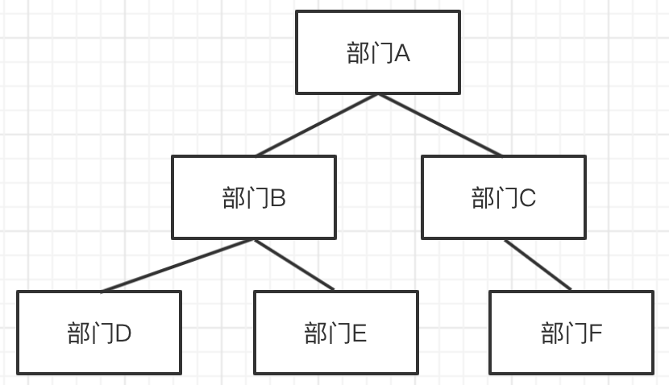
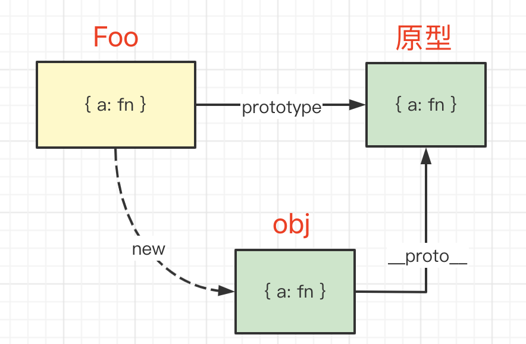

# 09-分析和解决问题的思路 - 可以独立解决问题

## 01: 开始

遇到一个需求、问题或者一段代码，如何能高效的分析、解决它，这是前端程序员的必备技能。否则你将无法独立工作，这不是企业需要的人才。本章将通过多个面试题，教你如何分析问题、解决问题。

### 为何要考察

遇到一个需求、问题或者一段代码，如何能高效的分析、解决它，这是前端程序员的必备技能。
否则你将无法独立工作，这不是企业需要的人才。

### 考察重点

- 能看懂代码的逻辑，分析逻辑
- 识破代码的一些坑。

### 看几个问题

- `['1','2','3'].map(parseInt)`
- 以下代码输出什么

  ```js
  function changeArg(x) {
    x = 200
  }

  let num = 100
  changeArg(num)
  console.log('changeArg num', num)

  let obj = { name: '双越' }
  changeArg(obj)
  console.log('changeArg obj', obj)

  function changeArgProp(x) {
    x.name = '张三'
  }
  changeArgProp(obj)
  console.log('changeArgProp obj', obj)
  ```

- 将数组转为树

  ```javascript
  const obj = {
    id: 1,
    name: '部门A',
    children: [
      {
        id: 2,
        name: '部门B',
        children: [
          { id: 4, name: '部门D' },
          { id: 5, name: '部门E' },
        ],
      },
      {
        id: 3,
        name: '部门C',
        children: [{ id: 6, name: '部门F' }],
      },
    ],
  }
  ```

## 02:[1, 2, 3].map(parseInt)

### 题目

`['1', '2', '3'].map(parseInt)` 输出什么？

### parseInt

`parseInt(string, radix)` 解析一个字符串并返回指定基数的**十进制**整数

- 作用：解析一个字符串，并返回十进制整数
- `string` 要解析的字符串
- `radix` 可选参数，数字基数（即进制），范围为 2-36

示例

```js
parseInt('11', 1) // NaN ，1 非法，不在 2-36 范围之内
parseInt('11', 2) // 3 = 1*2 + 1
parseInt('3', 2) // NaN ，2 进制中不存在 3
parseInt('11', 3) // 4 = 1*3 + 1
parseInt('11', 8) // 9 = 1*8 + 1
parseInt('9', 8) // NaN ，8 进制中不存在 9
parseInt('11', 10) // 11
parseInt('A', 16) // 10 ，超过 10 进制，个位数就是 1 2 3 4 5 6 7 8 9 A B C D ...
parseInt('F', 16) // 15
parseInt('G', 16) // NaN ，16 进制个位数最多是 F ，不存在 G
parseInt('1F', 16) // 31 = 1*16 + F
```

### radix == null 或者 radix === 0

- 如果 `string` 以 `0x` 开头，则按照 16 进制处理，例如 `parseInt('0x1F')` 等同于 `parseInt('1F', 16)`
- 如果 `string` 以 `0` 开头，则按照 8 进制处理 —— **ES5 之后就取消了，改为按 10 进制处理，但不是所有浏览器都这样，一定注意！！！**
- 其他情况，按 10 进制处理

### 分析代码

- 代码拆解到最细粒度
- 看执行 parseInt 的参数是什么
- 最后找到答案

题目代码可以拆解为

```js
const arr = ['1', '2', '3']
const res = arr.map((s, index) => {
  console.log(`s is ${s}, index is ${index}`)
  return parseInt(s, index)
})
console.log(res)
```

分析执行过程

```js
parseInt('1', 0) // 1 ，radix === 0 按 10 进制处理
parseInt('2', 1) // NaN ，radix === 1 非法（不在 2-36 之内）
parseInt('3', 2) // NaN ，2 进制中没有 3
```

### 答案

```js
;['1', '2', '3'].map(parseInt) // [1, NaN, NaN]
```

### 划重点

- 要知道 `parseInt` 参数的定义
- 把代码拆解到最细粒度，再逐步分析

### 扩展

为何 eslint 建议 `partInt` 要指定 `radix`（第二个参数）？<br>
因为 `parseInt('011')` 无法确定是 8 进制还是 10 进制，因此必须给出明确指示。

## 03: 读代码-函数修改形参，能否影响实参？

### 题目

运行以下代码，会输出什么

```js
function changeArg(x) {
  x = 200
}

let num = 100
changeArg(num)
console.log('changeArg num', num)

let obj = { name: '双越' }
changeArg(obj)
console.log('changeArg obj', obj)

function changeArgProp(x) {
  x.name = '张三'
}
changeArgProp(obj)
console.log('changeArgProp obj', obj)
```

### 分析

调用函数，传递参数 —— **赋值**传递

```js
function fn(x, y) {
  // 继续操作 x y
}
const num = 100
const obj = { name: '双越' }
fn(num, obj)
```

以上代码相当于

```js
const num = 100
const obj = { name: '双越' }

let x = num
let y = obj
// 继续操作 x y
```

### 解题

执行题目代码分别输出 `100  {name: '双越'}  {name: '张三'}`

### 扩展：

eslint 规则建议：函数参数当作一个 `const` 常量，不要修改函数参数 —— 这样代码更易读

## 04: 把一个数组转换为树

### 题目

定义一个 `convert` 函数，将以下数组转换为树结构。

```js
const arr = [
  { id: 1, name: '部门A', parentId: 0 }, // 0 代表顶级节点，无父节点
  { id: 2, name: '部门B', parentId: 1 },
  { id: 3, name: '部门C', parentId: 1 },
  { id: 4, name: '部门D', parentId: 2 },
  { id: 5, name: '部门E', parentId: 2 },
  { id: 6, name: '部门F', parentId: 3 },
]
```



### 分析

定义树节点的数据结构

```ts
interface ITreeNode {
  id: number
  name: string
  children?: ITreeNode[]
}
```

### 思路

#### 遍历数组，针对每个元素

- 生成 tree node
- 找到 parentNode 并加入到它的 `children`

#### 如何找到 parentNode

找 parentNode 时，需要根据 `id` 能**尽快**找到 tree node<br>
需要一个 map ，这样时间复杂度是 `O(1)` 。否则就需要遍历查找，时间复杂度高。

### 实现

代码参考 convert-arr-tree.ts

```typescript
interface IArrayItem {
  id: number
  name: string
  parentId: number
}
interface ITreeNode {
  id: number
  name: string
  children?: ITreeNode[]
}

function covert(arr: IArrayItem[]): ITreeNode | null {
  // 用于 id 和 treeNode 的映射
  const idToTreeNode: Map<number, ITreeNode> = new Map()
  let root = null

  arr.forEach((item) => {
    const { id, name, parentId } = item
    // 定义 tree node 并加入 map
    const treeNode: ITreeNode = { id, name }
    idToTreeNode.set(id, treeNode)
    // 找到 parentNode 并加入到 它的 children
    const parentNode = idToTreeNode.get(parent)
    if (parentNode) {
      if (!parentNode.children) {
        parentNode.children = []
      }
      parentNode.children.push(treeNode)
    }
    // 找到根节点
    if (parentId === 0) {
      root = treeNode
    }
  })
  return root
}

const arr = [
  { id: 1, name: '部门A', parentId: 0 }, // 0 代表顶级节点，无父节点
  { id: 2, name: '部门B', parentId: 1 },
  { id: 3, name: '部门C', parentId: 1 },
  { id: 4, name: '部门D', parentId: 2 },
  { id: 5, name: '部门E', parentId: 2 },
  { id: 6, name: '部门F', parentId: 3 },
]
const tree = convert(arr)
console.info(tree)
```

### 存在的疑虑

对于 arr 遍历时候，当前项目的 `parentId` 必须之前出现过才可以，否则结果是不对的
比如对于以下数据，结果就不正确

```javascript
const arr = [
  { id: 6, name: '部门 F', parentId: 3 },
  { id: 1, name: '部门 A', parentId: 0 }, // 0 代表顶级节点，无父节点
  { id: 2, name: '部门 B', parentId: 1 },
  { id: 3, name: '部门 C', parentId: 1 },
  { id: 4, name: '部门 D', parentId: 2 },
  { id: 5, name: '部门 E', parentId: 2 },
]
const tree = convert(arr)
console.info(tree)
```

### 扩展

- 数组：像是**关系型**数据库，如 MySQL
- 树： 像是**文档型**数据库，如 Mongodb

## 05: 连环问: 把一个树转换为数组

### 思路

- 遍历树节点（广度优先）
- 将节点转为 Array Item, push 到数组
- 根据父子关系，找到 Array Item 的 parentId

### 如何找到 parentId

- 遍历树去查找，太慢
- 可用一个 Map 来维护关系，便于查找

### 代码实现

```typescript
interface IArrayItem {
  id: number
  name: string
  parentId: number
}

interface ITreeNode {
  id: number
  name: string
  children?: ITreeNode[]
}

function convert(root: ITreeNode): IArrayItem[] {
  // Map
  const nodeToParent: Map<ITreeNode, ITreeNode> = new Map()
  const arr: IArrayItem[] = []
  // 广度优先遍历，queue
  const queue: ITreeNode[] = []
  queue.unshift(root) // 根节点 入队

  while (queue.length > 0) {
    const curNode = queue.pop() // 出队
    if (curNode == null) break
    const { id, name, children = [] } = curNode
    // 创建数组 item 并 push
    const parentNode = nodeToParent.get(curNode)
    const parentId = parentNode?.id || 0
    const item = { id, name, parentId }
    arr.push(item)
    // 子节点入队
    children.forEach((child) => {
      // 映射 parent
      nodeToParent.set(child, curNode)
      // 入队
      queue.unshift(child)
    })
  }

  return arr
}

const obj = {
  id: 1,
  name: '部门A',
  children: [
    {
      id: 2,
      name: '部门B',
      children: [
        { id: 4, name: '部门D' },
        { id: 5, name: '部门E' },
      ],
    },
    {
      id: 3,
      name: '部门C',
      children: [{ id: 6, name: '部门F' }],
    },
  ],
}
const arr1 = convert(obj)
console.info(arr1)
```

### 划重点

- 根据顺组的顺序，需要**广度优先**遍历树

* 要快速获取 `parentId` 需要存储 `nodeToParent` map 结构。

## 06: 读代码-构造函数和原型的重名属性

### 题目

以下代码，执行会输出什么？

```js
function Foo() {
  Foo.a = function () {
    console.log(1)
  }
  this.a = function () {
    console.log(2)
  }
}
Foo.prototype.a = function () {
  console.log(3)
}
Foo.a = function () {
  console.log(4)
}

Foo.a() // 4
let obj = new Foo()
obj.a() // 2
Foo.a() // 1, 因为 执行 new Foo 后重新赋值了 Foo.a
```

### 分析

把自己想象成 JS 引擎，你不是在读代码，而是在执行代码 —— 定义的函数如果不执行，就不要去看它的内容 —— 这很重要！！！

按这个思路来“执行”代码

### 原型



### 答案

执行输出 `4 2 1`

### 重点

- 原型和原型链基础知识
- 你不是在读代码，而是在模拟执行代码

## 06: 一道让人失眠的 promise-then 执行顺序问题

### 题目

以下代码，执行会输出什么

```js
Promise.resolve()
  .then(() => {
    console.log(0)
    return Promise.resolve(4)
  })
  .then((res) => {
    console.log(res)
  })

Promise.resolve()
  .then(() => {
    console.log(1)
  })
  .then(() => {
    console.log(2)
  })
  .then(() => {
    console.log(3)
  })
  .then(() => {
    console.log(5)
  })
  .then(() => {
    console.log(6)
  })
```

### 这道题很难

网上有很多文章介绍这道题，都没有给出清晰的答案。

被称为“令人失眠的”题目

### 回顾

- 单线程和异步
- 事件循环
- 宏任务 微任务

### then 交替执行

- 如果有多个 fulfilled 状态的 promise 实例，同时执行 then 链式调用，then 会交替调用
- 这是编译器的优化，防止一个 promise 持续占据事件

### then 返回 promise 对象

- 当 then 返回 promise 对象时，可以认为是多出一个 promise 实例。
- 也会遵循”交替执行“
- 但是和 直接声明一个 promise 实例，结果有些差异

```js
Promise.resolve()
  .then(() => {
    console.log(1)
    return Promise.resolve(100) // 相当于多处一个 promise 实例，如下注释的代码
  })
  .then((res) => {
    console.log(res)
  })
  .then(() => {
    console.log(200)
  })
  .then(() => {
    console.log(300)
  })
  .then(() => {
    console.log(300)
  })

Promise.resolve()
  .then(() => {
    console.log(10)
  })
  .then(() => {
    console.log(20)
  })
  .then(() => {
    console.log(30)
  })
  .then(() => {
    console.log(40)
  })

// // 相当于新增一个 promise 实例 —— 但这个执行结果不一样，后面解释
// Promise.resolve(100).then(res => {
//     console.log(res)
// }).then(() => {
//     console.log(200)
// }).then(() => {
//     console.log(300)
// }).then(() => {
//     console.log(400)
// })
```

### “慢两拍”

then 返回 promise 实例和直接执行 `Promise.resolve()` 不一样，它需要等待两个过程

- `promise` 状态由 `pending` 变为 `fulfilled`
- `then` 函数挂载到 `microTaskQueue`

所以，它变现的会“慢两拍”。可以理解为

```js
Promise.resolve().then(() => {
  console.log(1)
})

Promise.resolve()
  .then(() => {
    console.log(10)
  })
  .then(() => {
    console.log(20)
  })
  .then(() => {
    console.log(30)
  })
  .then(() => {
    console.log(40)
  })

Promise.resolve().then(() => {
  // 第一拍
  const p = Promise.resolve(100)
  Promise.resolve().then(() => {
    // 第二拍
    p.then((res) => {
      console.log(res)
    })
      .then(() => {
        console.log(200)
      })
      .then(() => {
        console.log(300)
      })
      .then(() => {
        console.log(400)
      })
  })
})
```

### 答案

题目代码输出的结果是 `1 2 3 4 5 6`

### 重点

- 熟悉基础知识：事件循环 宏任务 微任务
- then 交替执行
- then 返回 promise 对象时“慢两拍”

PS：这里一直在微任务环境下，如果加入宏任务就不一样了
