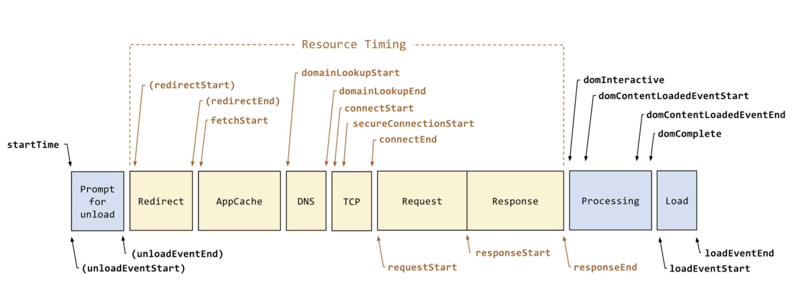
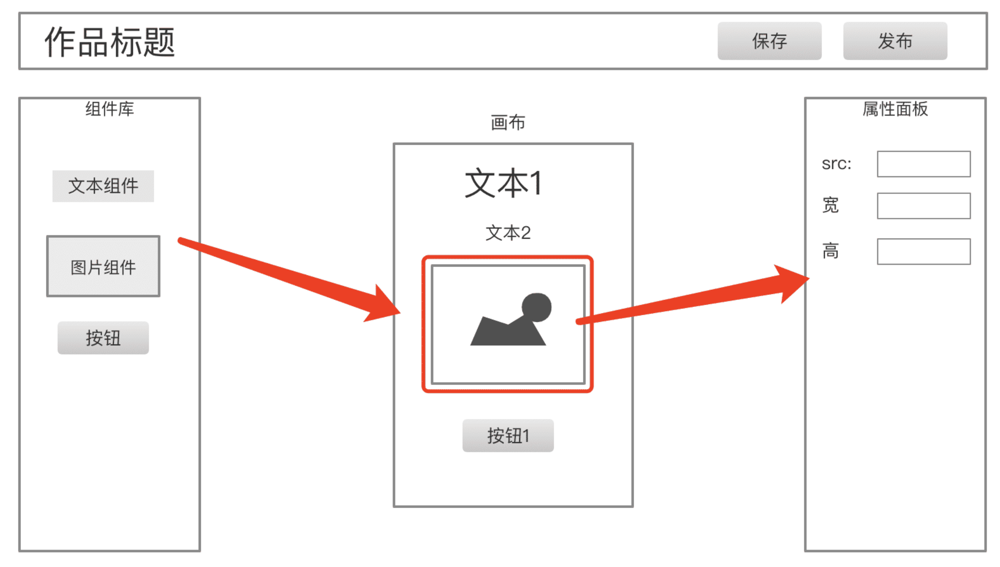

# 10- 项目设计 - 能否成为项目负责人

## 01: 开始

面试官给出一个项目需求或者功能，让候选人做技术方案设计，考察综合能力。
本章将通过多个面试题，讲解如何进行项目设计，包括抽象数据模型，总结功能和流程，制定技术方案等

### 为何要考察

面试官给出一个项目需求或者功能，让候选人做技术方案设计，考察综合能力。

### 考察重点

- 识别需求，转化为功能
- 功能模块拆分
- 数据结构设计

### 注意事项

看整体设计，不要追求细节

### 看几个问题

- 要你开发一个前端统计 SDK, 你会如何设计
- 一个 H5 编辑器（低代码），提交到服务器的数据格式怎么样设计？

## 02: 项目负责人的职责

### 题目

作为项目前端技术负责人，主要的职责是什么？

### 目标

项目前端技术负责人，将负责和项目前端开发相关的所有事情，不仅仅是前端范围内的，也不仅仅是开发的事宜。

目标：保证项目按时、按质量的交付上线，以及上线之后的安全稳定运行。

### 职责

#### 把控需求

新项目开始、或者新功能模块开始时要参与需求评审，认真审阅需求的详细内容，给出评审意见，提出问题。自己已经同意的需求要能保证按时、按质量的完成。

评审需求需要你能深入理解项目的业务，不仅仅是自己负责的功能，还有上下游全局的串联。所以，一入职的新人无论技术能力多好，都无法立刻作为项目技术负责人，他还需要一段时间的业务积累和熟练。PS：除非他在其他公司已经是这个方面的业务专家。

需求评审之后，还可能有 UI 设计图的评审，也要参与，提出自己的意见和问题。保证评审通过的 UI 设计图都能保质保量的开发出来。

需求和 UI 设计图评审完之后，还要给出开发的排期。此时要全面考虑，不仅仅要考虑开发时间，还有内部测试、单元测试的时间，以及考虑一些延期的风险，多加几天的缓冲期。

最后，在项目进行过程中，老板或者 PM 有可能中途插入新需求。此时要积极沟通，重新评估，还要争取延长项目开发周期。需求增加了，肯定周期也要延长一些。

#### 技术方案设计

> 需求指导设计，设计指导开发。

需求和 UI 设计图确定之后，要先进行技术方案设计，写设计文档，评审，通过之后再开发。技术方案设计应该包含核心数据结构的设计，核心流程的设计，核心功能模块的组织和实现。评审时看看这些有没有不合理、隐患、或者和别人开发重复了。

技术方案设计还要包括和其他对接方的，如和服务端、客户端的接口格式。也要叫他们一起参与评审，待他们同意之后再开发。

#### 开发

作为技术负责人，不应该把自己的主要精力放在代码开发上，但也不能完全不写代码。
应该去写一些通用能力，核心功能，底层逻辑的代码。其他比较简单的业务代码，可以交给项目成员来完成。

#### 监督代码质量

技术负责人，可能会带领好多人一起编写代码，但他要把控整个项目的代码质量。例如：

- 制定代码规范
- 定期组织代码审核
- CI 时使用自动化单元测试

#### 跟踪进度

每天都组织 10 分钟站会，收集当前的进度、风险和问题。如有延期风险，要及时汇报。

不仅仅要关心前端开发的进度，还要关心上下游。例如上游的 UI 设计图延期，将会导致前端开发时间不够，进而导致测试时间不够，甚至整个项目延期。

#### 稳定安全的运行

上线之后，要能实时把控项目运行状态，是否稳定、安全的运行。万一遇到问题，要第一时间报警。

所以，项目中要增加各种统计和监控功能，例如流量统计、性能统计、错误监控，还有及时报警的机制。

### 总结

- 把控需求
- 技术方案设计
- 开发
- 监督代码质量
- 跟踪进度
- 稳定安全的运行

## 03:如何设计一个前端统计 SDK

### 分析

前端统计的范围

- 访问量 PV
- 自定义事件（如统计一个按钮被点击了多少次）
- 性能
- 错误

统计数据的流程 （只做前端 SDK ，但是要了解全局）

- 前端发送统计数据给服务端
- 服务端接受，并处理统计数据
- 查看统计结果

### 代码结构

SDK 要用于多个不同的产品，所以初始化要传入 `productId`

```js
class MyStatistic {
  private productId: number

  constructor(productId: number = 0) {
    if (productId <= 0) {
        throw new Error('productId is invalid')
    }
    this.productId = productId // 产品 id （SDK 会被用于多个产品）

    this.initPerformance() // 性能统计
    this.initError() // 监听错误
  }
  private send(url: string, paramObj: object = {}) {
    // TODO 发送统计数据
  }
  private initPerformance() {
    // TODO 性能统计
  }
  private initError() {
    // TODO 监听全局错误（有些错误需要主动传递过来，如 Vue React try-catch 的）
  }
  pv() {
    // TODO 访问量 PV 统计
  }
  event(key: string, value: string) {
    // TODO 自定义事件
  }
  error(key: string, info: object = {}) {
    // TODO 错误统计
  }
}
```

用户使用

```js
const myStatistic = new MyStatistic('abc')
```

### 发送数据

发送统计数据，用 `` —— 浏览器兼容性好，没有跨域限制

```js
private send(url: string, paramObj: object = {}) {
  // 追加 productId
  paramObj.productId = this.productId

  // params 参数拼接为字符串
  const paramArr = []
  for (let key in paramObj) {
    const value = paramObj[key]
    paramArr.push(`${key}=${value}`)
  }
  // 用 img 发送，1. 可跨域，2. 兼容性极好
  const img = document.createElement('img')
  img.src = `${url}?${paramArr.join('&')}`
}
```

如果再精细一点的优化，`send` 中可以使用 `requestIdleCallback` （兼容使用 `setTimeout`）

### 自定义事件统计

```js
event(key: string, value: string) {
  const url = 'xxx' // 接受自定义事件的 API
  this.send(url, { key, value }) // 发送
}
```

用户使用

```js
// 如需要统计“同意” “不同意” “取消” 三个按钮的点击量，即可使用自定义事件统计
$agreeBtn.click(() => {
  // ...业务逻辑...
  // 其他不同的按钮，传递不同的 value (如 'refuse' 'cancel')
  myStatistic.event('some-button', 'agree')
})
```

### 访问量 PV

PV 可以通过自定义事件的方式。但是为了避免用户重复发送，需要加一个判断

```js
// 定义一个全局的 Set ，记录已经发送 pv 的 url
const PV_URL_SET = new Set()
```

```js
pv() {
  const href = location.href
  if (PV_URL_SET.has(href)) return

  this.event('pv', '') // 发送 pv

  PV_URL_SET.add(href)
}
```

用户使用

```js
myStatistic.pv()
```

【注意】PV 统计需要让用户自己发送吗，能不能在 DOMContentLoaded 时自动发送？—— 最好让用户发送，因为 SPA 中切换路由也可能发送 PV

### 性能统计

通过 `console.table( performance.timing )` 可以看到网页的各个性能



```js
private initPerformance() {
  const url = 'yyy' // 接受性能统计的 API
  // 全部传给服务端，让服务端去计算结果 —— 统计尽量要最原始数据，不要加工处理
  this.send(url, performance.timing)
}
```

PS：想要得到全面的性能数据，要在网页加载完成之后（ DOMContentLoaded 或 onload ）去初始化 `myStatistic`

### 错误统计

监听全局操作

```js
private initError() {
  // 全局操作
  window.addEventListener('error', event => {
    const { error, lineno, colno } = event
    this.error(error, { lineno, colno })
  })
  // Promise 未 catch 的报错 （ 参考 unhandledrejection.html ）
  window.addEventListener("unhandledrejection", event => {
    this.error(event.reason)
  })
}
```

被开发这主动收集的错误，需要调用 API 来统计

```js
error(error: Error, info: object = {}) {
  // error 结构 { message, stack }
  // info 是附加信息

  const url = 'zzz' // 接受错误统计的 API
  this.send(url, Object.assign(error, info))
}
```

用户使用

```js
// try catch
try {
  100()
} catch (e) {
  myStatistic.error(e)
}

// Vue 错误监听
app.config.errorHandler = (error, instance, info) => {
  myStatistic.error(error, { info })
}

// React 错误监听
componentDidCatch(error, errorInfo) {
  myStatistic.error(error, { info: errorInfo })
}
```

### 划重点

- 统计的范围
- 发送数据使用 img
- 报错统计要结合 Vue React 报错

### 总结

- 自定义事件（包括 PV）
- 性能统计
- 报错统计

PS：以上是一个统计 SDK 的基本估计，可以应对面试，实际工作中还可能需要进一步完善很多细节。

## 04: 连环问：sourcemap 有什么作用？该如何配置

遇到 JS 报错的问题，就离不开 sourcemap

### 背景

- JS 上线之前要合并、混淆和压缩。例如 jquery 的线上代码 [https://www.bootcdn.cn/jquery/](https://www.bootcdn.cn/jquery/)
- 压缩之后，一旦线上有报错，通过行、列根本找不到源代码的位置，不好定位错误
- sourcemap 就是用于解决这个问题。可以看 jquery 的 sourcemap 文件 [https://www.jsdelivr.com/package/npm/jquery?path=dist](https://www.jsdelivr.com/package/npm/jquery?path=dist)

### 示例

一个网页中引用了 CDN jquery.min.js ，通过 chrome Sources 即可看到之前源码的样子。<br>
寻找 sourcemap 有两种方式：1. 同目录下的同名文件；2. js 文件最后一样指定（如 wangEditor js）


### 配置

sourcemap 是在打包、压缩 js 时生成，通过 webpack 的打包工具即可配置。（可以在 `js-code` 代码环境中测试）<br>
webpack 通过 `devtool` 来配置 sourcemap ，有多种选择 [https://webpack.docschina.org/configuration/devtool/#devtool](https://webpack.docschina.org/configuration/devtool/#devtool)

- 不用 `devtool` - 正常打包，不会生成 sourcemap 文件
- `eval` - 所有代码都放在 `eval(...)` 中执行，不生成 sourcemap 文件
- `source-map` - 生成单独的 sourcemap 文件，并在 js 文件最后指定
- `eval-source-map` - 代码都放在 `eval(...)` 中执行，sourcemap 内嵌到 js 代码中，不生成独立的文件
- `inline-source-map` - sourcemap 以 base64 格式插入到 js 末尾，不生成单独的文件
- `cheap-source-map` - sourcemap 只包含行信息，没有列信息（文件体积更小，生成更快）
- `eval-cheap-source-map` - 同上，但是所有代码都放在 `eval(...)` 中执行

推荐

- 开发和测试 `eval` `eval-source-map` `eval-cheap-source-map` —— 追求效率
- 生产环境 `source-map` 或者不产出 sourcemap —— 看个人需求

### 划重点

- 开源醒目，也要开源 sourcemap
- 非开源项目，不要泄露 sourcemap !!!
- 了解 sourcemap 的作用和配置即可, 编码原理不必深究

### 注意

公司实际项目的 sourcemap 可用于内部反查 bug ，但不要泄漏。否则等于源码泄漏了。<br>
开源项目的 sourcemap 文件也是开源的。

只需要了解 sourcemap 的作用和配置即可，原理不用掌握。

## 05: SPA 和 MPA 应该如何选择

### 题目

何时用 SPA 何时用 MPA ？

### 分析

- SPA - Single-page Application 单页面应用，只有一个 html 文件，用前端路由切换功能
- MPA - Multi-page Application 多页面应用，每个页面是单独的 html 文件

现在基于 React Vue 开发时，大部分产出的都是 SPA ，很少会产出 MPA 。<br>
但并不是所有的场景都适用于 SPA ，项目设计时要确定好，否则后面不好改。

### SPA 适用于一个综合应用

特点

- 功能较多，一个界面展示不完
- 以操作为主，不是以展示为主

举例

- 大型的后台管理系统（阿里云的管理后台）
- 知识库（语雀、腾讯文档）
- 功能较复杂的 WebApp（外卖）

### MPA 适用于孤立的页面

特点

- 功能较少，一个页面展示得开
- 以展示为主，而非操作

举例

- 分享页（微信公众号文章）
- 新闻 App 里的落地页（有可能是用 H5 + hybrid 开发的）

### Webpack 打包

```js
const path = require('path')
const HtmlWebpackPlugin = require('html-webpack-plugin')
const { CleanWebpackPlugin } = require('clean-webpack-plugin')

module.exports = {
  mode: 'production',
  // 多入口
  entry: {
    home: './src/home/index.js',
    product: './src/product/index.js',
    about: './src/about/index.js',
  },
  output: {
    filename: 'js/[name].[contentHash].js', // name 即 entry 的 key
    path: path.resolve(__dirname, './dist'),
  },
  plugins: [
    new CleanWebpackPlugin(),

    // 三个页面
    new HtmlWebpackPlugin({
      title: '首页',
      template: './template/index.html',
      filename: 'home.html',
      chunks: ['home'],
    }),
    new HtmlWebpackPlugin({
      title: '产品',
      template: './template/product.html',
      filename: 'product.html',
      chunks: ['product'],
    }),
    new HtmlWebpackPlugin({
      title: '关于',
      template: './template/about.html',
      filename: 'about.html',
      chunks: ['about'],
    }),
  ],
}
```

### 扩展：技术是一回事，怎么做是另外的事儿

讲一个故事，说明这个问题，请大家注意。

我之前的一个同事，他技术很好。
我就问他一个问题：你觉得在项目发布之前，最需要做的是什么？<br>
他回复是：1. 扩展性还不太好，得增强一下；2. 解决当前的 bug 。

然后我继续追问：1. 你觉得扩展性不好用，是扩展什么功能不好用，举个例子来说明？2. 目前记录的这些 bug ，那几个是高优的？<br>
然后他没有回答出来。

技术人员有这个想法很正常，我之前也是。<br>
我刚毕业那 2 年，对自己维护的一个系统提出了很多升级意见，都是自己从书上、竞品参考的。但领导问：这些如何实际应用到我们的项目？<br>
我就回答不上来了。

## 06: 设计一个 H5 编辑器的数据模型和核心功能-错误答案展示

低代码，现在流行

### 题目



这是一个 H5 编辑器，用 vue + Vuex 来实现，几个问题：

- 在点“保存”按钮的时候，往服务端传递的**数据结构**是什么样子的？
- 如何保证画布和属性面板是同步更新的？
- 如果在扩展一个“图层”面板，数据结构该怎么设计？

### 大家的答案

第一个问题，大家的答案往往都是这样的：

```js
{
  components: {
    'text1': {
      type: 'text',
      value: '文本1',
      color: 'red',
      fontSize: '16px'
    },
    'text2': {
      type: 'text',
      value: '文本2',
      color: 'red',
      fontSize: '16px'
    },
    'img1': {
      type: 'image',
      src: 'xxx.png',
      width: '100px'
    }
  }
}
```

第二个问题，大家觉得数据存到 vuex 中，就可以同步更新了 —— 这没错，但具体如何做到呢？很多同学想不出来，或者到这里就懵了。

第三个问题，很多同学觉得应该在 vuex store 中新增一个属性

```js
{
  layer: [
    {
      id: 'text1', // 对应到 components 的 key
      name: '文本1',
    },
    {
      id: 'text2',
      name: '文本2',
    },
  ],
}
```

### 存在的问题

- 组件应该是**有序**结构，属性应该参考 vnode 设计
- 使用 Vuex 同步，但是如何确定当前画布选中的组件的？
- 图层，仅仅是一个索引，应该用 computed 这种形式

基于以上回答，总结一下：

- node 结构，不是规范的 vnode 形式
- 组件应该用数组，而不是对象。数组是有序结构
- 都知道存储到 vuex 中即可同步数据，但问题是如何用 vuex 表示当前选中的组件
- 图层，应该是一个 computed 计算出来的索引，而不是一个单独的数据

### 正确的设计思路

vuex store

```js
{
    // 作品
  work: {
    title: '作品标题',
    setting: { /* 一些可能的配置项，用不到就先预留 */ },
    props: { /* 页面 body 的一些设置，如背景色 */ },
    components: [
      // components 要用数组，有序结构

      // 单个 node 要符合常见的 vnode 格式
      {
        id: 'xxx', // 每个组件都有 id ，不重复
        name: '文本1',
        tag: 'text',
        attrs: { fontSize: '20px' },
        children: [
          // 文本内容，有时候放在 children ，有时候放在 attrs 或者 props ，没有标准，看实际情况来确定
          '文本1'
        ]
      },
      {
        id: 'yyy',
        name: '图片1',
        tag: 'image',
        attrs: { src: 'xxx.png', width: '100px' },
        children: null
      },
    ]
  },
  // 画布当前选中的组件，记录 id 即可
  activeComponentId: 'xxx'
}
```

vuex getter

```js
{
  layers() => {
    store.work.components.map(c => {
      return {
        id: c.id,
        name: c.name
      }
    })
  }
}
```

总之，基本思路就是：

- 每个组件尽量符合 vnode 规范
- 用数组来组织数据，有序
- 尽量使用引用关系，不要冗余

### 扩展

项目技术方案设计时，数据结构的设计是非常重要的。

不要纠细节，看主要设计

要参考现有标准，而非自造标准 —— 这需要自己有基础知识，有识别能力

---

联想到富文本编辑器的数据结构设计：text 摊平，而不是嵌套。
