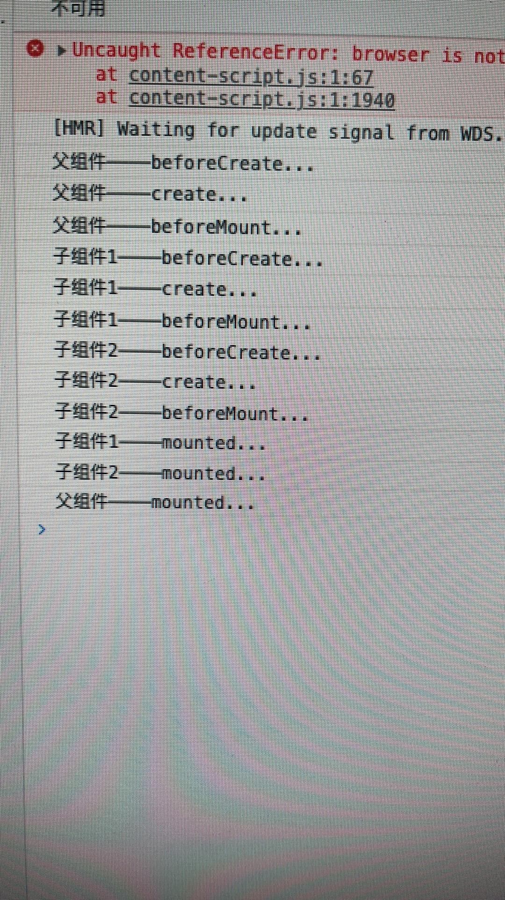

# 05- Vue 面试真题演练

面试题来源整理

- 自己觉得是面试重点
- 网上收集整理的面试题
- 热门技术和知识点

## 01: v-show 与 v-if 的区别

- v-show 通过 CSS display 控制显示和隐藏
- v-if 组件真正的渲染和销毁，而不是显示和隐藏
- 频繁切换显示状态时候使用 v-show ,否则用 v-if

## 02: v-for 为何使用 key

- 必须用 key, 且不能使 index 和 random
- diff 算法中通过 tag 和 key 来判断，是否是 sameNode
- 减少渲染次数，提升渲染性能

## 03：描述 vue 组件声明周期（父子组件）

- 单组件生命周期图
  
- 父 + 子 组件生命周期图

  

- 父 + 多个子组件生命周期图
  

## 04: vue 组件如何进行通讯（常见）

- 父子组件： props 与 $emit
- 自定义组件：event.$on、event.$off、event.$emit
- vuex
- ref / $refs
  > 这种方式也是实现父子组件之间的通信
  > ref：这个属性用在子组件上，它的用用就指向了子组件的实例，可以通过实例来访问组件的数据和方法
- 依赖注入（provide / inject）
- $parent / $children
  > 使用$parent 可以让组件访问父组件的实例（访问的是上一级父组件的属性和方法）。
  >
  > 使用 $children 可以让组件访问子组件的实例，但是， $children 并不能保证顺序，并且访问的数据也不是响应式的。
- $attrs / $listeners
  > $attrs：继承所有的父组件属性（除了 props 传递的属性、class 和 style），一般用在子组件的子元素上
  >
  > $listeners：该属性是一个对象，里面包含了作用在这个组件上的所有监听器，可以配合 v-on=" $listeners " 将所有的事件监听器指向这个组件的某个特定的子元素。（相当于子组件继承父组件的事件）

## 05: 描述组件的渲染和更新过程

1. vue 组件初次渲染过程

- 解析模板为 render 函数
- 触发响应式，监听 data 属性的 getter 和 setter
- 执行 render 函数， 生成 vnode
- patch(elem,vnode) 挂载节点，渲染

2. vue 组件更新过程

- 修改 data， 触发 setter （此前在 getter 中已被监听）
- 重新执行 render 函数，生成 newVnode
- patch(vnode, newVnode) 更新节点


## 06: 双向数据绑定 v-model 的实现原理

- input 的元素 value = this.name
- 绑定 input 事件：this.name = $event.target.value
- data 更新触发 re-render

### 07: 对 MVVM 的理解

1. MVVM 是 Model-View-ViewModel 的缩写，它是一种基于前端开发的架构模式。

2. 其核心是提供对 View 和 ViewModel 的双向数据绑定，这使得 ViewModel 的状态改变可以自动传递给 View，即所谓的数据双向绑定。

3. 以 Vue.js 为例。Vue 是一个提供了 MVVM 风格的双向数据绑定的 Javascript 库，专注于 View 层。

4. 它的核心是 MVVM 中的 VM，也就是 ViewModel。 ViewModel 负责连接 View 和 Model，保证视图和数据的一致性，这种轻量级的架构让前端开发更加高效、便捷。


#### 延伸知识 MVC MVP

[从 Script 到 Code Blocks、Code Behind 到 MVC、MVP、MVVM ](https://www.cnblogs.com/indream/p/3602348.html)

MVC


MVP


## 08: computed 有什么特点

- 缓存，data 不变则不会重新计算
- 提高性能

## 09: 组件 data 为何是函数

1. vue 中组件是用来复用的，为了防止 data 复用，将其定义为函数。

2. vue 组件中的 data 数据都应该是相互隔离，互不影响的，组件每复用一次，data 数据就应该被复制一次，之后，当某一处复用的地方组件内 data 数据被改变时，其他复用地方组件的 data 数据不受影响，就需要通过 data 函数返回一个对象作为组件的状态。

3. 当我们将组件中的 data 写成一个函数，数据以函数返回值形式定义，这样每复用一次组件，就会返回一份新的 data，拥有自己的作用域，类似于给每个组件实例创建一个私有的数据空间，让各个组件实例维护各自的数据。

4. 当我们组件的 data 单纯的写成对象形式，这些实例用的是同一个构造函数，由于 JavaScript 的特性所导致，所有的组件实例共用了一个 data，就会造成一个变了全都会变的结果。

---

版权声明：本文为 CSDN 博主「王三六」的原创文章，遵循 CC 4.0 BY-SA 版权协议，转载请附上原文出处链接及本声明。
原文链接：[https://blog.csdn.net/qq_42072086/article/details/108060494](https://blog.csdn.net/qq_42072086/article/details/108060494)

## 10: ajax 应该放在哪个生命周期中

> 首先，一个组件的 created 比 mounted 也早调用不了几微秒，性能没啥提高；

- mounted
- JS 是单线程的，ajax 异步获取数据
- 放在 mounted 之前没哟用，只会让逻辑更加混乱

[参考回答：【前端哈默】Ajax 请求到底应该放在 created 里还是 mounted 里【Vue 小知识】](https://www.bilibili.com/read/cv14696847)

## 11: 如何将组件所有 props 传递给子组件

- $props
- `<User v-bind="$props" />`
- 细节知识点，优先级不高

## 12: 如何自己实现 `v-model`

```vue
<template>
  <input type="text" :value="text" @input="$emit("change", $event.target.value)"
  />
  <!-- 注意：
  1. 上面使用 :value 而没有用 v-model
  2. 上面的 change 和 model.event 对应起来即可，名字可以自定义
   -->
</template>
<script>
export default {
  model: {
    prop: 'text', // 对应到 props text
    event: 'change',
  },
  props: {
    text: String,
  },
}
</script>
```

## 13: 多个组件有相同的逻辑，如何抽离

- mixin
- 以及 mixin 的一些缺点

## 14: 何时使用异步组件

- 加载大组件
- 路由异步加载

## 15: 何时使用 keep-alive

- 缓存组件，不需要重复渲染
- 多个静态 tab 的切换
- 优化性能

## 16: 何时需要使用 beforeDestroy

- 解除自定义事件 event.$off
- 清楚定时器
- 解绑自定义的 DOM 事件，如 window.scroll 事件等

## 17: 什么是作用域插槽

> 官网是这样描述的：有时让插槽内容能够访问子组件中才有的数据是很有用的。显然作用域插槽的作用就是使父组件能够引用子组件中的数据。

父组件

```vue
<template>
  <div>
    <h1>这里是父组件</h1>
    <child>
      <template slot-scope="slotsProps">
        {{ slotsProps.info }}
      </template>
    </child>
    <!-- 自Vue2.6起，语法变成了这样 -->
    <child>
      <template v-slot:default="slotProps">
        {{ slotProps.info }}
      </template>
    </child>
  </div>
</template>
```

子组件

```vue
<template>
  <div>
    <h2>这里是子组件</h2>
    <slot :info="info"></slot>
  </div>
</template>
<script>
export default {
  data() {
    return { info: '这里是传递的内容' }
  },
}
</script>
```

效果图：


可以看到成功渲染了子组件中的数据，可能有人会问既然要渲染子组件中的数据那直接写在子组件中就好了，何必通过作用域插槽传递数据给父组件然后再进行渲染了。

有这样一个场景，一个级联选择器，根据不同的应用场景渲染不同的变量，而且在不同的场景下可以进行不同而操作，比如编辑、删除等，那么想用这个组件是不是要对传入的数据的格式做严格的规定，这样组件的复用性是不是就变得很差了呢？但是通过作用域插槽就可以实现了呢。下面用一个简单地例子解释：

父组件：

```vue
<template>
  <div>
    <div class="container">
      <child :options="options" class="child">
        <template slot-scope="slotsProps">
          <span>{{ slotsProps.data.label }}</span>
          <button @click="getInfo(slotsProps.data)">编辑</button>
        </template>
      </child>
      <child :options="options" class="child">
        <template slot-scope="slotsProps">
          <span>{{ slotsProps.data.value }}</span>
          <button @click="getInfo(slotsProps.data)">删除</button>
        </template>
      </child>
    </div>
  </div>
</template>
<script>
export default {
  date() {
    return {
      options: [
        { label: '指南', value: 'zhinan' },
        { label: '组件', value: 'zujian' },
        { label: '资源', value: 'ziyuan' },
      ],
    }
  },
}
</script>
```

子组件：

```vue
<template>
  <div>
    <div v-for="item in options" :key="item.value">
      <slot :data="item"></slot>
    </div>
  </div>
</template>
```

效果图


## 18: Vuex 中 action 和 mutation 有何区别

- action 中处理异步，mutation 不可以
- mutation 中做原子操作
- action 可以整合多个 mutation

## 19: Vue-router 常用的路由模式

- hash 默认
- H5 history （需要服务端支持）
- abstract

### 扩展：如何实现路由

[点击跳转 mini-vue-router 实现](../../../skill/front/mini-frame/mini-vue-router.md)

hash 模式

1. 特点：hash 模式的 url 地址上有'#'
   `<a href='#/aaa'>1(#/aaa)</a>`
   其中 `#/aaa` 就是我们的 hash 值,并且 hash 值并不会传给服务器
2. 实现的原理：原生的 `hashChange` 事件，主要是通过事件监听 hash 值得变化 `window.onHashChange=function(){}`

3. 刷新页面：不会不发生请求，页面不会有任何问题，不需要后端配合
   而且 hash 模式的兼容性比较好.不过他因为带有 '#' 所以他的美观行没有 history 模式好.

## 20：如何配置路由懒加载

```javascript
// 将
// import UserDetails from './views/UserDetails.vue'
// 替换成
const UserDetails = () => import('./views/UserDetails.vue')

const router = createRouter({
  // ...
  routes: [
    { path: '/users/:id', component: UserDetails },
    {
      path: '/product/detail/:id',
      component: () =>
        import(
          /* webpackChunkName: "product-detail" */ './views/ProductDetail.vue'
        ),
    },
  ],
})
```

## 21: 请用 VNode 描述一个 DOM 结构

DOM 结构如下

```html
<div id="div1" class="container">
  <p>VDom</p>
  <ul style="font-size: 20px">
    <li>a</li>
  </ul>
</div>
```

相应的 VNode 结构如下

```javascript
{
  tag: "div",
  props: {
    className: "container",
    id: "div1"
  },
  children: [
    { tag: "p", children: "VDom" },
    {
      tag: "ul",
      props: {
        style : "font-size: 20px",
      },
      children: [
        { tag: "li", children:"a" }
      ]
    }
  ]
}
```

## 22: Vue 监听 data 变化的核心 API 事什么

- Object.defineProperty
- 以及深度监听、监听数组
- 有何缺点

[点击跳转: Object.defineProperty 实现响应式](/zh/other/class/frame-project-interview/index-04.html#object-defineproperty-实现响应式)

## 23: Vue 如何监听数组变化

- Object.defineProperty 不能监听数组变化
  > [vue 对通过下标修改数组监听不到，和 Object.defineProperty 无关（这个锅它不背）](https://juejin.cn/post/7008710100005158926)
- 重新定义原型，重写 push pop 等方法，实现监听
- Proxy 可以原生支持监听数组变化

## 24: 请描述响应式原理

- 监听 data 变化
- 组件渲染和更新的过程

## 25: diff 算法时间复杂度

- O(n)
- 是在 O(n^3)基础上做了一些调整

## 26: 简述 diff 算法过程

- `patch(elem, VNode)` 和 `patch(VNode, newVNode)`
- `pathVnode` 和 `addVnodes` 和 `removeVnodes`
- `updateChildren` (key 的重要性)

## 27: Vue 为何是异步渲染，$nextTick 何用

[vue 核心面试题（为什么 vue 采用异步渲染）](https://blog.csdn.net/qq_42072086/article/details/106986201)

- 异步渲染（以及合并 data 修改），以提高渲染性能
- $nextTick 在 DOM 更新完之后，触发回调

原理：

当数据变化后会调用 notify 方法，将 watcher 遍历，调用 update 方法通知 watcher 进行更新，这时候 watcher 并不会立即去执行，在 update 中会调用 queueWatcher 方法将 watcher 放到了一个队列里，在 queueWatcher 会根据 watcher 的进行去重，多个属性依赖一个 watcher，如果队列中没有该 watcher 就会将该 watcher 添加到队列中，然后通过 nextTick 异步执行 flushSchedulerQueue 方法刷新 watcher 队列。flushSchedulerQueue 中开始会触发一个 before 的方法，其实就是 beforeUpdate，然后 watcher.run() 才开始真正执行 watcher，执行完页面就渲染完成啦，更新完成后会调用 updated 钩子。

---

版权声明：本文为 CSDN 博主「王三六」的原创文章，遵循 CC 4.0 BY-SA 版权协议，转载请附上原文出处链接及本声明。

原文链接：[https://blog.csdn.net/qq_42072086/article/details/106986201](https://blog.csdn.net/qq_42072086/article/details/106986201)

## 18: vue 常见性能优化方式

- 合理使用 v-show 和 v-if
- 合理使用 computed
- v-for 时加 key, 以及避免和 v-if 同时使用
- 自定义事件、DOM 事件要及时销毁
- 合理使用异步组件
- 合理使用 keep-alive
- data 层级不要太深
- 使用 vue-loader 在开发环境做模板编译（预编译）
- webpack 层面的优化（后面会讲）
- 前端通用的性能优化，如图片懒加载
- 使用 SSR
