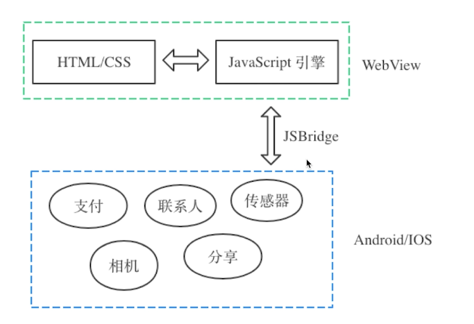
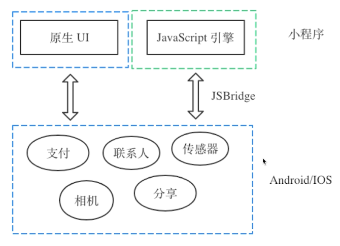

# 01:混合开发介绍

## 01: 混合开发介绍

### 混合开发定义

- 一种开发模式，英文名字叫做 HyBird App
- 混合使用 Native 和 Web 技术开发

### 混合开发优缺点

* 优点：开发快、易更新、开发周期短
* 缺点：性能问题、兼容性问题
* 在 Android 5.0+ 和 IOS 9.0 以上缺点不再明显

### 混合开发应用场景：

* 微信公众号：通过 JSSDK 链接 Native 端和 Web 端

  

* 微信小程序：通过内置框架链接 Native 和 Web 端

  

### 混合开发学习意义

* 更好的使用第三方平台
* 更灵活的技术方案选型
* 具备搭建平台和输出服务的能力

### 混合开发的核心技术

* JS Bridge 桥接器
* 混合开发的核心技术

## 02: 混合开发核心技术

### JS Bridge 桥接器

* 实现 Native 端 和 Web 端双向通信的一种机制
* 以 JavaScript 引擎或者 Webview 容器为媒介
* 通过约定协议进行通信

### 混合开发主流技术框架

* Web 渲染：Cordova(前身是 PhoneGap)
* 原生渲染：React Native、Weex
* 混合渲染：微信小程序

