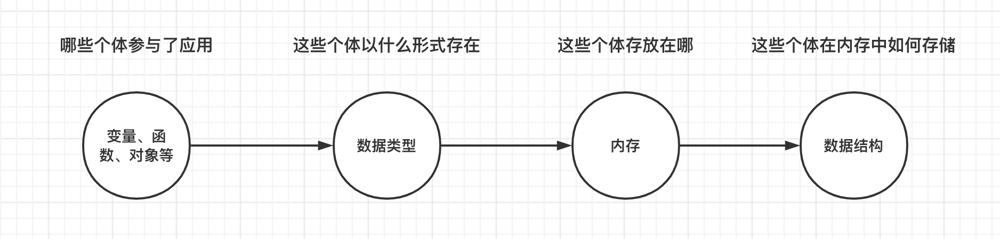
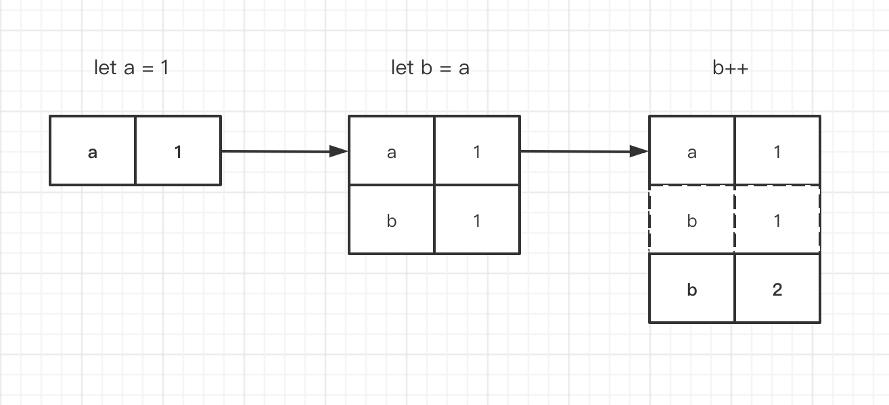
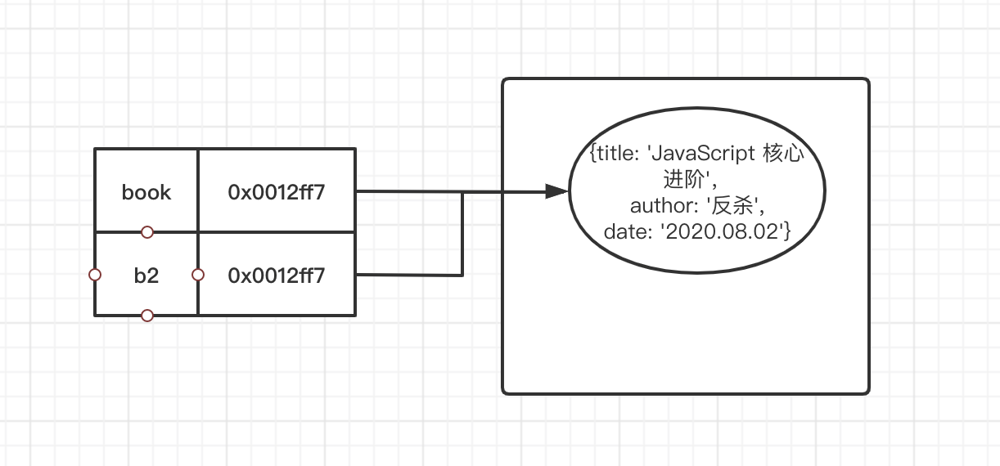
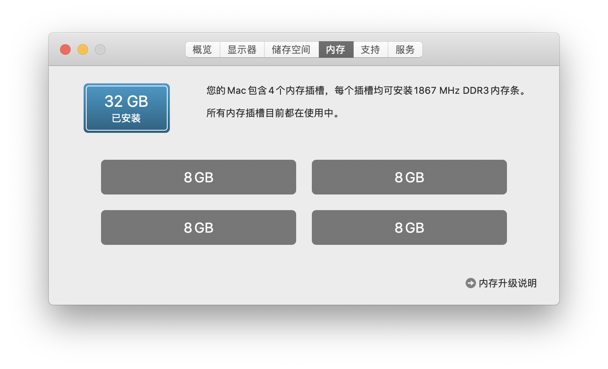
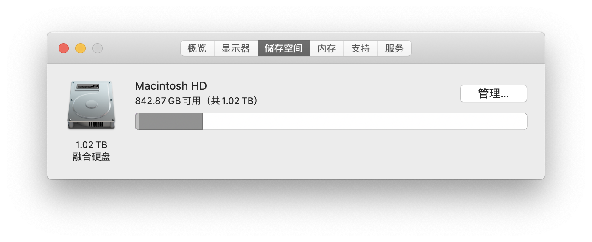
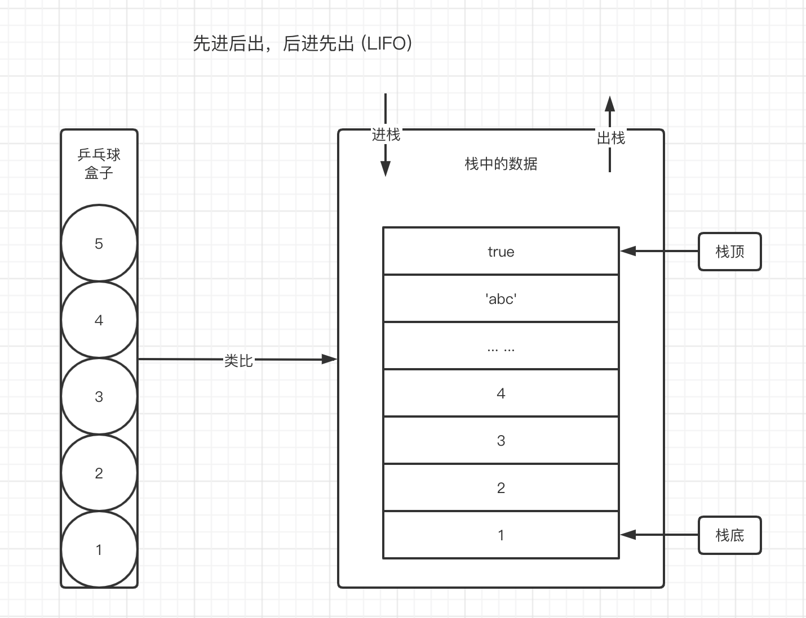
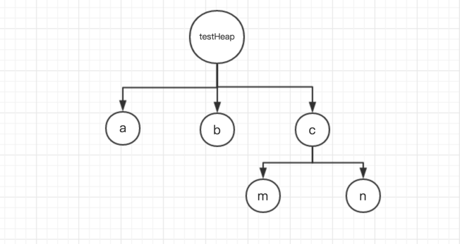
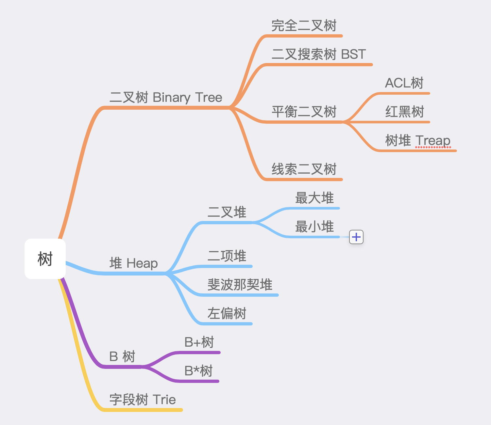
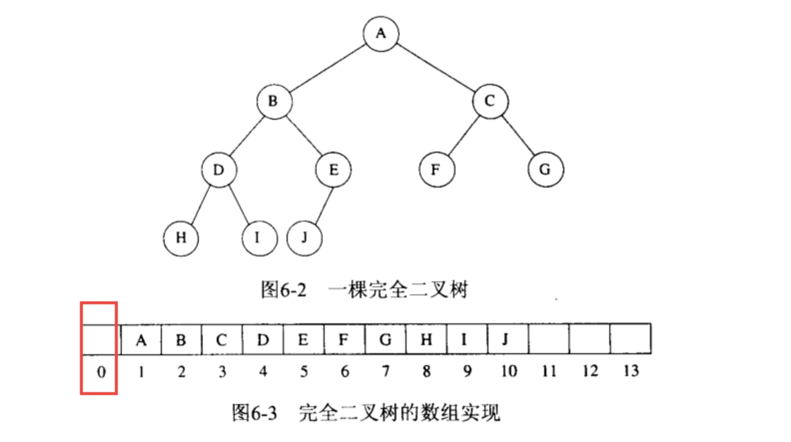
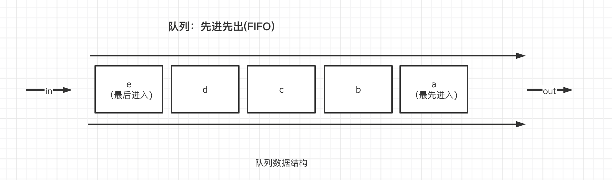

# 02-内存与数据结构

我们可以把一个页面，看成是一个完整的独立应用。

那么，哪些个体参与了应用的运行，这些个体以什么样的形式存在，这些个体要存放在哪里「内存中」，这些个体在内存中如何存放，都是我们要一一去了解的事情。



## 01-个体

讨论参与应用的个体，是讨论在应用运行过程中，哪些角色可能会参与应用运行的课题。

在 JavaScript 中，通常可以通过声明变量、函数、对象这三个方式，来明确它们。

```javascript
// 声明一个变量
var a = 10
// 声明一个函数
function add(a, b) {
  return a + b
}
// 声明一个对象
class M {}
```

上面的例子中，`a, add, M` 分别是不同个体的名字。我们可以通过这些名字，访问到具体个体的值。

## 02-数据类型

讨论数据类型，是讨论个体以什么样的形式存在的课题。

ES6 中定义了 8 种数据类型。其中包括 7 种基础数据类型与一种引用数据类型「Object」。

### 基础数据类型 「primitive value」

基础数据类型，通常用来表达一些结构简单的数据。

| 基础类型  | 值                                     |
| :-------- | :------------------------------------- |
| Boolean   | 只有两个值：`true` 与 `false`          |
| Null      | 只有一个值：`null`                     |
| Undefined | 只有一个值：`undefined`                |
| Number    | 所有数字                               |
| String    | 所有字符串                             |
| Symbol    | 符号类型 `var sym = Symbol('tSymbol')` |
| BigInt    | 整数的末尾追加 n                       |

学习基础数据类型，最核心的关键点，是要理解到，**基础数据类型的值，是不可改变的。**

乍一听，好像有点不太对。我们在使用过程中，经常会遇到修改值的场景。例如数据的累加，字符串的变动等等。是不是和「不可改变」冲突了呢？

以数据累加为例，我们写一个小案例来验证一下。

```javascript
let a = 1
let b = a
b++
console.log(a) // 仍然为1
console.log(b) // 变成了2
```

分析一下上面的代码。我们声明一个变量 `a`, 并且声明一个变量 `b`，将 `a` 赋值给 `b`。这个时候，`a` 与 `b` 是等价的。然后我们试图去修改 `b` 的值，进行累加操作。最后发现一个奇怪的结果，`a` 的值没有变，可是 `b` 的值改变了。也就意味着，`a` `b` 的等价，并不表示他们是同一个值。我们用图例来表达这个过程。

左侧表示变量，右侧表示具体的值。第三步 `b` 为 1 的结果被覆盖了，因此用虚线表示。

我们发现，变量名对应的值可能被改变，但是基础数据类型的值本身是没有改变的。对于变量 `b` 来说，是一个新的值跟他建立了对应关系。

因此，我们说，**基础数据类型，是按值访问的。**

当两个基础类型的变量进行比较时，本质上，也是他们的值在进行比较。

```javascript
const a = 1
const b = 1
a == b // --> 1 == 1
```

下面字符串的案例也能说明问题

```javascript
var str = 'hello world'
str[0] = 'K' // 试图修改字符串的第一个字符

console.log(str) // 打印结果：hello world
```

除了不可变性，基础数据类型还有一个需要我们关注的重点，那就是**基础数据类型也能访问方法。**

这就很奇怪，如果是一个对象，能够访问方法我们能够理解，基础数据类型也能访问方法其实细想一下就很奇怪。

```javascript
var str = 'hello world'
str.charAt(0)
```

原因是因为当我们在访问字符串时，实际上依然是在访问一个对象。在 JavaScript 中，针对每一种基础数据类型(null 和 undefined 除外)，都有提供对应的包装对象，例如对于字符串而言，就有一个名为 `String` 的包装对象，当我们使用字符串变量访问方法时，实际上经历了如下三步代码

```javascript
// 首先使用包装对象创建对象
var _str = new String('hello world')

// 然后使用包装对象的实例去访问方法
_str.charAt(0)

// 最后销毁该对象
_str = null
```

包装对象会在访问方法时临时生效，并在访问结束之后清除包装对象生成的实例。

### 引用数据类型「reference value」

当数据结构变得更加复杂，不再是单一的数字或者字符串，则需要引用数据类型来表达。例如我们想要表达一本书，需要知道书的名字，作者，发行日期等许多信息，才能完整的表达它。

```javascript
const book = {
  title: 'JavaScript 核心进阶',
  author: '这波能反杀',
  date: '2020.08.02',
}
```

与基础数据类型不同的是，**引用数据类型的值是可以被改变的。**

我们也写一个类似的案例来进行分析。

```javascript
const book = {
  title: 'JavaScript 核心进阶',
  author: '这波能反杀',
  date: '2020.08.02',
}
const b2 = book
b2.author = '反杀'
console.log(book) // {title: "JavaScript 核心进阶", author: "反杀", date: "2020.08.02"}
console.log(b2) // {title: "JavaScript 核心进阶", author: "反杀", date: "2020.08.02"}
```

在这个案例中，我们声明了变量 `book`，它的值类型是一个引用数据类型。并且将 `book` 赋值给新的变量 `b2`。然后修改 `b2` 的 `author` 属性。结果我们发现，`book` 和 `b2` 的值，都发生了变化。我们用图例来表达这个过程。



在上图中，与变量 `book` 建立直接映射关系的，并非引用类型本身，而是引用类型值本身在内存中的地址 `0x0012ff7`。因此，当我们执行 `b2 = book` 进行一个赋值操作时，并非如基础数据类型那样，值的本身有一份新的拷贝，而只是地址进行了一份拷贝。这种只拷贝地址的操作，我们也可以称之为**浅拷贝**。

那么自然的，当我们通过 `b2` 修改 `author` 字段时，`book` 对应的值自然也发生了改变，因为他们最终，都是指向同样的引用类型值。

因此我们说，**引用数据类型，是按引用访问的**。这里的引用，说的其实就是内存空间中的地址。

当两个引用数据类型在进行比较时，本质上，是他们的内存地址在进行比较。

```javascript
const a = {}
const b = {}
a == b // false
```

上例中，由于 `a` 与 `b` 是两个分开创建的对象，尽管他们的值是一样的，但是他们在内存空间中的地址不一样，因此他们比较的结果也会不同。直接比较引用地址，我们称这样的操作为**浅比较**。

> 浅拷贝与浅比较，都是针对引用数据类型的概念，它们没有非常明确的界限来定义，在其他场景里，只比较一层数据结构，也被认为是浅比较，浅比较是低成本的比较方式，浅拷贝同理。

## 03-内存

内存是讨论参与应用的个体存放在哪里的课题。

大家都有过购买电脑的经验。在购买电脑时，我们常常会关注两个非常重要的指标：内存与硬盘。



这是计算机给应用程序提供的两种存储信息的途径。我们要研究变量、函数、对象等个体存放在哪里，就是要弄明白内存与硬盘存储的区别。

对于 CPU 而言，他们的区别非常明显。内存通常用于存储程序运行时的信息，CPU 可以通过寄存器直接寻址访问。因此，CPU 访问内存的速度是非常快的。

我们可以将大量的电影，图片等永久存储在硬盘中。与内存的区别就在于，CPU 并不能直接访问硬盘中的数据，它只能通过硬件控制器来访问。

| 对象 | 容量 | 访问速度 | CPU 能否直接访问 | 存储时效   |
| :--- | :--- | :------- | :--------------- | :--------- |
| 内存 | 小   | 快       | 能               | 程序运行时 |
| 硬盘 | 大   | 慢       | 不能             | 持久性     |

对于电脑而言，一个应用程序，我们下载下来，是安装在硬盘存储中，而当我们运行这个程序时，则是在内存中进行。

与之对应的，一个 JavaScript 应用程序，也是在内存中运行。我们也可以将一些数据做持久化存储，这就是我们常说的本地缓存。本质上来说，这些本地缓存也是存储在硬盘中。在浏览器中，提供了 localStorage 对象来帮助我们实现本地缓存。

在 JavaScript 中，内存又分为栈内存与堆内存。栈内存与堆内存本身没有区别，只因为存取方式的差异，而有了不同。通常情况下，一个应用在运行时，操作系统会分配一份内存给它。假设这段内存地址为 0 ~ 1000。

> 内存地址本应该用 16 进制表示，但是为了便于理解，此处使用 10 进制表示

应用程序使用栈内存时，是从地址高位开始分配内存空间。使用堆内存时，是从地址低位开始分配空间。


## 04-基础数据结构

讨论数据结构，是讨论参与应用的个体，在内存中如何存放的课题。

其中，**栈、堆、队列** 是我们需要了解并掌握的三种基础数据结构。

### stack 栈

在学习中遇到栈这个名词时，我们需要针对不同的场景去理解它所要表达的含义。

第一种场景，**栈是一种数据结构**。它表达的是对于数据的一种存取方式。这是一种理论基础。

要理解栈数据结构的存取方式，我们可以通过类比乒乓球盒子来分析。如下图所示。



往乒乓球盒子中依次放入乒乓球，当我们想要取出来使用时，处于盒子中最顶层的乒乓球 5，它一定是最后被放进去并且最先被取出来的。而我们想要使用最底层的乒乓球 1，就必须要将上面的所有乒乓球取出来之后才能取出。但乒乓球 1 是最先放入盒子的。

乒乓球的存取方式与栈数据结构如出一辙。这种存取方式的特点我们总结为**先进后出，后进先出（LIFO，Last In，First Out）**。如上图右侧所示，处于栈顶的数据 true，最后进栈，最先出栈。处于栈底的数据 1，最先进栈，最后出栈。

在 JavaScript 中，数组「Array」提供了两个栈方法用来对应栈的这种存取方式。他们在实践中非常常用。

**push**：向数组末尾添加元素「进栈方法」

push 方法可以接受任意参数，把他们逐个添加到数组末尾，并返回修改后数组的长度

```javascript
var a = []
a.push(1) // a: [1]
a.push(2, 4, 6) // a: [1, 2, 4, 6]
var l = a.push(5) // a: [1, 2, 4, 6, 5] l: 5
```

**pop**：弹出数据最末尾的一个元素「出栈方法」

pop 方法会将数据最末尾的一个元素删除，并返回被删除的元素。

```javascript
var a = [1, 2, 3]
a.pop() // a: [1, 2]
// a.pop()的返回结果为 3
```

数组提供的栈方法，可以很方便的让我们在实践中，模拟栈数据结构来解决问题。

第二种场景是将栈数据结构的理论运用于实践：栈内存空间。我们刚才已经知道，内存空间，因为操作方式不同才有了区别，而栈内存空间的操作方式，正是使用了栈数据结构的思维。

栈内存空间，是用于记录函数的执行记录，它代表了函数的执行顺序。因此也称之为函数调用栈「call Stack」。函数调用栈的相关知识，后续专门用一章来分析。

### heap 堆

堆内存，与堆数据结构是完全不同的两回事。在学习时一定要仔细区分。

堆内存是内存中的空间区域。CPU 可以通过内存地址直接访问。

它的存取方式与在书架中取书的方式非常相似。书虽然整齐的放在书架上，但是我们只要知道书的名字，在书架中找到它之后就可以方便的取出，我们不用关心书的存放顺序，不用像从乒乓球盒子中取乒乓球那样，非得将上面的所有乒乓球拿出来之后才能取到中间的某一个乒乓球。

下面是一个大概的示意图。



该示意图可以用字面量对象的形式体现出来。

```javascript
var testHeap = {
  a: 10,
  b: 20,
  c: {
    m: 100,
    n: 110,
  },
}
```

当我们想要访问 a 时，就只需要通过 `testHeap.a`来访问即可，我们不用关心 a，b，c 的具体顺序。

堆数据结构，是一种特殊的树状结构。他们关系大概如下：



而为了易于存储与索引，在实践中，我们常常会使用二叉堆去解决问题。例如，在 v8 定时器实现原理中，我们会使用二叉堆「又称优先级队列」来决定哪个事件优先执行。

> 优先级队列是非常重要的知识，高级前端工程师必备

二叉堆是一颗完全二叉树。我们使用一个数组就完全可以存储完全二叉树。因此它非常易于存储。



二叉堆又分最大堆和最小堆。

**最大堆**，又称大顶堆，父节点的键值总是大于等于任何一个子节点。
**最小堆**，又称小顶堆，父节点的键值总是小于等于任何一个子节点。

暂时就介绍到这里，具体的数据结构实现，我们在后续补充章节中详细说明。

### queue 队列

队列是一种先进先出（FIFO）的数据结构。正如排队过安检一样，排在队伍前面的人一定是最先过检的人。用以下的图示可以清楚的理解队列的原理。



队列所要表达的核心思维是一种排队机制。因此运用到我们实践中就会有许多其他的规则，例如，位于队列首位的 人员 Peter 有其他的事情必须去完成，这个时候就需要在队列中暂时挂起，让其他的成员可以出队，当 Peter 事情做完之后，需要直接排在队列首位。

又例如在浏览器中，会将所有的异步事件都放于队列中等待执行，可需要满足一定条件才能直接执行。

因此此处队列的先进先出只是一个基础规则，结合运用到实践时，又会有新的限制条件出现。

## 05-内存空间管理

当一个新的个体参与到应用的运行中来，我们首先需要给这个个体分配一份内存空间。而这个个体参与结束之后，它不再参与应用的运行了，我们就应该想办法让它把刚才所占的内存空间让出来，释放掉，这样才能有效的利用有限的内存空间。这个过程，就是内存管理。

对于栈内存而言，操作系统会自动回收出栈的内存空间。

对于堆内存而言，JavaScript 中提供了自动的垃圾回收机制，来释放内存。

```javascript
var a = 20
alert(a + 100)
a = null
```

上面三条语句，可以对应内存管理的三个过程。

```javascript
// 1. 给新的个体分配内存空间
var a = 20

// 2. 参与程序运行，使用内存
alert(a + 100)

// 3. 参与完毕，释放内存
a = null
```

垃圾回收主要依靠「引用」的概念。当一块内存空间中的数据能够被访问时，垃圾回收器就认为「该数据能够被获得」，也就意味着，这份数据可能还需要使用。不能够被获得的数据，就会被打上标记，并释放对应的内存空间。这种方式叫做**标记-清除算法**。

这个算法会设置一个全局对象，并定期的从全局对象开始查找，垃圾回收器将会找到所有可以获得与不能够被获得的数据。

因此在上面的简单例子中，当我们将 a 的值设置为 null，那么刚开始分配的 20，就无法被访问到了，很快就会被自动回收。

**注意**: 在全局中，垃圾回收器无法判断全局声明的内存什么时候应该释放，因此我们在开发中，需要尽量避免使用全局变量。如果使用了全局变量，最好建议不再使用时，通过`a = null` 这样的方式释放引用，以确保能够及时回收。

## 06-小结

本文以一个独立的完整应用作为思维的出发点，去思考当应用运行时，哪些个体参与，这些个体以什么形式存在，这些个体要放在哪里，怎么放等问题，从而轻松将数据类型，内存，数据结构等知识串联。这些看上去零散的知识，都是为了解决应用需要运行这个实际的问题，而提出的解决方案。

## 07-思考题

下面代码执行后，变量 `m` 的值是否被改变了，为什么？

```javascript
const m = {
  a: 1,
  b: 2,
}
function foo(arg) {
  arg.a = 20
}
foo(m)
```
