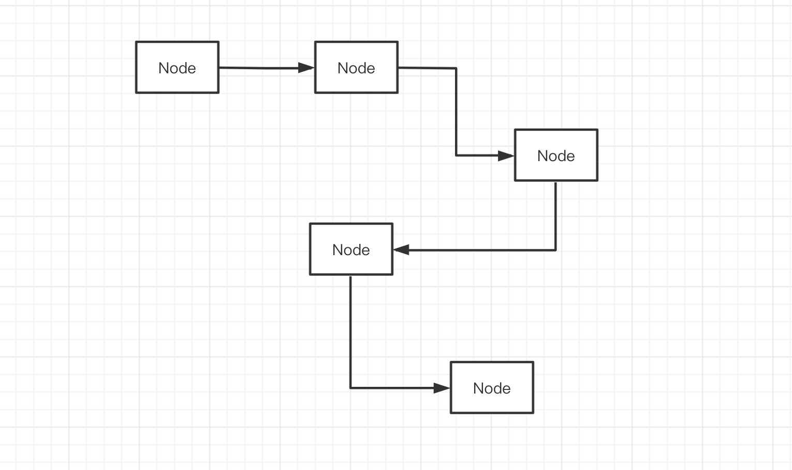
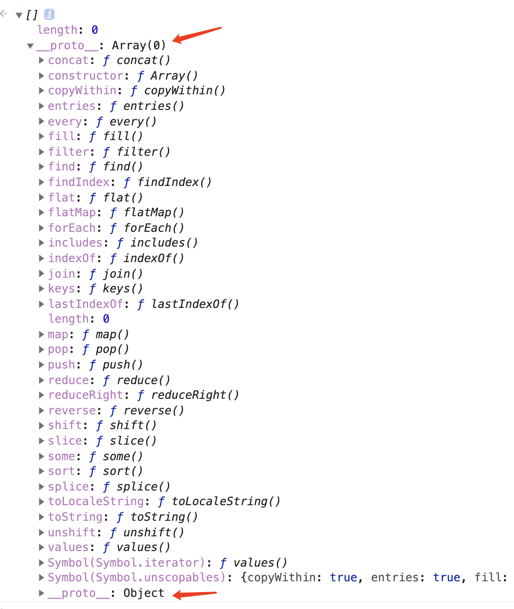

# 06-数据结构链表

链表是一种递归的数据结构，它由多个节点组成，节点之间使用引用相互关联，组成一根链条。



从上图中，我们可以总结出链表的几个特征

在内存中，链表是**松散不连续**的结构，通过引用确定节点之间的联系，不像数组那样，是排列在一起的连续内存地址

**链表没有序列**，如果引用是单向的，只能通过上一个节点，找到下一个节点

**节点之间的引用可以是单向的「单向链表」，也可以是双向的「双向链表」，还可以首尾连接「循环链表」**

> 从知识点的角度来说，链表与数组几乎是一对孪生兄弟，他们都能解决同样的问题。

链表的节点通常是这样一个类似的对象

```javascript
// ts 语法，用于描述 Node 对象的具体结构
type Node = {
  // 指向其他节点的引用
  next: Node,
  prev: Node,
  
  // 其他表示这个节点具体内容的属性
  tag: string,
  type: number
  ...
}
```

next 与 prev 属性，表示节点中指向下一个节点或者上一个节点的引用，该引用的属性名在不同的引用场景中可能命名不同。其他的属性，则表示该节点的具体内容。我们可以通过 next 与 prev 找到其他节点。

在学习过程中我们能够遇到非常多这样的案例，例如 HTML div 元素对象中有这样两条属性

```javascript
// 伪代码
div = {
  nextSibling: nextDiv
  previousSibling: prevDiv
  ...
}
```

又例如在原型链中，每一个实例对象，都有一个 `__proto__` 属性，用以指向该实例的原型对象。该原型对象，自身也会有一个 `__proto__` 属性，指向自己的原型对象。

原型链是一个由 `__proto__` 进行关联的单向链表。

又例如在 React 源码实现中，会对多任务进行切片，每一个切片就是一个 Fiber 节点。而这个节点的数据结构大概如下，暂时可只关注前两个属性，我们会发现链表的体现

```javascript
// ts 语法，用于表示一个节点的数据结构
type Fiber = {
  // 单向链表引用：指向自己的第一个子节点
  child: Fiber | null,
  
  // 单向链表引用：快速查找下一个 side effect
  nextEffect: Fiber | null,

  // Fiber 节点的其他属性，可忽略
  tag: WorkTag,
  key: null | string,
  elementType: any,
  type: any,
  stateNode: any,
  sibling: Fiber | null,
  return: Fiber | null,
  index: number,
  ref: null | (((handle: mixed) => void) & {_stringRef: ?string}) | RefObject,
  pendingProps: any, 
  memoizedProps: any,
  updateQueue: UpdateQueue<any> | null,
  memoizedState: any,
  firstContextDependency: ContextDependency<mixed> | null,
  mode: TypeOfMode,
  effectTag: SideEffectTag,
  firstEffect: Fiber | null,
  lastEffect: Fiber | null,
  expirationTime: ExpirationTime,
  childExpirationTime: ExpirationTime,
  alternate: Fiber | null,
  actualDuration?: number,
  actualStartTime?: number,
  selfBaseDuration?: number,
  treeBaseDuration?: number,
  _debugID?: number,
  _debugSource?: Source | null,
  _debugOwner?: Fiber | null,
  _debugIsCurrentlyTiming?: boolean,
};
```

因为链表的松散性，如果我们要在实践中使用链表，只需要约定好每个节点的数据格式，在创建节点时，通过引用指向上一个节点或者下一个节点即可。因此我们往往会依据上一个节点来创建下一个节点，这样很容易建立联系，而不是凭空产生。

例如我们创建一个数组对象，是根据 Array 对象来创建

```javascript
// new 的实现中，完成了 __proto__ 的指向
var arr = new Array()
```

这样 实例 arr 就依据 Array 对象，加入了原型链中。

所以，我们可以看出，**链表常常用于解决不关注序列的的线性场景**。

从知识点的角度分析，数组与链表可以算是一对孪生兄弟。都是作为线性数据结构，几乎能够解决同样的问题。我们完全可以定义一个 LinkedList，实现与 Array 一模一样的功能。但是他们在内存空间中的位置特性，决定了他们适应的场景不一样

**链表，在内存空间是松散的，不连续的。**因此，如果我们要关注链表的序列的话，就很麻烦。我们需要找到头部节点，根据引用找到下一个节点，然后再依次找下去。也就是说，如果想要找到链表中的第 9 个节点，那么我们必须要依次找出前面 8 个节点，才能通过第八个节点的引用，知道第九个节点是谁。而数组就没那么麻烦，可以通过序列直接找到第九个元素。

**数组，在内存空间是紧密的，连续的**。那么也就意味着，如果我要在长度为 100 的数组中的第二个位置，新增一个成员，后面的 99 个数组成员，在内存空间中都得往后挪动位置，这样才能空出新的空间让新成员加入。而链表在新成员加入的时候就没那么麻烦，因为空间的不连续性，新节点不需要任何成员让位置。

在性能的角度上考虑，访问某个成员，数组远远优于链表，而如果新增/删除元素，链表远远优于数组。因此基于这个特性，面对实际场景，我们要选择最适合的解决方案。

## 01-代码实现

单向链表的代码实现

```javascript
// 单向链表
class LinkedList {
  constructor() {
    this.length = 0
    this.head = null // 链表首部节点
  }

  // 约定此时的节点格式
  createNode(number) {
    return {
      num: number,
      next: null
    }
  }

  push(number) {
    const node = this.createNode(number)
    if (!this.head) {
      this.head = node
      this.length++
      return node
    }
    let current = this.head
    
    // 此处的节点处理是关键，从头部开始遍历，只要还能找到下一个，说明就还不是最后一个，直到最后找不到了，就表示 current 指向了最后的节点
    while (current.next) {
      current = current.next
    }
    current.next = node
    this.length++
    return node
  }

  // 根据索引位置，插入新节点：默认此处传入的 i 值 >= 0，小于 length
  insert(i, number) {
    const node = this.createNode(number)
    let curIndex = 0, prevNode = null, current = this.head;
    if (i == 0) {
      node.next = current
      this.head = node
      return node
    }
    // 找到 i 对应的节点
    while (curIndex++ < i) {
      prevNode = current
      current = current.next
    }
    // 上一个节点指向新增节点，新增节点指向下一个节点
    node.next = current
    prevNode.next = node
    this.length++
    return node
  }

  // 找到节点所在的位置
  indexOf(number) {
    let index = -1, curIndex = -1, current = this.head

    // 直到找到最后一个节点
    while (current) {
      index++
      if (current.num == number) {
        curIndex = index
        break
      }
      current = current.next
    }

    return curIndex
  }

  // 根据索引位置，删除节点，默认 i 值是合理的
  remove(i) {
    let prevNode = null, current = this.head, curIndex = 0;
    if (i == 0) {
      const rmNode = current
      this.head = current.next
      return rmNode
    }

    while(curIndex++ < i) {
      prevNode = current
      current = current.next
    }
    // 被删除的节点
    const rmNode = current
    prevNode.next = current.next
    return rmNode
  }
}
```

上面代码实现，引入了索引位置的概念来实现链表的部分功能。我们发现，一旦涉及到位置信息，都需要进行遍历处理，这也是链表在索引位置上的弊端所在。

我们还可以根据实际需求再新增新的方法。双向链表的实现也只需要额外多处理一个 prev 引用即可。

## 02-思考题

需要排序的应用场景「例如我之前章节中实现的二叉堆」，适合用链表来实现吗？为什么？
