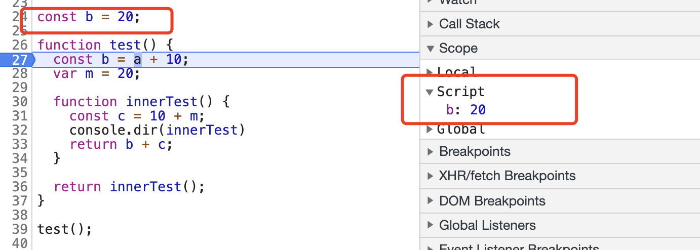
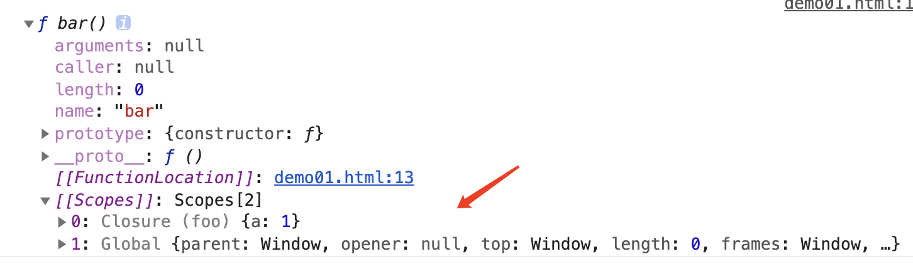
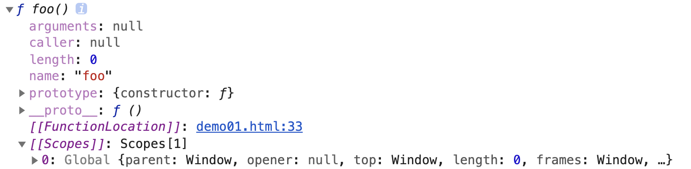
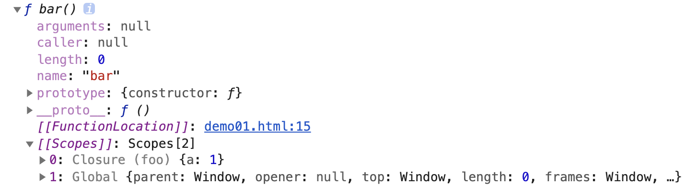
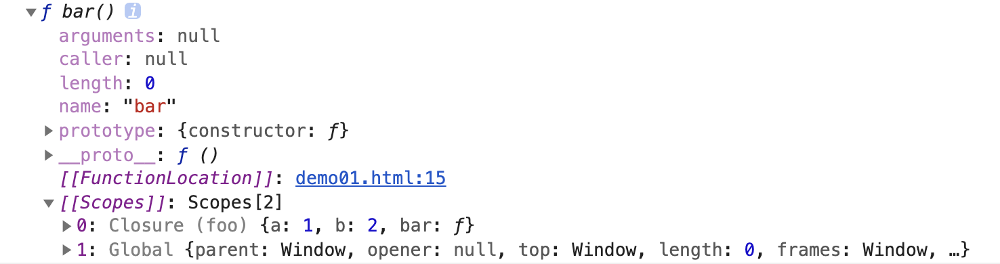
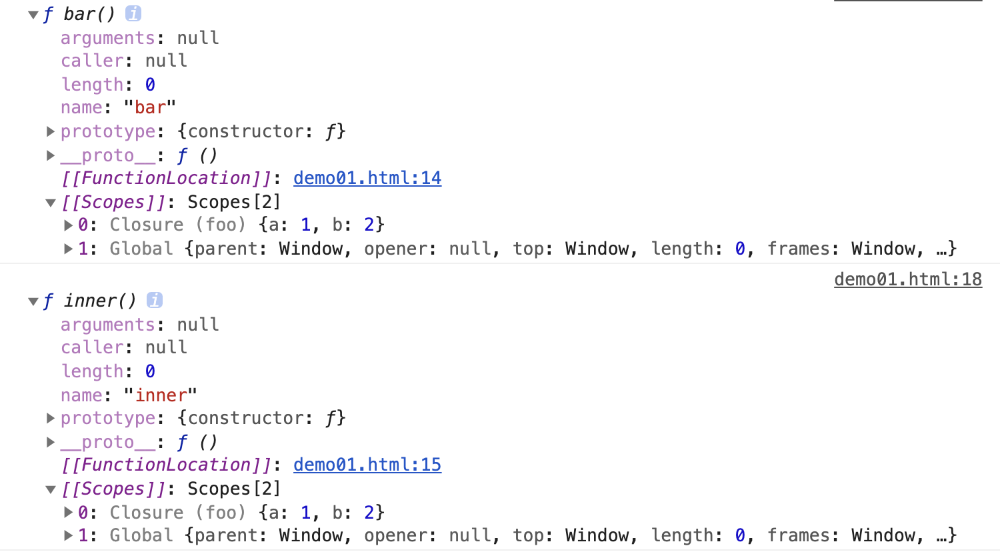
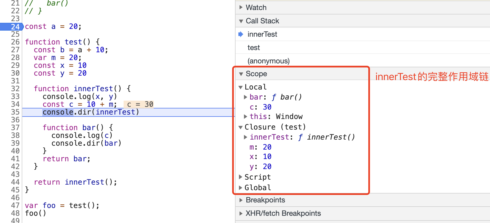
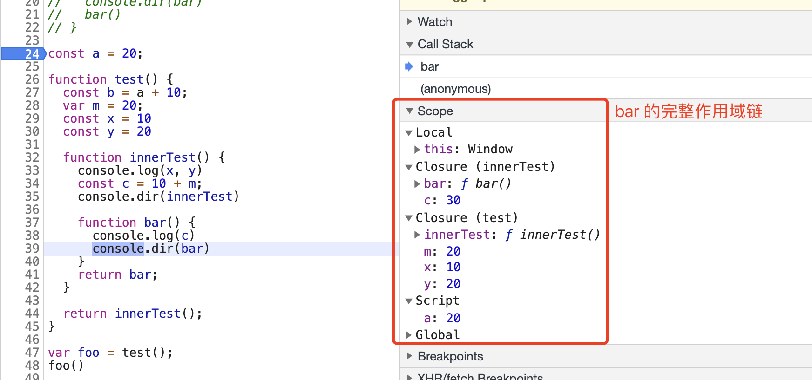

# 09-作用域与作用域链

作用域是规定变量与函数可访问范围的**一套规则**。

最常见的作用域有两种，分别是全局作用域与函数作用域。

## 01-全局作用域

全局作用域中声明的变量与函数，可以在代码的任何地方被访问。一般来说，以下三种情形属于全局作用域。

**全局对象下的属性与方法**

```javascript
window.name
window.location
window.top
...
```

**在最外层声明的变量与方法**

```javascript
const foo = function() {}
let str = 'out variable';
let arr = [1, 2, 3];
function bar() {}
...
```

**在非严格模式下，函数作用域中未定义但直接赋值的变量与方法。**

在非严格模式下，这样的变量自动变成全局对象 window 的属性。因此他们也是属于全局作用域。

```javascript
function foo() {
  bar = 20;
}

function fn() {
  foo();
  return bar + 30;
}

fn(); // 50
```

需要注意的是，从一个完整的大型应用的角度来考虑，我们应该尽量少的将变量或者方法定义为全局。

我们可能会**无意间修改全局变量的值**，但是其他场景并不知道

```javascript
// 定义全局变量
const foo = { m: 200 }

function setM() {
  // 轻易的被修改
  foo.m = 300
}

setM()
```

**命名冲突：**不同的开发者，在同一个项目里如果都使用全局变量的话，很容易造成命名冲突

应用程序执行过程中，**全局变量的内存无法被释放**

因此，对于团队项目管理来说，每一个全局变量的使用，都应该引起足够的重视以防止影响到别的代码逻辑。除此之外，还有许多类似的场景，例如，css 没有作用域的概念，那么也就意味着，每一个组件对应的样式，都有可能影响别的组件布局，因此我们常常会通过一些方式让当前组件具备范围约束，以达到作用域的效果

```javascript
// 假设当前组件为一个侧边栏，为了避免影响其他元素，每一个样式前面都使用 sidebar 进行范围约束
.sidebar .container {}
.sidebar .content {}
.sidebar .left {}
```

在 vue 中，专门提供了 css 作用域的语法，以达到类似的效果

```vue
<style scoped>
.example {
  color: red;
}
</style>

<template>
  <div class="example">hi</div>
</template>
```

将会编译为

```vue
<style>
.example[data-v-f3f3eg9] {
  color: red;
}
</style>

<template>
  <div class="example" data-v-f3f3eg9>hi</div>
</template>
```

我们还可以将全局的概念进行一些演变，整个项目能轻松访问到或者修改的地方，都可以认为是全局。例如在 vue 的项目中，常常会有小伙伴通过一些方式，将一些变量或者方法挂载到全局的 Vue 对象上去。此时这些变量和方法能够被我们轻松访问到，例如 、emit、、http 等。我们应该尽量避免去新增或者修改新的全局变量与方法，例如 element-ui 中新增的 $message 全局方法，都是不建议的做法。

这里有一个细节需要重点关注，全局声明的变量，还存在一些差异。

我们使用 var 声明的变量，会被挂载到全局对象 window 之下。

```javascript
var a = 100
console.log(window.a) // 100
```

而使用 let/const 声明的变量，并不会修改 window 对象，而是被挂载到一个新的对象 Script 之下

```javascript
const b = 20
console.log(window.b) // undefined
```



## 02-函数作用域

每一个花括号 `{}` 都是一个代码块。但需要注意的是，并不是所有花括号，都能够具备自己的作用域。函数声明或者函数表达式，能够让花括号具备作用域，我们称之为函数作用域。函数作用域中声明的变量与方法，只能被下层子作用域访问，不能被其他不相关的作用域访问。

```javascript
function foo() {
  var a = 20;
  var b = 30;
}
foo();

function bar() {
  return a + b;
}

bar(); // 因为作用域的限制，bar中无法访问到变量a,b，因此执行报错
```

```javascript
function foo() {
  var a = 20;
  var b = 30;

  function bar() {
    return a + b;
  }
  return bar();
}
foo(); // 50 bar中的作用域为foo的子作用域，因此能访问到变量a, b
```

在 ES6 以前，ECMAScript 没有块级作用域，因此使用时需要特别注意，一定是在函数环境中才能生成新的作用域。如下情况则不会有作用域的限制。

```javascript
var arr = [1, 2, 3, 4, 5];

for (var i = 0; i < arr.length; i++) {
  console.log('do something by ', i);
}

console.log(i); // i == 5
```

因为没有块级作用域，单独的 `{}` 并不会产生新的作用域。这个时候 i 的值会保留下来，在 for 循环结束之后仍然能够访问。

在前面一章我们了解到，**作用域的范围信息，是在预解析阶段就已经确定的**，因此在代码执行之前，就已经明确了作用域的范围。例如以下例子

```javascript
function foo() {
  var a = 1;
  function bar() {
    console.log(a);
  }
  console.dir(bar)
}

foo()
```

例子中，我在 foo 函数内部定义了 bar 函数，执行 foo 函数时，并未执行 bar 函数，而是打印出来看看 bar 函数的详细信息，此时 bar 仅仅只是被预解析，而我们可以看到，在打印结果中，bar 函数的作用域信息已经生成了。


## 03-模拟块级作用域

没有块级作用域会给我们的开发带来许多困扰。例如上面的 for 循环例子中，i 值仍然在作用域中可以被访问，那么这个值就会对作用域中的其他同名变量造成干扰。因此在没有块级作用域时，需要模拟块级作用域。我们知道，一个函数可以生成一个作用域，这个时候，就能够利用函数达到模拟的目的。

```javascript
var arr = [1, 2, 3, 4, 5];

// 自执行函数
(function () {
  for (var i = 0; i < arr.length; i++) {
    console.log('do something by ', i);
  }
})();

console.log(i); // i is not defined
```

## 04-块级作用域

变量的声明，有三种方式。

### **第一种：var 声明**

在 ES6 标准之前，我们只能使用 var 声明变量。这样变量声明的方式约束性很弱。对于已经声明的变量，我们可以重复声明，我们也可以任意修改变量声明的值。并且除函数之外的其他花括号也不会对 var 声明的变量有作用域的约束。它完美符合了 JavaScript 弱类型语言的定位。

```javascript
// 同名变量可以重复声明
var a = 10;
var a = 20;

// 声明的变量可以任意修改
var b = 30;
b = 40;
b = function() {}


// 花括号不会约束 var 变量的作用范围
{
  var c = 50
}
console.log(c) // 50
```

var 声明的变量，具备变量提升的特性。

```javascript
console.log(a) // 输出 undefined
var a = 20
console.log(a) // 输出 20
```

变量提升的意思是，将变量声明提升到当前作用域最前面执行，并且赋值为 undefined，而赋值操作留在原处。因此上述代码的真实执行顺序为

```javascript
var a = undeinfd
console.log(a)
a = 20
console.log(a)
```

正是因为 var 变量的灵活性，以及变量提升带来的理解偏差，导致许多使用者在使用 var 声明变量时，造成了很多困扰，对一些意外情况无法理解。

因此，为了减少开发者在使用过程中的错误，ES6 提供了新的，具有更强约束性的变量声明方式。

### 第二种：let 声明

let 声明最核心的特点，就是它声明的变量，能够被任何花括号约束。这也就是我们常说的块级作用域。

```javascript
{
  let a = 10
}
console.log(a) // Uncaught ReferenceError: a is not defined
if (true) {
  let a = 20
}
console.log(a) // Uncaught ReferenceError: a is not defined
for(let i = 0; i <= 10; i++) {
  console.log(i) // 依次输出 0 ~ 10
}
console.log(i) // Uncaught ReferenceError: i is not defined
with(location) {
  let s = search.substring(1)
  let hostName = hostname
}
console.log(s) // Uncaught ReferenceError: s is not defined
```

let 声明的变量，不能重复声明，否则将会被解析为一个语法错误。

```javascript
let a = 20
let a = 30 // Uncaught SyntaxError: Identifier 'a' has already been declared
```

let 声明的变量，不会提前赋值为 undefined

```javascript
// 记得在 js 文件或者 script 标签中执行，而不是在 console 面板中
console.log(a) // Cannot access 'a' before initialization
let a = 20
console.log(a)
```

let 声明的变量，存在暂时性死区。在当前块级作用域中，let 声明的变量，在赋值之前，都不能对该变量进行额外的访问与操作，否则就会报错。

```javascript
var a = 10;

if (true) {
  a = 20; // Uncaught ReferenceError: Cannot access 'a' before initialization
  let a = 30; // 当然这里也会报错，因为重复声明了，只不过提前报错了，所以暴露不到这里来
}
```

从这里的报错信息也可以看出，let 声明的变量，其实也是存在变量提升的，只不过并没有进行初始化赋值「initialization」，具体的我们后面再深入分析。

### **第三种：const 声明**

const 声明具备与 let 声明差不多的特性，他们只有一个点不一样，那就是 const 声明的变量，对应的值不能被修改。

如果变量对应的是基础数据类型，则值不能被修改

如果变量对应的是引用数据类型，则是该引用的的内存地址不能被修改。

```javascript
const a = 20
a = 30 // Uncaught SyntaxError: Identifier 'a' has already been declared

const person = { name: 'TOM' }
person.name = 'Jake'  // 可以修改
```

结合基础数据类型与引用数据类型的特点，这个不难理解。我们要重点考虑的是，在实践中，用哪一种声明比较合适。

**能用 const 的，就先使用 const，不能使用的，再使用 let 来声明。**

基于这样的原则，我们能够很快初步明确变量所对应的值，在当前上下文中的处境。

## 04-作用域链

作用域是一个很抽象的概念。但是每一个函数内，能够访问哪些变量，都必须要有一个具体范围体现出来。因此有了作用域链的概念。

每一个函数都有一个 [[Scopes]] 属性，它是由一系列对象组成的数组。每个对象，都对应某一个父级作用域。它们是从对应的父级函数作用域中，收集到的当前函数作用域内会使用到的变量声明、函数声明、函数参数的集合。

仅仅从字面上理解有一点困难，我们结合一个例子来分析一下。

先从最简单的例子开始，我们直接在全局作用域中声明一个函数，观察一下这个函数的作用域链是什么

```javascript
function foo() {
  const a = 10;
  function bar() {}
}

console.dir(foo)
```



我们发现当前函数 foo 的 [[Scopes]] 属性中，只有一个全局的 window 对象。该对象代表了全局作用域的所有属性与方法。

接下来，将例子修改得稍微复杂一点

```javascript
function foo() {
  var a = 1;
  let b = 2;

  function bar() {
    console.log(a);
  }
  
  console.dir(bar)
}

foo()
```

在函数内部，我声明了两个变量 a，b，一个函数 bar。然后观察一下 bar 的作用域链。

打印结果发现，bar 的 [[Scopes]] 属性中有两个对象，他们分别来自全局作用域，与父级函数 foo 的作用域。这里需要注意的是，父级函数 foo 中，声明了两个变量一个函数，但是在 bar 的作用域链对象中，仅仅只出现了变量 a。这是因为在函数 bar 内部，只访问了变量 a。这是在代码解析时针对性的做了优化。

如果我们同时在 bar 中访问了所有变量与函数，那么结果就会不一样。

重新修改一下代码

```javascript
function foo() {
  var a = 1;
  let b = 2;
  function bar() {
    function inner() {
      return a + b;
    }
    console.dir(inner)
  }
  console.dir(bar)
  bar()
}

foo()
```

在 bar 函数内部，新增函数 inner，inner 直接访问 foo 中声明的变量 a，b。此时同时观察函数 bar 与函数 inner 的 [[Scopes]] 属性，我们会发现，他们居然都是一样的。



无论是对于 bar 还是 inner 来说，内部只访问了 foo 函数作用域中的 a，b，因此这样的结果是符合优化原则的，那些没有被访问的函数声明不会解析到作用域链中。

当然，从理论上而言，inner 函数的作用域链中，应该包含所有父级作用域中声明的变量/函数/参数。

```javascript
inner.[[Scopes]] = [O(bar), O(foo), O(window)]
```

只是O(bar) 中，一个变量也没有，因此就被优化掉了。

**在当前函数中，要寻找到变量的值是从哪里来的，就首先会从当前执行上下文中查找，如果没有找到，则会去作用域链中查找。这里需要注意的是，作用域链本身就是存在于函数对象中的一个属性 [[Scopes]]，因此不是一层一层的往上查找「这里经常理解有误」，该属性是在代码预解析阶段就已经确认好的。**

## 05-完整作用域链的组成部分

通过上面的学习，我们知道，每一个函数在声明后，都具备一个属性 [[Scopes]]，该属性中存储了当前函数可访问的所有变量对象。这些变量对象又有所不同。

**Global 全局对象**：不会做任何优化，会包含全局对象中的所有属性与方法

**Script 对象**：在全局环境下，由 let 和 const 声明的变量对象

**Closure 对象**：我们讨论比较多的闭包对象，嵌套函数生成，仅会保存当前作用域能够访问的变量属性

**Local 对象**：以上的几种变量对象，都会存在于函数的 [[Scopes]]属性之中，因为他们都能够在函数解析时确认，而 Local 对象则不行，需要在函数的执行过程中才能确定，并且在执行过程中，该对象中的属性是随时会发生变化的，该对象除了会存储当前函数上下文中所有的变量与函数声明，还会额外记录this的指向。

通过该例子结合图示进行分析

```javascript
// const 声明，在其他函数的作用域链中，会归属于 Script 对象中去
const a = 20;

function test() {
  const b = a + 10;
  var m = 20;
  const x = 10
  const y = 20

  function innerTest() {
    console.log(x, y)
    const c = 10 + m;
    console.dir(innerTest)

    function bar() {
      console.log(c)
      console.dir(bar)
    }
    return bar;
  }

  return innerTest();
}

var foo = test();
foo()
```

函数 innerTest 的完整作用域链如下：Local -> Closure(test) -> Script -> Global

函数 bar 的完整作用域链如下： Local -> Closure (innerTest) -> Closure (test) -> Script -> Global

大家可以利用该案例，结合断点调试观察一下在执行过程中，Local 对象的变化过程。

在作用域链的组成对象里，除了 Local 对象是在函数执行时确认的之外，其他的都是在函数声明时就能够明确的，因此在后续的文章里，我们称 Local 对象为**活动对象**，其他对象为**变量对象**。

> 注意，此处的 Local 对象，并非后续会介绍到的词法环境记录对象，或者变量环境记录对象，不过他们有很大的相似之处

## 06-思考题

如下例子中，作用域链的情况如何

```javascript
const a = 20;

function test() {
  const b = a + 10;

  function innerTest() {
    const c = 10;
    console.dir(innerTest)
    return b + c;
  }

  return innerTest();
}

test();
```