# 10-函数调用栈

函数调用栈对于代码的执行顺序有着非常重要的决定性影响。在完成一个应用程序的过程中，我们需要调用大量的函数来帮助我们完成各种功能，JavaScript 使用函数调用栈来管理所有函数的执行。

## 01-函数体

当我们在代码中声明一个函数，如下

```javascript
function foo() {}

var bar = () => {}
```

无论使用哪种方式，都能够创建一个函数体。

函数体也是数据，每一个函数体都是一个对象，在代码解析阶段创建，被持久的存储于内存之中，也就是说，在程序的运行过程中，函数体始终存在。

因此，我们可以在程序运行的任何时候调用该函数。

在其他语言，例如 Java，函数的声明会在代码打包的过程中就解析好，因此函数是静态的，在内存中会专门提供一个静态的方法区用于存放函数体。

但是 JS 是在代码运行过程中对函数进行解析，因此在内存分配中，JS 并没有一个类似方法区的静态区域用于存储函数体，而是将函数体看待成为一个对象，存放于堆内存中。

## 02-执行上下文

声明函数与执行函数是两个不同的阶段。

声明函数会创建函数体，函数体会持久的占用一定的内存空间。而执行函数会创建执行上下文，执行上下文会占用新的内存空间，执行上下文与函数体是完全不同的。

执行上下文会按照函数体内编辑好的代码逻辑，实时的记录函数在执行过程中的所有状态与数据。

执行上下文占用的内存空间是临时的，函数执行完毕，它占用的内存空间就应该被释放掉。

因此，同一个函数，我们可以调用很多次，但是每次调用，都会生成新的执行上下文。我们常说的函数执行完毕，所占用的内存空间会被垃圾回收器回收，说的就是执行上下文所占用的内存空间。

JavaScript 代码的执行，必须进入到一个执行上下文中：执行上下文可以理解为当前可执行代码的运行环境。执行上下文用于跟踪可执行代码的执行状态。

JavaScript 中的运行环境包括三种情况：

- 全局环境：代码运行时会首先进入全局环境，同时会生成全局上下文
- 函数环境：当函数被调用执行时，进入函数环境执行函数代码，同时该函数对应的执行上下文被创建
- eval环境：不建议使用，这里不做介绍

当我们调用一个新的函数时，一个新的执行上下文就会被创建。因此可以预见的是，每一个应用程序中，会有大量的执行上下文会被创建。JavaScript 引擎，使用栈的方式来管理与跟踪多个执行上下文的运行情况，我们称之为**「函数调用栈」。**在应用程序的运行过程中，栈底永远是全局上下文，并且不会出栈。栈顶是当前正在执行的上下文，**并且正在执行的上下文始终都会在栈顶**。也就意味着，无论任何时候，都只会有一个上下文正在执行。在执行过程中，如果遇到了新的函数，那么就会创建新的上下文，推入到栈顶，栈顶上下文执行完毕之后，就会出栈，并被垃圾回收器回收，新的栈顶上下文继续执行。

为了更加清晰的理解整个函数调用栈的执行过程，我们通过几个实例进行分析一下。

demo1：有示例代码如下

```javascript
var color = 'blue';

function changeColor() {
  var anotherColor = 'red';

  function swapColors() {
    var tempColor = anotherColor;
    anotherColor = color;
    color = tempColor;
  }

  swapColors();
}

changeColor();
```

此处使用 ECStack 来表示跟踪执行上下文执行情况的函数调用栈。

第一步：首先肯定是全局上下文入栈，并且一直存于栈底

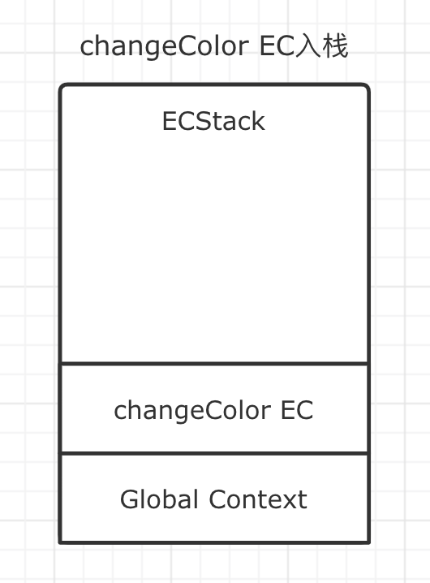

第二步：全局上下文入栈之后，代码开始执行，直到遇到了 `changeColor();` ，这一句代码表示调用函数 changeColor，因此它会创建自己的执行上下文，此时新创建的上下文入栈，并开始执行，此时全局上下文会处于挂起状态，暂停执行。

第三步：changeColor 的上下文入栈之后，开始执行其中的代码，执行过程中遇到了 `swapColors();` ，于是激活了 swapColor 的执行上下文，于是新的上下文入栈，并开始执行。此时 changeColor 的上下文会调整为挂起状态，暂停执行。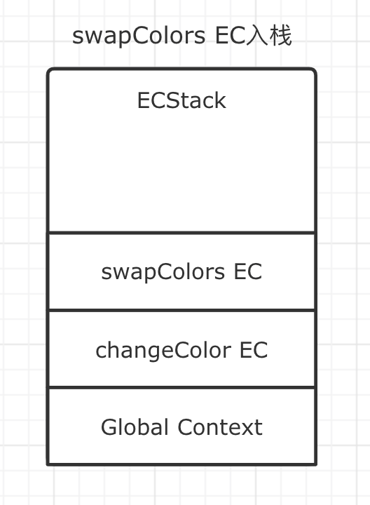

第四步：在 swapColors 的执行过程中，并没有遇到新的函数调用，因此不会生成新的指向上下文，swapColors 函数顺利执行完毕。此时 swapColors 的上下文从栈中弹出，等待被回收。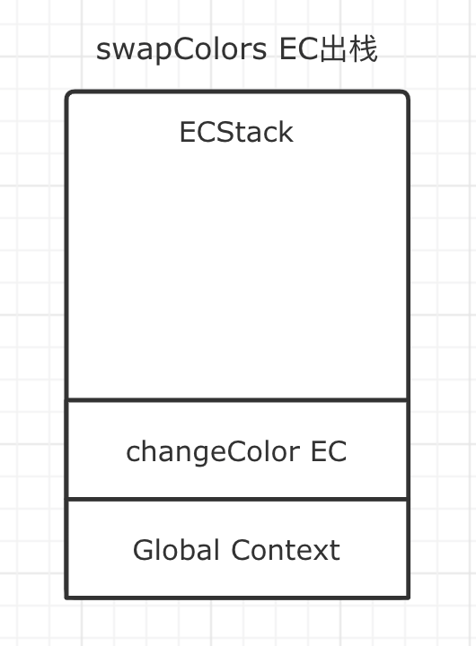

第五步：swapColors 的执行上下文被弹出之后，changeColor 的执行上下文再次成为栈顶元素，代码从挂起状态激活，重新开始向下执行。继续执行的过程中，再没遇到新的函数被调用，因此顺利执行完毕，从函数调用栈中被弹出等待回收。此时，函数调用栈 ECStack 中，就只剩下全局上下文了。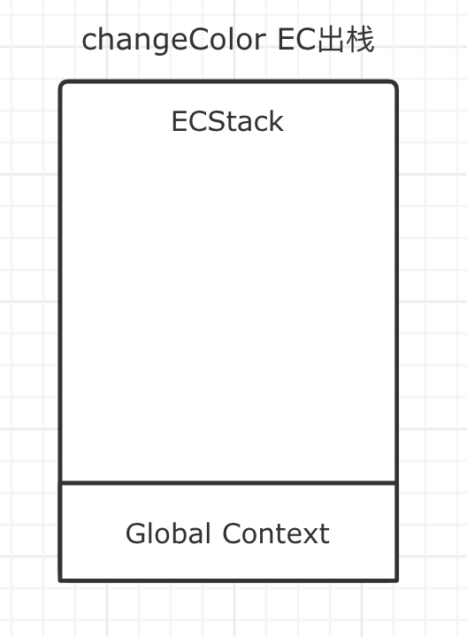

最后，全局上下文在浏览器窗口关闭，整个应用程序结束执行时出栈。

注意：函数执行过程中，遇到 return，能直接终止可执行代码的执行，此时会直接将上下文弹出栈。

整个过程如下

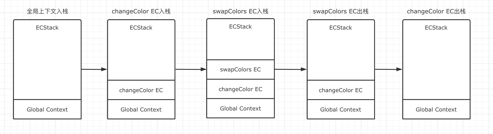

在浏览器环境下，代码包含在 script 标签中，浏览器会将 script 标签处理成为一个匿名函数参与到栈中。但它不是全局上下文。并且当我们在 chrome 中通过调试工具观察函数调用栈时，看不到全局上下文入栈。这也是默认全局上下文始终存在。因此，在浏览器的观察中，更准确的表达应该如下图所示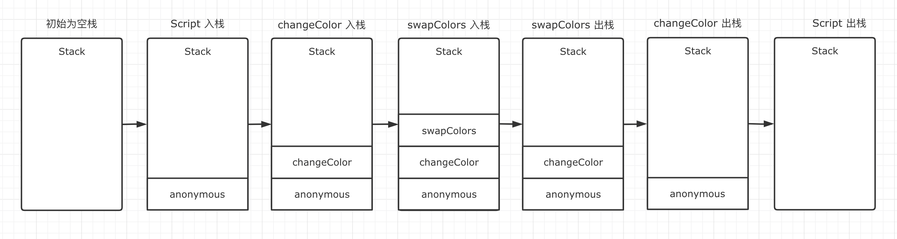但我们在学习时仍然会将全局上下文加入到理解中来，并且忽略 Script 标签生成的匿名函数。

关于调用栈的执行顺序我想大家应该都已经理解了，我们再来分析一个具备一定迷惑性的例子。

```
function f1() {
  var n = 999;
  function f2() {
    alert(n);
  }
  return f2;
}
var result = f1();
result(); // 999
```

只是一个跟闭包有关的例子，我们仔细观察该例子，函数 f1 执行过程中，声明了新的函数 f2，并且返回 f2。接着 f2 继续执行。在 f2 中访问了 f1 的变量 n，因此会形成包含 n 的闭包对象，该闭包对象不会因为 f1 执行完而被回收。

第一步，仍然是全局上下文入栈

第二步，代码在执行过程中，遇到了 f1 执行 `var result = f1()` ，因此 f1 创建新的执行上下文入栈

第三步，在 f1 的执行过程中，虽然声明了 f2，但是并未执行 f2，因此不会产生别的上下文，return 之后表示函数执行完毕，f1 自然会出栈。

第四步，这里就有一些迷惑性了，result 其实是在 f1 中声明的 f2，因此 result 执行会创建新的上下文入栈

第五步，result 在执行过程中，没有别的上下文产生，于是执行完毕之后直接出栈

完整步骤如下图所示：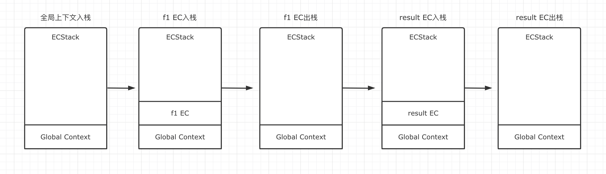

## 03-chrome 中的栈图

函数调用栈利用了栈数据结构的思维来管理代码的执行顺序，因此深刻的理解调用栈，对于我们调试代码定位问题也非常有用。

在 chrome 的开发工具中，我们通过 Performance 工具观察整个项目的代码中的代码执行顺序，以及整个项目的调用栈变化情况。如下图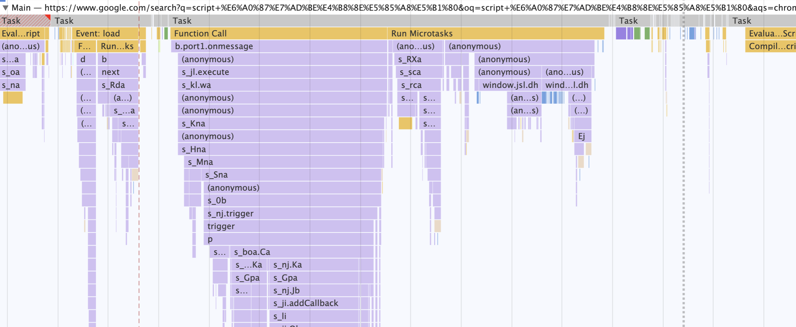

图中从左到右，其实就是记录的网页在运行过程中，函数调用栈的变化过程。记录过程与我们刚才分析时的图例完全一样，只不过栈的方向是栈顶朝下，栈底在上。这也符合栈空间的分配原则。在之前我们提到过，栈空间的分配，是从高位向下分配。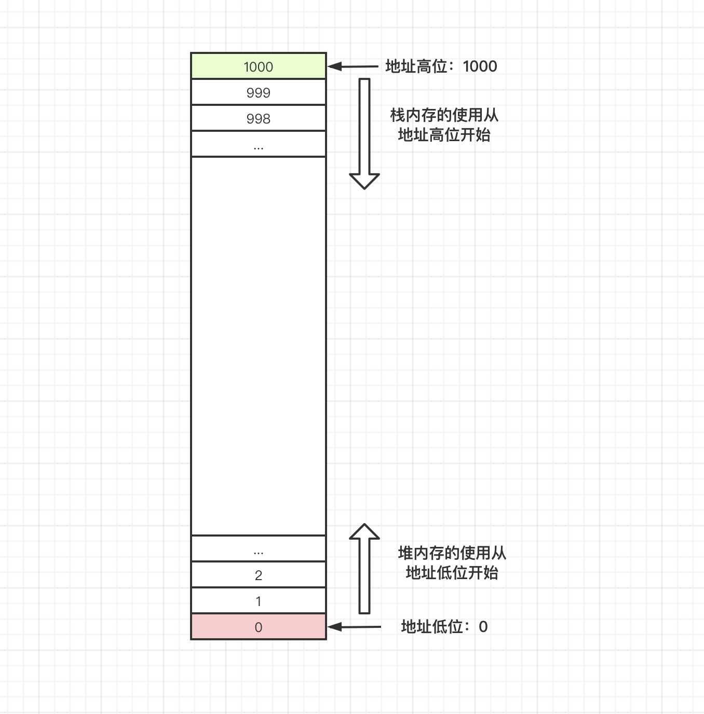

读懂栈图是每个前端开发者必备的高级技能，这对于优化代码，定位问题有着非常重要的作用。也能够帮助我们阅读别人的源码。当然，结合我们本文的分析，要读懂栈图，并非难事。

> 此处不太好用文字跟大家分享如何读懂栈图，以后可能出视频详细分析

我们也可以使用 console 的 trace 方法来打印出来，当前函数调用栈中还有哪些函数

```javascript
function f1() {
  var n = 999;
  function f2() {
    console.trace()
    alert(n);
  }
  return f2;
}
var result = f1();
result(); // 999
```

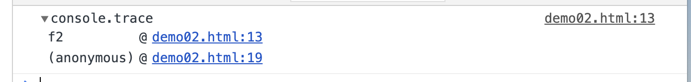

当我们的代码报错时，浏览器的 console 面板也会自动将当前的函数栈打印出来「红色」，这也是我们定位 bug 的有效手段之一。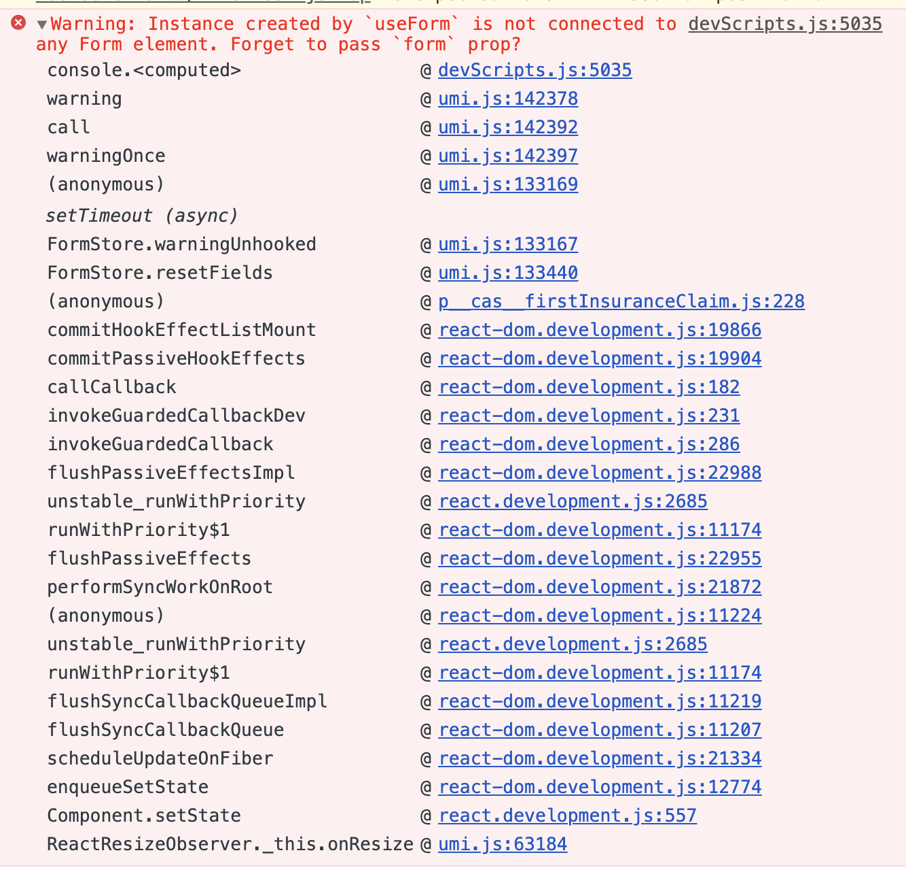

函数调用栈的工作原理，其实就是栈内存的工作原理，关于栈内存更底层的细节，我们在后面的章节继续介绍。
