# 11-V8 引擎是如何工作的

JavaScript 的代码执行顺序，是每个前端开发工程师都必须要关注的重中之重。无论是未来我们会学习到的函数调用栈，还是事件循环等，都是为了探索代码执行顺序的奥秘而展开的。只有清晰明白代码执行的过程，我们才能对我们自己写的代码更加了解。

那么代码执行顺序，是不是就如我们写的代码那样，从上到下执行的呢？当然没有那么简单！这里我们先了解一下 JavaScript 引擎的简单工作思路，再进行后续的探索。

## 01-简介

JavaScript 引擎也是一个应用程序，它是 JavaScript 执行环境。在浏览器中，它是浏览器的组成部分。每个浏览器对应的 JavaScript 引擎都不一样，例如 chrome 是 v8，firefox 是 SpiderMonkey，safari 是 Nitro 等。

JavaScript 引擎会解析与编译我们所写的 JavaScript 代码。虽然有不同的 JavaScript 引擎，它们的实现方式可能有所差异，解析原理也不尽相同，但是原则它们都必须按照 ECMAScript 的标准来实现。因此想要了解 JavaScript的工作原理，我们了解 V8 就足够了。

[点击查看 V8 文档](https://v8.dev/)

V8 内部是由许多小的子模块组成，它的工作流程图如下：


*Blink 是谷歌浏览器的渲染引擎，V8 是 Blink 的内置 JavaScript 引擎*

我们依次来了解其中最重要的四个模块。

## 02-scanner

scanner 是一个扫描器，用于对纯文本的 JavaScript 代码进行词法分析。它会将代码分析为 tokens。**token** 在这里是一个非常重要的概念，它是词义单位，是指语法上不能再分割的最小单位，可能是单个字符，也可能是一个字符串。

例如，一段简单的代码如下：

```javascript
const a = 20
```

上面的代码的 token 集合如下

```javascript
[
  {
    "type": "Keyword",
    "value": "const"
  },
  {
    "type": "Identifier",
    "value": "a"
  },
  {
    "type": "Punctuator",
    "value": "="
  },
  {
    "type": "Numeric",
    "value": "20"
  }
]
```

## 03-parser

顾名思义，parser 模块我们可以理解为是一个解析器。解析过程是一个语法分析的过程，它会将词法分析结果 tokens 转换为抽象语法树「Abstract Syntax Tree」，同时会验证语法，如果有错误就抛出语法错误。我们可以通过在线网站 [esprima](https://esprima.org/demo/parse.html) 来观察 JavasSript 代码通过词法分析变成 AST 之后的样子。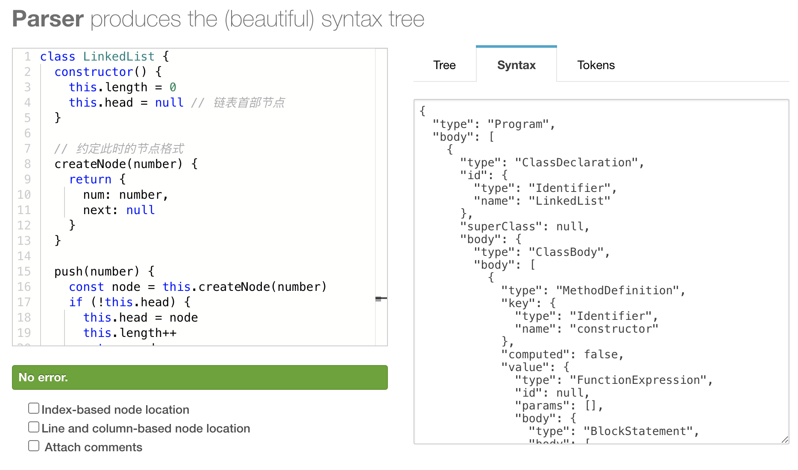

同样一段代码如下：

```
const a = 20
```

被解析成抽象语法树之后，变成

```javascript
{
  "type": "Program",
  "body": [
    {
      "type": "VariableDeclaration",
      "declarations": [
        {
          "type": "VariableDeclarator",
          "id": {
            "type": "Identifier",
            "name": "a"
          },
          "init": {
            "type": "Literal",
            "value": 20,
            "raw": "20"
          }
        }
      ],
      "kind": "const"
    }
  ],
  "sourceType": "script"
}
```

需要注意的是，parser 的解析有两种情况，预解析与全量解析。理解他们有助于你编写性能更优的代码。

**预解析 pre-parsing: Layze**

原则上来说，应该对应用中我们编写的所有代码进行解析。但是实际情况有很大的优化空间。在我们代码里，有大量的代码，虽然声明了函数，但是这部分代码并未被使用，因此如果全部都做 Full-parsing 的话，那么整个解析过程就会做许多无用功。

使用浏览器的调试工具 Coverage 能够清晰的看出来，如下图，表格中的 Usage Visualization 表示的代码使用情况，红色部分表示未被执行过的代码，蓝色部分表示执行过的代码。我们发现，未被使用的代码超过了一半多。这些代码多半是我们在项目中引入的依赖包中声明的函数等。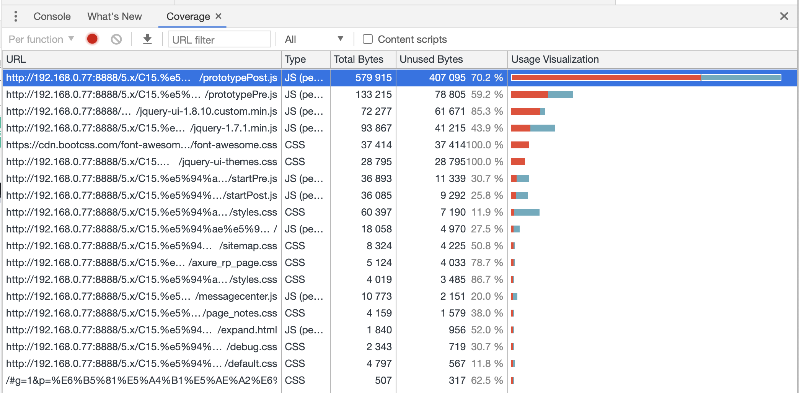

于是就有了预解析的方案，它在提高代码执行效率上起到了非常关键的作用。它有如下特点

- 预解析会跳过未被使用的代码
- 不会生成 AST，会产生不带有变量引用和声明的 scopes 信息
- 解析速度快
- 根据规范抛出特定的错误

我们来看这样一段代码

```javascript
function foo1() {
  console.log('foo1')
}
function foo2() {
  console.log('foo2')
}

foo2();
```

代码中，声明了两个函数 foo1 和 foo2，但是只有 foo2 被执行了。因此对于 foo1 来说，生成 AST 就变得没有意义。这个时候，foo1 的解析方式就是预解析。但是会生成作用域信息。

如图，注意观察作用域引用 Scopes。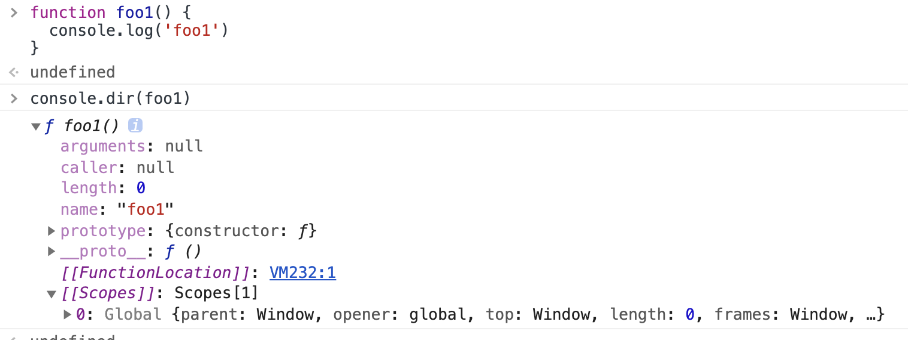

**全量解析 Full-parsing: Eage**

全量解析很好理解，它会解析所有立即执行的代码。这个时候会生成 AST，并且进一步明确更多的信息。

- 解析被使用的代码
- 生成 AST
- 构建具体的 scopes 信息，变量的引用，声明等
- 抛出所有的语法错误

此时对应的，其实就是**执行上下文**的创建过程，关于执行上下文我们后续详细分析。需要区分的是，作用域与作用域链的信息是在预解析阶段就已经明确了。

分析一下这段代码的解析过程

```
// 声明时未调用，因此会被认为是不被执行的代码，进行预解析
function foo() {
  console.log('foo')
}

// 声明时未调用，因此会被认为是不被执行的代码，进行预解析
function fn() {}

// 函数立即执行，只进行一次全量解析
(function bar() {

})()

// 执行 foo，那么需要重新对 foo 函数进行全量解析，此时 foo 函数被解析了两次 
foo();
```

三个函数对应三种不同的情况，函数 foo 在函数声明时，被认为是不被执行的代码，因此进行一次预解析，但是后面会调用执行该方法，因此会再次进行全量解析，也就意味着 foo 函数被解析了两次。

而立即执行函数 bar，在声明时就已经知道会执行，因此只会进行一次全量解析。

函数声明 fn，从头到尾一直未被执行，因此只会进行一次预解析。

那如果我在函数 foo 里面再次声明一个函数呢，那是不是也就意味着，foo 内部的函数也会被跟着解析两次。嵌套层级太深甚至会导致更多次数的解析。因此，减少不必要的嵌套函数，能提高代码的执行效率。

注意：V8 引擎会对 parser 阶段的解析结果，缓存 3 天，因此如果我们把不怎么变动的代码打包在一起，如公共代码，把经常变动的业务代码等打包到另外的 js 文件中，能够有效的提高执行效率。

## 04-Ignition

Ignition 是 v8 提供的一个解释器。他的作用是负责将抽象语法树 AST 转换为字节码「bytecode」。并且同时收集下一个阶段「编译」所需要的信息。这个过程，我们也可以理解为预编译过程。基于性能的考虑，预编译过程与编译过程有的时候不会区分的那么明显，有的代码在预编译阶段就能直接执行。

## 05-TurboFan

TurboFan 是 v8 引擎的编译器模块。它会利用 Ignition 收集到的信息，将字节码转换为汇编代码。这也就是代码被最终执行的阶段。

Ignition + TurboFan 的组合，就是字节码解释器 + JIT 编译器的黄金组合「边解释边执行」。Ignition 收集大量的信息，交给 TurboFan 去优化，多方面条件都满足的情况下，会被优化成机器码，这个过程称为 Optimize，当判断无法优化时就会触发去优化「De-optimize」操作，这些代码逻辑会重新回到 Ignition 中称为字节码。

在这个过程中，有一个建议能够帮助我们避免去优化操作，从而提高代码执行效率。那就是**不要总是改变对象类型。**

例如以下一个例子

```javascript
function foo(obj) {
  return obj.name
}
```

由于 JavaScript 的动态性，我们虽然定义了一个函数 foo，但是该函数的参数 obj 并没有明确它的类型，那么这个时候，如果我传入的参数分别为以下几种情况

```javascript
obj0 = {
  name: 'Alex'
}

obj1 = {
  name: 'tom',
  age: 1
}

obj2 = {
  name: 'Jake',
  age: 1,
  gender: 1
}
```

对编译器而言，obj0，obj1，obj2 是三种不同的类型，此时 TurboFan 就无法针对这种情况做优化处理，只能执行 De-optimize 操作。这意味着执行效率的降低。

因此，定义函数时，严格要求参数格式保持一致，在实践中是非常重要的优化策略，这也是 typescript 的作用之一。

## 06-Orinoco

在我们执行的 JavaScript 代码中，有大量的垃圾内存需要处理。甚至绝大多数内存占用都是垃圾。因此我们必须有一个机制来管理这些垃圾内存，用于回收利用。这就是垃圾回收器 Orinoco。

垃圾回收器会定期的执行以下任务

- 标记活动对象，和非活动对象「标记阶段」
- 回收被非活动对象占用的内存空间「清除阶段」
- 合并或者整理内存「整理阶段」

## 07-总结

v8 的 Compiler Pipeline 并非一开始就是使用的 Ignition + TurboFan 组合。也是在不断的迭代过程中演变而来。例如在他们之前，是 Full-codegen + Crankshaft，并且他们也共存过一段时间。

在官方文档中，提供了[一个 PPT](https://docs.google.com/presentation/d/1chhN90uB8yPaIhx_h2M3lPyxPgdPmkADqSNAoXYQiVE/edit#slide=id.g18d89eb289_1_389)，我们可以观察不同版本的演变过程。该 PPT 介绍了为何要使用新的编译组合。

- 减少了内存占用
- 减少了启动时间
- 降低了复杂度

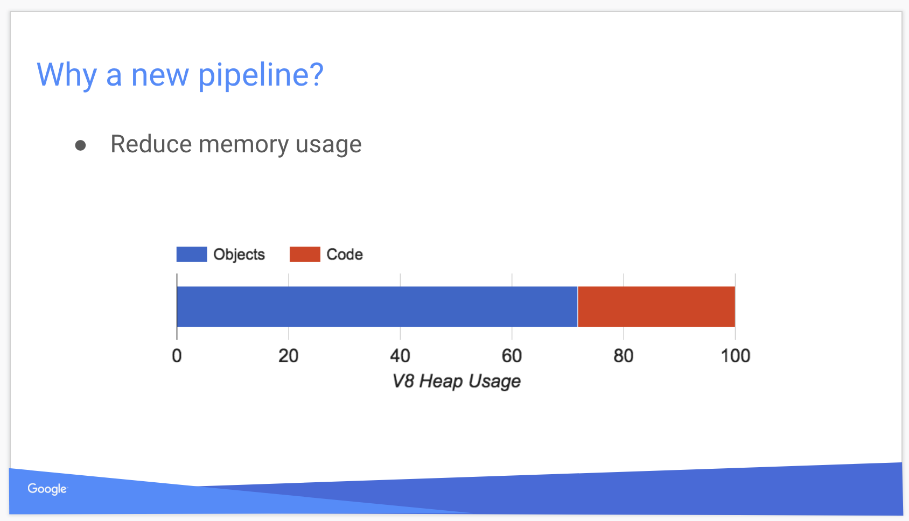image.png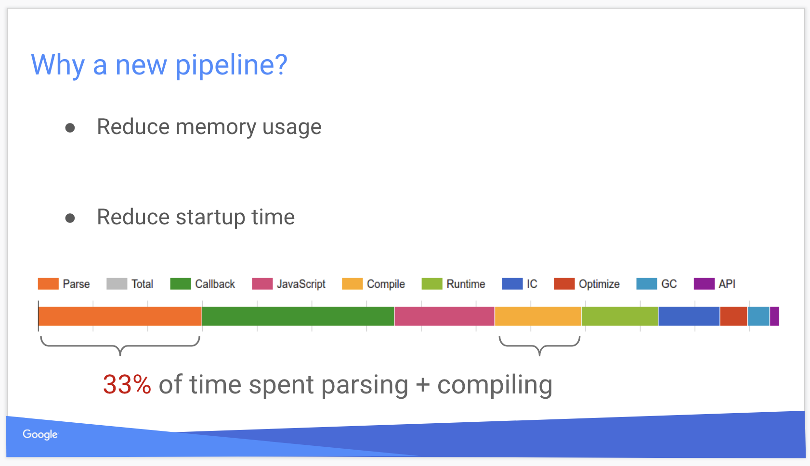image.png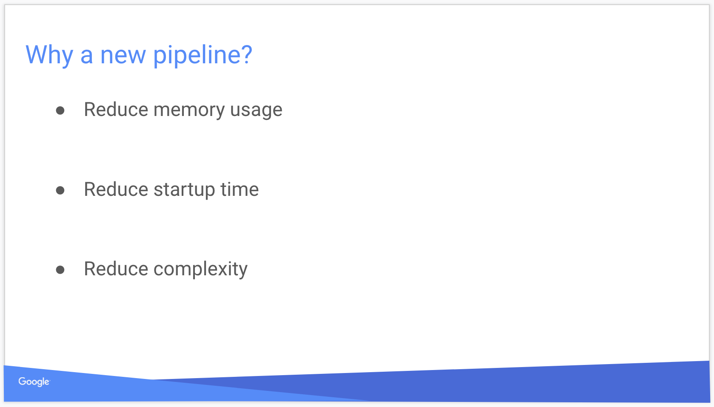image.png

并展示了不同版本的编译过程

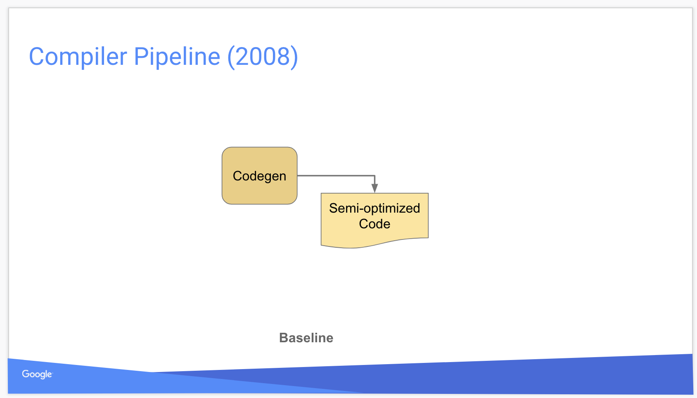image.png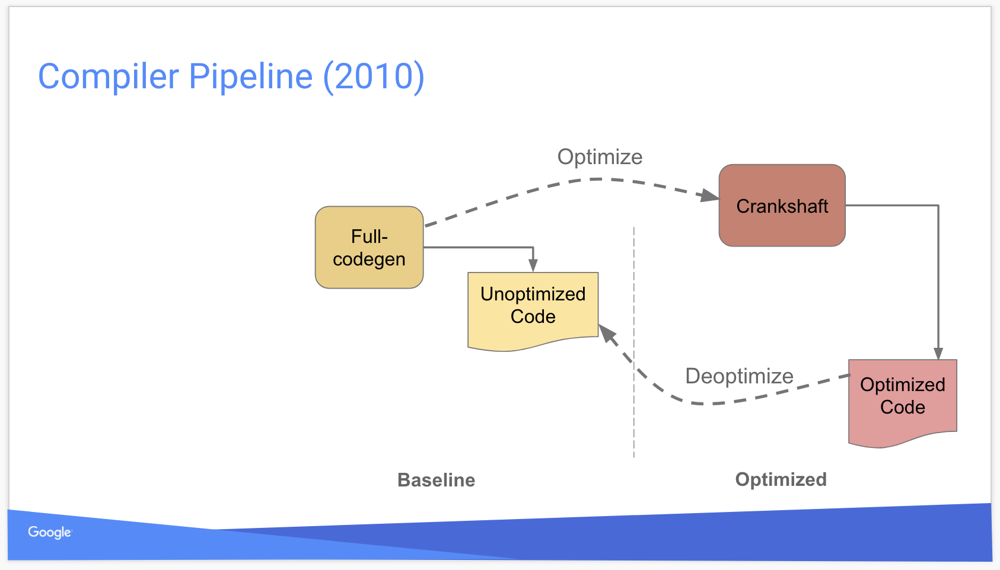image.png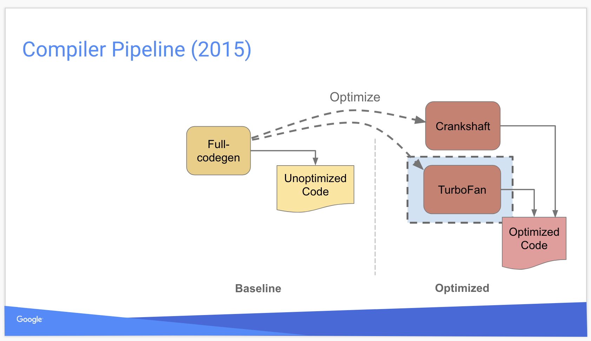image.png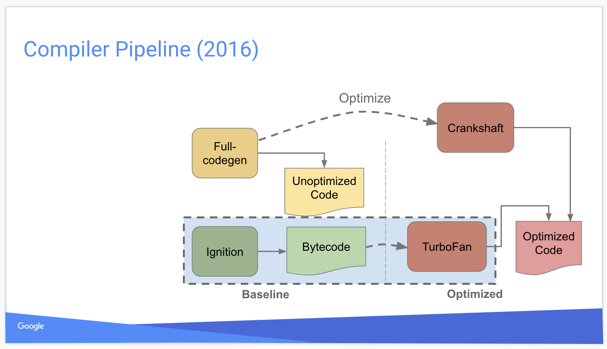image.png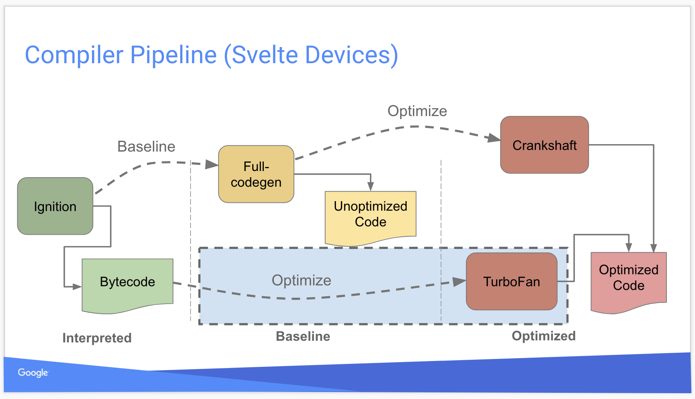image.png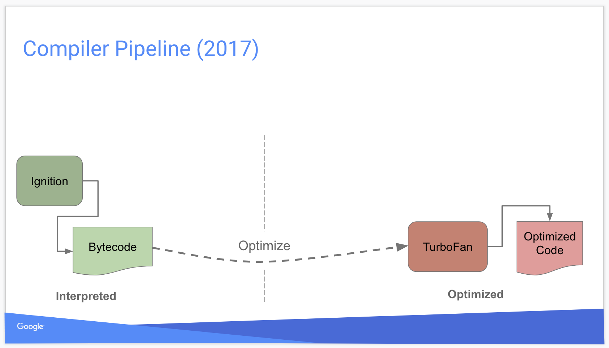image.png

详细介绍了机器码的执行过程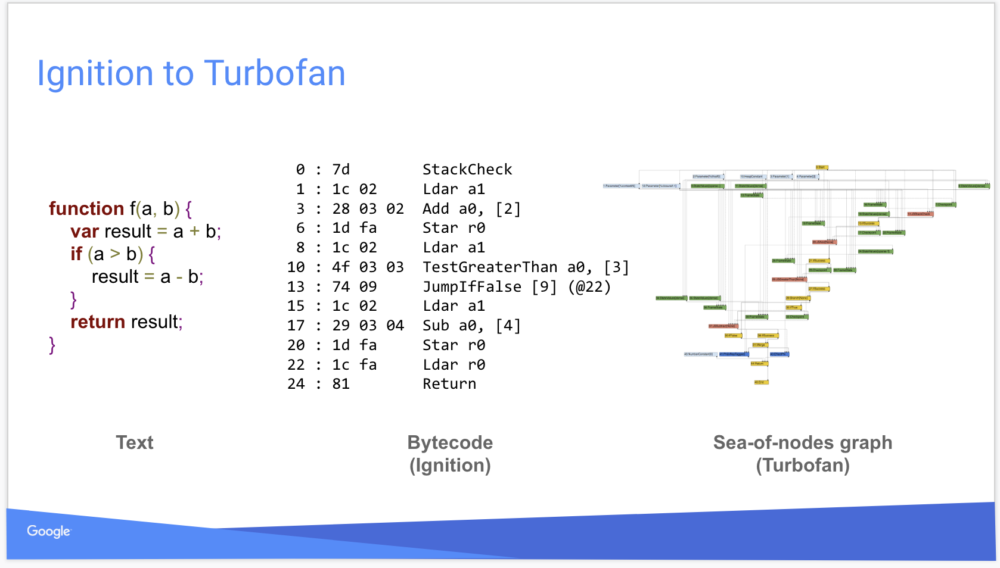

image.png

以及其他的分析过程，内存占用，时间消耗等。详细的大家可以阅读 PPT 进一步了解。最后的结论是

**Ignition + Turbofan 是 v8 的未来。**

## 08-思考题

有如下一段代码，你是如何理解活动对象，和非活动对象的，哪些内存是垃圾需要被回收？

```javascript
let foo = {
  m: 1,
  n: 2
}

let foo = function() {
  console.log('hello')
}

foo();
foo();
```