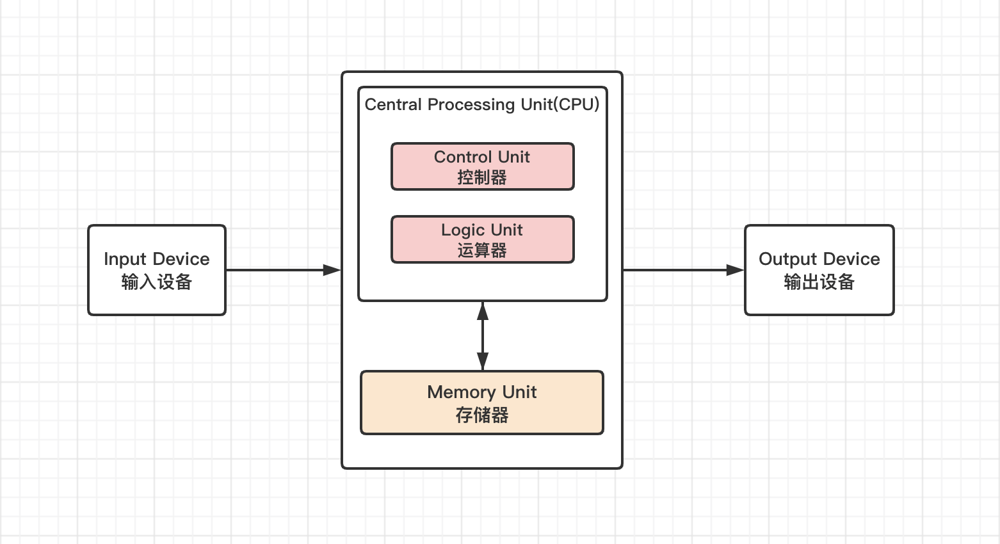
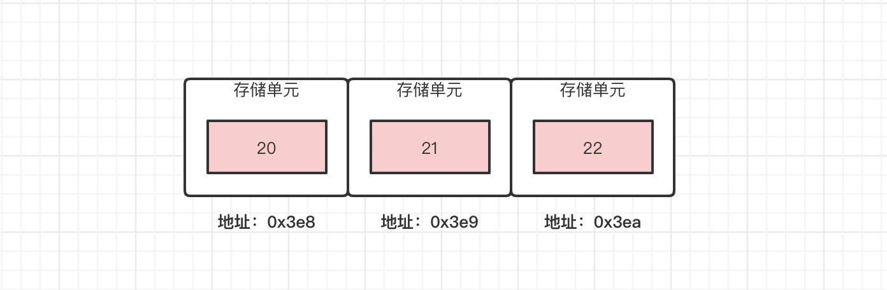
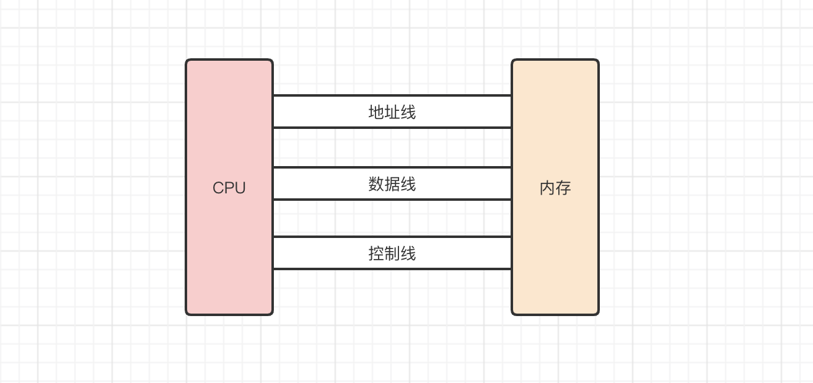

# 14-从冯.洛伊曼说起

看过《三体》的读者朋友应该听过这个理论，科学家汪淼在在游戏中的秦始皇年代，遇到了一个叫做冯.洛伊曼的人，他使用三千万士兵完成了计算机的计算。

当然，我们的真实社会中，也有这么一个牛逼的人物，叫做 冯.洛伊曼，他是美籍匈牙利数学家，是计算机的奠基人。他提出存储程序原理，把程序本身当做数据来对待，程序和该程序处理的数据用同样的方式存储。计算机应该按照程序顺序执行。

要理解这套理论为什么牛逼，我们需要知道更早期的计算机是怎么样的。早期的计算机是由各种门电路组成，这些门电路通过组装，得到一块固定的电路板，来执行特定的程序。问题就在于，当我们想要修改程序的功能，就只能重新组装电路板。可维护性极低。

也就是说，在早期的计算机中，程序是硬件化的，它与数据完全是两码事。

现在大家都应该知道，应用程序是可编程，可调整的，应用程序是数据化的，对我们而言，修改一个程序的运行逻辑是司空见惯的事情。这些成果都得益于冯.洛伊曼结构的支撑。所以冯.洛伊曼结构的核心，就是**将不可更改的硬件变成可编程的软件。**

这才有了程序员行业的诞生。

冯.洛伊曼体系结构有以下特点：

1. 计算机处理的数据和指令，一律用二进制表示
2. 指令和数据不加区分，混合存储在同一个存储器中
3. 顺序执行程序的每一条指令
4. 计算机硬件由运算器，控制器，存储器，输入设备、输出设备五大部分组成

**指令：**控制计算机行为的指示和命令，一条指令通常包括两方面的内容，操作码和操作数。操作码决定要完成的操作，操作数指参与运算的数据与其所在的单元地址。指令的概念有点类似于函数，操作码是函数名，操作数是函数参数。 ** 基于冯.洛伊曼体系结构，现代计算机一般都具备如下能力：

- 能够通过输入设备，把程序需要的数据送至计算机中
- 具备长期记忆程序，数据，处理结果以及运算结果的能力
- 能够完成各种算术，逻辑运算和数据传送等数据加工处理的能力
- 能够根据需要控制程序走向，并能够根据指令控制机器的各部件协调操作
- 能够按照要求将处理结果输出给用户

上图简单介绍了中央处理器「CPU」的组成。其中

**处理单元「Processing Unit」**包含了算术逻辑单元和处理寄存器，用于完成各种算术和逻辑运算

**控制单元「Control Unit」**包含了指令寄存器和程序计数器，用于控制程序的流程，通常是条件判断和跳转

注意观察他们的简称，PU 和 CU 共同组成了 CPU。

这里我们注意观察，一个重要的概念出现了：**寄存器。**

CPU 想要控制程序执行逻辑，进行运算，寄存器在其中起到非常重要的作用。那么是什么寄存器呢？

寄存器是 CPU 内部用来存放数据/指令的一些小型存储区域，用来暂时存放参与运算的数据和运算结果。它是 CPU 的内部元件，一般包括通用寄存器，专用寄存器和控制寄存器。寄存器拥有非常高的读写速度，比内存更快。

寄存器的种类众多，我们的目的是了解栈空间执行顺序相关的几个寄存器。在此之前，我们要先大概明白什么是存储单元。

在上图中，我们看到，存储器也是计算机的组成部分，而在前面的文章有提到，存储器又分为内部存储器「内存」和外部存储器「硬盘，U盘等」。

内存由一个一个小的存储单元组成。存储单元具备存储数据和读写数据的功能，以 8 位二进制作为一个存储单元，也就是一个字节。每一个单元有一个地址，一般用十六进制表示，程序中的变量和内存的存储单元相对应，变量名对应存储单元的地址，变量值对应着存储单元所存储的数据。

例如如下代码

```
int a = 20
```

其实是 a -> 0x3e8 -> 20

这里需要注意的是，对于计算机来说，没有变量的概念，变量会被编译成具体的存储单元的地址。

寄存器也能存储少量数据，原则上来说，不需要内存，寄存器就能帮助 CPU 运行一个完整的程序，并且速度飞快。但是寄存器的容量限制了它的能力，当运算所需要的存储容量很大时，它就无法满足需求，因此 CPU 与内存的交互是必不可少的。他们通过地址线、数据线、控制线进行交互。



**地址线：**CPU 通过地址线进行寻址，指定存储单元地址

**数据线：**CPU 和其他部分能通过数据总线相互传递数据

**控制线：**控制线决定了 CPU 对外部器件的控制能力

寄存器也是集成电路中非常重要的一种存储单元。以 32 位 CPU 来分析，它包括

- 4 个数据寄存器 「eax、ebx、ecx、edx」

- 2 个变址寄存器「esi、edi」

- **2 个指针寄存器「esp、ebp」**

- 6 个段寄存器「ees、ecs、ess、eds、efs、egs」

- 1 个指令指针寄存器「eip」

- 1 个标志寄存器「EFlags」

  

| **寄存器**  | **概述**                                                     |
| :---------- | :----------------------------------------------------------- |
| eax         | 累加器，可用于加减乘除等操作，使用频率高                     |
| ebx         | 基地址寄存器，可以作为存储器指针来使用                       |
| ecx         | 计数寄存器，在循环和字符串操作时，用它来控制循环次数         |
| edx         | 数据寄存器，在进行乘除运算时，可作为默认操作数参与运算，可存放I/O的端口地址 |
| esi/edi     | 变址寄存器，用于存放存储单元的地址偏移量，可实现多种寻址方式 |
| ebp         | 基指针寄存器，用于存取栈中的数据                             |
| esp         | 栈指针寄存器，用于实时记录栈内存的栈顶位置                   |
| ees/efs/egs | 附加段寄存器，其值为附加数据段的段值                         |
| ecs         | 代码段寄存器，其值为代码段的段值                             |
| ess         | 栈段寄存器，其值为栈段的段值                                 |
| eds         | 数据段寄存器，其值为数据段的段值                             |
| eip         | 指令指针寄存器，用于存放下次将要执行的指令在代码段中的偏移量 |
| EFlags      | 标志寄存器，有多种标志，例如进位标志，溢出标志等             |