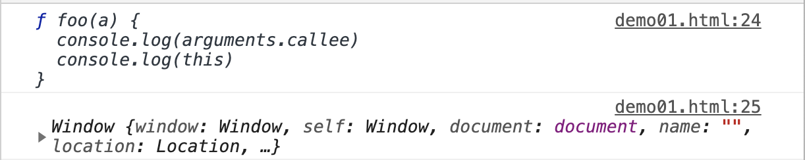

# 17-this

this 的学习至关重要。

而掌握 this 的关键，是要明白，函数的 this，是在什么时候确认的。

前面我们学习执行上下文的章节中，有提到关于 this 的信息。在执行上下文中的环境记录对象中，提供了一个内部属性 [[ThisValue]] 用于记录 this 的指向，同时还提供了一个内部方法 BindThisValue 用于设置 [[ThisValue]] 的值。也就意味着，对于函数而言，**this 的指向，是在执行上下文的创建过程中，被确定的。**

明确了这一点，我们就很容易知道，只有在函数调用时，this 的指向才会被确定。于是一个函数的 this 的指向，就变得非常灵活。这也是导致 this 难以理解的真正原因。例如下面的例子，同一个函数，由于调用方式不同，它内部的 this 指向了不同的对象

```javascript
var a = 10;
var obj = {
  a: 20
}

function fn() {
  console.log(this.a);
}

fn(); // 10
fn.call(obj); // 20
```

通过 a 值的不同表现，我们可以知道 this 分别指向了 window 与 obj 对象。

接下来，我们一点点来分析 this 的具体表现

## 01-全局上下文中 this

全局上下文是一个比较特殊的存在，在全局上下文中，this 指向全局对象本身。因此这也相对简单，没有那么多复杂的情况需要考虑。

```javascript
// 通过this绑定到全局对象
this.a2 = 20;

// 通过声明绑定到变量对象，但在全局环境中，变量对象就是它自身
var a1 = 10;

// 仅仅只有赋值操作，标识符会隐式绑定到全局对象
a3 = 30;

// 输出结果会全部符合预期
console.log(a1);
console.log(a2);
console.log(a3);
```

const/let 声明的函数并不会挂载到全局对象，因此

```javascript
const b = 20
console.log(this.b) // undefined
```

## 02-函数中的 this

函数上下文中的 this 指向，与调用该函数的方式息息相关。

**在一个函数的执行上下文中，this 由该函数的调用者「caller」提供，由调用函数的方式来决定。方式一，有明确的调用者。方式二，独立调用，无明确的调用者。**** 一个简单的例子来展示谁是调用者 caller，谁是被调用者 callee。

```javascript
function foo(a) {
  console.log(arguments.callee)
  console.log(this)
}

// foo 是被调用者 callee，window 是调用者 caller，因此 foo 内部的this，此时指向 window
window.foo(10)
```

很显然，foo 是被调用者 callee，而 window 对象是调用者 caller。因此 foo 内部的this，此时指向 window。执行结果如下图所示：

一种特殊的情况是，在写法上，foo 并没有显示的调用者，函数独立调用。如下

```javascript
function foo(a) {
  console.log(arguments.callee)
  console.log(this)
}

foo(10)
```

此时如果是在非严格模式下，调用者默认由全局对象 window 提供。因此此时 foo 内部的 this 依然指向 window 对象。

但是在严格模式之下，foo 此时就是没有调用者，因此函数内部的 this 指向 undefined。

```javascript
function foo(a) {
  'use strict';
  // 严格模式下无法访问 arguments.callee
  // console.log(arguments.callee)
  console.log(this)
}

foo(10) // 内部 this 指向为 undefined
```

因此，判断 this 的指向，其实就是明确函数的具体调用者是谁。这应该还是比较简单。结合上面的结论，再来分析一个例子。

**案例一**

```javascript
var a = 20;

var obj = {
  a: 40
}
function fn() {
  console.log('fn this: ', this);

  function foo() {
    console.log(this.a);
  }
  foo();
}
fn.call(obj);
fn();
```

代码中涉及到两个函数的 this 指向问题，一个是 fn，一个是 foo。fn 有两种执行方式，一种是通过 call 方法显示的指定调用者为 obj，因此此时的 this 指向自然是 obj 对象。一种是独立调用，显示上没有调用者，这里非严格模式则表示 此时 fn 内部的 this 指向 window 对象。

而函数 foo 显示上没有调用者，因此 foo 内部的 this 始终指向 window 对象。于是上例的输出结果为：

```javascript
fn this: Object { a: 40 }
20

fn this: Window {}
20
```

**案例二**

```javascript
'use strict';

var a = 20;
function foo() {
  var a = 1;
  var obj = {
    a: 10,
    c: this.a + 20
  }
  return obj.c;

}

console.log(window.foo()); // 40
console.log(foo()); // 报错 TypeError
```

对象字面量的写法并不会产生自己的作用域，因此该案例中，obj.c 上使用的 this 并不会指向 obj，而是与函数 foo 内部的 this 指向是一样的。

当我们使用 `window.foo` 调用时，foo 具备明确的调用者，内部 this 指向 window 对象。此时 this.a 访问到的是全局的 a 变量。

当 foo 独立调用时，此时为严格模式，内部的 this 则指向 undefined，此时代码报错。

**案例三**

```javascript
// demo03
var a = 20;
var foo = {
  a: 10,
  getA: function () {
    return this.a;
  }
}
console.log(foo.getA()); // 10

var test = foo.getA;
console.log(test()); // 20
```

这是一个迷惑性很强的例子。但是只要我们能够正确分清楚调用者与被调用者，就不怕任何迷魂阵。

当使用 `foo.getA()` 执行时，foo 为调用者，getA 为被调用者，因此此时 getA 内部的 this 指向 foo。

当使用 `test()` 执行时，虽然 test 与 foo.getA 引用相同，但是调用方式明显不一样。因此此时 getA 内部的 this 在非严格模式下指向 window 对象。

## 03-思考题

分析下面两个例子中的 this 指向问题

```javascript
function foo() {
  console.log(this.a)
}

function active(fn) {
  fn();
}

var a = 20;
var obj = {
  a: 10,
  getA: foo,
  active: active
}

active(obj.getA); // 输出的值是多少？
obj.active(obj.getA); // 输出的值是多少?
var n = 'window';
var object = {
  n: 'object',
  getN: function () {
    return function () {
      return this.n;
    }
  }
}

console.log(object.getN()()); // 输出的结果是多少？
```

## 04-call/apply/bind

JavaScript 提供了一种可以手动设置函数内部 this 指向的方式，他们就是 call/apply/bind。所有的函数都能够调用者三个方法。

有下面一个简单的例子

```javascript
var a = 20;
var object = {
  a: 40
}

function fn() {
  console.log(this.a);
}
```

如果我们正常调用函数 fn，fn 独立调用，在非严格模式下，内部的 this 指向 window 对象，因此函数的输出结果会是 20.

```javascript
fn(); // 20
```

我们还可以通过如下的方式，显示的指定 fn 的调用者。

```javascript
fn.call(object) // 40
fn.apply(object) // 40
```

当函数 fn 调用 call/apply 时，其实是在执行 fn 函数自身，只是此时 call/apply 接受第一个参数，将函数内部的 this 明确的指向这个传入的参数。

call/apply 具备同样的能力，他们的区别在于参数的传递方式不同。

call 的第一个参数是函数内部指定的 this 指向，后续的参数是函数本身执行应该传入的参数，一个一个的传递。

apply 的第一个参数与 call 完全一样，函数本身应该传入的参数，则以数组的形式，作为 apply 的第二个参数传入。

```javascript
function fn(num1, num2) {
return this.a + num1 + num2;
}

var a = 20;
var object = { a: 40 }

// 正常执行
fn(10, 10); // 40

// 通过call改变this指向
fn.call(object, 10, 10); // 60

// 通过apply改变this指向
fn.apply(object, [10, 10]); // 60
```

bind 方法也能够显示的指定函数内部的 this 指向，但是它与 call/apply 有所不同。

当函数调用 call/apply 时，函数会立即执行。

当函数调用 bind 时，函数并不会立即执行，而是返回一个新的函数，这个新的函数与原函数具有内容一样的函数体，但是它并非原函数，并且新函数的参数与 this 指向都已经被绑定，参数为 bind 的后续参数。

```javascript
function fn(num1, num2) {
  return this.a + num1 + num2;
}

var a = 20;
var object = { a: 40 }

var _fn = fn.bind(object, 1, 2);

console.log(_fn === fn); // false
_fn(); // 43
_fn(1, 4); // 43 因为参数被绑定，因此重新传入参数是无效的
```

call/apply/bind的特性，让JavaScript变得十分灵活，他们的应用场景十分广泛，例如将类数组转化为数据，实现继承，实现函数柯里化等。在这里我们先记住他们的基础知识与基本特性，在后续章节中，我们还会遇到 this 相关的知识，后续再来进一步学习。