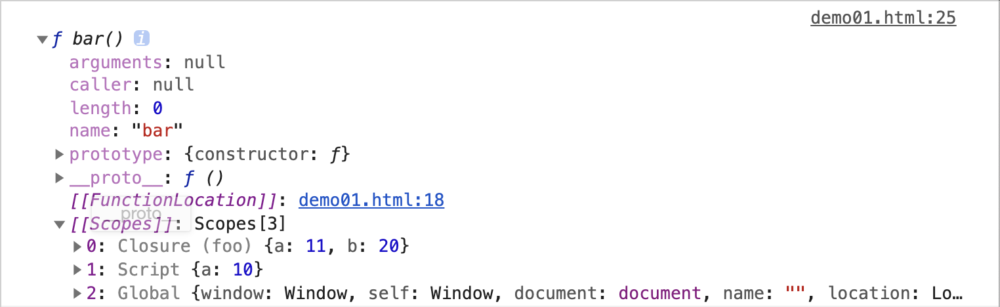
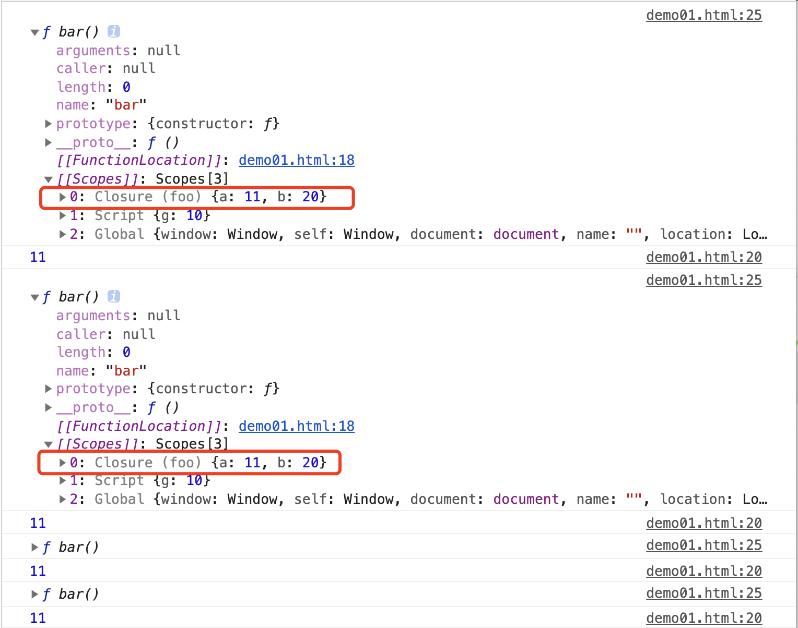
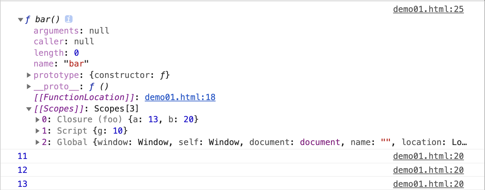
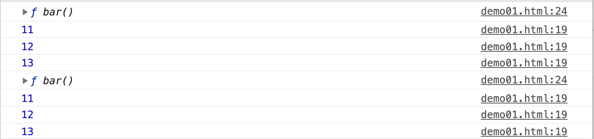
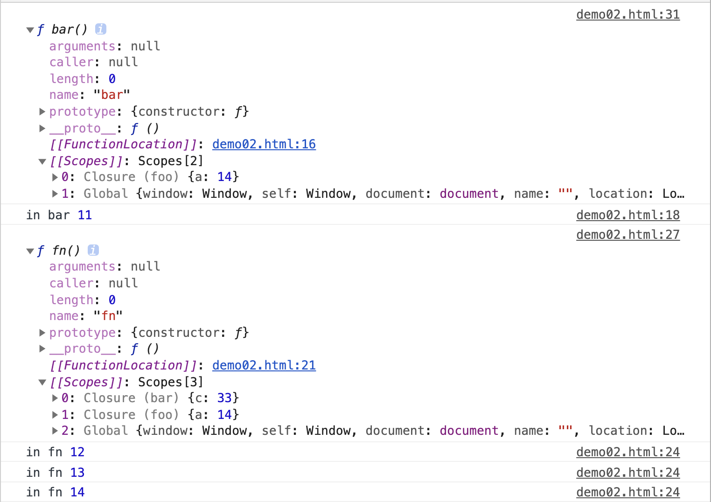

# 18-闭包

闭包是一个特殊的对象。

凡是没有将闭包，定义为对象的说法，都是错误的。

## 01-词法作用域

词法作用域并非 JavaScript 特有的说法，通常我们也直接称之为作用域。词法作用域表达的是一个静态关系，通常情况下，我们在代码编写时，语法规范就已经确定了词法作用域的作用范围。它具体体现在代码解析阶段，通过词法分析确认。

JavaScript 的词法作用域通过函数的 [[Scopes]] 属性来具体体现。而函数的 [[Scopes]] 属性，是在预解析阶段确认。

词法作用域是为了明确的告诉我们，当前的上下文环境中，能够访问哪些变量参与程序运行。在函数的执行上下文中，除了自身上下文中能够直接访问的声明之外，还能从函数体的 [[Scopes]] 属性访问其他作用域中的声明。

一个简单的例子

```javascript
const g = 10

function foo() {
  let a = 10;
  let b = 20;

  function bar() {
    a = a + 1;
    const c = 30;

    return a + b + c;
  }  

  console.dir(bar)
  return bar
}

foo()
```

仅从语法上，我们就可以知道，函数 bar 能访问的声明，除了自身声明的变量 c 之外，还能访问 foo 声明的变量 a 与 b，以及全局声明的变量 g。最后还能访问整个全局对象。

能够访问自身的变量 c，具体体现为当前函数上下文中创建的 Local 对象。而其他的，则全部都体现在函数的 [[Scopes]] 属性中。如图。

## 02-闭包

在上面例子里，函数 bar 的 [[Scopes]] 中，有一个特殊的对象，**Closure**，就是我们将要学习的闭包对象。

**从概念上来说，闭包是一个特殊的对象，当函数 A 内部创建函数 B，并且函数 B 访问函数 A 中声明的变量等声明时，闭包就会产生。**

例如上面的例子中，函数 foo 内部创建了函数 bar，并且在 bar 中，访问了 foo 中声明的变量 a 与 b，此时就会创建一个闭包。闭包是基于词法作用域的规则产生，让函数内部可以访问函数外部的声明。**闭包在代码解析时就能确定。**

从具体实现上来说，对于函数 bar 而言，闭包对象「Closure (foo)」的引用存在于自身的 [[Scopes]] 属性中。也就是说，只要函数体 bar 在内存中持久存在，闭包就会持久存在。而如果函数体被回收，闭包对象同样会被回收。

*「此处消除一个大多数人的误解：认为闭包在内存中永远都不会被回收，实际情况并不是这样的」*

通过前面的函数调用栈章节我们知道，在预解析阶段，函数声明会创建一个函数体，并在代码中持久存在。但是并非所有的函数体都能够持久存在。上面的例子就是一个非常典型的案例。函数 foo 的函数体能够在内存中持久存在，原因在于 foo 在全局上下文中声明，foo 的引用始终存在。因此我们总能访问到 foo。而函数 bar 则不同，函数 bar 是在函数 foo 的执行上下文中声明，当执行上下文执行完毕，执行上下文会被回收，在 foo 执行上下文中声明的函数 bar，也会被回收。如果不做特殊处理，foo 与 bar 产生的闭包对象，同样会被回收。

微调上面的案例，多次调用 foo 的返回函数 bar 并打印 a 的值。

```javascript
const g = 10

function foo() {
  let a = 10;
  let b = 20;

  function bar() {
    a = a + 1;
    console.log(a)
    const c = 30;
   
    return a + b + c;
  }  
 console.dir(bar)
  return bar
}

// 函数作为返回值的应用：此时实际调用的是 bar 函数
foo()()
foo()()
foo()()
foo()()
```

分析一下执行过程。

当函数 foo 执行，会创建函数体 bar，并作为 foo 的返回值。foo 调用完毕，则对应创建的执行上下文会被回收，此时 bar 作为 foo 执行上下文的一部分，自然也会被回收。那么保存在 foo.[[Scopes]] 上的闭包对象，自然也会被回收。

因此，多次执行 foo()()，实际上是在创建多个不同的 foo 执行上下文，中间与 bar 创建的闭包对象，始终都没有被保存下来，会随着 foo 的上下文一同被回收。因此，多次执行 foo()()，实际上创建了不同的闭包对象，他们也不会被保留下来，相互之间也不会受到影响。如图

> 这个过程，也体现了 JavaScript 边执行边解析的特性



而当我们使用一些方式，保留了函数体 bar 的引用，情况就会发生变化，微调上面的代码如下：

```javascript
const g = 10

function foo() {
  let a = 10;
  let b = 20;

  function bar() {
    a = a + 1;
    console.log(a)
    const c = 30;
   
    return a + b + c;
  }  
 console.dir(bar)
  return bar
}

// 在全局上下文中，保留 foo 的执行结果，也就是 内部函数 bar 的引用
var bar = foo()

// 多次执行
bar()
bar()
bar()
```

分析一下，微调之后，代码中，在全局上下文使用新的变量 bar 保存了 foo 的内部函数 bar 的引用。也就意味着，即使 foo 执行完毕，foo 的上下文会被回收，但是由于函数 bar 有新的方式保存引用，那么即使函数体 bar 是属于 foo 上下文的一部分，它也不会被回收，而会在内存中持续存在。

因此，当 bar 多次执行，其实执行的是同一个函数体。所以函数体 bar 中的闭包对象「Closure (foo)」也是同一个。那么在 bar 函数内部修改的变量 a，就会出现累加的视觉效果。因为他们在不停的修改同一个闭包对象。

再次微调

```javascript
const g = 10

function foo() {
  let a = 10;
  let b = 20;

  function bar() {
    a = a + 1;
    console.log(a)
    const c = 30;
   
    return a + b + c;
  }  
 console.dir(bar)
  return bar
}

// 在全局上下文中，保留 foo 的执行结果，也就是 内部函数 bar 的引用
var bar1 = foo()

// 多次执行
bar1()
bar1()
bar1()

// 在全局上下文中，保留 foo 的执行结果，也就是 内部函数 bar 的引用
var bar2 = foo()

// 多次执行
bar2()
bar2()
bar2()
```

调整之后我们观察一下。

虽然 bar1 与 bar2 都是在保存 foo 执行结果返回的 bar 函数的引用。但是他们对应的函数体却不是同一个。foo 每次执行都会创建新的上下文，因此 bar1 和 bar2 是不同的 bar 函数引用。因此他们对应的闭包对象也就不同。所以执行结果就表现为：

## 03-小结

闭包的产生非常简单，只需要在函数内部声明函数，并且内部函数访问上层函数作用域中的声明就会产生闭包

闭包对象真实存在于函数体的 [[Scopes]] 属性之中

闭包对象是在代码解析阶段，根据词法作用域的规则产生

闭包对象并非不能被垃圾回收机制回收，仍然需要视情况而定

透彻理解闭包的真实体现，要结合引用数据类型，作用域链，执行上下文和内存管理一起理解

接下来我们要继续修改上面的例子，来进一步理解闭包。

```javascript
function foo() {
  let a = 10;
  let b = 20;

  function bar() {
    a = a + 1;
    console.log('in bar', a)
    let c = 30;

    function fn() {
      a = a + 1;
      c = c + 1
      console.log('in fn', a)
    }

    console.dir(fn)
    return fn
  }

  console.dir(bar)
  return bar()
}

var fn = foo()
fn()
fn()
fn()
```

函数 foo 中声明函数 bar， 函数 bar 中声明函数 fn。

函数 bar 中访问 函数 foo 中声明的变量 a。显然，此时能生成闭包对象 「Closure (foo)」 函数 fn 中访问 函数 foo 中声明的变量 a，与函数 bar 中声明的变量 c。此时也能生成闭包对象「Closure (foo)」与 「Closure (bar)」

我们会发现，bar.[[Scopes]] 中的闭包对象「Closure (foo)」与 fn.[[Scopes]] 中的闭包对象 「Closure (foo)」是同一个闭包对象。

输入结果如下图所示：闭包对象 foo 中的变量 a 的值，受到 bar 与 fn 操作共同影响。

## 04-思考题

1. 下面这些例子中，是否有闭包产生

```javascript
function add(x) {
  return function _add(y) {
    return x + y;
  }
}

add(2)(3); // 5
var name = "window";

var p = {
  name: 'Perter',
  getName: function () {
    return function () {
      return this.name;
    }
  }
}

var getName = p.getName();
var _name = getName();
console.log(_name);
```