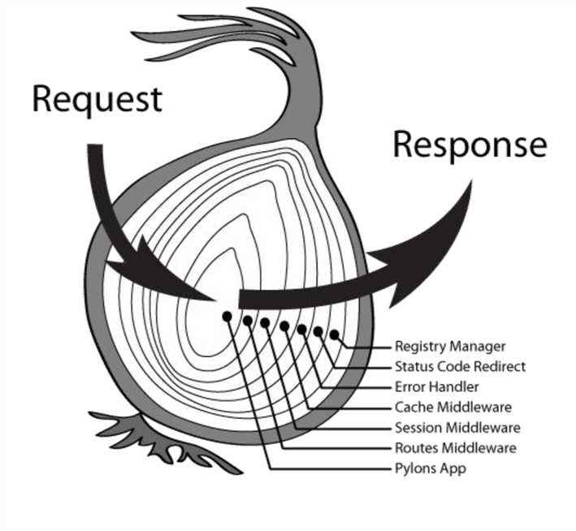

# 24-组合 compose

学习代码组合之前，我们需要回顾一下高阶函数的应用。

在高阶函数的章节学习中，我们探讨了一个实践中的案例。每一个页面都会判断用户的登录状态，因此我们封装了一个 withLogin 的高阶函数来处理这个统一的逻辑。而每一个页面的渲染函数，则作为基础函数，通过下面这样的方式得到高阶函数 withLogin 赋予的新能力。这个新的能力就是直接从参数中得到用户的登录状态。

```javascript
window.renderIndex = withLogin(renderIndex);
```

但是如果这个时候，我们又新增加一个需求，我们不仅仅需要判断用户的登录状态，还需要判断用户打开当前页面所处的具体环境，是在某一个 app 中打开，还是在移动端打开，或者是在 pc 端的某一个浏览器中打开。因为不同的页面运行环境我们需要做不同的处理。

因此根据高阶函数的用法，我们还需要封装一个新的高阶函数 withEnvironment 来处理这个统一的环境判断逻辑。

```javascript
(function() {
  const env = {
    isMobile: false,
    isAndroid: false,
    isIOS: false
  }
  const ua = navigator.userAgent;
  env.isMobile = 'ontouchstart' in document;
  env.isAndroid = !!ua.match(/android/);
  env.isIOS = !!ua.match(/iphone/);

  const withEnvironment = function(basicFn) { 
    return basicFn.bind(null, env);
  }

  window.withEnvironment = withEnvironment;
})();
```

正常情况下，我们在使用这个高阶函数时，就会这样做。

```javascript
window.renderIndex = withEnvironment(renderIndex);
```

但是现在的问题是，这里已经有两个高阶函数想要给基础函数 renderIndex 传递新能力了。因为高阶函数的实现中我们使用了 bind 方法，因此 withEnvironment(renderIndex) 与 renderIndex 其实是拥有共同的函数体的，因此当遇到多个高阶函数时，我们也可以这样来使用。

```javascript
window.renderIndex = withLogin(withEnvironment(renderIndex));
```

这样之后，我们就能够在renderIndex中接收到两个高阶函数带来的新能力了。但是这样是不是感觉很奇怪？

为了避免这种多层嵌套使用的问题，我们可以使用代码组合的方式来解决。

我们期望有一个组合方法 compose，可以这样来使用。参数从右至左，将第一个参数 renderIndex 作为第二个参数 withEnvironment 的参数，并将运行结果作为第三个参数 withLogin 的参数，依次递推。并最终返回一个新的函数。这个新函数，是在基础函数 renderIndex 的基础上，得到了所有高阶函数的新能力。

```javascript
window.renderIndex = compose(withLogin, withEnvironment, renderIndex);
```

这样做之后呢，代码变得更加清晰直观，也不用担心更多的高阶组件进来增加嵌套。那么我们应该如何来实现这样一个 compose 函数呢？

整理一下思路，我们可以通过判断 compose 个数的方式，从右到左把函数执行结果，当成下一个函数的参数继续执行，直到执行完毕，代码实现如下

```javascript
// ...args 为ES6语法中的不定参数，
// args表示一个由所有参数组成的数组，
// 最新的chrome浏览器已经支持该语法
function compose(...args) {
  var arity = args.length - 1;
  var tag = false;
  if (typeof args[arity] === 'function') {
    tag = true;
  }

  if (arity > 1) {
    var param = args.pop(args[arity]);
    arity--;
    var newParam = args[arity].call(args[arity], param);
    args.pop(args[arity]);

    // newParam 是上一个参数的运行结果，我们可以打印出来查看他的值
    args.push(newParam);
    console.log(newParam);

    return compose(...args);
  } else if (arity == 1) {
    // 将操作目标放在最后一个参数，目标可能是一个函数，也可能是一个值，因此针对不同的情况做不同的处理
    if (!tag) {
      return args[0].bind(null, args[1]);
    } else {
      return args[0].call(null, args[1]);
    }
  }
}
```

OK，我们来验证一下封装的这个 compose 函数是否可靠。

```javascript
var fn1 = function(a) { return a + 100 }
var fn2 = function(a) { return a + 10 }
var fn3 = function(a) { return a + 20 }

console.log(fn1(fn2(fn3(10))))
// 140

var bar = compose(fn1, fn2, fn3, 10);
console.log(bar());

// 输出结果
// 30       
// 40
// 140
var base = function() {
  return arguments[0] + arguments[1];
}

var foo1 = function(fn) {
  return fn.bind(null, 20);
}
var foo2 = function(fn) {
  return fn.bind(null, 30);
}

var res = compose(foo1, foo2, base);
console.log(res());

// 输出结果
// f() {}
// 50
```

通过这两个验证的例子，我们确定封装的这个组合函数还是比较可靠的。因此就可以直接放心的使用了。

此处 compose 的逻辑为，用上一个函数的执行结果，参与到下一个函数的运算中去，我们发现这样的逻辑与 reduce 竟然惊人的相似。因此此处也可以使用 reduce 非常简单的就达到 compose 的封装目的。

我们考虑兼容版本，那么基于 reduce 的封装代码如下，最终运用会与上例的封装有所不同。

```javascript
function compose(...args) {  
  return args.reduceRight((pre, cur, i) => {
    console.log(pre, cur, i)
    return cur(pre)
  })
}
```

核心代码只有一句话，竟然如此简单。使用两个案例来验证一下

```javascript
const fn1 = function (a) { return a + 100 }
const fn2 = function (a) { return a + 10 }
const fn3 = function (a) { return a + 20 }

const bar = compose(fn1, fn2, fn3, 10);
console.log('案例1执行结果：', bar);   // 140
// 高阶函数1，注入参数 env
const foo1 = (() => {
  const env = {
    iOS: true,
    android: false
  }

  return (baseFn) => {
    return baseFn.bind(null, env)
  }
})()

// 高阶函数2，注入参数
const foo2 = (() => {
  const loginInfo = {
    isLogin: true,
    name: 'TOM',
    age: 20,
    token: '123xsadfklsdh112sdjfhn'
  }

  return (baseFn) => {
    return baseFn.bind(null, loginInfo)
  }
})()

const homePage = (...args) => {
  console.log(args)
  // todo 执行其他当前页面的逻辑
}

const page = compose(foo1, foo2, homePage)
page()
```

结果证明，基于 reduce 封装，也能够达到我们的目的。在 redux 中，也使用了类似的逻辑来封装 compose。大家可以自行感受一下他们的异同。因为运用场景不同，因此封装时会有细微的差异，但是核心的思路是一模一样的。

```javascript
export default function compose(...funcs) {
  if (funcs.length === 0) {
    return arg => arg
  }

  if (funcs.length === 1) {
    return funcs[0]
  }

  return funcs.reduce((a, b) => (...args) => a(b(...args)))
}
```

当然，组合函数还可以借助柯里化封装得更加灵活。

```javascript
window.renderIndex = compose(withLogin, withEnvironment, renderIndex);

// 还可以这样
window.renderIndex = compose(withLogin, withEnvironment)(renderIndex);
```

这里不再继续深入探讨具体的封装方法，我们在使用时可以借助工具库 lodash.js 中的 flowRight 来实现这种灵活的效果。

```javascript
// ES6 模块化语法，引入flowRight函数
import flowRight from 'lodash/flowRight';

// ...

// ES6模块化语法 对外暴露接口
export default flowRight(withLogin, withEnvironment)(renderIndex);
```

## 00-中间件：洋葱模型

我们未来在学习 koa 或者 redux 时，就会涉及到中间件的概念。大家常常会使用洋葱模型来形象的描述中间件的存在。如下图。在基础对象的外层，包裹一层又一层的洋葱，就构成了洋葱模型。每一层都会对基础对象赋能。例如在下图中，核心对象为 http 请求，而有的洋葱层缓存 cache，有的缓存 session，有的做异常监听等等。每一层洋葱层，都是一个中间件。负责给基础对象赋予专门的能力。



对比我们本章学习的例子我们会发现，洋葱模型与 compose 的理论几乎一模一样。

在上面的案例中，renderIndex 为基础对象，withLogin，withEnvironment 等高阶函数其实就可以理解为一个中间件。然后通过 compose 的方式，我们根据需要添加任意个数的中间件来扩展基础对象的能力。

当然从具体实现上还是有所差别，真实的场景远比案例复杂，我们还需要考虑异步的情况如何处理。此处只是从概念上进行归纳理解。

除此之外，DOM 的事件冒泡与事件捕获也与此处的场景有相似之处，大家可以结合起来理解