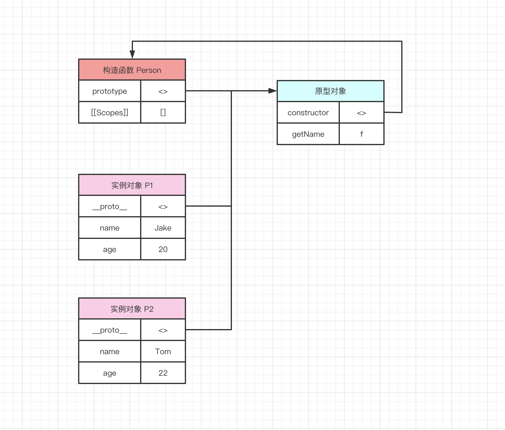
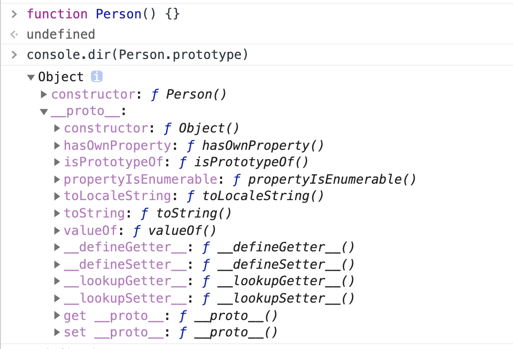
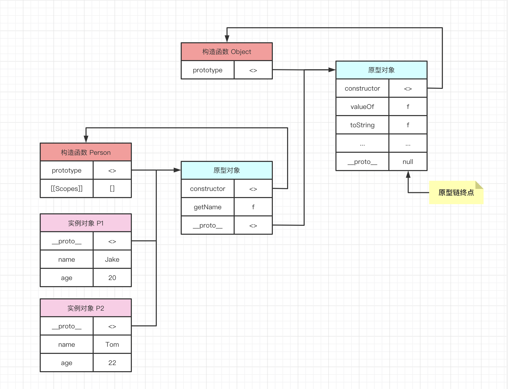
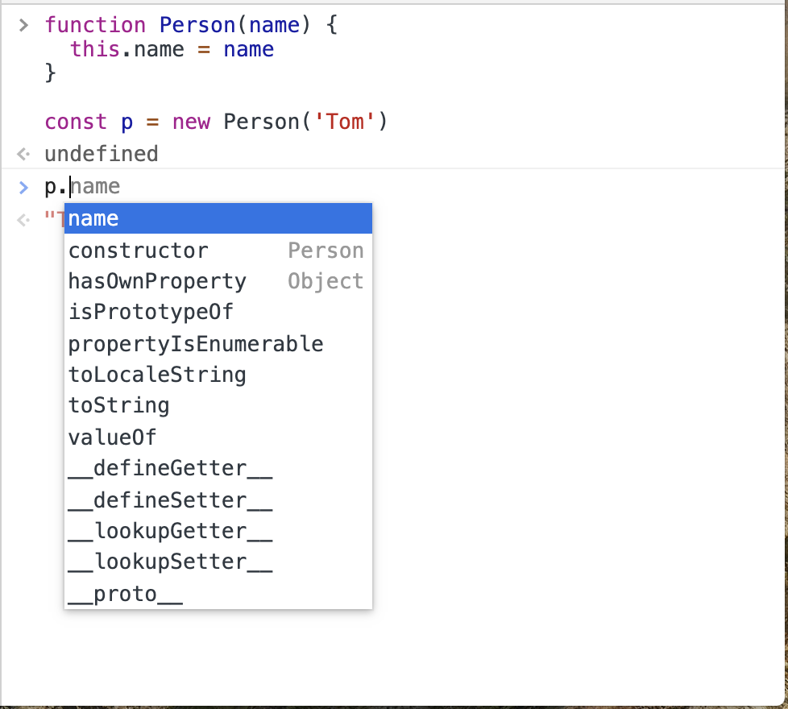
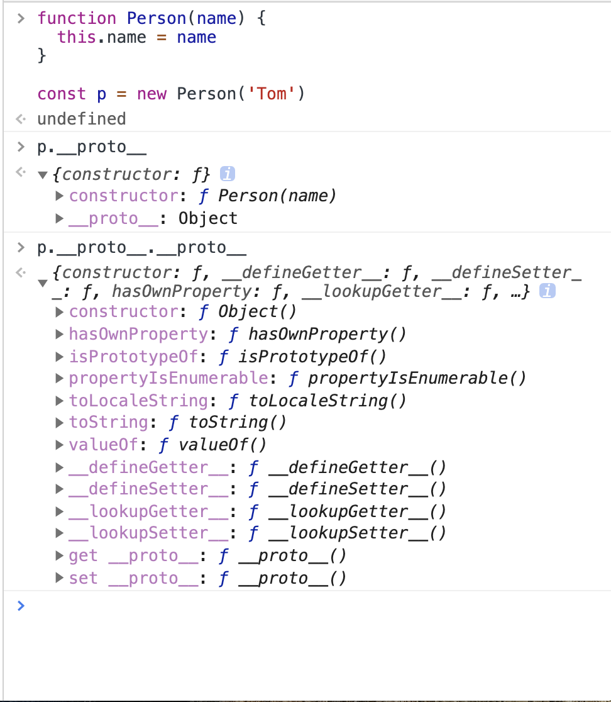

# 31-原型与原型链

在对实例的封装中，我们将所有实例共享的方法抽离出来，挂载在一个对象里，这个对象就是**原型对象**。

## 01-原型

构造函数中，使用 `prototype` 指向原型对象。 实例对象中，使用 `__proto__` 指向原型对象。 原型对象中，使用 `constructor` 指向构造函数。

他们的关系如下图。



从图中很自然能够得出如下的结论

```javascript
function Person(name) {
  this.name = name
}

const p1 = new Person('Tom');

console.log(p1.__proto__ === Person.prototype) // true
console.log(Person.prototype.constructor === Person) // true
// Object.getPrototypeOf 能够获取实例的原型
console.log(Object.getPrototypeOf(p1) === Person.prototype) // true
```

## 02-原型链

在上例中，Person 的原型对象也是一个对象。因此，原型对象也是别人的实例。可以观察一下我们会发现，Person 的原型对象中，也有一个 `__proto__` 属性，用于指向自己的原型对象。而该原型对象的构造函数， `constructor` 指向 Object()。

我们可以完善上图



对于实例对象 p1 而言，它的原型对象为 `p1.__proto__` 对于 p1 的原型对象而言，它的原型对象为 `p1.__proto__.__proto__`

此时我们发现，一个单向的链表模型存在于对象的关联关系中，这就是**原型链。**

现在有如下代码

```javascript
function Person(name) {
  this.name = name
}

const p = new Person('Tom')
```

此时，并没有往实例对象 p 的原型对象中，添加任何方法。我们观察一下，p 能访问哪些方法。



很神奇的是，实例对象 p 居然能够访问这么多方法/属性，name 属性来自构造函数，constructor 与 `__proto__` 属性来自原型对象，其他的属性来自哪里呢？进一步观察



我们发现其他的属性来自于 Object 的原型对象。也就是说，**实例对象能够访问原型链中的正方向节点中的每一个属性与方法。**

例如

```javascript
// p 对象中并没有 constructor 属性，但是能够从其原型对象中找到，所以
p.constructor === Person  // true
```
