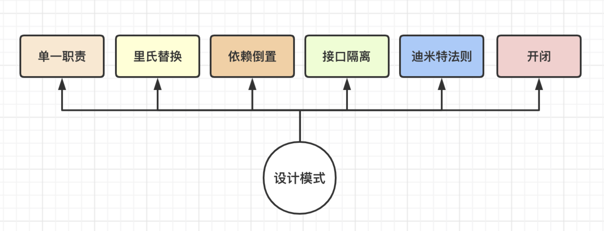

# 39-设计模式

在学习封装时，我们知道，封装很重要的一个核心就是要学会提炼可复用的公共逻辑。

而设计模式，就是大佬们在实践过程中，逐渐提炼出来的一系列可复用的公共逻辑。设计模式是在运用面向对象思维解决实际问题时的解决方案，他们对于提高代码的可读性和可维护性具有重要的意义。因此，掌握设计模式，是对面向对象的进一步深入学习。

提炼公共逻辑是一个非常大的概念，提炼出来的东西是否合理，是否具备可维护性，每个人对公共逻辑的理解不同，结果也会产生变化。特别是在对象与对象要进行复杂的交互时，对于公共逻辑的理解会产生更大的偏差。因此，对于面向对象的逻辑封装，前辈们总结出来了六大设计原则，来指导大家更优雅的使用设计模式。



## 1-单一职责原则

一个类，只负责一项职责。一个方法尽量只干一件事。

例如，一个非常简单的案例，人要打球。合理的封装应该是，分别封装一个人的类，与球的类。这是我们很容易就能够区分出来的事情。单一原则的运用往往在潜移默化中，虽然你可能还没有听过这个原则，但是你已经在使用它了。

```javascript
class Person {}
class Ball {}
```

不合理的封装，就是把球的属性，放在 Person 对象里

```javascript
class Person {
  constructor(name, ballType) {
    this.name = name
    this.ball = ballType
  }
}
```

但是这样封装的扩展性就非常差，因为在实践中，人有许多类别，例如学生，教师，医生等，可能会设计不同的类。球也有羽毛球，篮球，乒乓球等等。人与球是一个多对多的关系，如果封装在一个类里，后续的扩展就会变得非常困难。

## 2-里氏替换原则

该原则针对的是父类与子类的替换关系。

最早是在 1988 年，由麻省理工学院的一位女士（Barbara Liskov）提出。该原则以 liskov 的名字命名。

任何使用父类实例的地方，能够使用子类实例完美替换。这就是里氏替换原则的核心。

例如，父类为 Person， 子类为学生 Student

```javascript
class Person {
  constructor(name) {
    this.name = name
  }
  run(t) {
    console.log(`${this.name} 跑了 ${t} 公里`);
  }
}

class Student extends Person {
  constructor(name, grade) {
    super(name)
    this.grade = grade
  }
}

const p1 = new Person('Tom')
p1.run(20)
const s1 = new Student('Tom')
s1.run(20)
```

父类实例 p1 调用 run 方法，与子类实例 s1 调用 run 方法，他们的效果是一模一样的。我们能够用 s1 替换掉 p1 而不会引发什么额外的问题。

我们知道，继承的本质是代码的复制，也就是说，只要我们不在子类中，重写父类已经完整实现的方法，就能够达到里氏替换原则想要的效果。

这里强调的是，子类一定只能是父类的扩展，而非在父类的基础上进行畸变和魔改。

如果一定需要重写父类的方法，那么也一定是在父类方法上进行扩展，要确保原有逻辑的稳定性。

很明显，该原则也是确保我们写的程序能具备强大的扩展性。

## 3-依赖倒置原则

依赖倒置原则的原始定义如下：

High-level modules should not depend on low-level modules.  Both should depend on abstractions.**高层模块不应该依赖低层模块，两者都应该依赖其抽象**

Abstractions should not depend upon details.  Details should depend upon abstractions.**抽象不应该依赖细节，细节应该依赖抽象**

这个理解起来有点困难，但是掌握之后威力巨大。

理解这个定义，首先需要理解三个概念，高层模块，底层模块，以及抽象。

有一个非常简单的场景，我看书。

这个场景里，高层模块就是 “我”，低层模块就是 “书”。

我们来使用代码定义这个场景，大概就是

```javascript
myself.read(book)
```

这里的 myself 与 book，就是我们要封装的两个类。

```javascript
// 低层模块
class Book {
  // 定义一个非常简单的方法
  getContent() {
    return '书籍的内容'
  }
}
```

低层模块是一个非常简单的类，他不依赖任何其他的类来实现自己的功能。

```javascript
import Book from './Book'

// 高层模块
class Person {
  // 此时需要传入一个 Book 的实例，用于获取书籍的内容
  read(book: Book) {
    console.log('我开始看书了')
    console.log(`书的内容是：${book.getContent()}`)
  }
}
```

关注此处 read 方法的实现。如果我们要做类型约束，那么期望传入的参数，就最好只能是 Book 类的实例，这样我们可以进一步确认运用时的准确性。于是，Person 类在封装时，就不可避免的依赖了底层模块 Book 类。

在实践中，这样的方式其实没有什么问题。

```javascript
const myself = new Person()
const book = new Book()

myself.read(book)
```

真实场景中，这样的实现，扩展性受到了限制。

我可能不仅仅只是想读书，还想要读报纸，读手机内容等等。那此时，read 方法的类型限制就很难受了

```javascript
import Book from './Book'
import Newspaper from './NewsPaper'
import Phone from './Phone'

// 高层模块
class Person {
  // 此时需要传入一个 Book 的实例，用于获取书籍的内容
  read(book: Book | Newspaper | Phone) {
    console.log('我开始看书了')
    console.log(`书的内容是：${book.getContent()}`)
  }
}
```

这里的改动，我们做了一件成本偏高的事情，就是修改了 Person 类。实践场景远不止如此简单。 Person 类的修改，也就意味着存在未知风险，相关的功能都需要重新验证一次。而 Person 类的依赖也越来越多，后期的调整成分本在逐渐变得很高。

那么有没有更好的方案，能够在扩展的时候，不改动 Person 类呢？当然有

这里我们需要引入抽象的概念。书、报纸、手机，他们虽然都是不同的类，有非常多的不一样，但是对于 Person 类来说，他们可以提炼出来一个抽象概念：读物。通俗一点说，就是**依据他们的共性，给他们分个类**。

有了读物这个抽象概念，事情就好办多了

先定义抽象类

```javascript
interface Reader {
  getContent: () => string
}
```

然后定义各自具体的读物

```javascript
class Book impements Reader {
  getContent() {
    return '返回具体的内容'
  }
}
```

最后定义 Person 类

```javascript
import Reader from './Reader'

// 高层模块
class Person {
  // 此时需要传入一个 Book 的实例，用于获取书籍的内容
  read(reader: Reader) {
    console.log('我开始看书了')
    console.log(`书的内容是：${reader.getContent()}`)
  }
}
```

此时我们发现，如果我们想要新增报纸这种读物时，就只需要新增报纸类「实现 Reader」即可。Person 类完全不需要任何改动，因为 Person 依赖的是读物。

于是 高层组件「Person」仅仅只依赖了抽象类「Reader」。Person，Book，Newspaper，Phone 得以解耦。

这其实也是面向接口编程。

在实践中，我们可以大量运用依赖倒置原则来提高代码的扩展性。

例如，将盒子、盆子、桶，提炼出一个抽象概念：容器，用于装水。

又例如，封装的地图组件，不明确依赖到底是百度地图还是高德地图或者是谷歌地图。而是将这些地图提炼出来一个抽象概念：地图。无论是什么地图，只需要提供我们组建需要的方法即可

## 4-接口隔离原则

定义：一个类，不应该依赖它不需要的接口。

一本书，可以抽象为读物，这个是基于能够提供内容的角度去做的分类。 一本书，可以抽象为可燃物，这个是基于能够纸张能够燃烧的角度做的分类。

同样的对象，从不同的角度去分类，可以提炼出不同的抽象，也就是说可以提炼出不同的接口。

```javascript
interface Book {
  // 提供内容
  getContent: () => string,
  
  // 燃烧
  burn: () => void
}
```

但是对于 Person 对象来说，并不关注书的可燃烧属性。因此，当我们定义 Person 类的时候，依赖的抽象类，就不应该包含此处的 burn 方法。

虽然读物和可燃物，都是从书籍里提炼出来的，但是他们针对的场景不一样，因此就不应该把他们的抽象类合并在一起，而应该拆分开。

```javascript
// 读物
interface Reader {
  getContent: () => string
}
可燃物
interface CombustibleMaterial {
  burn: () => void
}
```

然后根据不同的场景选择依赖即可。

当然，接口隔离原则的使用，一定要适度，要结合场景进行合理的拆分，如果拆分得过细，也就造成接口过多而维护困难的局面。

## 5-迪米特法则

迪米特法则要求的是：一个对象应该对其他的对象保持最少的了解。

通俗来说，就是要想办法降低类与类之间的耦合。如果类与类之间的关系太过于密切，那么，一个类发生了变化，就会对另外一个类造成更大的影响。

例如这样一个场景，一个集团下有许多分公司。

从需求上来说，集团需要计算公司每个员工的薪资情况，包括集团直属员工与各分公司员工。

那么我们在设计类的时候，这里的就包括两个类，一个集团公司 HeadOffice，一个分公司 BranchOffice。

对于集团公司来说，至少需要一个方法，就是该场景需要的计算薪资 calculate。

但是计算薪资，还需要获取到非常多的信息才能够正确的计算，例如员工基本信息，岗位信息，基本工资，提成方式等。

不合理的设计方式，就是把分公司员工的薪资计算交给集团公司类来做

```javascript
// 定义分公司类
class BranchOffice {
  // 获取员工列表，包含员工基本信息
  getEmployeeList() {
    return []
  }
  
  // 通过员工id进一步获取员工更多的信息，例如基本工资，绩效信息，提成方式等
  getEmployeeInfo(id) {
    return '员工信息'
  }
}
```

定义集团公司，还需要分公司薪资，因此此时必须依赖分公司，

```javascript
import BranchOffice from './BranchOffice'

// 定义集团公司类
class HeadOffice {
  // 获取集团公司员工列表，包含员工基本信息
  getEmployeeList() {}

  // 进一步获取员工信息
  getEmployeeInfo(id) {}

  // 设置员工薪资 -> 计算单个员工的信息
  setEmployeeSalary(useInfo) {}

  // 传入分公司对象
  calculate(office: BranchOffice) {
    // 计算集团的员工薪资
    const headEmployees = this.getEmployeeList()
    headEmployees.forEach((emp, i) => {
      const info = this.getEmployeeInfo(emp.id)
      this.setEmployeeSalary({...emp, ...info})
    })

    // 需要通过分公司，获取到分公司的员工信息，以及员工的详细信息
    const employees = office.getEmployeeList()
    employees.forEach((emp, i) => {
      const info = office.getEmployeeInfo(emp.id)
      this.setEmployeeSalary({...emp, ...info})
    })
  }
}
```

此时我们发现，在集团公司中，为了计算子公司员工的薪资，获取了很多只属于子公司的信息，例如子公司的员工列表，子公司的员工详情，那么集团公司与子公司就变得非常密切。如果子公司发生变化，有极大的风险会影响到集团公司的正常运行。

遵守迪米特法则的设计，是应该尽量少的让集团公司获取到子公司的信息。我们只需要在设计方法时，让子公司自己计算自己员工的薪资即可。

代码如下：

```javascript
// 定义分公司类
class BranchOffice {
  // 获取员工列表，包含员工基本信息
  getEmployeeList() {
    return []
  }

  // 通过员工id进一步获取员工更多的信息，例如基本工资，绩效信息，提成方式等
  getEmployeeInfo(id) {
    return {}
  }
  // 计算某一个员工的薪资
  setEmployeeSalary(useInfo) {}

  // 计算所有员工的薪资
  calAllEmployeeSalary() {
    const employees = this.getEmployeeList()
    employees.forEach(employee => {
      const info = this.getEmployeeInfo(employee.id)
      this.setEmployeeSalary({...employee, ...info})
    })
  }
}
import BranchOffice from './BranchOffice'

// 定义集团公司类
class HeadOffice {
  // 获取集团公司员工列表，包含员工基本信息
  getEmployeeList() {}

  // 进一步获取员工信息
  getEmployeeInfo(id) {}

  // 设置员工薪资 -> 计算单个员工的信息
  setEmployeeSalary(useInfo) {}

  // 计算集团公司所有员工的薪资
  calAllEmployeeSalary() {
    const employees = this.getEmployeeList()
    employees.forEach(employee => {
      const info = this.getEmployeeInfo(employee.id)
      this.setEmployeeSalary({ ...employee, ...info })
    })
  }

  // 传入分公司对象
  // 计算所有员工，包括集团总部和分公司
  calculate(office: BranchOffice) {
    this.calAllEmployeeSalary()
    office.calAllEmployeeSalary()
  }
}
```

我们可以看到，优化之后，集团公司与分公司的耦合降低了，对于集团公司来说，只需要调用一下分公司计算薪资的方法即可。至于分公司如何计算，是否与集团公司的计算方式保持一致，这些都是集团公司并不关心的问题。因此，这样的设计也极大的提高了扩展性。

当然，我们还可以利用依赖倒置原则进一步优化。这里就不再扩展。

## 6-开闭原则

开闭原则是面向对象程序设计的终极目标。

上诉我们提到的所有的设计原则，以及之后我们还会学习到的各种设计模式，都在遵循开闭原则。

当需求变化时，如果直接修改旧代码，一个是成本很高，我们无法确保修改不会对之前的功能造成影响，甚至可能会对已有的功能造成破坏性修改，二个是风险很高，我们无法确保在改动过程中，是否会造成了一些错误。不好的设计，在软件迭代一年两年，就可能不得不进行重构。这在实践中很常见。

因此开闭原则的理想情况就是，对已有功能闭合，对扩展开放。也就是说，功能的扩展，都通过设计的扩展来实现，而不是通过修改来实现。

当然，开闭原则是一个非常抽象和理想的情况，实践中很难完全的达到这样的理想效果。我们只需要在实践时，对程序的扩展性和可维护性保持足够的重视，就自然会遵循开闭原则。

## 7-总结

在实践中，设计原则讨论的不是是与否的问题，而是多与少的问题。有的场景因为场景原因，或者历史原因，并不能完全的遵循这些设计原则。我们在实践中，要学会灵活运用这些原则，这就是很理想的情况。