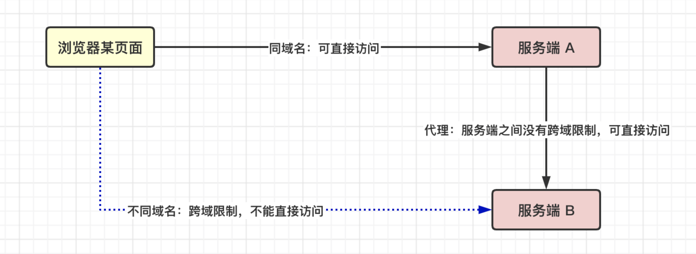
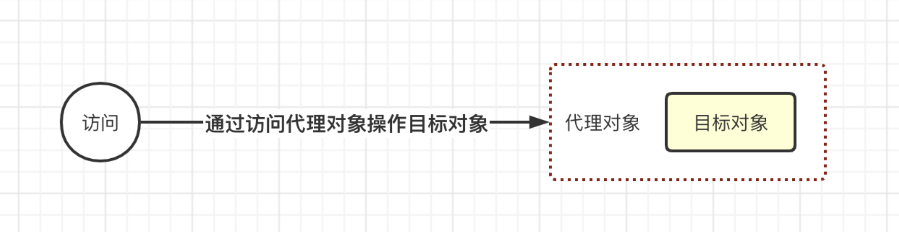

# 43-代理模式

理解代理模式，很形象的例子就是明星的经纪人。

我希望能够让某位明星成为我的代言人，但是一般情况只能跟经纪人洽谈。而不会跟明星直接联系。

经纪人就是明星的代理。

生活中也有许多代理模式的案例。

例如我想购买飞机票，但是我可以不用直接在机场购买，我们小区楼下就有一家代理出售机票火车票的小机构。

解决跨域问题也可以使用代理。

浏览器中某一页面无法直接访问其他域名的接口。那如果就是有需求要访问其他域名的接口怎么办呢？

我在自己域名服务器下，创建一个代理。

浏览器访问自己域名服务器的代理接口，代理接口在服务端，不在浏览器，就不会有跨域限制，于是服务端的代理接口可以去访问其他域名的数据。这样就达到了目的。



代理模式的好处，在明星经纪人这里体现的非常明显。

想要找赵丽颖谈商业合作的商家非常多，但是如何对比开价更高的商家，如何淘汰恶意捣乱的商家，如何应付诚意不足的商家，如何安排通告行程等等，这些乱七八糟的事情都由经纪人来处理。

而赵丽颖只需要确定最终选择商家即可。代理模式让她避免了很多杂务。

在我们的代码设计中，代理模式，是为其他对象提供一种代理以控制对该对象的访问。



- 代理对象，是对目标对象的一次封装
- 代理对象可预先处理访问请求，再决定是否转交给目标对象
- 代理对象和目标对象，对外提供的可操作性方式保持一致

针对不同的场景，实现代理的方式可能不一样。

在 JavaScript 中，提供了默认的 Proxy 对象，用于创建一个对象的代理。

```javascript
const t = {m: 1}
const p1 = new Proxy(t, {
  get: function(obj, prop) {
    return obj[prop]
  }
})

// 通过代理对象，访问目标对象
console.log(p1.m)  // 1

// 通过代理对象修改目标对象
p1.m = 2
console.log(t) // {m: 2}
```

Proxy 的第一个参数为目标对象，第二参数是监听事件，可以监听代理对象的访问与修改操作。这样的话，我们就可以利用代理对象，对目标对象的访问进行数据的劫持。

Vue3.0 正是利用了 Proxy 这样的特点，才能得以使用 Proxy 替换掉 getter/setter。

我们也可以自己实现一个 Proxy 对象。

> ProxyPolyfill 简化版，仅仅只提供了 Object 的兼容。仅供参考阅读

```javascript
class Internal {
  constructor(target, handler) {
    this.target = target
    this.handler = handler
  }
  get(property, receiver) {
    var handler = this.handler;
    if (handler.get ==undefined) {
      return this.target[property];
    }
    if (typeof handler.get === 'function') {
      return handler.get(this.target, property, receiver);
    }
  }
  set(property, value, receiver) {
    var handler = this.handler;
    if (handler.set == undefined) {
      this.target[property] = value;
    } else if (typeof handler.set === 'function') {
      var result = handler.set(this.target, property, value, receiver);
      if (!result) {
        console.error(`set 异常： ${property}`)
      }
    } else {
      console.error("Trap 'set' is not a function: " + handler.set);
    }
  }
}

function ProxyPolyfill(target, handler) {
  return proxyObject(new Internal(target, handler));
}

/**
 * Proxy object 这里是核心关键，使用 Object.create 的方式与 目标对象建立绑定关系
 * @param {Internal} internal 
 * @returns {object}
 */
function proxyObject(internal) {
  var target = internal.target;
  var descMap, newProto;
  
  descMap = observeProto(internal);
  newProto = Object.create(Object.getPrototypeOf(target), descMap);

  descMap = observeProperties(target, internal);
  return Object.create(newProto, descMap);
}

/**
 * Observe [[Prototype]]
 * @param {Internal} internal 
 * @returns {object} descriptors
 */
function observeProto(internal) {
  var descMap = {};
  var proto = internal.target;
  while (proto = Object.getPrototypeOf(proto)) {
    var props = observeProperties(proto, internal);
    Object.assign(descMap, props);
  }
  descMap.__PROXY__ = {
    get: function () {
      return internal.target ? undefined : 'REVOKED';
    }
  };
  return descMap;
}

/**
 * Observe properties
 * @param {object} obj
 * @param {Internal} internal 
 * @returns {object} descriptors
 */
function observeProperties(obj, internal) {
  var names = Object.getOwnPropertyNames(obj);
  var descMap = {};
  for (var i = names.length - 1; i >= 0; --i) {
    descMap[names[i]] = observeProperty(obj, names[i], internal);
  }
  return descMap;
}

/**
 * Observe property，让 代理对象的属性操作，映射到目标对象
 * @param {object} obj
 * @param {string} prop
 * @param {Internal} internal 
 * @returns {{get: function, set: function, enumerable: boolean, configurable: boolean}}
 */
function observeProperty(obj, prop, internal) {
  var desc = Object.getOwnPropertyDescriptor(obj, prop);
  return {
    get: function () {
      return internal.get(prop, this);
    },
    set: function (value) {
      internal.set(prop, value, this);
    },
    enumerable: desc.enumerable,
    configurable: desc.configurable
  };
}
```

简单验证一下，发现初步达到了目的

```javascript
const t = {m: 1}
const p1 = new ProxyPolyfill(t, {
  get: function(obj, prop) {
    return obj[prop]
  }
})

p1.m = 2
console.log(t) // {m: 2}
```

**虚拟代理：图片加载**

有的时候图片过大，在页面上不能够快速的完整显示。这个时候体验就非常不好。

当图片还没有完整加载完成时，我们可以使用一个默认图片或者 loading 图片进行占位。目标图片加载完成之后，再将 loading 图片替换成目标图片。

```javascript
var targetImage = (function () {
  var imgNode = document.createElement('img');
  document.body.appendChild(imgNode);
  return {
    setSrc: function (src) {
      imgNode.src = src;
    }
  }
})();

var proxyImage = (function() {
  var img = new Image();
  // 先加载 loading 或者默认图片用于快速显示
  targetImage.setSrc('loading.gif')
  img.onload = img.onerror = function () {
    // 加载完成之后，替换目标图片
    targetImage.setSrc(img.src);
  };

  return {
    setSrc: function (src) {
      // 此时开始加载图片
      img.src = src;
    }
  }
})();

proxyImage.setSrc('https://cn.bing.com/sa/simg/hpb/LaDigue_EN-CA1115245085_1920x1080.jpg');
```

**缓存代理：记忆函数**

有这样一个函数。该函数接收两个整数参数，第一个参数表示开始数字，第二个参数表示结束数字，该函数的功能是计算开始到结束的范围中，所有整数的和。

```javascript
function sum(start, end) {
  let res = 0
  for (let i = start; i <= end; i++) {
    res += i
  }
  return res
}
```

于是问题来了，如果是大额的计算，计算成本很高。例如，我多次调用该方法，计算 1 ~ 100000 的和。

```javascript
sum(1, 100000)
sum(1, 100000)
sum(1, 100000)
sum(1, 100000)
```

我们仔细分析一下，会发现有大量的冗余计算过程。1 ~ 100000 的计算，会被重复计算很多次。

既然都是计算 1 ~ 100000，那能不能优化一下，只计算一次就好了？

当然可以。

我们联想一下纯函数的特点，相同的输入，总能得到相同的输出。因此，如果我们能判断，输入的参数是相同的，那么就可以直接上上一次的计算结果返回出来。

优化方案如下：

```javascript
function withSum(base) {
  const cache = {}

  return (...args) => {
    const str = `${args[0]}-${args[1]}`
    if (!cache[str]) {
      cache[str] = base.apply(null, args)
    }
    return cache[str]
  }
}
```

使用时很简单

```javascript
const _sum = withSum(sum)

_sum(1, 100000)
_sum(1, 100000)
_sum(1, 100000)
_sum(1, 100000)
```

该方案利用了闭包，将计算结果缓存在 `cache` 字段中，当再一次需要计算时，就从闭包中先判断是否已经有计算结果了，如果有就直接返回结果，如果没有才会重新计算。

如果仅仅从计算成本来考虑，新的方案有两个成本，一个是比较的成本，一个是计算结果的成本。

通常情况下，比较成本都是远远低于计算成本的，因此能够达到提高计算速度的效果，但是有的情况下，比较时间可能会大于计算时间。

因此，在实践中运用此方法时，要明确好判断条件，确保判断条件都是简单的，如果太过于复杂的比较条件，也有可能导致没有起到优化的效果，反而消耗更大。

在 React 中，有许多用到了这种方法的场景。

例如 React.memo，useState，useCallback，useMemo 等等。

也就意味着，我们在 React 实际场景中，也要尽量简化比较条件。

代理的方式还有很多，根据不同的场景处理手段也不一样，这里就不再一一列举。