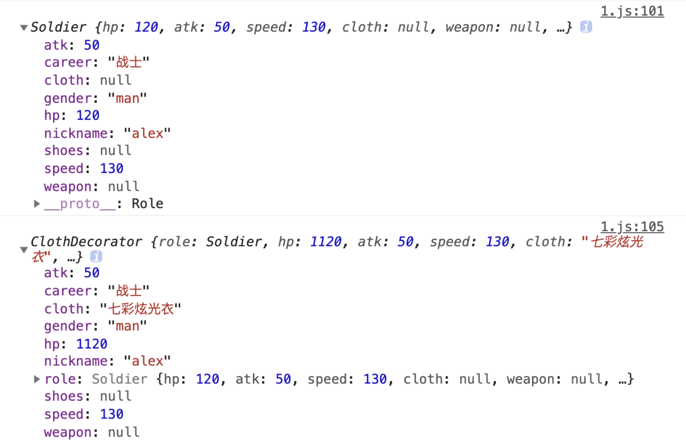
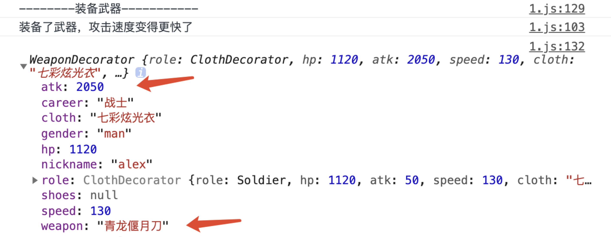
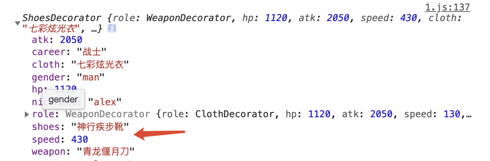

# 45-装饰者模式

当我们想要扩展一个对象的能力时，可以采用的方案有

- 添加原型方法
- 修改构造函数
- 继承
- **装饰者模式**

前面三种方法，都不可避免的会修改原有对象的代码。

而如果不修改原有对象代码的情况下，装饰者模式是很好的一种解决方案。

## 1-案例

首先，我们有设计了几件装备，他们的信息保存在 `config.js` 中

```javascript
// config.js
export const cloth = {
  name: '七彩炫光衣',
  hp: 1000
}
export const weapon = {
  name: '青龙偃月刀',
  attack: 2000
}
export const shoes = {
  name: '神行疾步靴',
  speed: 300
}
export const defaultRole = {
  hp: 100,
  atk: 50,
  speed: 125,
  cloth: null,
  weapon: null,
  shoes: null,
  career: null,
  gender: null
}
```

然后创建一个基础的角色对象，添加基础的属性与方法

```javascript
// 基础角色类
// 有血条，攻击力，速度三个基础属性
// 以及衣服，武器，鞋子三个装备插槽
class Role {
  constructor(role) {
    this.hp = role.hp;
    this.atk = role.atk;
    this.speed = role.speed;
    this.cloth = role.cloth;
    this.weapon = role.weapon;
    this.shoes = role.shoes;
  }
  run() {}
  attack() {}
}
```

然后基于基础角色类创建职业为**战士**的角色类

```javascript
// 战士
class Soldier extends Role {
  constructor(role) {
    const r = Object.assign({}, defaultRole, role)
    super(r)
    this.nickname = r.nickname
    this.gender = r.gender
    this.career = '战士'
    // 战士的基础血条 +20
    if (role.hp == defaultRole.hp) {
      this.hp = defaultRole.hp + 20
    }
    // 战士的基础移动速度 +5
    if (role.speed == defaultRole.speed) {
      this.speed = defaultRole.speed + 5
    }
  }
  run() {
    console.log('战士的奔跑动作')
  }
  attack() {
    console.log('战士的攻击动作')
  }
}
```

接下来，我们要创建装饰类。

装饰类不必知道被装饰类的存在。他是相对独立的。我们可以称之为装饰者。

**装饰类的关键，是以被装饰者的实例，作为初始化参数。**

装饰类可能会有许多，衣服武器鞋子等都可以各设计一个装饰类分别负责不同的行为与变化。因此我们需要设计一个基础装饰类作为各装饰类的父类，用于减少代码量。

装饰类与被装饰类的属性与方法基本保持一致，只是实现上略有差异。

```javascript
// 基础装饰类
class Decorator {
  constructor(role) {
    this.role = role;
    this.hp = role.hp;
    this.atk = role.atk;
    this.speed = role.speed;
    this.cloth = role.cloth;
    this.weapon = role.weapon;
    this.shoes = role.shoes;
    this.career = role.career;
    this.gender = role.gender;
    this.nickname = role.nickname;
  }
  run() {
    this.role.run()
  }
  attack() {
    this.role.attack()
  }
}
```

接下来创建衣服装饰类 ClothDecorator

衣服装饰类继承基础装饰类

衣服只会修改角色的属性，并不会修改角色的行为

```javascript
class ClothDecorator extends Decorator {
  constructor(role, cloth) {
    super(role)
    this.cloth = cloth.name
    this.hp += cloth.hp
  }
}
```

类封装好了之后，我们使用一下，感受一下变化

```javascript
const baseInfo = {...defaultRole, nickname: 'alex', gender: 'man'}
// 创建一个战士角色
const alex = new Soldier(baseInfo)
alex.run()
alex.attack()
console.log(alex)

alex = new ClothDecorator(alex, cloth)
// 查看变化
console.log(alex)
```



我们看属性 cloth 与 hp 已经发生了变化。

除此之外，我们还需要创建武器装饰类，鞋子装饰类。

武器与鞋子的穿戴会改变角色的攻击动作与奔跑动作，因此需要做更多的修改

```javascript
class WeaponDecorator extends Decorator {
  constructor(role, weapon) {
    super(role)
    this.weapon = weapon.name
    this.atk += weapon.attack
  }
  attack() {
    console.log('装备了武器，攻击速度变得更快了')
  }
}
console.log('--------装备武器-----------')
alex = new WeaponDecorator(alex, weapon)
alex.attack()
console.log(alex)
```



鞋子装饰类

```javascript
class ShoesDecorator extends Decorator {
  constructor(role, shoes) {
    super(role)
    this.shoes = shoes.name
    this.speed += shoes.speed
  }
  run() {
    console.log('穿上了鞋子，奔跑速度变得更快了')
  }
}
console.log('--------装备鞋子-----------')
alex = new ShoesDecorator(alex, shoes)
alex.run()
console.log(alex)
```



除此之外，我们玩游戏时，还知道每个角色都会在某些情况下获得不同的 buff，例如大龙 buff，小龙 buff，红蓝 buff 等，这些buff 有的会更改角色属性，例如 cd 更短，攻击更高，有的会更改攻击特性，例如红 buff 会持续掉血，减速等。

我们可以思考一下如何实现这些功能。

## 2-decorator

> 默认情况下并不支持装饰器语法，因此，在学习该语法之前，你需要找到一个支持该语法的开发环境 [如何在构建环境中支持 decorator](https://technologyadvice.github.io/es7-decorators-babel6/)

ES7 中提供了一个快捷的语法用来解决与装饰者模式一样的问题。这就是装饰器语法 decorator。

在学习装饰器语法之前，需要先温习一下 ES5 的一些基础知识。

假设有对象如下：(便于理解)

```javascript
var person = {
  name: 'TOM'
}
```

对象中的每个属性都有一个特性值来描述这个属性的特点，他们分别是：

- `configurable`: 属性是否能被 delete 删除，当值为false时，其他特性值也不能被改变，默认值为true
- `enumerable`： 属性是否能被枚举，也就是是否能被 for in 循环遍历。默认为 true
- `writable`: 是否能修改属性值。默认为 true
- `value`：具体的属性值是多少，默认为 undefined
- `get`：当我们通过`person.name`访问 name 的属性值时，get 将被调用。该方法可以自定义返回的具体值是多少。get 默认值为 undefined
- `set`：当我们通过`person.name = 'Jake'`设置 name 属性值时，set 方法将被调用，该方法可以自定义设置值的具体方式，set 默认值为 undefined

> 需要注意的是，不能同时设置`value，writeable`与`get set`。

我们可以通过`Object.defineProperty`(操作单个)与`Object.defineProperties`（操作多个）来修改这些特性值。

```javascript
// 三个参数分别为  target, key, descriptor(特性值的描述对象)
Object.defineProperty(person, 'name', {
  value: "TOM"
})

// 新增
Object.defineProperty(person, 'age', {
  value: 20
})
```

装饰器语法与此类似，当我们想要自定义一个装饰器时，可以这样写：

```javascript
function nameDecorator(target, key, descriptor) {
  descriptor.value = () => {
    return 'jake';
  }
  return descriptor;
}
```

函数 `nameDecorator` 的定义会重写被他装饰的属性(getName)。方法的三个参数与 `Object.defineProperty` 一一对应，分别指当前的对象 `Person`，被作用的属性`getName`，以及属性特性值的描述对象 `descriptor` 。函数最后必须返回`descriptor`。

使用时也很简单，如下：

```javascript
class Person {
  constructor() {
    this.name = 'jake'
  }
  @nameDecorator
  getName() {
    return this.name;
  }
}

let p1 = new Person();
console.log(p1.getName())
```

在 `getName` 方法前面加上 `@nameDecorator`，就是装饰器语法。

自定义函数 `nameDecorator` 的参数中，target，就是装饰的对象Person，key 就是被装饰的具体方法`getName`。

不能使用装饰器对构造函数进行更改，如果要修改构造函数，则可以通过如下的方式来完成

```javascript
function initDecorator(target, key, descriptor) {
  const fn = descriptor.value;
  // 改变传入的参数值
  descriptor.value = (...args) => {
    args[0] = 'TOM';
    return fn.apply(target, args);
  }
  return descriptor;
}

class Person {
  constructor(name, age) {
    this.init(name, age)
  }
  @initDecorator
  init(name, age) {
    this.name = name;
    this.age = age;
  }
  getName() {
    return this.name;
  }
  getAge() {
    return this.age;
  }
}

console.log(new Person('alex', 20).getName()); // TOM
```

如果希望装饰器传入一个指定的参数，可以如下做。

```javascript
// 注意这里的差别
function initDecorator(name) {
  return function (target, key, descriptor) {
    const fn = descriptor.value;
    descriptor.value = (...args) => {
      args[0] = name;
      return fn.apply(target, args);
    }
    return descriptor;
  }
}

class Person {
  constructor(name, age) {
    this.init(name, age)
  }
  @initDecorator('xiaoming')
  init(name, age) {
    this.name = name;
    this.age = age;
  }
  getName() {
    return this.name;
  }
  getAge() {
    return this.age;
  }
}

console.log(new Person('alex', 20).getName());  // xiaoming
```

这里利用了闭包的原理，将装饰器函数外包裹一层函数，以闭包的形式缓存了传入的参数。

我们也可以对整个class添加装饰器

```javascript
function personDecorator(target) {
  // 修改方法
  target.prototype.getName = () => {
    return 'hahahahaha'
  }
  // 新增方法，因为内部使用了this，因此一定不能使用箭头函数
  target.prototype.getAge = function () {
    return this.age
  }
  return target;
}

@personDecorator
class Person {
  constructor(name, age) {
    this.init(name, age)
  }
  init(name, age) {
    this.name = name;
    this.age = age;
  }
  getName() {
    return this.name;
  }
}

var p = new Person('alex', 30);
console.log(p.getName(), p.getAge());  // hahahahaha 30
```

也可以传参数

```javascript
function initDecorator(person) {
  return function (target, key, descriptor) {
    var method = descriptor.value;
    descriptor.value = () => {
      var ret = method.call(target, person.name);
      return ret;
    }
  }
}

@stuDecorator(xiaom)
class Student {
  constructor(name, age) {
    this.init(name, age);
  }
  @initDecorator(xiaom)
  init(name, age) {
    this.name = name;
    this.age = age;
  }
  getAge() {
    return this.age;
  }
  getName() {
    return this.name;
  }
}

var p = new Student('hu', 18);
console.log(p.getAge(), p.getName(), p.getOther()); // 22 "xiaom" "other info."
```

那么用ES7 的decorator来实现最开始的需求，则可以这样做

```javascript
import { cloth, weapon, shoes, defaultRole } from './config';

// 基础角色
class Role {
  constructor(role) {
    this.hp = role.hp;
    this.atk = role.atk;
    this.speed = role.speed;
    this.cloth = role.cloth;
    this.weapon = role.weapon;
    this.shoes = role.shoes;
    this.nickname = role.nickname
    this.gender = role.gender
  }
  run() { }
  attack() { }
}


function ClothDecorator(target) {
  target.prototype.getCloth = function (cloth) {
    this.hp += cloth.hp;
    this.cloth = cloth.name;
  }
}

function WeaponDecorator(target) {
  target.prototype.getWeapon = function (weapon) {
    this.atk += weapon.attack;
    this.weapon = weapon.name;
  }
  target.prototype.attack = function () {
    if (this.weapon) {
      console.log(`装备了${this.weapon}，攻击更强了`);
    } else {
      console.log('战士的基础攻击');
    }
  }
}

function ShoesDecorator(target) {
  target.prototype.getShoes = function (shoes) {
    this.speed += shoes.speed;
    this.shoes = shoes.name;
  }
  target.prototype.run = function () {
    if (this.shoes) {
      console.log(`穿上了${this.shoes}，移动速度更快了`);
    } else {
      console.log('战士的奔跑动作');
    }
  }
}


@ClothDecorator
@WeaponDecorator
@ShoesDecorator
class Soldier extends Role {
  constructor(role) {
    const o = Object.assign({}, defaultRole, role);
    super(o);
    this.career = '战士';
    if (role.hp == defaultRole.hp) {
      this.hp = defaultRole.hp + 20;
    }
    if (role.speed == defaultRole.speed) {
      this.speed = defaultRole.speed + 5;
    }
  }
  run() {
    console.log('战士的奔跑动作');
  }
  attack() {
    console.log('战士的基础攻击');
  }
}

const base = {
  ...defaultRole,
  nickname: 'alex',
  gender: 'man'
}

const s = new Soldier(base);
s.getCloth(cloth);
console.log(s);

s.getWeapon(weapon);
s.attack();
console.log(s);

s.getShoes(shoes);
s.run();
console.log(s);
```

这里需要注意的是，装饰者模式与直接使用浏览器支持的语法在实现上的一些区别。

ES7 Decorator重点在于对装饰器的封装，因此我们可以将上栗中的装饰器单独封装为一个模块。在细节上做了一些调整，让我们封装的装饰器模块不仅仅可以在创建战士对象的时候使用，在我们创建其他职业例如法师，射手的时候也能够正常使用。

```javascript
export function ClothDecorator(target) {
  target.prototype.getCloth = function (cloth) {
    this.hp += cloth.hp;
    this.cloth = cloth.name;
  }
}

export function WeaponDecorator(target) {
  target.prototype.getWeapon = function (weapon) {
    this.atk += weapon.attack;
    this.weapon = weapon.name;
  }
  target.prototype.attack = function () {
    if (this.weapon) {
      console.log(`${this.nickname}装备了${this.weapon}，攻击更强了。职业：${this.career}`);
    } else {
      console.log(`${this.career}的基本攻击`);
    }
  }
}

export function ShoesDecorator(target) {
  target.prototype.getShoes = function (shoes) {
    this.speed += shoes.speed;
    this.shoes = shoes.name;
  }
  target.prototype.run = function () {
    if (this.shoes) {
      console.log(`${this.nickname}穿上了${this.shoes}，移动速度更快了。职业：${this.career}`);
    } else {
      console.log(`${this.career}的奔跑动作`);
    }
  }
}
```

可以利用该例子，感受Decorator与继承的不同。

整理之后，Soldier的封装代码将会变得非常简单

```javascript
import { cloth, weapon, shoes, defaultRole } from './config';
import { ClothDecorator, WeaponDecorator, ShoesDecorator } from './equip';
import Role from './Role';

@ClothDecorator
@WeaponDecorator
@ShoesDecorator
class Soldier extends Role {
  constructor(roleInfo) {
    const o = Object.assign({}, defaultRoleInfo, roleInfo);
    super(o);
    this.career = '战士';
    if (roleInfo.hp == defaultRoleInfo.hp) {
      this.hp = defaultRoleInfo.hp + 20;
    }
    if (roleInfo.speed == defaultRoleInfo.speed) {
      this.speed = defaultRoleInfo.speed + 5;
    }
  }
  run() {
    console.log('战士的奔跑动作');
  }
  attack() {
    console.log('战士的基础攻击');
  }
}
```