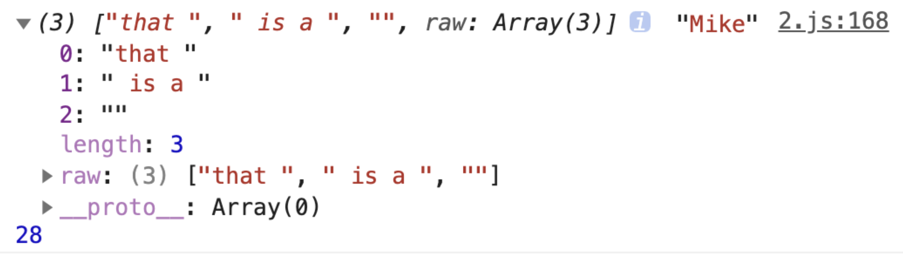

# 47-模板字符串

模板字符串是为了解决传统字符串拼接不便利而出现的。

我们先通过一个简单的例子来观察一下模板字符串与传统字符串的差别。

```
// ES5
var a = 20;
var b = 30;
var string = a + "+" + b + "=" + (a + b);

// ES6
const a = 20;
const b = 30;
const string = `${a}+${b}=${a+b}`;
```

模板字符串使用反引号 `[``]` 将整个字符串包裹起来，变量或者表达式则使用 `${}` 来包裹。

除了能够在字符串中嵌入变量，还可以用来定义多行字符串。其中所有的空格，缩进，换行都会被保留下来。

```
var elemString = `<div>
  <p>So you crossed the line, how'd you get that far?</p>
  <p>${word} you give it a try.</p>
</div>`
```

`${}` 中，可以放入一个变量，表达式，甚至一个函数执行。

```
// 变量
const hello = 'hello';
let message = `${hello}, world!`;

// 表达式
const a = 40;
const b = 50;
let result = `the result is: ${a + b}`;

// 函数
let fn = () => {
  const result = 'you are the best.';
  return result;
}

let str = `he said: ${fn()}`
```

也可以嵌套使用

```
function isLargeScreen() {
  return false
}
const item = {
  isCollapsed: true
}

const classes = `header ${isLargeScreen() ? '' :
  `icon-${item.isCollapsed ? 'expander' : 'collapser'}`}`;

console.log(classes)
```

当然还有更高级的用法。

我们可以在模板字符串前面加上一个标签。

该标签可以使用函数的形式来定义，并在内部定义更多的逻辑用于控制最终的输出。

```
// 案例来源于 MDN
var person = 'Mike';
var age = 28;

function myTag(strings, personExp, ageExp) {
  console.log(strings, personExp, ageExp)

  var str0 = strings[0]; // "that "
  var str1 = strings[1]; // " is a "

  var ageStr;
  if (ageExp > 99) {
    ageStr = 'centenarian';
  } else {
    ageStr = 'youngster';
  }

  return str0 + personExp + str1 + ageStr;

}

var output = myTag`that ${person} is a ${age}`;

console.log(output);
// that Mike is a youngster
```




标签函数的第一个参数中，有一个特殊属性 `raw`，通过它可以访问模板字符串的原始字符串。