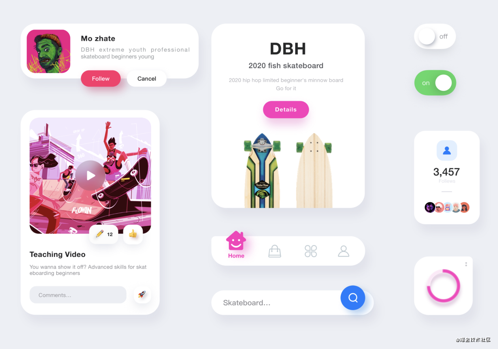
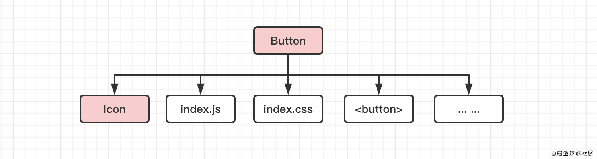
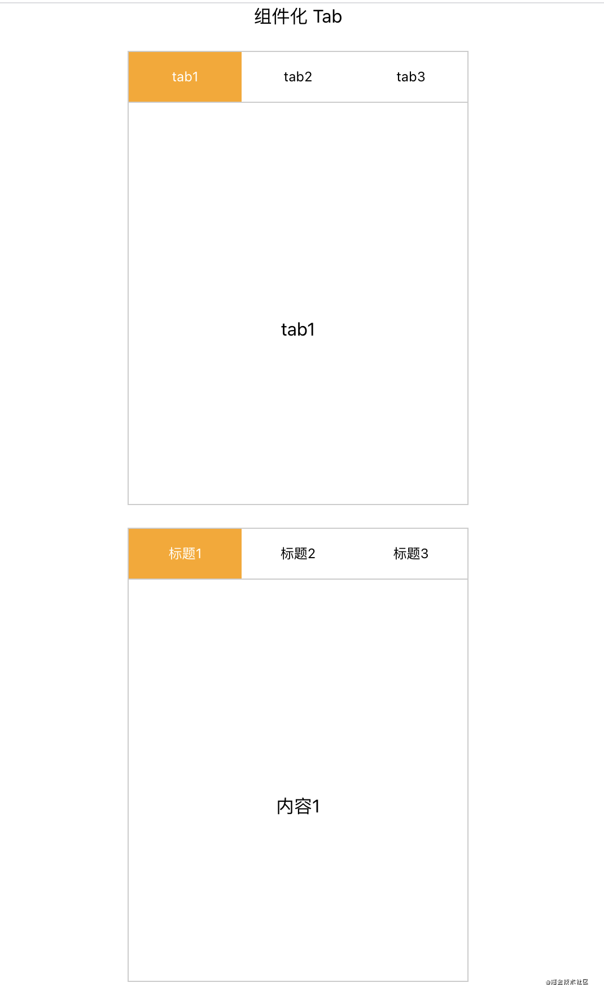
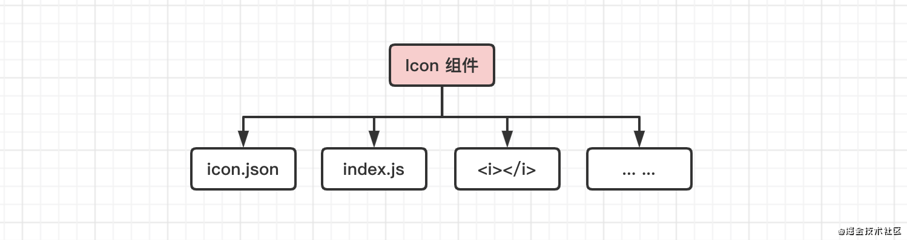

# 57-组件化



## 序

我会用一个大的章节来介绍组件化，主要目的在于分享组件化的开发思维，组件化由何而来，让大家对于组件化底层思维有一个了解，并且有自己的独立思考。为深入的掌握好组件化提供一个方向与思路。

这些底层思维，是进一步掌握好组件化实践「React/vue」的核心基础，如果没有这些思维打底，你可能对于框架，会长期仅仅停留在简单运用的层面，而无法真正的感知到组件化思维的巨大威力，开发出具备更强可维护性的代码。

因此，这个大的章节不会进一步分享如何深入掌握 React 等应用层面的知识，那需要至少一整本书才能说完，但会提供一个更为便利掌握它的底层基础，因此同样非常重要。大家明确好学习目的，做到有的放矢。

------

**组件化**是前端独有的开发思维。是在模块化的基础之上发展而来的更高效的开发手段。

得益于 webpack 的横空出世，组件化的思维有了落地实现的基础。

那么什么是组件化呢？

我们知道，一个按钮，通常有如下几部分共同组成

- DOM 结构  `<button class="btn"></button>`
- 按钮逻辑 `click` 等回调事件
- 按钮样式 `.btn {}`
- 可能还包括按钮前置图标
- 可能还包括背景色图片
- 可能有一些音效资源

...

这些资源共同构成了一个完整的按钮。



那么，我们在使用时，最简单的方式就应该把按钮当成一个独立个体引入一次，即可呈现完整的按钮

```javascript
import Button from './components/Button'
```

但是在模块化开发的结构中，我们做不到这样的便利，我们必须单独处理 html 标签，js 逻辑，css 样式。漏掉了一个，就无法呈现完整的按钮。

我们使用一个案例来体会一下模块化与组件化的区别。

首先使用 create react app 创建一个项目

```javascript
npx create-react-app tab --template typescript
```

项目地址：[点击这里查看示例代码](https://github.com/yangbo5207/jsCore/tree/master/7.1组件化/tab)

我们先使用**模块化**的方式来完成一个 Tab 组件。

首先置空 App.tsx 的内容。

> 默认创建的项目还有许多其他冗余的文件，我们不关注，就当他们不存在。

```javascript
import React from 'react';
import './App.css';

function App() {
  return (
    <div className="App">
    </div>
  );
}

export default App;
```

然后，在 html 中，新增片段

```html
<div id="tab-root">
  <div class="titles">
    <div class="item active" data-index="0">标题1</div>
    <div class="item" data-index="1">标题2</div>
    <div class="item" data-index="2">标题3</div>
  </div>
  <div class="contents">
    <div class="item active">内容1</div>
    <div class="item">内容2</div>
    <div class="item">内容3</div>
  </div>
</div>
```

在 `src/tab.css` 中，新增如下样式代码

```css
body {
  margin: 0;
}

html, body {
  height: 100%;
}

#tab-root {
  width: 300px;
  margin: 20px auto;
  border: 1px solid #CCC;
  height: 400px;
}

.titles {
  display: flex;
  height: 44px;
  border-bottom: 1px solid #CCC;
}

.titles .item {
  flex: 1;
  height: 100%;
  text-align: center;
  line-height: 44px;
  font-size: 12px;
}

.titles .item.active {
  background-color: orange;
  color: #FFF;
}

.contents {
  position: relative;
  height: 100%;
}

.contents .item {
  position: absolute;
  top: 0;
  left: 0;
  bottom: 0;
  right: 0;
  display: none;
  align-items: center;
  justify-content: center;
}

.contents .item.active {
  display: flex;
}
```

在 `src/tab.ts` 中新增如下逻辑代码

```typescript
const titles = document.querySelector<HTMLElement>('.titles');
const contents = document.querySelector('.contents');

if (!titles || !contents) {
  throw new Error('element not exist.')
}

let index = 0;

titles.onclick = (event) => {
  const activeTitle = event.target as HTMLElement;

  if (!activeTitle) {
    return;
  }

  const aindex = Number(activeTitle.dataset.index);

  if (aindex !== index) {
    titles.children[index].classList.remove('active');
    contents.children[index].classList.remove('active');

    activeTitle.classList.add('active');
    contents.children[aindex].classList.add('active');
    index = aindex;
  }
}
```

到这里，关于 tab 的功能都开发好了。

当我们使用时，直接在入口文件 `index.tsx` 中，引入如下资源就行。

```javascript
import './tab'
import './tab.css'
```

我们分析一下这样做的弊端。

在代码组织上，tab 组件相关的 html 片段，css 样式，以及 js 逻辑，我们并没有把他们当成一个整体来处理。分散到了不同的位置。因此在使用时，我们需要明确的知道 tab 组件的每一个组成部分，然后分别处理。

这会在使用上给我们带来很大的麻烦。

我们来尝试一下组件化的使用方式。

我们尝试基于 React 封装一个 `Tab` 组件。

创建目录 `src/Tabbar` 用于存放 Tab 组件的所有模块。

在该目录下新建 `index.css` 用于存放样式。

```css
/* src/Tabbar/index.css */
body {
  margin: 0;
}

html, body {
  height: 100%;
}

.tab_container {
  width: 300px;
  margin: 20px auto;
  border: 1px solid #CCC;
  height: 400px;
}

.titles {
  display: flex;
  height: 44px;
  border-bottom: 1px solid #CCC;
}

.titles .item {
  flex: 1;
  height: 100%;
  text-align: center;
  line-height: 44px;
  font-size: 12px;
}

.titles .item.active {
  background-color: orange;
  color: #FFF;
}

.contents {
  position: relative;
  height: 100%;
}

.contents .item {
  position: absolute;
  top: 0;
  left: 0;
  bottom: 0;
  right: 0;
  display: none;
  align-items: center;
  justify-content: center;
}

.contents .item.active {
  display: flex;
}
```

在该目录下新建 `index.tsx` 创建组件。

```tsx
// src/Tabbar/index.tsx
import React, { Component } from 'react';
import './style.css';

const defaultTabs = [{
  title: 'tab1',
  content: 'tab1'
}, {
  title: 'tab2',
  content: 'tab2'
}, {
  title: 'tab3',
  content: 'tab3'
}]

class Tab extends Component {
  state = {
    index: 0
  }

  static defaultProps = {
    tabs: defaultTabs
  }

  switchTab = (index) => {
    this.setState({
      index
    })
  }

  render() {
    const { tabs } = this.props;
    const { index } = this.state;

    return (
      <div className="tab_container">
        <div className="titles">
          {tabs.map((tab, m) => (
            <div 
              className={m === index ? 'item active' : 'item'} 
              key={m}
              onClick={() => this.switchTab(m)}
            >
              {tab.title}
            </div>
          ))}
        </div>

        <div className="contents">
          {tabs.map((tab, n) => (
            <div className={n === index ? 'item active' : 'item'} key={n}>{tab.content}</div>
          ))}
        </div>
      </div>
    );
  }
}

export default Tab;
```

封装之后，假如我们要在 `App.tsx` 中使用该组件，就只需要引入一次即可。而不用关心 Tabbar 组件的组成细节。

```tsx
// src/App.tsx
import React from 'react';
import './App.css';

+ import Tabbar from './Tabbar'

function App() {
  return (
    <div className="App">
+      <div>组件化 Tab</div>
+      <Tabbar />
    </div>
  );
}

export default App;
```



上为组件化案例，下为模块化案例

**组件化开发思维，是在模块化的基础之上，将所有的资源都当成模块来处理，不同的模块经过合理的合并，能够拼合成为一个完整的组件。**

因此，组件化是模块化的延伸。

一个**基础组件**，由多个模块组成。



一个组件，也可以当成一个模块来处理，参与合并成为别的组件。


组件也可以进行自由组合，合并成为新的组件。

最终整个项目，呈现出来的结果就是一棵组件树。

**组件化的手段，是通过组合来实现页面，但是，掌握组件化的核心，是要学会拆分。**

合理的组件拆分，能够让我们的开发效率得到极大的提高。因此在这个基础上，我们可以简单对组件进行一个简单的分类，以方便我们快速具备拆分组件的能力。

**一、基础组件**

通常由模块组成，或者由基础组件组成。基础组件是页面拆分的最小单位。例如 Icon 图标组件，Button 按钮组件，以及更多常见的 UI 组件。「可以参考 ant deisgn」

通常每个项目都需要单独封装一套基础组件，用于快速实现页面逻辑。或者有的项目在不需要单独设计 UI 的情况下，可以直接引入开源的基础组件。

**二、容器组件**

**容器**是组件化的重要概念。顾名思义，一个容器组件中，在使用时可以内置其他基础组件，用于组合成为更为复杂的组件。

**三、业务组件**

业务组件通常无法在不同的项目之间共享。因此业务组件往往需要单独根据实际需求进行封装。

业务组件有两种情况。

一种是容器组件与基础组件组合而成的复杂组件。该复杂组件在项目中多次使用。另外一种是具备异步逻辑的组件。

**四、页面组件**

页面组件是所有组件组合而成的最终页面。

一个完整的单页应用，是由多个页面组件组成。通过切换路由访问不同的页面。

组件拆分，要在实践中慢慢沉淀经验，做好组件拆分，定能在开发时事半功倍。