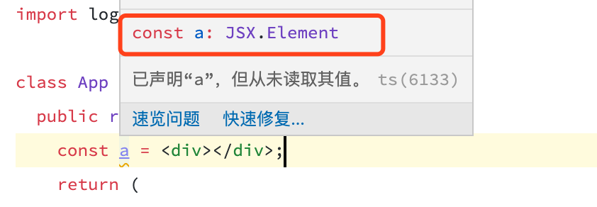
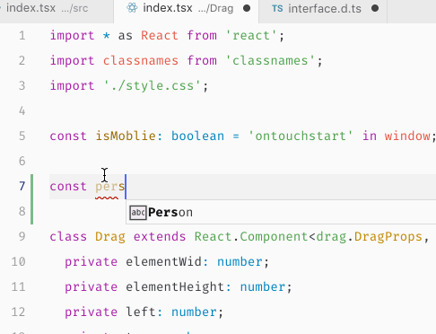
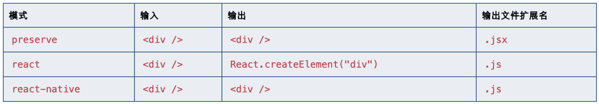

# 61-React 拖拽实践

## 1-方法

通过上一篇文章的学习，我们知道，TypeScript 其实是一套约束规则。

理解了这一点，就可以大概确定我们的学习方向。

- 是规则，那么知识点之间，就不会有太强的关联性。我们可以一条一条的逐步学习。也就意味着我们并不用急于把官方文档里所有的规则一次性学完。甚至可以把文档当成一个手册，在具体使用时再去查询。
- 是约束，也就意味着开发方式的改变与限制。ts 的开发会与通常情况下松散灵活的开发不太一样，这就必然会带来初期的不适应。约束带来的痛苦无法避免，我们要有这样一个心理预期。

最后抛开规则的学习，最重要的应该是什么？**毫无疑问，是实践**。这也是无法从官方文档获取到的重要讯息。

许多人只看官方文档，一脸懵逼！规则的学习好像不难，可运用到实践到底是什么样子？不知道。

所以，第一件事情，我们要抛开规则，来看一看，把 ts 用在实践里到底是什么样。这里以 react 中实现拖拽为例。

> 拖拽的原理与实现过程之前已经学习过，所以这里就把之前的代码直接拿过来调整一下

## 2-环境

一个简单的方式，是直接使用 `create-react-app` 创建一个已经支持 typescript 开发的项目。

```
npx create-react-app tsDemo --template typescript
```

当然，在不同的脚手架项目中支持 typescript 可能不太一样，因此这里就不做统一讲解，大家根据自己的需求在网上搜索方案即可。

除此之外，也可以 clone 我们的 [练习项目](https://github.com/daraluv/practice)。

> https://github.com/daraluv/practice

## 3-.d.ts

在 ts 的开发中，`.d.ts` 文件扮演着至关重要的作用。通常情况下，这样的文件，我们称之为声明文件。

那么声明文件是一个什么样的东西呢？

前一篇文章我们讲过，ts 的规则能够描述一个简单的变量，能够描述一个复杂的 JSON 数据，能够描述函数，也能够描述对象 class。可是大量的描述规则代码如果和实际功能代码糅合在一起，势必会导致整个代码冗余杂乱。因此在实践中，当声明内容很多时，通常会统一在一个文件中编写 ts 的描述规则，这个文件，就是以 `.d.ts`为后缀名的声明文件。

如果声明文件过多，那么就非常可能重名，为了避免相互干扰，typescript 又引入了作用域 `namespace` 概念。

因此，如果我们要利用 ts 实现拖拽组件，那么文件结构会如下展示：

```typescript
;+Drag - index.tsx - style.scss - interface.d.ts
```

其中 `interface.d.ts` 中会声明在开发过程中遇到的所有复杂数据结构。大概内容如下：

```typescript
declare namespace drag {
  ...
}
```

我们可以使用 `interface` 语法来约束一个 JSON 数据。



在创建一个需要符合这个约束规则的数据时，只需要直接使用命名空间 `drag` 即可。ts 会自动帮助我们识别而无需引入，或者 ts 会自动帮助我们引入(必要时)。



整个拖拽功能完整声明文件如下

```typescript
/** declare 为声明关键字，让外部组件能访问该命名空间*/
declare namespace drag {
  interface JSONDemo {
    name: string
    age: number
  }
  interface DragProps {
    width?: number
    height?: number
    left?: number
    top?: number
    zIndex?: number
    maxWidth?: number
    maxHeight?: number
    className?: string
    onDragEnd?: (target: DragEndParam) => any
    children?: any
  }

  interface DragState {
    left: number
    top: number
  }

  interface DragEndParam {
    X: number
    Y: number
  }

  type TouchEvent = React.TouchEvent & React.MouseEvent

  interface LiteralO {
    width: number
    height: number
    [key: string]: any
  }
}
```

> 本文的主要目的在于帮助大家了解实践中 ts 的运用，所以如果初学 ts，对一些语法不是很熟悉不用太过在意，具体的语法可以通过官方文档，或者后续文章中学习

通常情况下，每个「复杂」组件都会对应创建一个 `.d.ts` 的声明文件。

> 如果声明比较简单，我们可以不需要 .d.ts

## 4-React with TypeScript

我们可以使用 ES6 语法的 class 来创建 React 组件，所以如果熟悉 ES6 class 语法，则可以比较轻松的进一步学习 TypeScript 的 class 语法。在 React 中使用结合 TypeScript 是非常便利的。

首先，应该使用明确的访问控制符表明变量的有效范围

借鉴于其他编程语言的特性，一个类中的角色可能会包含

- `private` 声明的私有变量/方法
- `public` 声明的共有变量/方法
- `static`声明的静态变量/方法

也就是说，每声明一个变量或者方法，我们都应该明确指定它的角色。而不是直接使用`this.xxxx` 随意的给 class 新增变量。

然后，我们可以通过 TypeScript 的特性阅读 React 的声明(`.d.ts`)文件。以进一步了解 React 组件的使用。

React 的声明文件，详细的描述了 React 的每一个变量/方法的实现。通过阅读它的声明文件，我们可以进一步加深对 React 的理解。

最后，理解泛型

```typescript
class Component<P, S> {
  static contextType?: Context<any>

  context: any

  constructor(props: Readonly<P>)
  /**
   * @deprecated
   * @see https://reactjs.org/docs/legacy-context.html
   */
  constructor(props: P, context?: any)

  setState<K extends keyof S>(
    state:
      | ((prevState: Readonly<S>, props: Readonly<P>) => Pick<S, K> | S | null)
      | (Pick<S, K> | S | null),
    callback?: () => void,
  ): void

  forceUpdate(callBack?: () => void): void
  render(): ReactNode

  readonly props: Readonly<{ children?: ReactNode }> & Readonly<P>
  state: Readonly<S>
  /**
   * @deprecated
   * https://reactjs.org/docs/refs-and-the-dom.html#legacy-api-string-refs
   */
  refs: {
    [key: string]: ReactInstance
  }
}
```

这是在 React 的声明文件中，对于 `React.Component` 的描述。我们可以看到一些常用的 `state, setState, render` 等都有对应的描述。关键的地方是声明文件中有许多用到泛型的地方可能大家理解起来会比较困难。

```typescript
class Component<P, S>
```

这里的`<P, S>`就是传入的泛型约束变量。

从构造函数 `constructor(props: P, context?: any);` 的约束中，我们可以得知，P 其实就是 react 组件中 props 的约束条件。

其中对于 state 的约束 `state: Readonly<S>;` 也可以看到，S 是对 State 的约束。

> 暂时对泛型不理解也没关系，后续我们再进一步学习

基于上面几点理解，我们就可以实现 Drag 组件了。如下。代码仅仅只是阅读可能难以理解，一定要动手试试看！

```typescript
// index.tsx

import * as React from 'react'
import classnames from 'classnames'
import './style.css'

const isMoblie: boolean = 'ontouchstart' in window // 是否为移动端

class Drag extends React.Component<drag.DragProps, drag.DragState> {
  private elementWid: number
  private elementHeight: number
  private left: number
  private top: number
  private zIndex: number
  private clientWidth: number
  private clientHeight: number

  private clientX: number
  private clientY: number

  private startX: number
  private startY: number

  private disX: number
  private disY: number

  private _dragStart: () => any
  private _dragMove: () => any
  private _dragEnd: () => any

  constructor(props: drag.DragProps) {
    super(props)
    this.elementWid = props.width || 100
    this.elementHeight = props.height || 100
    this.left = props.left || 0
    this.top = props.top || 0
    this.zIndex = props.zIndex || 0
    this.clientWidth = props.maxWidth || 600
    this.clientHeight = props.maxHeight || 600
    this._dragStart = this.dragStart.bind(this)

    this.state = {
      left: this.left,
      top: this.top,
    }
  }

  public dragStart(ev: React.TouchEvent & React.MouseEvent): void {
    const target = ev.target
    if (isMoblie && ev.changedTouches) {
      this.startX = ev.changedTouches[0].pageX
      this.startY = ev.changedTouches[0].pageY
    } else {
      this.startX = ev.clientX
      this.startY = ev.clientY
    }
    // @ts-ignore 偏移位置 = 鼠标的初始值 - 元素的offset
    this.disX = this.startX - target.offsetLeft

    // @ts-ignore
    this.disY = this.startY - target.offsetTop

    this.zIndex += 1

    this._dragMove = this.dragMove.bind(this)
    this._dragEnd = this.dragEnd.bind(this)

    if (!isMoblie) {
      document.addEventListener('mousemove', this._dragMove, false)
      document.addEventListener('mouseup', this._dragEnd, false)
    }
  }

  public dragMove(ev: drag.TouchEvent): void {
    if (isMoblie && ev.changedTouches) {
      this.clientX = ev.changedTouches[0].pageX
      this.clientY = ev.changedTouches[0].pageY
    } else {
      this.clientX = ev.clientX
      this.clientY = ev.clientY
    }

    // 元素位置 = 现在鼠标位置 - 元素的偏移值
    let left = this.clientX - this.disX
    let top = this.clientY - this.disY

    if (left < 0) {
      left = 0
    }

    if (top < 0) {
      top = 0
    }

    if (left > this.clientWidth - this.elementWid) {
      left = this.clientWidth - this.elementWid
    }

    if (top > this.clientHeight - this.elementHeight) {
      top = this.clientHeight - this.elementHeight
    }

    this.setState({ left, top })
  }

  public dragEnd(ev: drag.TouchEvent): void {
    const { onDragEnd } = this.props
    document.removeEventListener('mousemove', this._dragMove)
    document.removeEventListener('mouseup', this._dragEnd)

    if (onDragEnd) {
      onDragEnd({
        X: this.startX - this.clientX,
        Y: this.startY - this.clientY,
      })
    }
  }

  public render() {
    const { className, width = 100, height = 100, zIndex } = this.props
    const { left = 0, top = 0 } = this.state

    const styles: drag.LiteralO = {
      width,
      height,
      left,
      top,
    }

    if (zIndex) {
      styles['zIndex'] = this.zIndex
    }

    /**
     * dragbox 为拖拽默认样式
     * className 表示可以从外部传入class修改样式
     */
    const cls = classnames('dragbox', className)

    return (
      <div
        className={cls}
        onTouchStart={this._dragStart}
        onTouchMove={this._dragMove}
        onTouchEnd={this._dragEnd}
        onMouseDown={this._dragStart}
        onMouseUp={this._dragEnd}
        style={styles}
      >
        {this.props.children}
      </div>
    )
  }
}

export default Drag

// /**
//  * 索引类型
//  * 表示key值不确定，但是可以约束key的类型，与value的类型
//  */
// interface LiteralO {
//   [key: number]: string
// }

// const enx: LiteralO = {
//   1: 'number',
//   2: 'axios',
//   3: 'http',
//   4: 'zindex'
// }

// /**
//  * 映射类型用另外一种方式约束JSON的key值
//  */
// type keys = 1 | 2 | 3 | 4 | 5;
// type Mapx = {
//   [key in keys]: string
// }

// const enx2: Mapx = {
//   1: 'number',
//   2: 'axios',
//   3: 'http',
//   4: 'zindex',
//   5: 'other'
// }

// interface Person {
//   name: string,
//   age: number
// }
// type Mapo = {
//   [P in keyof Person]: string
// }

// const enx3: Mapo = {
//   name: 'alex',
//   age: '20'
// }
```

你会发现，React 与 ts 的结合使用，并没有特别。我们只需要把 React 组件，看成一个 class，他和其他的 calss，并没有什么特别的不同了。

函数式组件同理。

## 5-JSX

普通的 ts 文件，以 `.ts` 作为后缀名。

而包含 JSX 的文件，则以 `.tsx` 作为后缀名。这些文件通常也被认为是 React 组件。

若要支持 jsx，我们需要在 tsconfig.js 中，配置 jsx 的模式。一般都会默认支持。

ts 支持三种 jsx 模式，`preserve, react, react-native`。这些模式只在代码生成阶段起作用 - 类型检查并不受影响。

这句话怎么理解呢？也就意味着，typescript 在代码生成阶段，会根据我们配置的模式，对代码进行一次编译。例如，我们配置 `jsx: preserve`，根据下面的图，.tsx 文件会 被编译成 .jsx 文件。而这个阶段是在代码生成阶段，因此，生成的 .jsx 还可以被后续的代码转换操作。例如再使用 babel 进行编译。



**类型检查**

> 这部分内容可能会难理解一点，大家不必强求现在就掌握，以后再说也 OK

我们在实际使用过程中，经常会遇到组件类型兼容性的错误，甚至也看不太明白报错信息在说什么。这大概率是对 JSX 的属性类型理解不到位导致。

理解 JSX 的类型检测之前，我们需要理清楚两个概念。

「**固有元素**」

通常情况下，固有元素是指 html 中的已经存在元素。例如 div。


固有元素使用特殊的接口 JSX.IntrinsicElements 来查找。我们也可以利用这个接口，来定义自己的固有元素「但是没必要」。

```typescript
// 官网demo
declare namespace JSX {
  interface IntrinsicElements {
    foo: any
  }
}

;<foo /> // 正确
;<bar /> // 错误
```

> 固有元素都以小写开头。

我们可以通过以下方式，给固有元素定义属性。

```typescript
declare namespace JSX {
  interface IntrinsicElements {
    foo: { bar?: boolean }
  }
}

// `foo`的元素属性类型为`{bar?: boolean}`
;<foo bar />
```

「**基于值的元素**」

也就是 React 中常常提到的自定义元素。规定必须以大写字母开头。基于值的元素会简单的在它所在的作用域里按标识符查找。

```typescript
// demo来自官方
import MyComponent from './myComponent'
;<MyComponent /> // 当前作用域找得到，正确
;<SomeOtherComponent /> // 找不到，错误
```

React 自定义组件有两种方式

- class 类组件
- function 函数组件

由于这两种基于值的元素在 JSX 表达式里无法区分，因此 TypeScript 首先会尝试将表达式做为函数组件进行解析。如果解析成功，那么 TypeScript 就完成了表达式到其声明的解析操作。如果按照函数组件解析失败，那么 TypeScript 会继续尝试以类组件的形式进行解析。如果依旧失败，那么将输出一个错误。

「**函数组件**」

正如其名，组件被定义成 JavaScript 函数，它的第一个参数是 props 对象。 TypeScript 会强制它的「函数执行的」返回值可以赋值给 JSX.Element。

```typescript
// demo来自官方文档
interface FooProp {
    name: string;
    X: number;
    Y: number;
}

declare function AnotherComponent(prop: {name: string});
function ComponentFoo(prop: FooProp) {
    return <AnotherComponent name={prop.name} />;
}

const Button = (prop: {value: string}, context: { color: string }) => <button>
```

「**类组件**」

当一个组件由 class 创建而成「例如我们刚才实践的 Drag 组件」，那么当我们在使用该组件「即生成实例对象」时，则该实例类型必须赋值给 JSX.ElementClass 或抛出一个错误。

```typescript
// demo来自官方文档
declare namespace JSX {
  interface ElementClass {
    render: any
  }
}

class MyComponent {
  render() {}
}

function MyFactoryFunction() {
  return { render: () => {} }
}

;<MyComponent /> // 正确
;<MyFactoryFunction /> // 正确
```

函数组件的 props 直接作为参数传入，而类组件的 props，则取决于 JSX.ElementAttributesProperty。

```typescript
// 案例来自官方文档
declare namespace JSX {
  interface ElementAttributesProperty {
    props // 指定用来使用的属性名
  }
}

class MyComponent {
  // 在元素实例类型上指定属性
  props: {
    foo?: string
  }
}

// `MyComponent`的元素属性类型为`{foo?: string}`
;<MyComponent foo='bar' />
```

> 如果未指定 JSX.ElementAttributesProperty，那么将使用类元素构造函数或 SFC 调用的第一个参数的类型。因此，如果我们在定义类组件时，应该将 props 对应的泛型类型传入，以确保 JSX 的正确解析。

「**子孙类型检查**」

从 TypeScript 2.3 开始，ts 引入了 children 类型检查。children 是元素属性「attribute」类型的一个特殊属性「property」，子 JSXExpression 将会被插入到属性里。 与使用 JSX.ElementAttributesProperty 来决定 props 名类似，我们可以利用 JSX.ElementChildrenAttribute 来决定 children 名。 JSX.ElementChildrenAttribute 应该被声明在单一的属性里。

简单来说，我们可以在 `this.props` 的智能提示中，得到 children 的索引。

```typescript
declare namespace JSX {
  interface ElementChildrenAttribute {
    children: {} // specify children name to use
  }
}
```

「**JSX 表达式结果类型**」

默认地 JSX 表达式结果的类型为 any。 我们可以自定义这个类型，通过指定 JSX.Element 接口。 然而，不能够从接口里检索元素、属性或 JSX 的子元素的类型信息。 它是一个黑盒。


