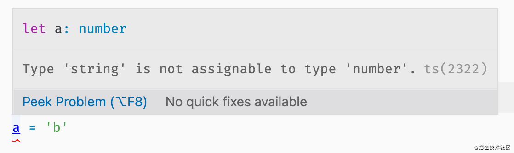
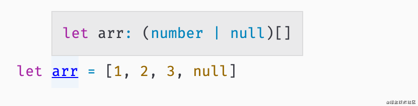
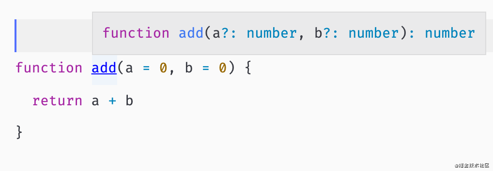
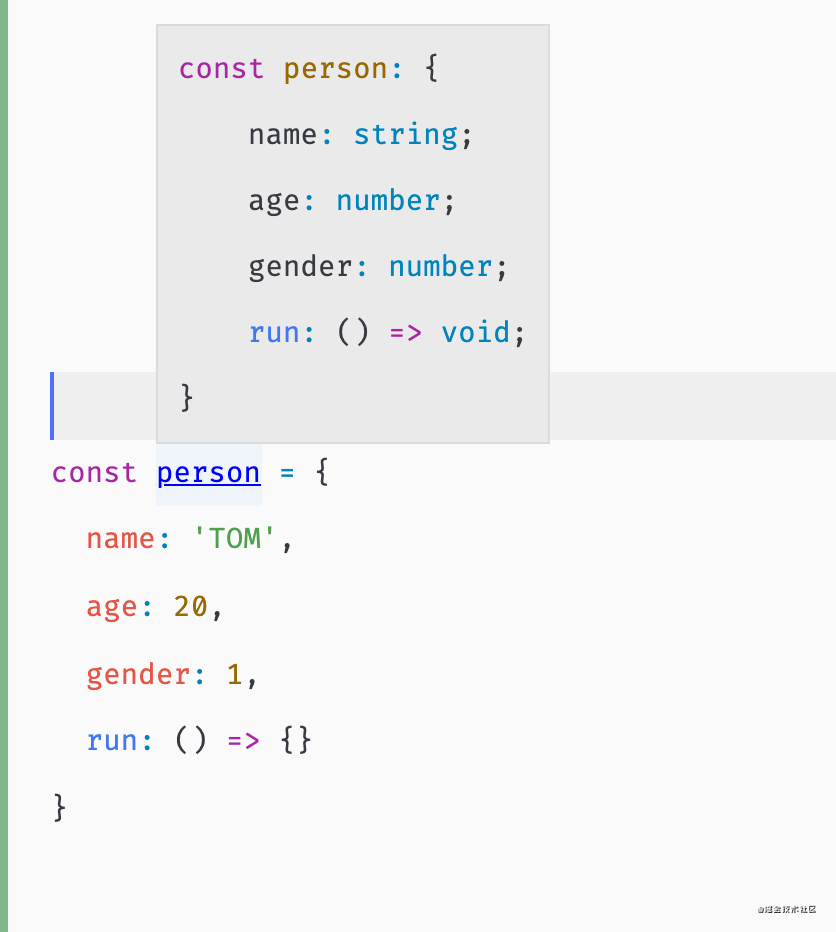
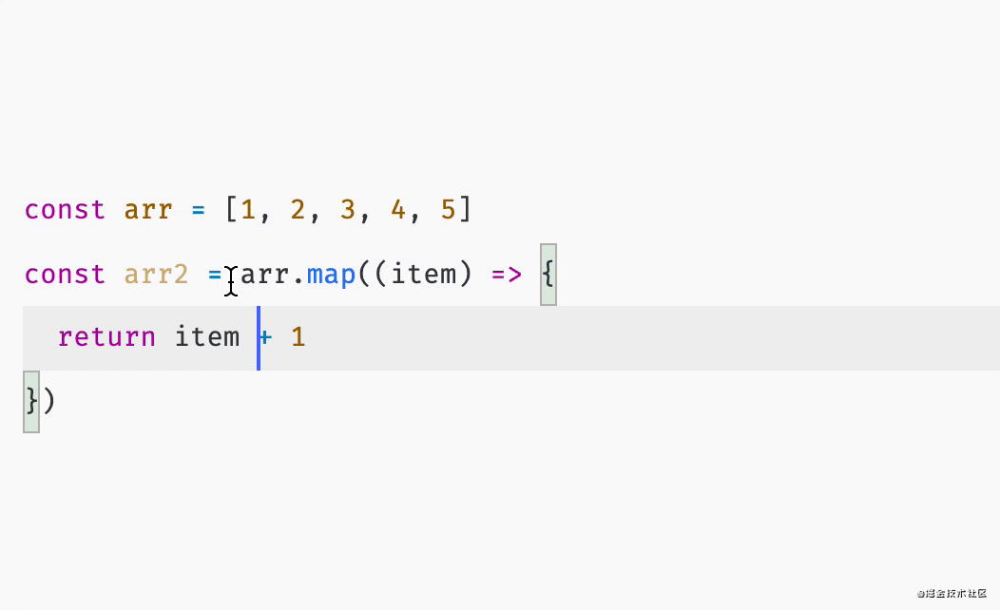
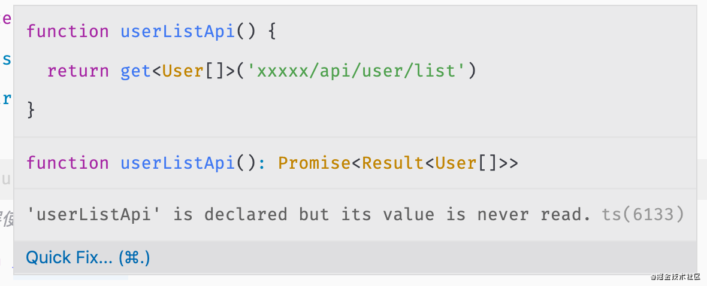

# 63-类型推导是核心

学会了规则，表示你能使用 TypeScript。理解了**类型推导**，你才能成为 TypeScript 高手。

当我想要声明一个变量为 number 类型时，常规的语法是这样的

```
let a: number = 20
```

我会明确指定变量 `a` 的类型。

但是如果我们理解了类型推导，就知道，这样的做法看上去就不太专业。

数字 `20` 在类型推导的机制下，会被判定为一个 `number` 类型，因此当我们将 `20` 赋值给变量 a 时，a 的类型也就确定下来了，就是 `number`

因此，在 ts 中，一个更专业的写法，就是

```
let a = 20
```

当我们试图将别的类型赋值给 a 时，同样会抛出错误提示



我们可以继续观察几个被推导出来之后的结果

```
let arr = [1, 2, 3, null]
```



函数也可以被推导

```
function add(a = 0, b = 0) {
  return a + b
}
```



复杂数据类型也可以

```
const person = {
  name: 'TOM',
  age: 20,
  gender: 1,
  run: () => {}
}
```



再看看我们熟悉的 map 方法。

```
const arr = [1, 2, 3, 4, 5]
const arr2 = arr.map((item) => {
  return item + 1
})
```

当我们如此使用之后，会发现毫无 ts 痕迹。可是，该有的类型全都推导出来了。



数组的 map 方法能够做到这样的推导，得益于底层的 ts 声明。

```
interface Array<T> {
  map<U>(callbackfn: (value: T, index: number, array: T[]) => U): U[]
}
```

从声明中我们看出，callback 的第一个参数为泛型 T，即原数组的每一项的类型。而最后的返回结果 arr2 ，也是得益于泛型 U 的声明。

体会一下。

我们自己也可以做一些底层封装，让上层应用时变得更加简洁。

例如一个请求结果的封装

```
// 底层声明
interface Result<T> {
  code: number,
  data: T,
  success: boolean
}

// 底层封装
function get<T>(url: string) {
  return new Promise<Result<T>>((resolve, reject) => {

  })
}
```

一个返回 Promise 对象的 get 方法，此处唯一不能推导的就是 T，因此我们只需要在应用层，明确泛型变量 T 的类型即可，其他的全都通过推导搞定。

```
interface User {
  name: string,
  id: string
}

// 应用层使用
function userListApi() {
  return get<User[]>('xxxxx/api/user/list')
}
```

此时我们观察 `useListApi` 的类型结果，已经被完整的推导出来了。



类型推导还需要在实践中慢慢体会，运用了好，你们的 ts 会变得更加简洁。