# 03-前端性能优化常见的四种方法

## 01：加载优化

- 什么是首屏时间

  - 浏览器显示第一屏页面所消耗的时间

- 为什么要优化首屏时间

  - 过长的等待时间，会让用户变得烦躁，更容易跳出或者关闭这个网站

- 怎么样优化首屏时间？

  - 针对**不是首屏的资源进行懒加载**

- 为什么一般都进行懒加载？

  - **资源文件较大**，加载完**既耗时又费力**，用户也不一定会浏览到全部页面内容

### 懒加载实践 - getBoundingClientRect()

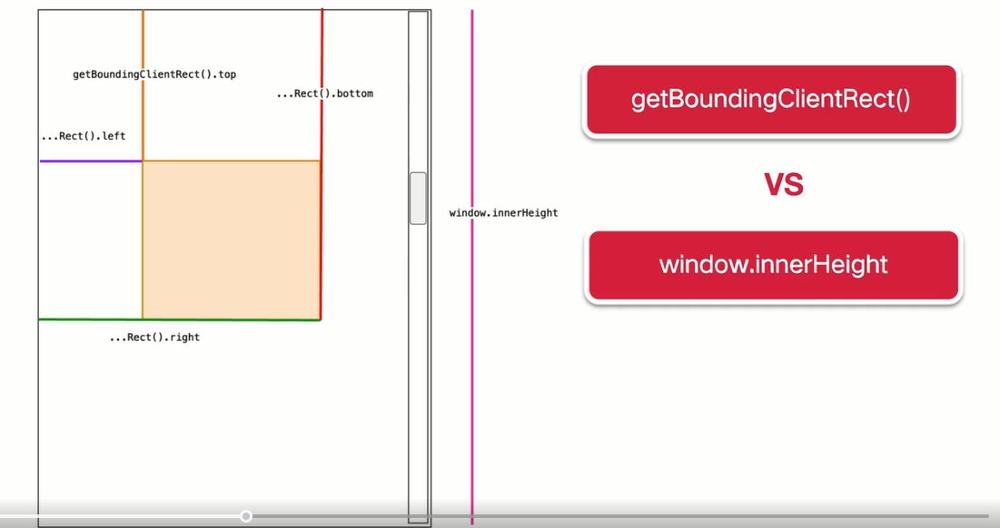

```javascript
document.addEventListener('DOMContentLoaded', function () {
  // 获取所有的需要懒加载的图片
  let lazyImages = [].slice.call(document.querySelectorAll('img.img-lazy'))
  // 限制频繁调用
  let active = false
  window.addEventListener('scroll', lazyLoad)
  function lazyLoad() {
    if (active === false) {
      active = true
      setTimeout(() => {
        lazyImages.forEach(function (lazyImage) {
          if (
            lazyImage.getBoundingClientRect().top <= window.innerHeight &&
            lazyImage.getBoundingClientRect().bottom >= 0
          ) {
            lazyImage.src = lazyImage.dataset.src
            lazyImage.classList.remove('img-lazy')
            lazyImages = lazyImage.filter((image) => image !== lazyImage)
          }
          // 判断所有图片加载完毕，移除事件
          if (lazyImages.length === 0) {
            window.removeEventListener('scroll', lazyLoad)
          }
        })
        active = false
      }, 200)
    }
  }
})
```

有没有更方便的方案呢？

### 懒加载实现 - Intersection Observer

> intersection Observer 现在除了 IE 以及低版本的安卓浏览器，基本上兼容大部分浏览器

```javascript
document.addEventListener('DOMContentLoaded', function () {
  // 获取所有的需要懒加载的图片
  let lazyImages = [].slice.call(document.querySelectorAll('img.img-lazy'))
  if (
    'IntersectionObserver' in window &&
    'IntersectionObserverEntry' in window &&
    'IntersectionRatio' in window.IntersectionObserverEntry.prototype
  ) {
    let lazyImageObserver = new IntersectionObserver(function (
      entries,
      observer,
    ) {
      entries.forEach((entry) => {
        if (entry.isIntersecting) {
          let lazyImage = entry.target
          lazyImage.src = lazyImage.dataset.src
          lazyImage.classList.remove('img-lazy')
          lazyImageObserver.unobserve(lazyImage)
        }
      })
    })
    lazyImages.forEach((lazyImage) => {
      lazyImageObserver.observe(lazyImage)
    })
  }
})
```

**实践：首选 Intersection Observer + 兼容性处理（选用 getBoundingClientRect）**

## 02：构建优化

- 构建优化为什么可以提高性能？
- 构建优化主要设计到 2 点：
  - **资源压缩**--体积变小所传输的时间响应就会变少
  - **资源合并**--将请求的多条资源合兵成少量的请求，从而较少 http 请求数量

### 构建优化 -- 资源压缩

如果能够让打包之后的构建结果体积减小，所带来的收益是显而易见的

- 代码压缩：使用更加**简洁的**代码表示 **同一套逻辑**

### 压缩原理

- 压缩工具是如何实现这两个功能的？

  - 将字符串形式的代码转换成 AST 语法树

  - 遍历 AST 语法树对其内容按照上述的规则进行逻辑处理

  - 生成简洁的 AST 树转换成 简洁的代码

### 压缩 JS - 基于 webpack5

- javascript 压缩

  - 基于 ES6 推出了 tree-shaking => 根据 import、export 的模块导入导出语法，确定是否删除代码

  - 配置 mode = production => 自动压缩

  - ES5 => UglifyJS -> uglifyjs-webpack-plugin

  - ES6 => Terser -> terser-webpack-plugin

- tips: 因为压缩又是打包最耗时的一个步骤，所以 terser-webpack-plugin 默认会开启的多线程压缩来加速我们的构建压缩速度

### 压缩 CSS

- 压缩 css 之前需要导出到独立的 css 文件，使用插件  mini-css-extract-plugin

- 为什么不直接使用 style-loader 嵌入到 html 里面

  - html、css 资源是无法并行加载的，从而降低了页面的性能
  - 会导致资源缓存粒度的变大，html、css 任意内容的变化，都会导致缓存的失效

- 先后使用的插件

  - mini-css-extract-plugin 将 css 代码抽离为单独的 CSS 文件
  - 命中 css-minimizer-webpack-plugin 默认的逻辑，进行压缩 CSS

  ```javascript
  const CssMinimizerPlugin = require('css-minimizer-webpack-plugin')
  const MiniCssExtractPlugin = require('mini-css-extract-plugin')
  module.exports = {
    optimization: {
      minimize: true,
      minimizer: [
        // webpack 5 之后，约定使用 ... 字面量保持默认 minimizer 配置
        '...',
        new CssMinimizerPlugin(),
      ],
    },
    plugins: [new MiniCssExtractPlugin()],
  }
  ```

### 压缩 CSS 效果

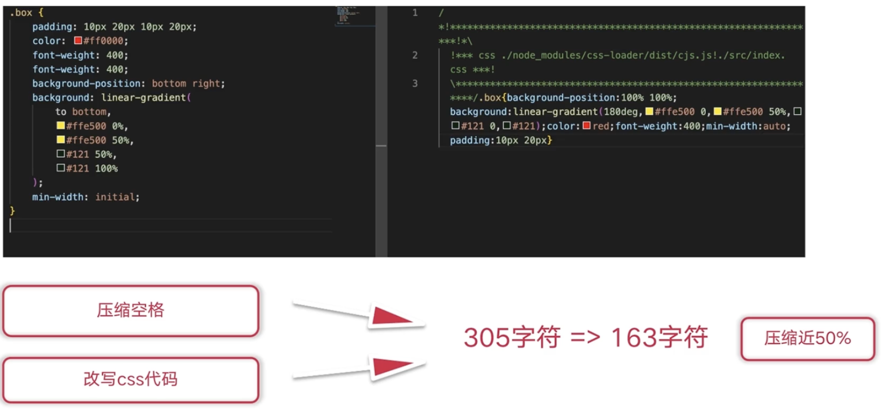

### 构建优化--资源合并

- 是否把**所有的 JS 资源都合并到一个 JS 文件**中比较好？这样只需要发送一个请求

  - 会造成页面的初始代码过大，增加首屏加载时间

  - 无法有效的利用浏览器的缓存，如果更改某块的逻辑，会造成整个文件的变动

  - 经过 http 的升级, 只需要进行一次 tcp 链接，是可以做到多路请求的复用以及独立

### 生产环境中---实践原则

- 针对 node_modules 资源：

  - 对 `node_modules` 模块打包成单独的文件

  - 配置 `maxSize` 设定阈值，防止 vendor 包体积过大

- 针对业务代码

  - 设置 `common` 分组，通过 `miniÇhunks` 配置项将使用率较高的资源合并为 Comon 资源

  - 对于可以懒加载的资源，可以通过异步方式引入

### 可视化分析打包结果

- webpack analysis

- statoscope

- webpack visualizer

- webpack bundle analyzer(**推荐**)

- webpack dashboard

### 可视化结果

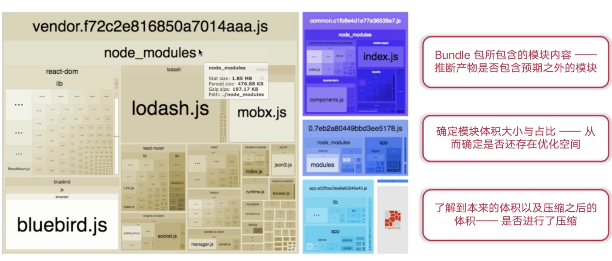

## 03： 渲染优化

- 渲染优化关注点

  > 浏览器获取到资源之后进行渲染部分的相关性能优化

  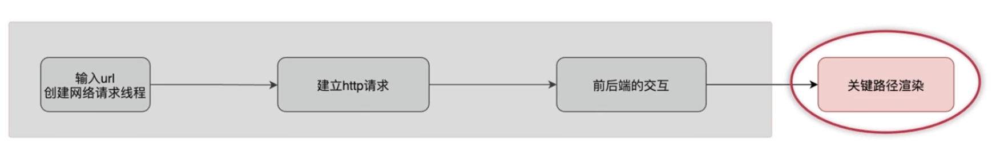

### 浏览器渲染进程”黑盒“

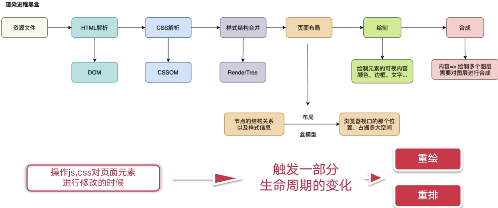

### 重排

- 因为 DOM 节点之间会相互关联，如果修改其中某一个 DOM 节点的几何属性，其他元素的几何属性以及位置同样会受到相关的影响，这样就会发生重排。

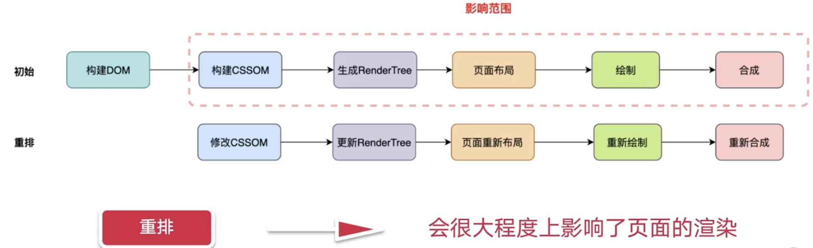

### 重绘

- 当我们对 DOM 的修改导致了样式的变化，类似于 颜色、背景色、字体这些，这样的改变，浏览器就不需要重新计算元素的几何属性，也就少了重新布局这一步骤了。

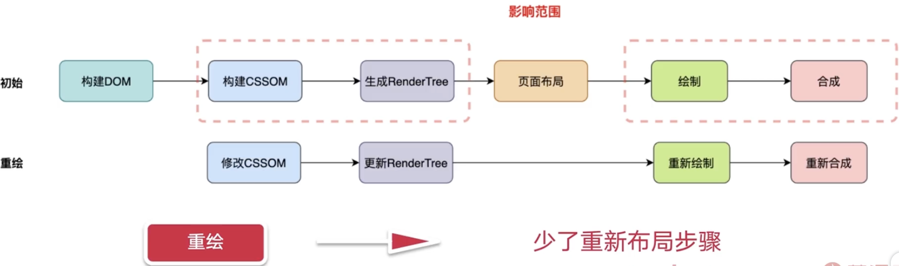

### 渲染性能 -- 减少重排的操作

- 很简单，相比较重绘，**重排更加消耗性能**，我们需要减少重排的操作

  - DOM 元素几何属性的修改，例如：width、height、padding、margin、left、top 等

  - 修改 DOM 树的结构，例如 增加、删除、移动 DOM 节点

  - 获取特定的属性值，例如 offsetTop、scrollTop、clientWidth、clientHeight 等

### 渲染性能 -- 避免样式频繁修改

- 三次布局

  ```javascript
  const box = document.querySelector('#box')
  box.style.width = '100px'
  box.style.height = '100px'
  box.style.border = '2px solid blue'
  ```

- 一次布局

  ```html
  <style>
    .my-box {
      width: 100px;
      height: 100px;
      border: 2px solid blue;
    }
  </style>
  <script>
    const box = document.querySelector('#box')
    box.classList.add('my-box')
  </script>
  ```

### 验证重绘

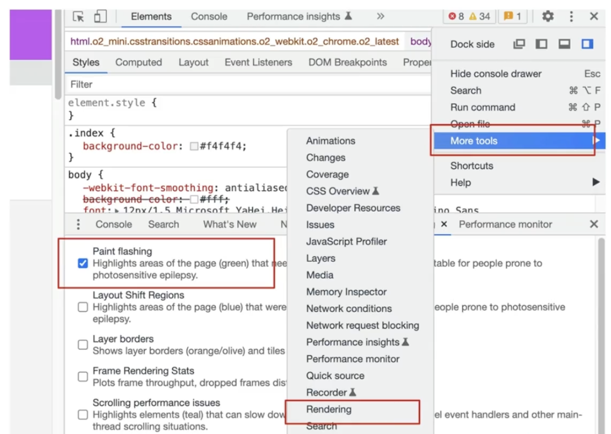


### 渲染性能 – 动画优化

- 举个例子：让一个 div 匀速往右移动 400px

#### css 实现

```css
.box:hover {
  left: 400px;
  transition: 4s linear 0s;
}
/* 使用 animation */
.myBox {
  animation: go 4s linear;
}
@keyframs go {
  from {
    transform: translateX(0px);
  }
  to {
    transform: translateX(400px);
  }
}
```

#### 定时器实现

```javascript
const box = document.querySelector('.box')
let distance = 0
const animation = setInterval(() => {
  distance += 1
  box.style.left = distance + 'px'
  if (box.style.left === '400px') {
    clearInterval(animation)
  }
}, 16.6)
```

#### 动画性能

- 一般动画为什么会设置 16.6 ms
  - 屏幕的刷新频率为 60 Hz, 也就是 1s 内刷新的帧数，**通过换算 1000ms/ 60 = 16.6ms**, 也就是 16.6 ms 刷新一次（但是有些显示器的刷新频率并不是 60Hz,如果一样使用 16.6ms，就会造成一定的失帧现象）
- 定时器做动画还会有哪些问题？？
  - 可能会造成动画的卡帧
- 引入 window 的 `requestAnimationFrame` 方案

### 节流 & 防抖

- 滚动 `scroll` 事件
- 缩放 `resize` 事件
- 键盘 `keyup` 事件
- 键盘 `keydown` 事件
- 鼠标 `mousemove` 事件
- 鼠标 `mouseover` 事件

> 以上事件如果频繁触发，都会造成页面的抖动/卡顿

本质：**两者并不会减少事件的触发，而是减少事件触发时回调函数的执行次数**

#### 节流

> 顾名思义：就是将短时间的函数调用以一个固定的频率间隔执行

例如

- 资源懒加载 => 监听页面的滚动事件，滚动到一定位置，图片或者其他资源进行加载

```javascript
// 节流
const throttle = (func, wait) => {
  let timeout
  return function () {
    const context = this
    const args = arguments
    if (!timeout) {
      timeout = setTimeout(function () {
        func.apply(context, args)
        timeout = null
      }, wait)
    }
  }
}
```

#### 防抖

> 抖动现象本质就是指短时间内高频词触发。因此，我们可以把短时间内的多个连续调用合并成一次，也就是只触发一次回调函数

防抖场景之一：输入框模糊搜索，监听键盘的 keydown 事件

```javascript
// 防抖
const debounce = (func, wait) => {
  let timeout
  return function () {
    const context = this
    const args = arguments
    timeout && clearTimeout(timeout)
    timeout = setTimeout(function () {
      timeout = null
      func.apply(context, args)
    })
  }
}

// 采用了防抖
window.addEventListener(
  'scroll',
  debounce(() => {
    console.log('scroll')
  }, 500),
)
```

### web Worker

* JS 单线程背景
  * js 是单线程执行的，所有的任务都放到同一个线程来执行
* 为什么 js 是**单线程**呢 ？
  * js的存在当初就是为了操作 DOM 相关，这就决定了 JS 只能是单线程。**否则就会出现很多负责的问题**
  * 假如是多线程，一个线程里删除了 DOM，一个线程里增加了 DOM，那该以哪个为准呢？就会比较复杂
* 针对现在多核 CPU 的能力，H5 新增了多线程 Web Worker 标准
  * 允许JavaScript脚本创建多个线程，但是**子线程完全受主线程控制，且不得操作DOM**
  * 所以，这个新标准并没有改变JavaScript单线程的本质。 Web Worker 的作用，就是为 JavaScript 创造多线程环境，允许主 线程创建 Worker 线程，将一些任务分配给后者运行。

#### 主进程代码

```javascript
// main.js
// 创建子线程
var worker = new Worker('worker.js');
// 向子线程发送消息
const data = { } // 传给子线程的数据
worker.postMessage(data)
worker.addEventListener('message', event => {
  const workData = event.data
  ...
})
```

#### workder 进程代码

```javascript
// worker.js
self.onmessage = e => {
  let mainData = e.data
  let postMainDate
  self.postMessage(postMainData)
  /*
		 子线程一旦创建成功机会始终执行，不会被主线程上的事件所打断，这意味着 workder 会比较耗费资源，所以不应当过度使用，一旦任务执行完毕就应该及时关闭。  
  */
  
  self.close()
}
```

#### 应用场景

* **大量计算**以及**同时渲染 DOM 时候**（例如：大文件上传之前需要计算 hash 值）

## 04：缓存优化

* http 缓存优化关注点
  * 缓存优化主要是**针对重复请求的处理**，是对已经获取资源的重用，提升网站性能和用户体验

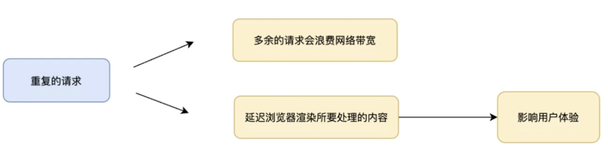

### 浏览器缓存

* 浏览器缓存 — 强缓存
  * 在再次请求的时候进行 缓存字段的检查，如果没有过期，直接从**浏览器本地缓存**中返回资源
* 浏览器缓存 — 协商缓存
  * 在浏览器使用本地的缓存之前，向服务器发送请求，判断一下**本地的缓存是否过期**

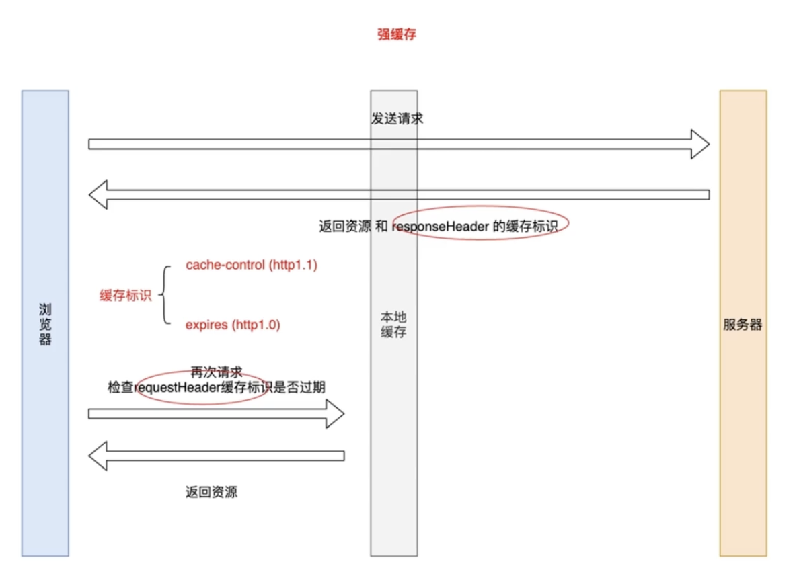

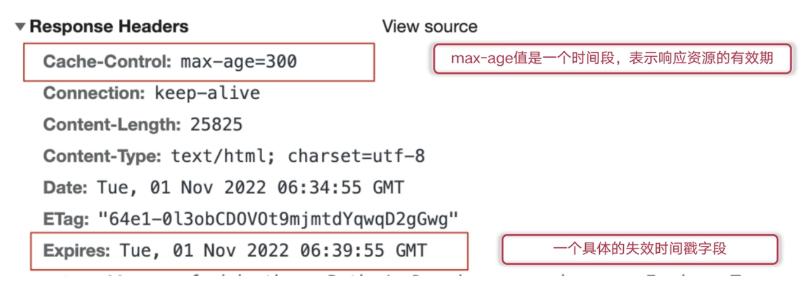

### 强缓存

* 为什么 http1.1 改变了 http1.0 的过期时间方式了？
  * http1.0 对**本地时间戳过分依赖**
  * http1.1 采用的时间段可以有效的避免**客户端和服务端时间戳不同步**的问题
* 既然 Cache-control 能够作为 expries 的完全替代方案。为什么在实践中一般**都带上这两个字段**？
  * 考虑项目的可用性问题 ——— 需要在项目的**可用性方面的进行向下兼容**
  * 如果 cache-control 与 expires 同时存在的话，cache-control 的优先级高于 expires

### 协商缓存

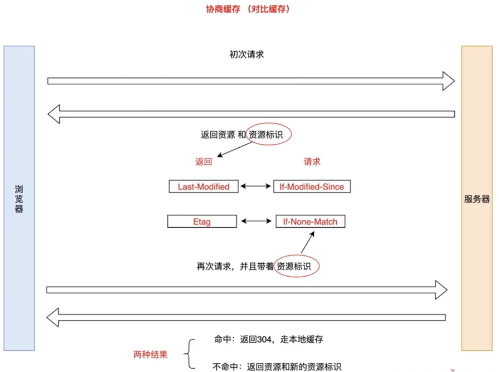

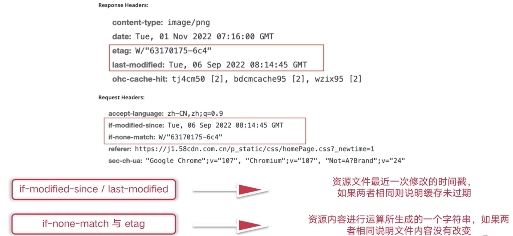

* 为什么已经有了 `last-modified` 的协商缓存策略，`http1.1` 还需要新增一个 `ETag` 方案？	
  * 考虑以下情况：
    * 一些文件也许会周期性的更改,但是他的内容并不改变(仅仅改变的修改时间),这个时候,我们并不希望客户端认为这个文件被修改了,而重新 get
    * 某些文件修改非常频繁,比如在秒以下的时间内进行修改(比方说 1s 内修改了 N 次), `If-Modified-Since` 能检查到的粒度时 s 级的,这种修改无法判断(或者说 UNIX 记录 MTIME只能精确到秒)
    * 某些服务器不能精确得到的文件的最后修改时间
  * `Last-Modified` 与 `ETag` 可以一起使用，**服务器会优先验证 ETag**， 一致的情况下才会比对 `Last-Modifed`
  * [为什么Etag比last-modified优先级更高？](https://blog.csdn.net/weixin_43912756/article/details/108481083)
* 为什么大厂**不常用 eTag** 进行协商缓存呢？
  * 因为他是根据文件内容进行运算所生成的一个字符串，小文件计算倒还算好，如果是大文件计算还是很损耗性能的
  * 对于大厂来说，请求量都会很大，因此我们使用负载均衡的方式来调度一个 http 请求。对于同一个用户的、同一个客户端、同一个页面可能会分配到不同的服务器，根据 ETag Header 是文件修改时间､文件大小和 inode号生成的校验(checksum), 在多台服务器的负载均衡环境下会因部署内容的 inode 节点差异造成 ETag 的不同, 在多台WEB前端做负载均衡的情况下,会因为请求同一个数据但不同机器的 ETag 而影响了响应. 是缓存失效。
  * 所以还是根据具体场景来选择诗和的缓存策略

### 浏览器缓存优先级

> 优先级 Cache-Control > Expries > Etag > Last-Modified

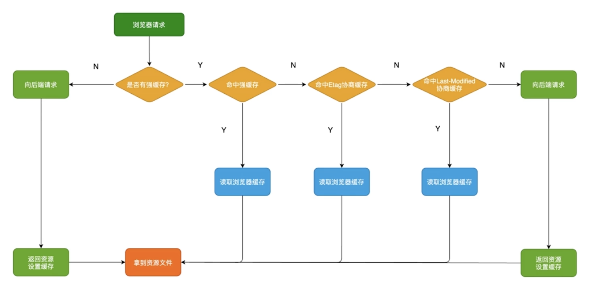

### 如何实践？

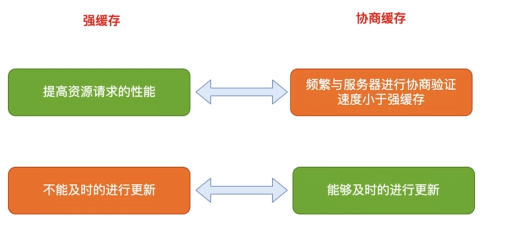

### 缓存方案？

* 缓存设置方案

  * html 文件资源

    > 因为内部包含很多其他的资源，我们一般可以设置为 协商缓存，cache-control：max-age = 0

  * 图片资源

    > 图片资源一般是通过更改来修改的，一般会设置为强缓存, 但缓存时间也不宜过长，一般设置时间为 1 天

  * 关于 CSS 以及 JS 文件

    > 通过设置强缓存，并且过期时间比较长，比如30天，但是需求的迭代导致我们需要在文件名的后面增加 hash 值，如果文件内容发生更改，文件url 也会更改，下次就会重新请求新的文件。
