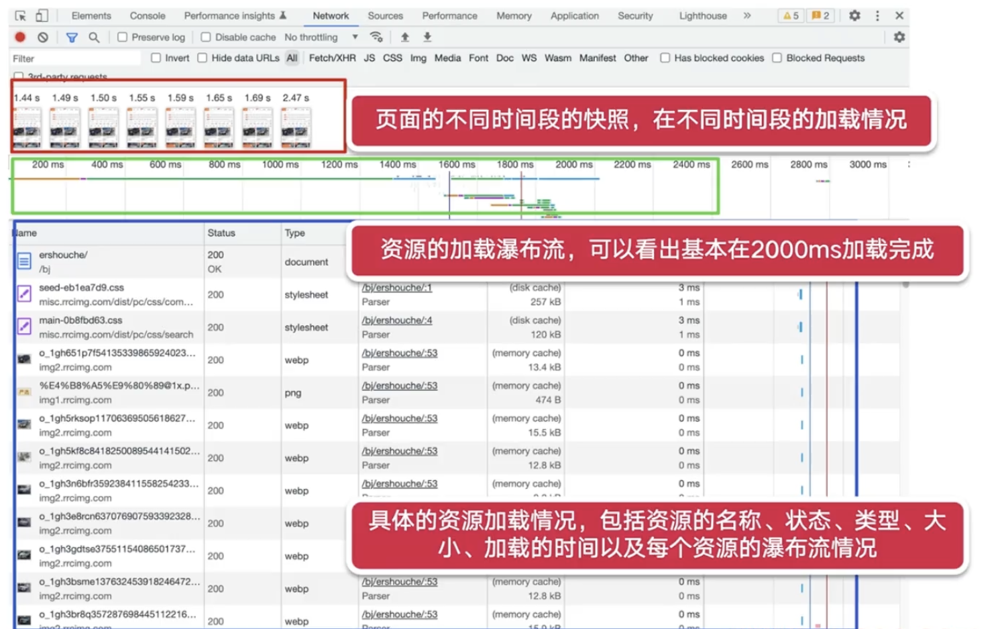
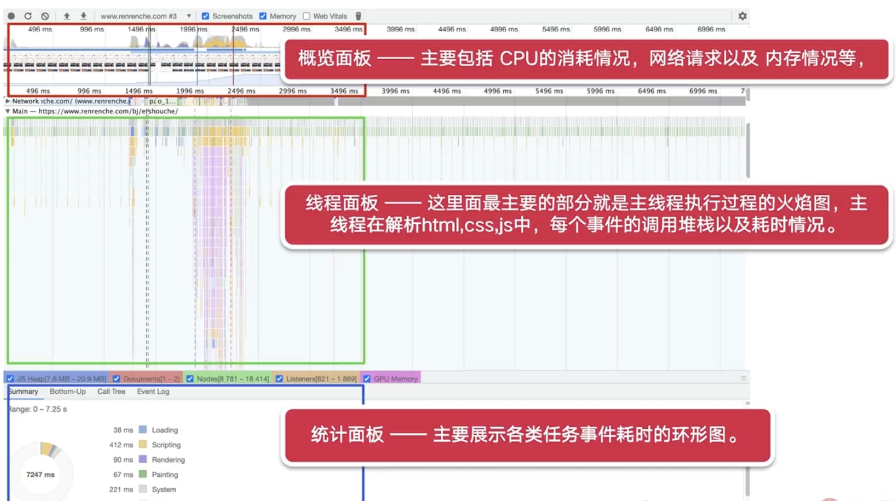
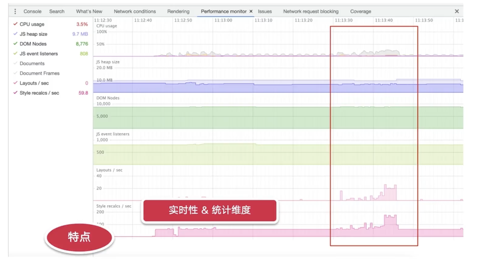
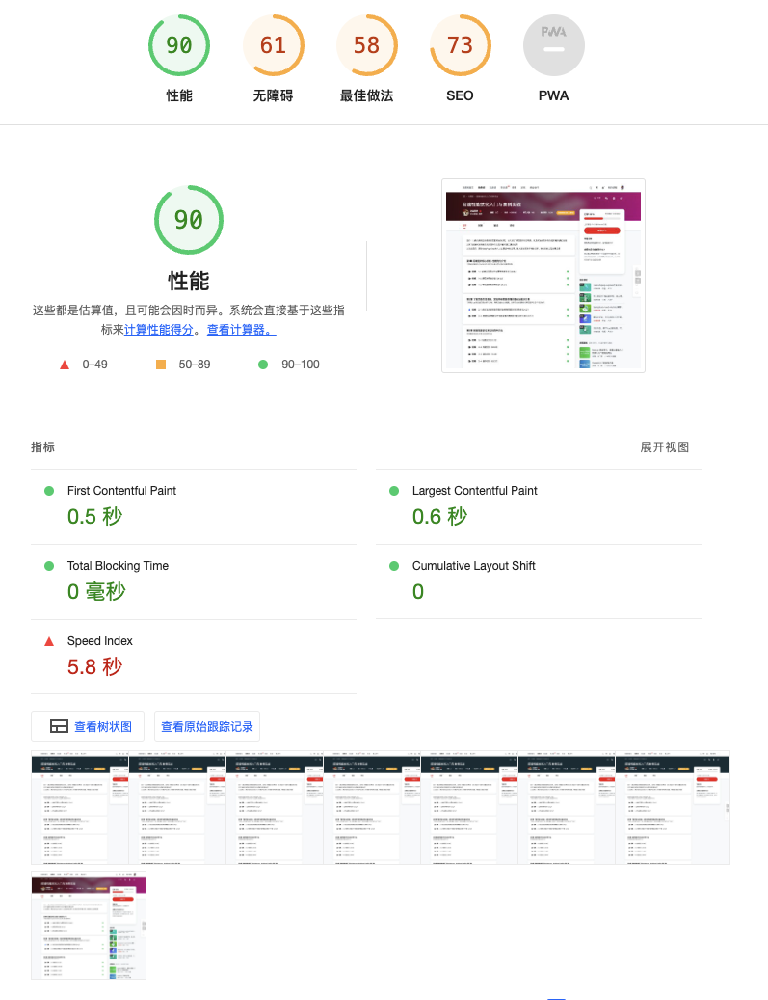
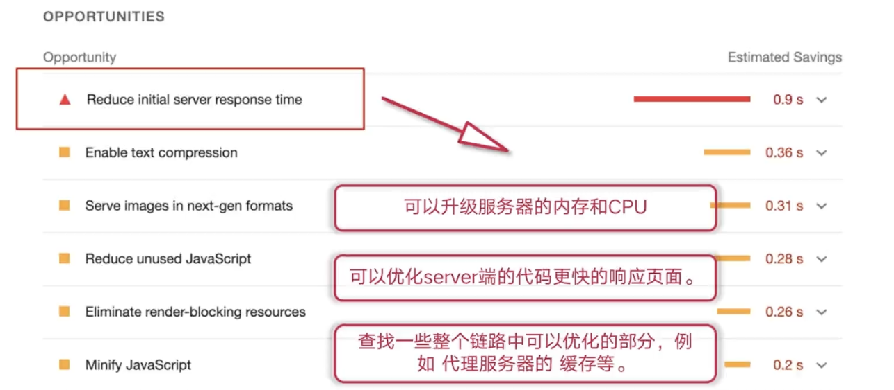
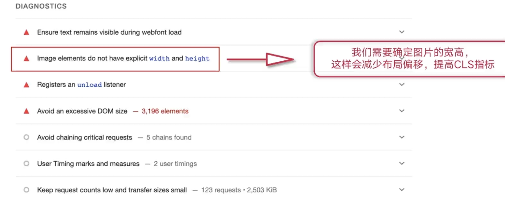
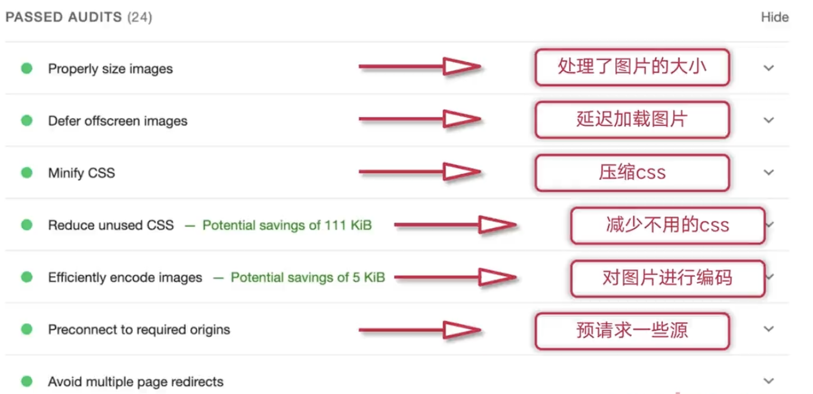
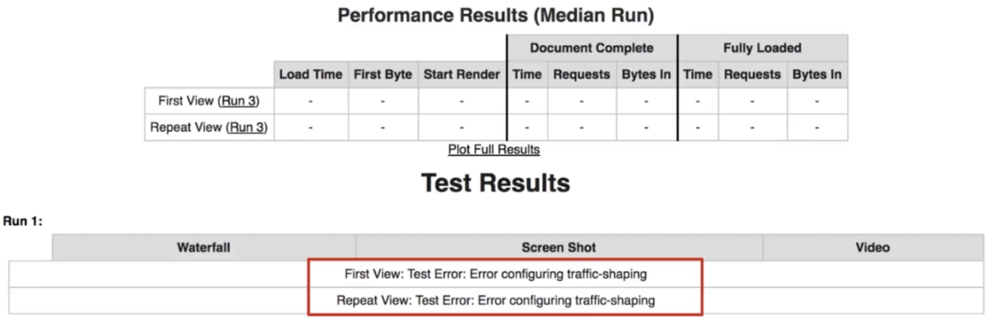

# 04-前端性能检测工具 Lighthouse、WebPageTest 的介绍与实践

## 01：性能检测工具概述

### 性能检测概述

- 如何快读定位性能瓶颈？
  - 比对着优化知识点清单，一项一项手动排查或者完全凭借经验去处理吗？（不推荐）
  - 我们需要有一整套清晰科学的优化流程和检测工具，来进行高效、准确及全面的性能分析与瓶颈定位**（推荐）**

### 性能检测本质 & 原则

- 本质：后续优化工作提供指导方向、参考基线以及前后对比的依据
- 原则：
  - 性能检测需要多维度，并不是单一指标
  - 需要进行多次检测，排除，几次检测带来的偶然性
  - 区分开发环境、线上环境对性能造成的额外的影响因素

### devtools-NetWork



### devtools-Performance



### devtools-Performance monitor



## 02：Lighthouse 介绍

- chrome 扩展程序
  - chrome 网上应用商店搜索扩展程序，进行添加之后就可以使用（高版本已经继承，不用此方法）
- Lighthouse Tab
  - 在 chrome 开发者工具的 moretools 里面直接选择 LightHouse，然后在工具面板上就会展示这个 tab (**直接推荐使用**)
- 命令行工具
  - 直接使用 Node Cli 命令行工具来进行分析网站页面

### lightHouse 的结果分析

- 第一部分：性能指标评估结果

  - FC：首次内容绘制时间，白屏时间
  - TTI：可交互前的耗时
  - SI (Speed Index)：首屏展现平均值
  - LCP：最大内容耗时，视屏时间
  - TBT (Total Blocking Time)：总阻塞时间，测量[First Contentful Paint 首次内容绘制 (FCP)](https://web.dev/fcp/)与[Time to Interactive 可交互时间 (TTI)](https://web.dev/tti/)之间的总时间，这期间，主线程被阻塞的时间过长，无法作出输入响应。
  - CLS（Cumulative Layout Shift）：累积布局偏移，指一个页面的布局在加载时的偏移程度

  

- 第二部分：优化建议，lightHouse 给出一些切实可行的一些建议

  - 

- 第三部分：诊断结果，给出页面中影响性能的各个方面

  - 

- 第四部分：已经通过的性能检测

  * 

  

## 03：WebPageTest 介绍

* 环境高度自定义化，可以模拟用户的使用场景
* 清晰详细的瀑布流
* 使用 webpagetest 可以测试已经已经上线的页面，**如何处理还没上线的页面？？** – webpagetest 本地部署

> 使用官方的 webpagetest/server 以及 webpagetest/agent 包进行 docker 部署

```dockerfile
$ docker run -d -p 4000:80 --rm webpagetest/server

$ docker run -d -p 4001:80 \
--network="host" \
-e "SERVER_URL=http://localhost:4000/work/" \
-e "LOCATION=Test" \
webpagetest/agent
```

* 官方包在 mac 上会报 Error configuring traffic-shaping 错误，这是因为 OSX 下还没有实现 `traffic-shapping`

  

  * 替代方案：需要自己制作镜像，具体详细步骤参考：[https://cloud.tencent.com/developer/article/1651120](https://cloud.tencent.com/developer/article/1651120)

[https://www.webpagetest.org/](https://www.webpagetest.org/)
