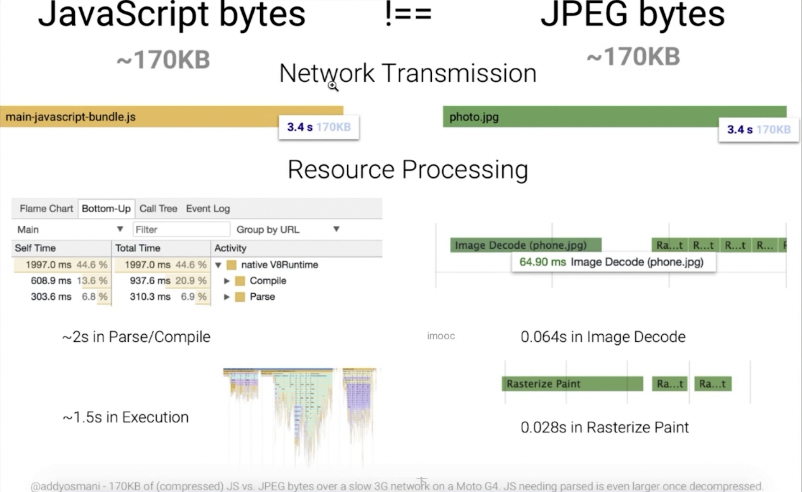
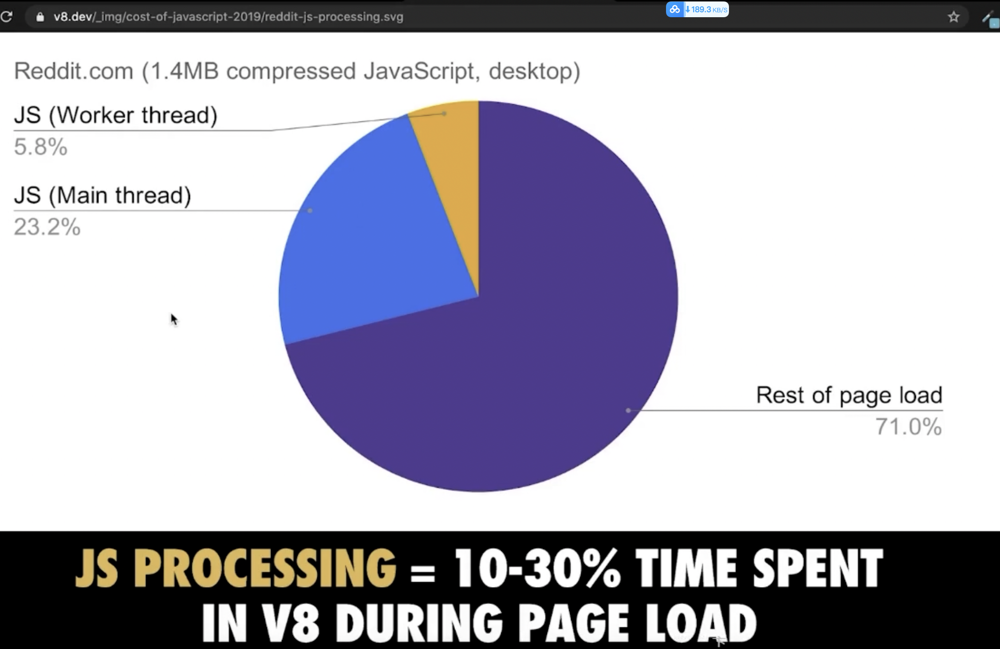
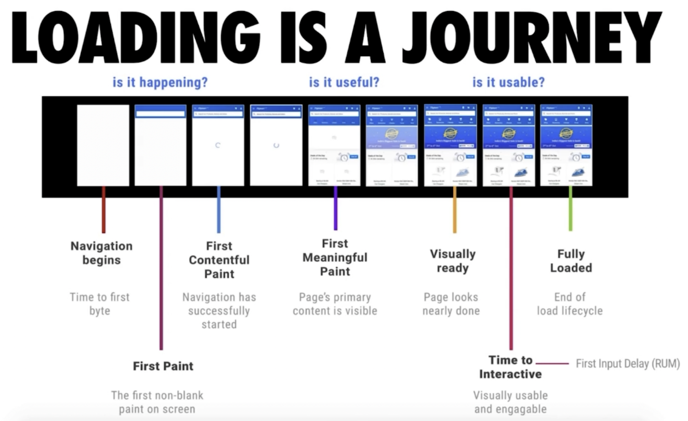
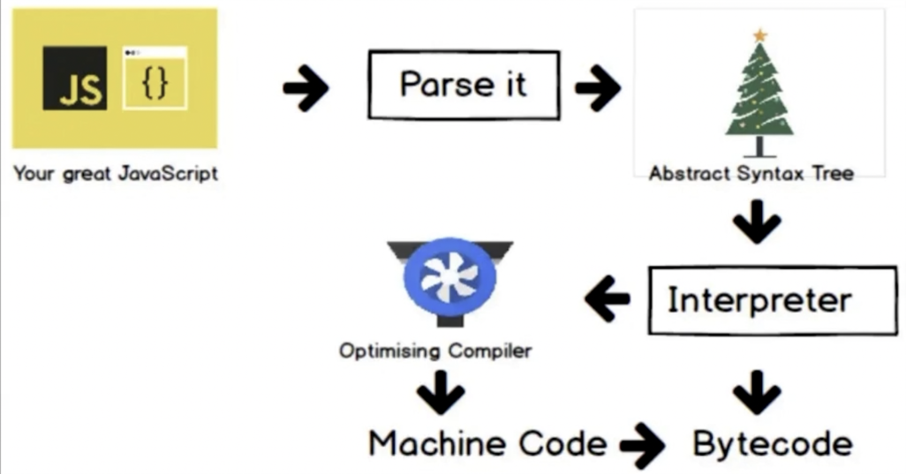
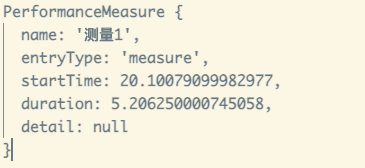

# 04-代码优化 (快来看看怎样写出真正高性能的代码)

## 01:JS开销和如何缩短解析时间【为什么我的JS运行慢】

### 开销在哪里

* 加载
* 解析 & 编译
* 执行

> 如下如，对于同样大小的 图片和 js 文件，网络传输耗时一样，资源加载耗时就不一致了，对于 js 文件 花费了 2s 左右的解析编译，又花费了 1.5 的执行时间，而对于图片下载完成后，直接在 0.064s 内完成了图片编码，又花费了 0.028s 的绘制



对于 Reddit.com 下图可以看出，对于 js 代码还是压缩后的，花费了 1/3 左右的时间



### 解决方案

* Code splitting 代码拆分，按需加载
* Tree shaking 代码减重

### 减少主线程工作量

* 避免长任务
* 避免超过 1kb 的行间脚本
* 使用 rAf 和 rIc 进行时间调度

### Progressive Bootstrapping

* 可见不可交互 vs 最小可交互资源集



## 02: 配合V8 有效优化代码【路走对了才能快】

### V8 编译原理


> js -> Parse it -> AST(Abstract Syntax Tree) 抽象语法树 -> Interpreter （解释器理解抽象语法树）-> Optimising Compiler（编译器优化）[1]-> machine Code -> Bytecode

> 拿到你的 js 字符，解析处理，变为抽象语法树 AST，所有的编程语言都有这样一个过程。先把你的文本，识别成字符，然后把里面重要的信息提取出来，变为一些节点，存储在一定的数据结构里。然后在这个数据结构里，进行理解解释是什么意义。这就是接下来，解释器要做的事情。然后呢，再把我们的代码变为机器码去运行之前，这个编译器会进行一些优化工作，也就是 Optimising Compiler. 当然，他做的优化工作不一定合适，如果它发现不合适，这时会发生一个逆优化过程。这样就造成一些不必要的开销，所以我们要注意的就是按照他优化的方式、按照它期望的方式，并且回顾可能让他出现逆优化的过程的方式，进行书写代码。



```javascript
// node.js
const { performance, PerformanceObserver } = require('perf_hooks')

const add = (a, b) => a + b;

const num1 = 1;
const num2 = 2;

performance.mark('start')

for(let i = 0; i < 1000000; i++){
  add(num1, num2)
}

add(num1, 's') // 这里注意：类型发生变化！类型发生变化！类型发生变化！

for(let i = 0; i < 1000000; i++){
   add(num1, num2)
}

performance.mark('end')

const observer = new PerformanceObserver((list) => {
    console.log(list.getEntries()[0]);
})

observer.observe({entryTypes: ['measure']})
performance.measure('测量1', 'start', 'end')
```
**类型发生变化时 运行耗时**

```shell
PerformanceMeasure {
  name: '测量1',
  entryType: 'measure',
  startTime: 20.10079099982977,
  duration: 5.206250000745058,
  detail: null
}
```



**类型未发生变化时 运行耗时**

> 我们上面类型变化的代码 注释掉，再重新运行，得出如下结果
>
> 注：单次执行可能存在误差，可以多执行几次，取平均值

```javascript
PerformanceMeasure {
  name: '测量1',
  entryType: 'measure',
  startTime: 21.454458000138402,
  duration: 3.105374999344349,
  detail: null
}
```

可以看明显的速度提升，同样进行多次相加，但是类型没有发生变化，对代码进行了优化 如果类型发生了变化，会触发V8 的反优化，增加耗时。

### 抽象语法树

* 源码 => 抽象语法树 => 字节码Bytecode => 机器码
* 编译过程会进行优化
* 运行过程可能发生优化

### V8 优化机制

* 脚本流：

  > 下载过程中就开始解析。
  >
  > 当下载超过30kb的时候就新开单独线程去解析，等全部加载好之后，在进行解析时，之前的已经解析过的合并过来，减少解析时间。

* 字节码缓存

  > 源码翻译成字节码之后，例如在不同页面存在`部分相同的片段`,就把它缓存起来

* 懒解析

  > 针对函数，先不解析内部逻辑，真正用时再解析。

说到这里，大家可以检查下自己的代码中时候有类型的代码，可以进行优化下·～～

这里也可以看出，ts 的引入会让我们解决一些类型转换的问题。。

## 03: 函数优化【必会】

[“解析JavaScript — lazy 是否比 eager更好?”](https://blog.csdn.net/szengtal/article/details/78924931)

### 函数的解析方式

* `lazy parsing` 懒解析 VS `eager parsing` 饥饿解析
* 利用 `Optimize.js` 优化初次加载时间

() 括号包裹函数，告诉解析器这是一个 eager parsing 饥饿解析。

如果知道该函数在解析期间会被调用，则使用 eager parsing，如果不调用，使用 lazy parsing。 因为使用立刻会被调用的情况下，如果使用 lazy parsing，会导致之前的优化无效，还需要重新反优化，增加时间。

压缩的过程中，（）会被去掉，通过 optimize.js 来解决

```javascript
// test.js
export default () => {
  const add = (a, b) => a*b; // 懒解析，这里先记住函数，并不进行解析
  const num1 = 1;
  const num2 = 2;
  add(num1, num2);
}
```

我们使用webpack 对上面代码进行打包 为了方便定位，进行下面的配置，把test.js 打包到单独的文件中


**打包出来的结果**


**实际项目中的时常**


**代码解读**

```javascript
// test.js
export default () => {
  const add = (a, b) => a*b; // 懒解析，这里先记住函数，并不进行解析        
  // 让add 函数 饥饿解析的方式 如下
  // const add = ((a, b) => a*b); // 饥饿解析

  const num1 = 1;
  const num2 = 2;
  add(num1, num2);
}
```

实际webpack 打包压缩(Uglify)的过程中，会把我们的括号去掉，就不能进行饥饿解析了

[ParalleUglifyPlugin 多进程代码压缩](https://juejin.cn/post/6857145619157368839#heading-14)

### 利用Optimize.js优化初次加载时间

[github.com/nolanlawson…](https://link.juejin.cn/?target=https%3A%2F%2Fgithub.com%2Fnolanlawson%2Foptimize-js)

可以把压缩后的省略的括号找回来

> optimize-js input.js > output.js

Example input:

```javascript
!function (){}()
function runIt(fun){ fun() }
runIt(function (){})
```

Example output:

```javascript
!(function (){})()
function runIt(fun){ fun() }
runIt((function (){}))
```

**官方给的速度提升的数据**

| Browser    | Typical speed boost/regression using optimize-js |
| ---------- | ------------------------------------------------ |
| Chrome 55  | 20.63%                                           |
| Edge 14    | 13.52%                                           |
| Firefox 50 | 8.26%                                            |
| Safari 10  | -1.04%                                           |

### 重要

后面 webpack4 包括 Uglify，已经把上面的(括号省略等)问题处理了。

可能更早的项目需要做一些兼顾

> 问：变 lazy parsing 为 eager parsing，webpack 它处理了吗，如果有，是怎么做到的 ？
>
> 答：是的，Webpack 可以处理将 lazy parsing 转换为 eager parsing 的需求。在 Webpack 中，可以通过配置文件或者在代码中使用特定的语法来实现。
>
> 在配置文件中，可以使用 `optimization.splitChunks` 选项来配置代码分割的行为。通过设置 `splitChunks.chunks` 为 `'all'`，Webpack 将会对所有模块进行代码分割，将公共的部分提取出来，从而实现 eager parsing。
>
> 另外，在代码中，可以使用 `import()` 函数来实现动态导入模块的功能。通过使用 `import()` 函数，Webpack 将会自动将模块进行代码分割，并在需要的时候进行加载，从而实现 eager parsing。
>
> 需要注意的是，Webpack 的代码分割功能需要配合其他优化选项一起使用，例如使用 `optimization.runtimeChunk` 选项来提取运行时代码，以及使用 `optimization.splitChunks.cacheGroups` 选项来配置代码分割的规则。
>
> 总之，Webpack 提供了多种方式来处理 lazy parsing，可以根据具体的需求选择合适的方式进行配置。

另外

> webpack可以处理lazy parsing和eager parsing，通过配置和插件可以实现。Lazy parsing是指在运行时按需加载模块，而eager parsing是指在编译时预先加载所有模块。 要启用eager parsing，你可以在webpack配置文件中设置`optimization.moduleIds`属性为`'deterministic'`，这将使 webpack 使用模块路径来生成模块标识，从而实现 eager parsing。此外，你还可以设置`optimization.chunkIds`属性为`'deterministic'`来生成可预测的块标识。 
>
> 除了配置，webpack还提供了一些插件来优化模块加载。例如，使用`PrefetchPlugin`和`PreloadPlugin`插件可以预先加载代码块，以提高应用程序的性能。这些插件可以通过配置手动添加，也可以使用相关的插件或工具自动分析和添加。 
>
> 总之，通过适当的配置和插件，webpack可以实现lazy parsing 和 eager parsing的处理，以优化模块加载和应用程序性能。

## 04: 对象优化【JS对象避坑地图】

## 05: HTML优化【必会】

## 06: CSS对性能的影响 【必会】