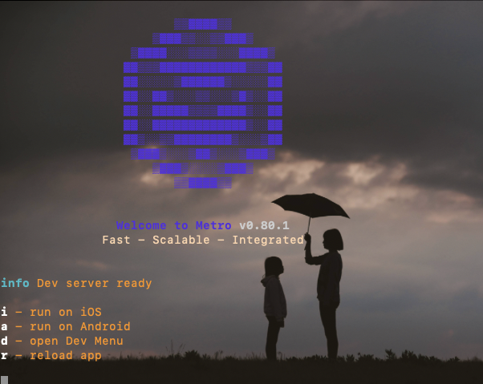
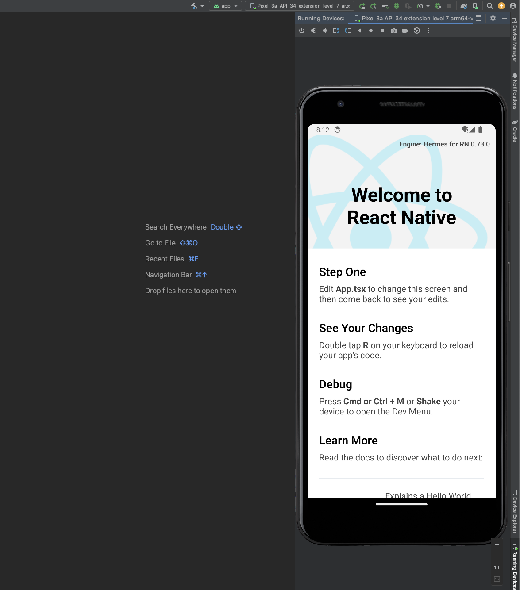

# 02-环境搭建

## 开发环境介绍

https://reactnative.cn/docs/environment-setup

### 环境选择

* MACOS、windows、Linux
* Android IOS

### 开发环境搭建

* React
  * Node
  * watchman
  * vscode
* Native
  * jdk
  * AndroidStudio
  * SDK
  * 模拟器

## 安装 node 和 watchman
```bash
brew install node
brew install watchman
```
## 安装 VSCODE

[https://code.visualstudio.com/](https://code.visualstudio.com/)

## 安装JDK和AndroidStudio

### 安装 JDK

* HomeBrew 安装
```bash
brew install adopopenjdk/openjdk/adoptopenjdk8
```

* 官网下载（推荐）
  * [https://www.oracle.com/java/technologies/downloads/#java11](https://www.oracle.com/java/technologies/downloads/#java11)
  * 注意：如果是 m1 就选择 arm64 文件安装包
  * 如果是 intel 就选择 x64 文件安装包

### 安装 Android Studio

[https://developer.android.google.cn/studio?hl=zh-cn](https://developer.android.google.cn/studio?hl=zh-cn)

### 配置 SDK 和 Tools
```txt
preference => Languages & Frameworks => Android Sdk
```
## 配置环境变量

* 配置 sdk 环境变量

```bash
export ANDROID_HOME=$HOME/Library/Android/sdk
export PATH=$PATH:$ANDROID_HOME/emulator
export PATH=$PATH:$ANDROID_HOME/tools
export PATH=$PATH:$ANDROID_HOME/tools/bin
export PATH=$PATH:$ANDROID_HOME/platform-tools
```

* 重新启动配置文件

  ```bash
  source ~/.zshrc
  ```

  

## 创建安卓模拟器

* 常规创建方式
```txt
DeviceManager => Create Device
```
### M1 芯片创建安卓模拟器

* 下载对应 SDK
  * SDK platform 勾选 Sv2 选项并下载
* 下载对应 SDK Tools
  * SDK Tools 勾选 Android Emulator、Android SDK Platform-Tools、底部三个 Layout Inspector 选项
* 创建模拟器
  * DeviceManager => Create Device 设备类型选择 phone, 屏幕尺寸随便选择，系统镜像选择 SV2 选项，一路 next 完成

## 创建新项目

* 初始化项目（最新 RN 版本）:推荐

  ```bash
  npx react-native init Demo
  ```

* 初始化项目（指定 RN 版本）

  ```bash
  npx react-native init Demo --version X.XX.X
  ```

### 开发安装项目依赖

* 安装 js 依赖
  * `npm install`
* 安装原生依赖
  * 用 android studio 打开 Demo/android 文件夹(注意之前下载过 jdk11或者更高，我们在 file => project structure 中需要选择 SDK location => gradle settings  => 选择对应的 jdk 版本 => 点击 ok 即可)
  * `gradle sync`

### 运行应用程序

* npm run start

  

* 然后输入 a

* 就可以在 android studio 的 模拟器中查看到相应界面了（前提打开 device manager中的模拟机运行起来）



### 注意报错
#### 1. brew update 更新时 shallow clone

[brew update 更新时 shallow clone](https://zhuanlan.zhihu.com/p/351199589)

#### 2. React Native 运行报错，可以运行如下命令，进行检查

```bash
npx react-native doctor
```
然后根据提示进行修复

#### 3. Mac OS 如何彻底卸载各版本的 jdk（java 开发环境）

  * 列出当前的 jdk 安装列表，如下命令：

  ```bash
  demo@Mac ~ $ ls /Library/Java/JavaVirtualMachines/
  jdk-11.0.10.jdk		jdk-11.0.3.jdk		jdk1.7.0_80.jdk		jdk1.8.0_241.jdk
  ```

  * 删除 jdk 安装列表中的 jdk 版本，如下命令：

  ```bash
  demo@Mac ~ $ sudo rm -rf /Library/Java/JavaVirtualMachines/jdk-11.0.3.jdk
  Password:
  ```
  输入密码，删除成功

#### 4. 步骤 2：输入 java -version 命令，查看当前系统上已安装的 JDK 版本。

```bash
java -version
```


#### 5. MAC 端安装 cocoapods 时出错

> 可能跟 ruby 版本有关，我的是 2.7.2，需要升级到 3.0.0 以上版本

按照如下文档升级，并配置环境变量

```bash
# 首先，检查您使用的Ruby版本。
ruby -v

which  ruby
usr/bin/ruby

# 现在使用Homebrew安装最新的Ruby。
brew install ruby

# 根据提示运行图中提示的三行命令 ，按照说明设置PATH。
echo 'export PATH="/usr/local/opt/ruby/bin:$PATH"' >> ~/.zshrc
echo 'export LDFLAGS="-L/usr/local/opt/ruby/lib"' >> ~/.zshrc  
echo 'export CPPFLAGS="-I/usr/local/opt/ruby/include"' >> ~/.zshrc 
echo 'export PKG_CONFIG_PATH="/usr/local/opt/ruby/lib/pkgconfig"'  >> ~/.zshrc

source ~/.zshrc  

# 最后，检查Ruby版本以确保它已升级。
ruby -v

# 在进行 npx react-native doctor ，然后在进行安装修复
```

[https://www.jianshu.com/p/beb6b5c5e109](https://www.jianshu.com/p/beb6b5c5e109)

#### 6. 安装 cocoapods 后，`npx react-native doctor`仍然报错，提示未安装 cocoapods

> 使用如下相应命令，重新安装

```bash
sudo gem install cocoapods (osx 10.11以前)

sudo gem install -n /usr/local/bin cocoapods （10.11后苹果升级了安全策略）
```

重新运行 `npx react-native doctor` 命令，提示成功。安装配置完成

#### 7. 安装 cocoapods 后，`npx react-native doctor`通过后，运行 ios 终端报错

> note: Building targets in dependency order
> 
> /Users/gaoyuan/Code/learn/RNDemo/ios/Pods/Target Support Files/Pods-RNDemo/Pods-RNDemo.debug.xcconfig:1:1: error: unable to open configuration settings > file

用 xcode 打开 ios 文件夹下的 `RNDemo.xcodeproj`, 发现项目中的 pod 文件一片红

```bash
# 在此过程中，可能需要翻墙，可以通过设置终端代理来解决
# 例子： export https_proxy=http://127.0.0.1:7890 http_proxy=http://127.0.0.1:7890 all_proxy=socks5://127.0.0.1:7890
pod install

pod update（pod install 不行再执行）
```

然后再运行 `npm run start` 后选择 i，即可

> 注意： 如果报错，就完全退出 xcode 和 模拟器，在重试脚本 npm run start