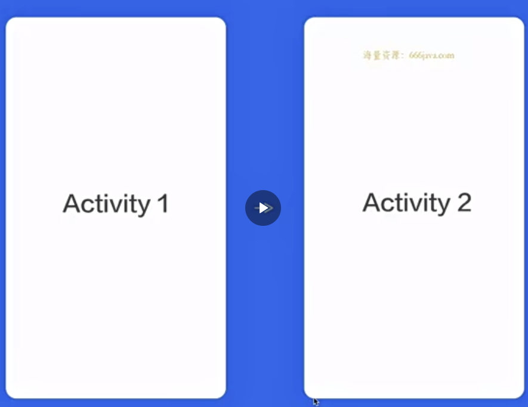
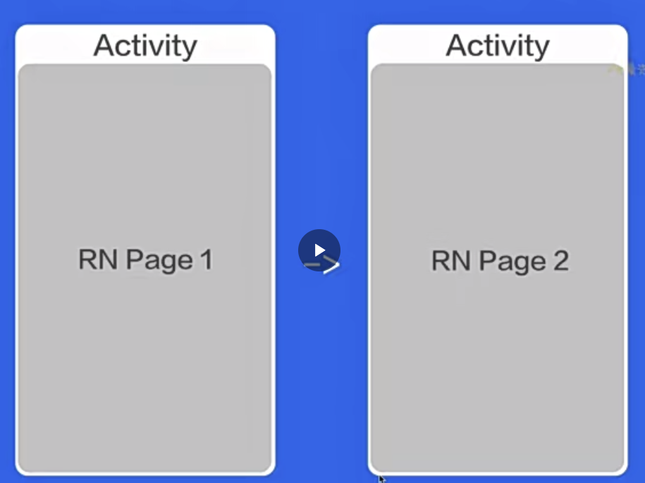
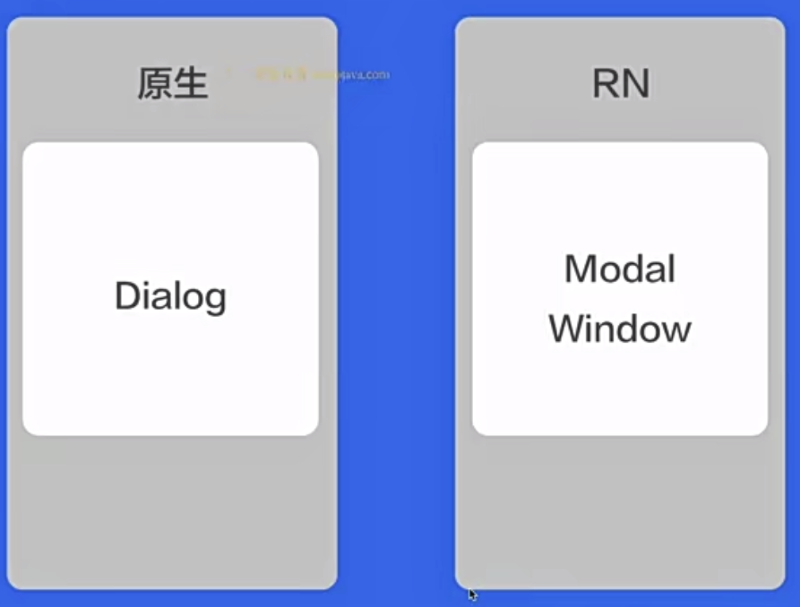
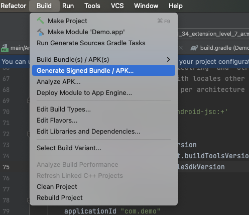

# 04- 为“前端开发”同学补充原生知识

## 01-本节内容

###  内容大纲

* 以安卓为例，学习如何连接设备，以及开发中常用的 adb 命令
* 以安卓为例，了解移动端 UI 结构和设备特性
* 以安卓为例，讲解 RN 开发中经常涉及到的原生文件
* 了解 RN 组件与 原生组件的对应关系
* 原生开发语言：Android：Java/kotlin, IOS：OC/Swift
* 移动端的应用发布以及主流的应用市场
* 移动端特有的生产热修复机制和应用场景
* 移动端设备的版本兼容选择

### 安卓链接设备以及常用 adb命令

* USB 连接设备
* WIFI 局域网链接
* adb 启动、停止、查看设备、端口映射、进入沙盒
  * 启动：`adb start-serve`
  * 停止：`adb kill-serve`
  * 查看设备：`adb devices`
  * 端口映射：`adb reverse tcp:8081 tcp:8081`
  * 进入沙盒：`adb shell`

## 02-移动端UI结构和设备特性

### 移动端应用UI结构

* StatusBar 状态栏
* ActionBar 标题栏
* ContentView 内容
* Navigation 导航

### 移动端特有的交互形式

* 一致返回，直到退出app
* home健，挂起应用

### 移动端页面载体

page1  => Page2

而在 RN 中

## 03-RN 开发中常见的原生文件

* 配置相关：mainfests、gradle
  * 权限
  * 第三方等
  * …
* 应用相关：Application、String、mipmap
* 桥接：ReactPackage、ReactModule、ViewManager

## 04-RN 和原生组件对相应关系

React Native 具有许多核心组件，从表单控件到活动指示器，应有尽有。你可以在[API 章节](https://reactnative.cn/docs/components-and-apis)找到它们。您将主要使用以下核心组件：

| REACT NATIVE UI 组件 | ANDROID 原生视图 | IOS 原生视图     | WEB 标签                | 说明                                                         |
| :------------------- | :--------------- | :--------------- | :---------------------- | :----------------------------------------------------------- |
| `<View>`             | `<ViewGroup>`    | `<UIView>`       | A non-scrolling `
` | 一个支持使用flexbox布局、样式、一些触摸处理和无障碍性控件的容器 |
| `<Text>`             | `<TextView>`     | `<UITextView>`   | `
`                   | 显示、样式和嵌套文本字符串，甚至处理触摸事件                 |
| `<Image>`            | `<ImageView>`    | `<UIImageView>`  | ``                 | 显示不同类型的图片                                           |
| `<ScrollView>`       | `<ScrollView>`   | `<UIScrollView>` | `
`                 | 一个通用的滚动容器，可以包含多个组件和视图                   |
| `<TextInput>`        | `<EditText>`     | `<UITextField>`  | `<input type="text">`   | 使用户可以输入文本                                           |

## 05-原生开发语言选择

* Android: Java Vs Kotlin
* IOS: OC Vs Swift

## 06-移动端应用发布

* debug 包 和 release 包
  * app文件夹下的 build.gradle： buildTypes 下有 debug、release 选项
* 应用签名：生成与使用

* 国内主流应用市场：AppStore + 华 米 O V

## 07-移动端特有的生产热修复机制和应用场景

* 热修复机制的产生原因
* RN 热修复框架选择：PUSHY等
* 热修复应用场景和注意事项

## 08-移动端设备版本兼容选择

* Android
  * 尺寸：1080 * 1920 以上
  * 系统版本：安卓 5.0 以上
* IOS
  * 尺寸：375 * 667 以上
  * 系统版本：IOS 10以上	

