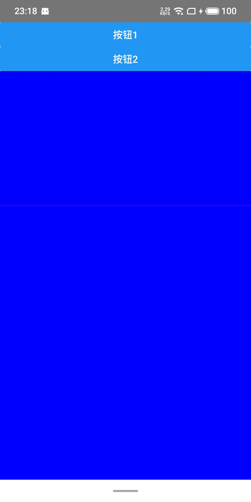

# 07-【夯实基础-常用 API】深刻理解 RN 核心 API 的功能

## 01：常用 API 精讲

* Alert/console: 开发周期的调试工具
* Dimensions/useWindowDeimensions: 适配屏幕高度
* Platform: 轻松获取平台属性
* StyleSheet: 灵活构建样式表
* Linking: 一个 api 帮你省掉 50行代码
* PixelRatio: 像素比例工具
* BackHandler: 针对安卓返回键的适配不再是难题
* PermissionAndroid: 一个 API 帮你解决解决原生动态权限问题
* vibration: 简单好用的震动交互
* ToastAndroid: 安卓平台的提示
* transform: 矩阵变换的伪 3D 效果
* keyboard: 操作键盘有神器

## 02: Alert/console: 开发周期的调试工具

* alert(): 简单的弹框提示
* 区别 Alert.alert(), 这个是 RN 的对话框工具
* console.log
* console 日志输出分级
* console.log 字符串模板和占位符两种方式：%o-对象、%s-字符串、%d-数字
* console.log 添加样式：%c颜色和字号
  * color: orange
  * font-size: x-large、x-medium、x-small
* console.table 输出组件树
* console.group 输出分组日志

```jsx
import React from 'react';
import {Button, Text, View, Alert} from 'react-native';

export default function TestApiDemo() {
  return (
    <View>
      <Button
        title="按钮1"
        onPress={() => {
          console.log('点击了');
          console.info('日志输出');
          console.debug('调试日志输出');
          console.warn('警告日志输出');
          console.error('错误日志输出');
          // alert('这是一条提示信息');
          const buttons = [
            {
              text: '取消',
              onPress: () => {
                console.log('点击了取消');
              },
            },
            {
              text: '确定',
              onPress: () => {
                console.log('点击了确定');
              },
            },
          ];
          Alert.alert('我是标题', '我是内容', buttons);
        }}
      />
      <Button
        onPress={() => {
          const name = '猪八戒';
          console.log('猪的祖先%s', name);
          console.log('我是个人开发者,我学习%d年了', 1);
          const nameObj = {
            name: '猪八戒',
            age: 100,
          };
          console.log('我是一个对象：%o', nameObj);
          // 终端不能生效，在浏览器控制台可以
          console.log(
            '%c这行日志红色文字，字好大%c',
            'color:red;font-size:x-large',
          );
          console.log(
            '%c这行日志蓝色文字，字号中等%c',
            'color:blue;font-size:x-medium',
          );
          console.log(
            '%c这行日志绿色蚊子，字号小号%c',
            'color:green;font-size:x-small',
          );
          const viewLayout = (
            <View style={{flexDirection: 'column'}}>
              <Text> 我是标题</Text>
            </View>
          );
          // 组件状态也许是从后台获取的，然后数据不固定，这时候打印就比较清晰看到
          console.log(viewLayout);

          // 在浏览器中可以看出来效果，终端没有
          const users = [
            {name: '张三', age: 10},
            {name: '李四', age: 30},
          ];
          console.table(users);
          console.group();
          console.log('我是分组中的第一行');
          console.log('我是分组中的第二行');
          console.log('我是分组中的第三行');
          console.group();
          console.log('我是二级分组中的第一行');
          console.log('我是二级分组中的第二行');
          console.log('我是二级分组中的第三行');
          console.groupEnd();
          console.log('end');
        }}
        title="按钮2"
      />
    </View>
  );
}
```

## 03: Dimension 和 useWindowDimension 获取屏幕信息

* 获取屏幕宽高的两种方式
* 获取缩放 scale、文字缩放 fontScale
* Dimension.get 传递 screen 和 window 的区别

```jsx
import React, {useEffect} from 'react';
import {
  Button,
  Text,
  View,
  Alert,
  useWindowDimensions,
  Dimensions,
} from 'react-native';

export default function TestApiDemo() {
  const {width: screenWidth, height: screenHeight} = useWindowDimensions();
  console.log('screenWidth', screenWidth, screenHeight);

  const {width, height, scale, fontScale} = Dimensions.get('window');
  console.log('width', width, height, scale, fontScale);
  // screen 会加上状态栏的高度,如果是通栏的,通过 window 和 screen 获得的 宽高度是一致的
  const {width: windowScreenWidth, height: windowScreenHeight} =
    Dimensions.get('screen');
  console.log('windowScreenWidth', windowScreenWidth, windowScreenHeight);

  useEffect(() => {
    // 比如某些安卓手机底部导航键是可以进行设置收起的，类似场景就会触发
    const subscription = Dimensions.addEventListener(
      'change',
      (window, screen) => {
        console.log('window', window, screen);
      },
    );

    return subscription.remove();
  }, []);

  const onPress = () => {
    Alert.alert('我是标题', '我是内容', buttons);
  };
  return (
    <View>
      <Button title="按钮1" onPress={onPress} />
    </View>
  );
}
```

## 04: PlatForm 获取平台属性

* 平台属性：OS、Version、constants
* 判断：isPad、isTv
* 平台选择：Platform.select()

```jsx
import React, {useEffect} from 'react';
import {
  View,
  Platform,
  StyleSheet,
} from 'react-native';

export default function TestApiDemo() {
  console.log(Platform.OS === 'android');
  console.log(Platform.OS === 'ios');
  console.log(Platform.Version); // 安卓 SDK 的版本号
  console.log(Platform.constants); // 品牌、型号、系统、SDK版本等
  console.log(Platform.isPad); // 针对 ios 判断的
  console.log(Platform.isTV);
  const style = Platform.select({
    ios: {
      marginTop: 200,
    },
    android: {
      marginTop: 150,
    },
    default: {
      marginTop: 100,
    },
  });
  console.log(style); // 安卓端就会打印出来 {"marginTop": 150}
  // 实际应用
  const styles = StyleSheet.create({
    root: {
      width: '100%',
      height: '100%',
      paddingTop: Platform.select({
        ios: 200,
        android: 150,
        default: 100,
      }),
      ...Platform.select({
        ios: {
          marginTop: 20,
        },
        android: {
          marginTop: 10,
        },
        default: {
          marginTop: 15,
        },
      }),
    },
  });
 
  return (
    <View style={styles.root}>
      <Button title="按钮1" />
    </View>
  );
}

```

## 05：StyleSheet构建灵活样式表

* 基础使用：以上章节代码就是基本使用
* 创建多个样式表：使用多个 StyleSheet.create 分别创建不同模块的样式表
* 样式合并：StyleSheet.compose 和 [] 写法的区别
* 样式平铺：StyleSheet.flatten
* 绝对填充：StyleSheet.absoluteFill
* 头发丝尺寸：StyleSheet.hairlineWidth

```jsx
const s1 = {
  fontSize: 18,
};
const s2 = {
  fontSize: 20,
  color: 'red',
};
const composeStyle = StyleSheet.compose(s1, s2);
console.log(composeStyle); // [{"fontSize": 18}, {"color": "red", "fontSize": 20}]

const flatStyle = StyleSheet.flatten([s1, s2]);
console.log(flatStyle); // {"fontSize": 20, "color": "red"}

const absoluteStyle = StyleSheet.absoluteFill;
console.log(absoluteStyle); // {{"bottom": 0, "left": 0, "position": "absolute", "right": 0, "top": 0}

// 头发丝宽度就是一个像素
console.log(StyleSheet.hairlineWidth);
console.log(1 / Dimensions.get('screen').scale);
```

## 06: Linking一个 api 节省 50 行代码

* 打开链接：Linking.openURL()、Linking.canOpenURL()
  * 网页链接
  * 地图定位
  * 拨打电话
  * 发送短信
  * 发送邮件
  * 应用跳转
* 跳转应用设置：Linking.openSettings()
* 安卓隐式跳转：Linking.sendIntent()
* 获取初始化URL：Linking.getInitialURL()

```jsx
import React, {useEffect} from 'react';
import {
  Button,
  Text,
  View,
  Alert,
  useWindowDimensions,
  Dimensions,
  Platform,
  StyleSheet,
  Linking,
} from 'react-native';

export default function TestApiDemo() {
  const onPress = () => {
    // if (Linking.canOpenURL('https://www.baidu.com')) {
    //   Linking.openURL('https://www.baidu.com'); // 会调用系统浏览器打开页面
    // } else {
    //   console.log('无法打开链接');
    // }
    // Linking.openURL('geo:37.122, 12.222'); // 通过地址软件打开经纬度
    // Linking.openURL('tel:10086'); // 拨打电话
    // Linking.openURL('sms:10086'); // 发送短信
    // Linking.openURL('mailto:10086@163.com'); // 发送邮件
    // 你需要使用该应用的特定 URL scheme。
    // Linking.openURL('dagongjue://demo'); // schema://路径
    // Linking.openSettings(); // 跳转到应用设置页面
    // Linking.sendIntent('', [{key: 'name', value: '张三'}]);
    Linking.getInitialURL();
    console.log(Linking.getInitialURL());
  }
  return (
    <View>
      <Button title="按钮1" onPress={onPress} />
  );
}
```

## 07: PixelRatio 像素比例工具

* 获取屏幕像素密度：PixelRatio.get()
* 获取字体缩放比例（仅安卓）：PixelRatio.getFontScale()
* 获取布局大小：PixelRatio.getPixelSizeForLayoutSize()

```js
import React, {useEffect} from 'react';
import {PixelRatio} from 'react-native';

console.log(PixelRatio.get() === Dimensions.get('screen').scale); // true
console.log(PixelRatio.getFontScale() === Dimensions.get('screen').fontScale ); // true
console.log(PixelRatio.getPixelSizeForLayoutSize(100) === 100 * PixelRatio.get()); // true
```

特殊场景下的救命稻草

* 获取就近值：PixelRatio.roundToNearesePixel()

> 在React Native（RN）中，`PixelRatio.roundToNearestPixel()` 是一个用于将一个像素值四舍五入到最接近的像素的函数。这通常在需要确保UI元素的精确像素对齐或确保视觉效果的连贯性时使用。

如下代码

```jsx
import React, {useEffect} from 'react';
import {
  View,
  PixelRatio,
} from 'react-native';

export default function TestApiDemo() {
  const styles = StyleSheet.create({
    view: {
      width: '100%',
      backgroundColor: 'red',
    },
    subView: {
      width: '100%',
      backgroundColor: 'blue',
      height: 32.1, // 不用纠结为什么是 32.1
    },
  });
  return (
    <View style={styles.root}>
       <View style={styles.view}>
        <View style={styles.subView} />
        <View style={styles.subView} />
        <View style={styles.subView} />
        <View style={styles.subView} />
        <View style={styles.subView} />
        <View style={styles.subView} />
        <View style={styles.subView} />
        <View style={styles.subView} />
        <View style={styles.subView} />
        <View style={styles.subView} />
        <View style={styles.subView} />
        <View style={styles.subView} />
      </View>
    </View>
  )
}
```

效果结果如下：忽略按钮，主要是产生了一条红色横线



更改代码后

```jsx
import React, {useEffect} from 'react';
import {
  View,
  PixelRatio,
} from 'react-native';

export default function TestApiDemo() {
  const styles = StyleSheet.create({
    view: {
      width: '100%',
      backgroundColor: 'red',
    },
    subView: {
      width: '100%',
      backgroundColor: 'blue',
      height: 32.1, // 不用纠结为什么是 32.1
    },
  });
  return (
    <View style={styles.root}>
       <View style={styles.view}>
        <View style={styles.subView} />
        <View style={styles.subView} />
        <View style={styles.subView} />
        <View style={styles.subView} />
        <View style={styles.subView} />
        <View style={styles.subView} />
        <View style={styles.subView} />
        <View style={styles.subView} />
        <View style={styles.subView} />
        <View style={styles.subView} />
        <View style={styles.subView} />
        <View style={styles.subView} />
      </View>
    </View>
  )
}
```

如此处理后，结果正常，没有红色横线

## 08：BackHandler安卓返回键适配

* 添加监听：BackHandler.addEventListener('hardwareBackPress', fn)
* 移除监听：BackHandler.removeEventListener('hardwareBackPress', fn)

* 退出应用：BackHandler.exitApp()

```jsx
import React, {useEffect} from 'react';
import {
  BackHandler,
} from 'react-native';

export default function TestApiDemo() {
    useEffect(() => {
      // 比如某些安卓手机底部导航键是可以进行设置收起的，类似场景就会触发
      const subscription = Dimensions.addEventListener(
        'change',
        (window, screen) => {
          console.log('window', window, screen);
        },
      );

      const backFordAndroid = () => {
        // 返回上一页
        // return true 表示拦截处理
        // 返回 false 表示不拦截，默认系统处理
        // return false;
      };

      BackHandler.addEventListener('hardwareBackPress', backFordAndroid);

      return () => {
        subscription.remove();
        BackHandler.removeEventListener('hardwareBackPress', backFordAndroid);
      };
    }, []);
   return (
    <View style={styles.root}>
       <Button title="按钮1" />
     </View>
 	)    
}
```

上述监听，移除都是模板代码

推荐使用

[https://github.com/react-native-community/hooks](https://github.com/react-native-community/hooks)

```bash
npm install @react-native-community/hooks
```

```jsx
import {useBackHandler} from '@react-native-community/hooks'

useBackHandler(() => {
  if (shouldBeHandledHere) {
    // handle it
    return true
  }
  // let the default thing happen
  return false
})
```

## 09：PermissionsAndroid 轻松解决权限问题

* 检查权限：PermissionsAndroid.check()

* 申请权限：PermissionsAndroid.request()

  * 切记：要在原生 mainfest 注册权限 

    ```xml
    // android/app/src/main/AndroidManifest.xml
    // 需要什么权限，事先声明
    <uses-permission android:name="android.permission.CAMERA" />
    ```

* 申请多个权限：PermissionsAndroid.requestMultiple

```jsx
import React from "react"
import {
  Button,
  View,
  PermissionsAndroid,
} from 'react-native';
export default function TestApiDemo(){
  const onPress = () => {
    console.log(PermissionsAndroid.PERMISSIONS);
    const needPermission = PermissionsAndroid.PERMISSIONS.CAMERA;
    PermissionsAndroid.check(needPermission).then(result => {
      console.log(result, 11111);
      if (!result) {
        PermissionsAndroid.request(needPermission).then(status => {
          console.log(status, 22222);
        });
      }
    });

    PermissionsAndroid.requestMultiple([
      PermissionsAndroid.PERMISSIONS.CAMERA,
      PermissionsAndroid.PERMISSIONS.READ_EXTERNAL_STORAGE,
    ]).then(res => {});
  }
  return (<View>
        <Button title="按钮" onPress={onPress}></Button>
    <View>)
}
```

## 10: Vibration 简单好用的震动交互

* 原生声明权限：android.persmission.VIBRATE

* 发起震动：Vibration.vibrate()

* 取消震动：Vibration.cancel()

* 安卓时间模式：[100, 5000, 1000, 2000]: *先停100ms 震动 5000，在停 1s 在震2s*

* IOS时间模式：[100,200,300,400]: 由于 IOS 端震动时间不能更改，所以生效的只是中间的停止时间

* 震动重复：repeat

  ```jsx
  Vibration.vibrate([100, 5000, 1000, 2000], true); // true 代表重复震动
  // 停止震动，调用 cancel
  ```

```jsx
Vibration.vibrate(); // 震动 400ms 默认
Vibration.vibrate(1000); // 震动 1s 中，只对于 安卓
Vibration.cancel(); // 取消

// 先停100ms 震动 5000，在停 1s 在震2s
Vibration.vibrate([100, 5000, 1000, 2000]);
// IOS 由于震动时间不能更改，所以生效的只是中间的停止时间
Vibration.vibrate([2000, 500, 2000, 500], true);
```

## 11: ToastAndroid 安卓平台的提示

* 弹出提示：ToastAndroid.show()
* 弹出提示以及位置：ToastAndroid.showWithGravity()

```jsx
// 先停100ms 震动 5000，在停 1s 在震2s
Vibration.vibrate([100, 5000, 1000, 2000]);
// IOS 由于震动时间不能更改，所以生效的只是中间的停止时间
Vibration.vibrate([2000, 500, 2000, 500], true);
ToastAndroid.show('提示信息', ToastAndroid.SHORT); // 3s
ToastAndroid.show('提示信息', ToastAndroid.LONG); // 5s

ToastAndroid.showWithGravity(
  '提示信息',
  ToastAndroid.SHORT,
  ToastAndroid.CENTER,
);
```

## 12: Transform 矩阵变换的伪3D效果

* 水平移动：translateX
* 垂直移动：translateY
* 整体缩放：scale
* 横向锁档：scaleX
* 竖向缩放：scaleY
* X轴旋转：rotateX
* Y轴旋转：rotateY
* Z轴旋转：rotateZ、rotate

```jsx
import React, {useEffect} from 'react';
import {
  View,
} from 'react-native';
export default function TestApiDemo() {
  return <View
    style={[
      {
        width: 200,
        height: 200,
        backgroundColor: 'red',
        marginTop: 100,
      },
      {
        transform: [
          {
            // translateX: 100,
            // translateY: 100,
            // scale: 1.5,
            scaleX: 1.5,
          },
          {
            scaleY: 1.5,
          },
          // {
          //   rotateX: '45deg', // 沿着 x 轴旋转, 横向中间位置
          // },
          // {
          //   rotateY: '45deg', // 沿着 y 轴旋转，竖向中间位置
          // },
          // {
          //   rotateZ: '45deg', // 沿着 z 轴旋转
          // },
          {
            rotate: '45deg', // 沿着 z 轴旋转
          },
        ],
      },
    ]}
  />
}
```

## 13：keyboard: 操作键盘有神器

* 注册键盘监听：Keyboard.addListener()
* 注销键盘监听：EmitterSubscription.remove()
* 隐藏键盘：Keyboard.dismiss()

```jsx
import React, {useEffect} from 'react';
import {
  View,
  TextInput,
  Keyboard
} from 'react-native';


export default function TestApiDemo() {
  
   useEffect(() => {
     
     const keyboardDidShow = () => {
        console.log('keyboardDidShow');
      };

      const keyboardDidHide = () => {
        console.log('keyboardDidHide');
      };
     
      const showSubscription = Keyboard.addListener(
        'keyboardDidShow',
        keyboardDidShow,
      );
      const hideSubscription = Keyboard.addListener(
        'keyboardDidHide',
        keyboardDidHide,
      );
      return () => {
        showSubscription.remove();
        hideSubscription.remove();
      };
    }, []);
  
   return (
     <View>
        <TextInput
          style={{width: '100%', height: 50, backgroundColor: '#E0E0E0'}}
        />
     </View>
   )
}
```

