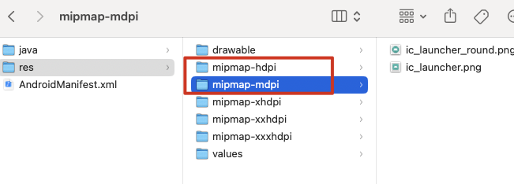

# 09-【小试牛刀-练习项目，账号密码本】巩固强化基础阶段知识

## 01：初始化项目和页面框架

- 新建并初始化工程：新建、安装、编译、运行

- 完成基础项目配置：名称、图标：在原生层进行修改

  ```xml
  // android/app/src/main/res/values/strings.xml: 这里是项目名称
  <resources>
      <string name="app_name">RNDemo</string>
  </resources>
  
  // 更改为
  <resources>
      <string name="app_name">账号管理</string>
  </resources>
  ```

  * 应用图标位置：：`/android/app/src/main/res`: hdpi、mdpi两个文件夹可以删除（适配的是以往的手机）

    

    * 在`xhdpi、xxhdpi、xxxhdpi` 文件夹下替换对应的 icon
    * 注意：这里修改了原生代码，所以需要重启终端命令运行，才会生效

- 完成基础页面框架：删除 demo 代码，重写主页标题栏

```jsx
// accountManager.js
import React from 'react';
import {
  StyleSheet,
  SafeAreaView,
  StatusBar,
  useColorScheme,
} from 'react-native';
import Home from '../modules/Home';
import {Colors} from 'react-native/Libraries/NewAppScreen';

const styles = StyleSheet.create({
  root: {
    width: '100%',
    height: '100%',
    backgroundColor: '#f5f5f5',
  },
});
export default function AccountManager() {
  const isDarkMode = useColorScheme() === 'dark';
  const backgroundStyle = {
    backgroundColor: isDarkMode ? Colors.darker : Colors.lighter,
  };
  return (
    <SafeAreaView style={styles.root}>
      <StatusBar
        darkStyle={isDarkMode ? 'light-content' : 'dark-content'}
        backgroundColor={backgroundStyle.backgroundColor}
      />
      <Home />
    </SafeAreaView>
  );
}

// modules/Home
import React from 'react';
import {StyleSheet, View, Text} from 'react-native';

const styles = StyleSheet.create({
  root: {
    width: '100%',
    height: '100%',
  },
  titleLayout: {
    width: '100%',
    height: 46,
    backgroundColor: '#fff',
    justifyContent: 'center',
    alignItems: 'center',
  },
  titleTxt: {
    fontSize: 18,
    color: '#333',
    fontWeight: 'bold',
  },
});
export default () => {
  const renderTitle = () => {
    // 这里应该返回一个标题组件
    return (
      <View style={styles.titleLayout}>
        <Text style={styles.titleTxt}>标题</Text>
      </View>
    );
  };
  return <View style={styles.root}>{renderTitle()}</View>;
};
```

## 03：自定义封装添加账号弹窗

* 首页增加添加按钮，调起弹框
* 自定义添加账号弹框、封装事件、ref转发（预学）
* 实现弹框 UI

```jsx
// Home.js
import React, {useRef} from 'react';
import {StyleSheet, View, Text, TouchableOpacity, Image} from 'react-native';
import IconAdd from '../assets/images/icon_add.png';
import AddAccountModal from '../components/AddAccountModal';

const styles = StyleSheet.create({
  root: {
    width: '100%',
    height: '100%',
  },
  titleLayout: {
    width: '100%',
    height: 46,
    backgroundColor: '#fff',
    justifyContent: 'center',
    alignItems: 'center',
  },
  titleTxt: {
    fontSize: 18,
    color: '#333',
    fontWeight: 'bold',
  },
  addBtn: {
    position: 'absolute',
    bottom: 64,
    right: 28,
  },
  iconAdd: {
    width: 56,
    height: 56,
    resizeMode: 'contain',
  },
});
export default () => {
  const renderTitle = () => {
    // 这里应该返回一个标题组件
    return (
      <View style={styles.titleLayout}>
        <Text style={styles.titleTxt}>账号管理</Text>
      </View>
    );
  };
  const addCountModalRef = useRef(null);
  return (
    <View style={styles.root}>
      {renderTitle()}
      <TouchableOpacity
        onPress={() => addCountModalRef.current.show()}
        style={styles.addBtn}
        activeOpacity={0.5}>
        <Image style={styles.iconAdd} source={IconAdd}></Image>
      </TouchableOpacity>
      <AddAccountModal ref={addCountModalRef}></AddAccountModal>
    </View>
  );
};

// AddAccountModal.js
import React, {useState, forwardRef, useImperativeHandle} from 'react';
import {
  View,
  Modal,
  StyleSheet,
  Text,
  Image,
  TouchableOpacity,
  TextInput,
  KeyboardAvoidingView,
  Platform,
} from 'react-native';
import IconClose from '../assets/images/icon_close_modal.png';
import {typesArray} from '../utils/constants';

const styles = StyleSheet.create({
  root: {
    width: '100%',
    height: '100%',
    backgroundColor: '#00000080',
    justifyContent: 'center',
    alignItems: 'center',
  },
  content: {
    width: '80%',
    backgroundColor: '#fff',
    borderRadius: 10,
    padding: 20,
  },
  subTitleTxt: {
    fontSize: 16,
    color: '#666666',
    marginTop: 10,
  },
});
export default forwardRef(function AddAccountModal(props, ref) {
  const [modalVisible, setModalVisible] = useState(false); // 控制模态框显示的变量
  const [tabIndex, setTabIndex] = useState(0);
  const [accountName, setAccountName] = useState('');
  const [accountCode, setAccountCode] = useState('');
  const [accountPassword, setAccountPassword] = useState('');
  const show = () => {
    setModalVisible(true);
  };
  const hide = () => {
    setModalVisible(false);
  };
  // 将方法和属性暴露给父组件
  useImperativeHandle(ref, () => {
    return {
      show,
      hide,
    };
  });
  const renderTitle = () => {
    const titleStyles = StyleSheet.create({
      layout: {
        width: '100%',
        height: 50,
        justifyContent: 'center',
        alignItems: 'center',
        flexDirection: 'row',
      },
      titleText: {
        fontSize: 18,
        fontWeight: 'bold',
        color: '#333',
      },
      closeBtn: {
        position: 'absolute',
        right: 6,
      },
      iconClose: {
        width: 28,
        height: 28,
        resizeMode: 'contain',
      },
    });
    return (
      <View style={titleStyles.layout}>
        <Text style={titleStyles.titleText}>添加账号</Text>
        <TouchableOpacity style={titleStyles.closeBtn}>
          <Image style={titleStyles.iconClose} source={IconClose} />
        </TouchableOpacity>
      </View>
    );
  };

  const renderType = () => {
    const typeStyles = StyleSheet.create({
      typesLayout: {
        width: '100%',
        height: 32,
        flexDirection: 'row',
        alignItems: 'center',
        marginTop: 8,
      },
      tabItem: {
        width: '25%',
        height: '100%',
        justifyContent: 'center',
        alignItems: 'center',
      },
      activeTab: {
        backgroundColor: '#007AFF',
      },
      leftTab: {
        borderTopLeftRadius: 8,
        borderBottomLeftRadius: 8,
        borderRightWidth: 1,
        borderLeftWidth: 1,
        borderTopWidth: 1,
        borderBottomWidth: 1,
        borderColor: '#c0c0c0',
      },
      middleTab: {
        borderRightWidth: 1,
        borderTopWidth: 1,
        borderBottomWidth: 1,
        borderColor: '#c0c0c0',
      },
      rightTab: {
        borderBottomWidth: 1,
        borderTopWidth: 1,
        borderRightWidth: 1,
        borderColor: '#c0c0c0',
        borderTopRightRadius: 8,
        borderBottomRightRadius: 8,
      },
      tabText: {
        fontSize: 14,
        color: '#666',
      },
      activeText: {
        color: 'white',
      },
    });
    return (
      <View style={typeStyles.typesLayout}>
        {typesArray.map((item, index) => {
          return (
            <TouchableOpacity
              onPress={() => setTabIndex(index)}
              key={index}
              style={[
                typeStyles.tabItem,
                index === 0 ? typeStyles.leftTab : '',
                index === typesArray.length - 1 ? typeStyles.rightTab : '',
                index !== 0 && index !== typesArray.length - 1
                  ? typeStyles.middleTab
                  : '',
                index === tabIndex ? typeStyles.activeTab : '',
              ]}>
              <Text
                style={[
                  typeStyles.tabText,
                  tabIndex === index ? typeStyles.activeText : '',
                ]}>
                {item}
              </Text>
            </TouchableOpacity>
          );
        })}
      </View>
    );
  };

  const renderName = () => {
    const nameStyles = StyleSheet.create({
      textInput: {
        width: '100%',
        height: 40,
        backgroundColor: '#f0f0f0',
        marginTop: 10,
        borderRadius: 8,
        paddingHorizontal: 10,
        fontSize: 16,
        color: '#333',
      },
    });
    return (
      <TextInput
        maxLength={20}
        value={accountName}
        onChangeText={text => {
          setAccountName(text || '');
        }}
        placeholder="请输入账户名称"
        style={nameStyles.textInput}></TextInput>
    );
  };

  const renderAccount = () => {
    const nameStyles = StyleSheet.create({
      textInput: {
        width: '100%',
        height: 40,
        backgroundColor: '#f0f0f0',
        marginTop: 10,
        borderRadius: 8,
        paddingHorizontal: 10,
        fontSize: 16,
        color: '#333',
      },
    });
    return (
      <TextInput
        maxLength={20}
        value={accountCode}
        onChangeText={text => {
          setAccountCode(text || '');
        }}
        placeholder="请输入账号"
        style={nameStyles.textInput}></TextInput>
    );
  };

  const renderPassword = () => {
    const nameStyles = StyleSheet.create({
      textInput: {
        width: '100%',
        height: 40,
        backgroundColor: '#f0f0f0',
        marginTop: 10,
        borderRadius: 8,
        paddingHorizontal: 10,
        fontSize: 16,
        color: '#333',
      },
    });
    return (
      <TextInput
        maxLength={20}
        value={accountPassword}
        onChangeText={text => {
          setAccountPassword(text || '');
        }}
        placeholder="请输入密码"
        style={nameStyles.textInput}></TextInput>
    );
  };

  const renderButton = () => {
    const styles = StyleSheet.create({
      button: {
        width: '100%',
        height: 40,
        backgroundColor: '#3050ff',
        justifyContent: 'center',
        alignItems: 'center',
        marginTop: 16,
        borderRadius: 8,
      },
      saveText: {
        fontSize: 16,
        color: '#fff',
        fontWeight: 'bold',
      },
    });
    return (
      <TouchableOpacity style={styles.button} onPress={() => {}}>
        <Text style={styles.saveText}>保存</Text>
      </TouchableOpacity>
    );
  };

  return (
    <Modal
      statusBarTranslucent={true}
      visible={modalVisible}
      onRequestClose={hide}
      animationType="fade"
      transparent={true}>
      <KeyboardAvoidingView
        behavior={Platform.OS === 'android' ? 'padding' : 'height'}
        style={styles.root}>
        <View style={styles.content}>
          {renderTitle()}
          <Text style={styles.subTitleTxt}>账号类型</Text>
          {renderType()}
          <Text style={styles.subTitleTxt}>账号名称</Text>
          {renderName()}
          <Text style={styles.subTitleTxt}>账号</Text>
          {renderAccount()}
          <Text style={styles.subTitleTxt}>密码</Text>
          {renderPassword()}
          {renderButton()}
        </View>
      </KeyboardAvoidingView>
    </Modal>
  );
});
```

## 04：使用UUID和AsyncStorage保存账号数据

### 生成唯一 ID

* react-natvive-get-random-values

  ```bash
  npm install react-native-get-random-values
  ```

* uuid

  ```bash
  npm install uuid 
  ```

### AsyncStorage: 数据存储

* 集成 async-storage

  * `@react-native-async-storage/async-storage`

    ```bash
    npm install @react-native-async-storage/async-storage --save
    ```

  * 保存数据：AsyncStorage.setItem()

  * 读取数据：AsyncStoraget.getItem()

```js
// utils/uuid.js
import 'react-native-get-random-values';
import {v4 as uuidv4} from 'uuid';

export const getUUid = () => {
  return uuidv4();
};
```

```js
// utils/storage.js
import AsyncStorage from '@react-native-async-storage/async-storage';

export const saveStorage = async (key, value) => {
  try {
    return await AsyncStorage.setItem(key, value);
  } catch (error) {}
};
export const getStorage = async key => {
  try {
    return await AsyncStorage.getItem(key);
  } catch (error) {
    console.log(error);
  }
};
export const removeStorage = async key => {
  try {
    return await AsyncStorage.removeItem(key);
  } catch (error) {}
};
```

```js
// utils/constants.js
export const typesArray = ['游戏', '平台', '银行卡', '其他'];
```

```jsx
// AddAccountModal.js:增加如下代码

import {getUUid} from '../utils/uuid';
import {getStorage, saveStorage} from '../utils/storage';
export default forwardRef(function AddAccountModal(props, ref) {
  const [id, setId] = useState(0);
  const show = () => {
    setModalVisible(true);
    setId(getUUid);
  };
  
  const renderButton = () => {
    const handleSaveAccount = () => {
      const newAccount = {
        id: id,
        tabIndex: tabIndex,
        tabType: typesArray[tabIndex],
        name: accountName,
        account: accountCode,
        password: accountPassword,
      };
      getStorage('accountList').then(result => {
        const newAccountList = result ? JSON.parse(result) : [];
        newAccountList.push(newAccount);
        saveStorage('accountList', JSON.stringify(newAccountList)).then(() => {
          console.log('保存成功');
          hide();
        });
      });
    };
    
    return (
      <TouchableOpacity style={styles.button} onPress={handleSaveAccount}>
        <Text style={styles.saveText}>保存</Text>
      </TouchableOpacity>
    );
  }
  
  return ()
}
```

## 05: 绘制账号列表ui

* 读取账号数据，并进行分组
* 使用 SectionList 事先列表 UI

```jsx
// src/modules/Home.js

import IconArrow from '../assets/images/icon_arrow.png';

const styles = StyleSheet.create({
  contentContainerStyle: {
    paddingHorizontal: 16,
  },
})

export default () => {
  const renderItem = ({item, index, section}) => {
    const itemStyles = StyleSheet.create({
      layout: {
        width: '100%',
        paddingHorizontal: 12,
        paddingVertical: 12,
        backgroundColor: '#fff',
        borderTopWidth: 1,
        borderColor: '#e0e0e0',
      },
      text: {
        fontSize: 16,
        color: '#333',
      },
      accPwdLayout: {
        width: '100%',
        flexDirection: 'row',
        alignItems: 'center',
        marginTop: 12,
        marginBottom: 6,
      },
      accPwdText: {
        flex: 1,
        fontSize: 14,
        color: '#666',
      },
    });
    return (
      <View style={itemStyles.layout}>
        <Text style={itemStyles.text}>{item.name}</Text>
        <View style={itemStyles.accPwdLayout}>
          <Text style={itemStyles.accPwdText}> 账号：{item.account}</Text>
          <Text style={itemStyles.accPwdText}> 密码：{item.password}</Text>
        </View>
      </View>
    );
  };
  
  const renderSectionHeader = ({section}) => {
    const headerStyles = StyleSheet.create({
      groupHeader: {
        width: '100%',
        height: 46,
        backgroundColor: '#fff',
        borderTopLeftRadius: 12,
        borderTopRightRadius: 12,
        paddingHorizontal: 12,
        flexDirection: 'row',
        alignItems: 'center',
        marginTop: 12,
      },
      icon: {
        width: 24,
        height: 24,
        resizeMode: 'contain',
      },
      text: {
        fontSize: 16,
        color: '#333',
        fontWeight: '600',
        marginLeft: 12,
        textAlignVertical: 'center',
        height: '100%',
      },
      arrowBtn: {
        position: 'absolute',
        right: 0,
        padding: 16,
      },
    });
    return (
      <View style={headerStyles.groupHeader}>
        <Image style={headerStyles.icon} source={IconPlatform}></Image>
        <Text style={headerStyles.text}>{section.name}</Text>
        <TouchableOpacity style={headerStyles.arrowBtn}>
          <Image style={headerStyles.icon} source={IconArrow}></Image>
        </TouchableOpacity>
      </View>
    );
  };
  
  
   return (
     <SectionList
        contentContainerStyle={styles.contentContainerStyle}
      />
   )
}
```

## 06: 账号列表实现展开收起功能

* 动画使用 LayoutAnimation：注意安卓端需要开启动画

  ```js
  // 入口文件处
  import { UIManager } from 'react-native';
  
  if (Platform.OS === 'android') {
    if (UIManager.setLayoutAnimationEnabledExperimental) {
      UIManager.setLayoutAnimationEnabledExperimental(true);
    }
  }
  ```

```jsx
import React, {useRef, useEffect, useState} from 'react';
import {
  StyleSheet,
  View,
  Text,
  TouchableOpacity,
  Image,
  SectionList,
  LayoutAnimation,
} from 'react-native';
import IconAdd from '../assets/images/icon_add.png';
import AddAccountModal from '../components/AddAccountModal';
import {getStorage} from '../utils/storage';
import IconGame from '../assets/images/icon_game.png';
import IconPlatform from '../assets/images/icon_platform.png';
import IconOther from '../assets/images/icon_other.png';
import IconBank from '../assets/images/icon_bank.png';
import IconArrow from '../assets/images/icon_arrow.png';

const ImageIconObj = {
  0: IconGame,
  1: IconPlatform,
  2: IconBank,
  3: IconOther,
};

const styles = StyleSheet.create({
  root: {
    width: '100%',
    height: '100%',
  },
  titleLayout: {
    width: '100%',
    height: 46,
    backgroundColor: '#fff',
    justifyContent: 'center',
    alignItems: 'center',
  },
  titleTxt: {
    fontSize: 18,
    color: '#333',
    fontWeight: 'bold',
  },
  addBtn: {
    position: 'absolute',
    bottom: 64,
    right: 28,
    zIndex: 10,
  },
  iconAdd: {
    width: 56,
    height: 56,
    resizeMode: 'contain',
  },
  contentContainerStyle: {
    paddingHorizontal: 16,
  },
});

export default () => {
  const renderTitle = () => {
    // 这里应该返回一个标题组件
    return (
      <View style={styles.titleLayout}>
        <Text style={styles.titleTxt}>账号管理</Text>
      </View>
    );
  };
  const addCountModalRef = useRef(null);
  const [accountList, setAccountList] = useState([]);
  const [sectionState, setSectionState] = useState({
    0: false,
    1: true,
    2: true,
    3: true,
  });

  useEffect(() => {
    getStorage('accountList').then(res => {
      const accountResultList = res ? JSON.parse(res) : [];
      const resultObjList = [];
      accountResultList.forEach(item => {
        if (!resultObjList[item.tabIndex]) {
          resultObjList[item.tabIndex] = {
            data: [],
            name: item.tabType,
            index: item.tabIndex,
          };
        }
        resultObjList[item.tabIndex].data.push(item);
      });
      setAccountList(resultObjList);
    });
  }, []);

  const renderItem = ({item, index, section}) => {
    if (!sectionState[section.index]) {
      return null;
    }
    const itemStyles = StyleSheet.create({
      layout: {
        width: '100%',
        paddingHorizontal: 12,
        paddingVertical: 12,
        backgroundColor: '#fff',
        borderTopWidth: 1,
        borderColor: '#e0e0e0',
      },
      layoutActive: {
        borderBottomLeftRadius: 12,
        borderBottomRightRadius: 12,
      },
      text: {
        fontSize: 16,
        color: '#333',
      },
      accPwdLayout: {
        width: '100%',
        flexDirection: 'row',
        alignItems: 'center',
        marginTop: 12,
        marginBottom: 6,
      },
      accPwdText: {
        flex: 1,
        fontSize: 14,
        color: '#666',
      },
    });
    return (
      <View
        style={[
          itemStyles.layout,
          index === section.data.length - 1 ? itemStyles.layoutActive : '',
        ]}>
        <Text style={itemStyles.text}>{item.name}</Text>
        <View style={itemStyles.accPwdLayout}>
          <Text style={itemStyles.accPwdText}> 账号：{item.account}</Text>
          <Text style={itemStyles.accPwdText}> 密码：{item.password}</Text>
        </View>
      </View>
    );
  };

  const renderSectionHeader = ({section}) => {
    const headerStyles = StyleSheet.create({
      groupHeader: {
        width: '100%',
        height: 46,
        backgroundColor: '#fff',
        borderTopLeftRadius: 12,
        borderTopRightRadius: 12,
        paddingHorizontal: 12,
        flexDirection: 'row',
        alignItems: 'center',
        marginTop: 12,
      },
      headerActive: {
        borderBottomLeftRadius: 12,
        borderBottomRightRadius: 12,
      },
      icon: {
        width: 24,
        height: 24,
        resizeMode: 'contain',
      },
      text: {
        fontSize: 16,
        color: '#333',
        fontWeight: '600',
        marginLeft: 12,
        textAlignVertical: 'center',
        height: '100%',
      },
      arrowBtn: {
        position: 'absolute',
        right: 0,
        padding: 16,
      },
    });
    return (
      <View
        style={[
          headerStyles.groupHeader,
          sectionState[section.index] ? '' : headerStyles.headerActive,
        ]}>
        <Image
          style={headerStyles.icon}
          source={ImageIconObj[section.index]}></Image>
        <Text style={headerStyles.text}>{section.name}</Text>
        <TouchableOpacity
          style={headerStyles.arrowBtn}
          onPress={() => {
            const originSectionState = {...sectionState};
            setSectionState({
              ...originSectionState,
              [section.index]: !originSectionState[section.index],
            });
            // 自动执行动画:当布局变化时，自动将视图运动到它们新的位置上。
            LayoutAnimation.easeInEaseOut();
          }}>
          <Image
            style={[
              headerStyles.icon,
              {
                transform: [
                  {
                    rotate: sectionState[section.index] ? '0deg' : '-180deg',
                  },
                ],
              },
            ]}
            source={IconArrow}></Image>
        </TouchableOpacity>
      </View>
    );
  };

  return (
    <View style={styles.root}>
      {renderTitle()}
      <TouchableOpacity
        onPress={() => {
          addCountModalRef.current.show();
        }}
        style={styles.addBtn}
        activeOpacity={0.5}>
        <Image style={styles.iconAdd} source={IconAdd} />
      </TouchableOpacity>
      <SectionList
        sections={accountList}
        renderSectionHeader={renderSectionHeader}
        keyExtractor={(item, index) => `${item}-${index}`}
        renderItem={renderItem}
        contentContainerStyle={styles.contentContainerStyle}
      />
      <AddAccountModal ref={addCountModalRef} />
    </View>
  );
};
```

## 07: 添加账号后实时刷新列表

```jsx
// src/components/AddAccountModal.js
export default forwardRef(function AddAccountModal(props, ref) {
  	
  const {onSave} = props;
 
  const renderButton = () => {
    const handleSaveAccount = () => {
      const newAccount = {
        id: id,
        tabIndex: tabIndex,
        tabType: typesArray[tabIndex],
        name: accountName,
        account: accountCode,
        password: accountPassword,
      };
      getStorage('accountList').then(result => {
        const newAccountList = result ? JSON.parse(result) : [];
        newAccountList.push(newAccount);
        saveStorage('accountList', JSON.stringify(newAccountList)).then(() => {
          console.log('保存成功');
          hide();
          onSave(); // 这里调用外部组件传过来的属性
        });
      });
    };
    return (
       <TouchableOpacity style={styles.button} onPress={handleSaveAccount}>
        <Text style={styles.saveText}>保存</Text>
      </TouchableOpacity>
    )
  }
  
  return <>
}
```

```jsx
// src/modules/Home.js
export default () => {
  
 	useEffect(() => {
    loadData();
  }, []);
  
  const loadData = () => {
    getStorage('accountList').then(res => {
      const accountResultList = res ? JSON.parse(res) : [];
      const resultObjList = Array.from(
        {length: typesArray.length},
        (el, index) => ({
          data: [],
          name: typesArray[index],
          index: index,
        }),
      );
      // 这样放止假如存储的序列中只有 1,3的数据，列表仍然可以获得data:[]的数据，否则列表就会报错
      accountResultList.forEach(item => {
        resultObjList[item.tabIndex].data.push(item);
      });
      setAccountList(resultObjList);
    });
  };
  
  return <>
  	<AddAccountModal ref={addCountModalRef} onSave={loadData} />
  <>
}
```

这样点击保存时候就调用了外部传过来的 onSave 属性,实现了点击保存后，数据刷新的效果。

## 08: 实现账号列表细节交互

* 点击列表行，跳转账号详情并支持修改

  ``` jsx
  // home 中的 renderItem View 更改为 TouchableOpacity
  const renderItem = ({item, index, section})=>{
    return (
        <TouchableOpacity
          onPress={() => {
            addCountModalRef.current.show(item);
          }}
        >
        ...
        </TouchableOpacity>
      );
  }
  
  // AddAccountModal.jsx
  
  const [isModify, setIsModify] = useState(false);
  
  const show = currentAccount => {
    if (currentAccount) {
      setIsModify(true);
      setId(currentAccount.id);
      setTabIndex(currentAccount.tabIndex);
      setAccountName(currentAccount.name);
      setAccountCode(currentAccount.account);
      setAccountPassword(currentAccount.password);
    } else {
      setId(getUUid);
      setIsModify(false);
    }
    setModalVisible(true);
  };
  
  
  const renderTitle = () => { 
    return (
      <View style={titleStyles.layout}>
        <Text style={titleStyles.titleText}>
          {isModify ? '编辑账号' : '添加账号'}
        </Text>
        ...
      </View>
    )
  }
  
  
  const renderButton = () => {
    const handleSaveAccount = () => {
      ...
      getStorage('accountList').then(result => {
        // 如果是编辑，就需要在保存前，先移除那个
        if (isModify) {
          newAccountList = newAccountList.map(item => {
            if (item.id === id) {
              return newAccount;
            }
            return item;
          });
        } else {
          newAccountList.push(newAccount);
        }
        ...
      }
     ...
    }
  }
  
  ```

* 增加长按删除交互

  ```jsx
  ```

  

* 标题栏增加密码显示开关

