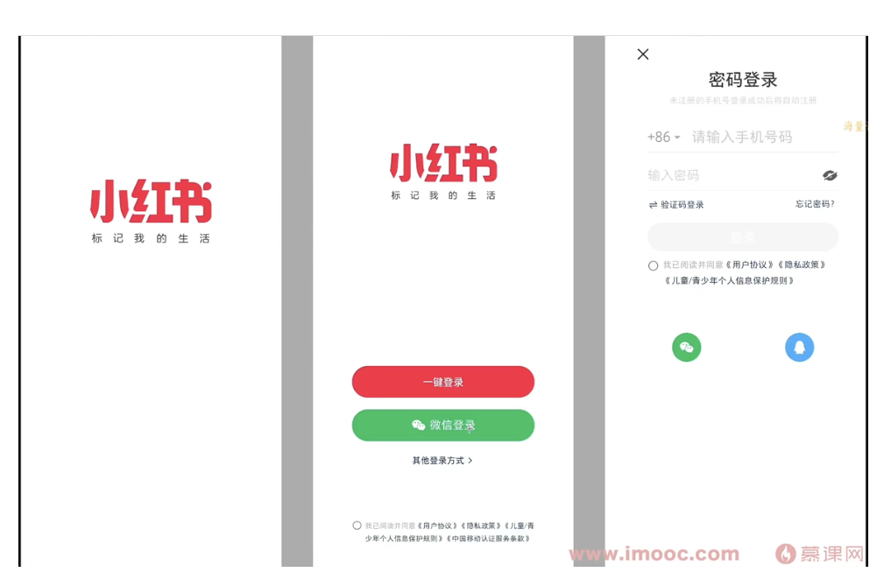

# 16-仿写小红书

## 01- 项目初始化

### 初始化项目

```bash
npx react-native init RedBookDemo
```

此时最终运行`npm run start` 选择 `a` => andorid 后可以在模拟器中看到如下界面


### 修改应用姓名

RedBookDemo/android/app/src/main/res/values/strings.xml

```xml
// 修改为如下代码
<resources>
    <string name="app_name">小红书</string>
</resources>
```

也可以通过以下路径来修改 applicationId

`RedBookDemo/android/app/build.gradle`

```gradle
defaultConfig {
  applicationId "com.redbookdemo"
}
```

### 修改应用图标

路径：`RedBookDemo/android/app/src/main/res`

导入相关静态资源文件

* 新建 `RedBookDemo/src/assets` 文件夹，并把需要的文件放进去即可

## 02：项目配置 TS 和 AsyncStorage

### 安装 TS

* 安装 TS

  ```shell
  npm install --save-dev typescript
  ```

* 生成 tsconfig.json
  ```shell
  tsc --init
  ```

* 安装类型声明（众多）

  ```shell
  npm install --save-dev @types/react @types/react-native
  ```

 ### 安装 AsyncStorage

* 集成 async-storage
  * `@react-native-async-storage/async-storage`

* 保存数据：AsyncStorage.setItem()
* 读取数据：AsyncStorage.getItem()

新建`RedBookDemo/src/utils/Storage.ts` 文件，内容如下

```typescript
import AsyncStorage from '@react-native-async-storage/async-storage';

export const saveData = async (key: string, value: string) => {
  return await AsyncStorage.setItem(key, value);
};

export const getData = async (key: string) => {
  return await AsyncStorage.getItem(key);
};

export const removeData = async (key: string) => {
  return await AsyncStorage.removeItem(key);
};

export const clearData = async () => {
  return await AsyncStorage.clear();
};
```

## 03：路由管理安装和介绍

### 集成 react-navigation

```shell
npm install @react-navigation/bottom-tabs
npm install @react-navigation/native
npm install @react-navigation/stack
npm install react-native-gesture-handler
npm install react-native-safe-area-context
npm install react-native-screens
```

### 构建导航栈

* 在 App.tsx 根节点构建导航栈
* 配置导航栈属性

### 代码内容如下

`app.tsx`

```jsx

import React from 'react';
import {StatusBar, useColorScheme} from 'react-native';
import {Colors} from 'react-native/Libraries/NewAppScreen';
import {SafeAreaProvider} from 'react-native-safe-area-context';
import {NavigationContainer} from '@react-navigation/native';
import {TransitionPresets, createStackNavigator} from '@react-navigation/stack';
import PageA from './src/modules/PageA';
import PageB from './src/modules/PageB';
const Stack = createStackNavigator();
function App(): React.JSX.Element {
  const isDarkMode = useColorScheme() === 'dark';

  const backgroundStyle = {
    backgroundColor: isDarkMode ? Colors.darker : Colors.lighter,
  };

  return (
    <SafeAreaProvider>
      <StatusBar
        barStyle={isDarkMode ? 'light-content' : 'dark-content'}
        backgroundColor={backgroundStyle.backgroundColor}
      />
      <NavigationContainer>
        <Stack.Navigator
          initialRouteName="PageA1"
          screenOptions={{
            cardStyle: {elevation: 1},
          }}>
          <Stack.Screen
            name="PageA1"
            component={PageA}
            options={{
              headerShown: false,
            }}
          />
          <Stack.Screen
            name="PageB1"
            component={PageB}
            options={{...TransitionPresets.SlideFromRightIOS}}
          />
        </Stack.Navigator>
      </NavigationContainer>
    </SafeAreaProvider>
  );
}

export default App;
```

`./src/modules/PageB`

```jsx
import React from 'react';
import {View, Text} from 'react-native';

export default () => {
  return (
    <View>
      <Text>Page B</Text>
    </View>
  );
};
```

`./src/modules/PageA`

```jsx
import React from 'react';
import {View, Text, Button} from 'react-native';
import {useNavigation} from '@react-navigation/native';
import {StackNavigationProp} from '@react-navigation/stack/lib/typescript/src/types';

export default () => {
  const navigation = useNavigation<StackNavigationProp<any>>();
  const myHandler = () => {
    // if (na`vigation.canGoBack) {
    //   navigation.goBack();
    // }
    navigation.push('PageB1');
    // navigation.replace('PageB1');
  };
  return (
    <View>
      <Text>Page A</Text>
      <Button title="点击跳转" onPress={myHandler} />
    </View>
  );
};
```

## 04: 欢迎页面、登录页面

* 开发欢迎页面、并设置 3秒倒计时
* 开发登录页面，并设置 3秒倒计时
* 三页面连续跳转

设计图如下



后续会使用到动画

`index.js` 中需要先进项开启

[layoutanimation](https://reactnative.cn/docs/layoutanimation)

```jsx
import { UIManager } from 'react-native';

if (Platform.OS === 'android') {
  if (UIManager.setLayoutAnimationEnabledExperimental) {
    UIManager.setLayoutAnimationEnabledExperimental(true);
  }
}
```

`App.tsx`

```jsx
import React from 'react';
import {StatusBar, useColorScheme} from 'react-native';
import {Colors} from 'react-native/Libraries/NewAppScreen';
import {SafeAreaProvider} from 'react-native-safe-area-context';
import {NavigationContainer} from '@react-navigation/native';
import {TransitionPresets, createStackNavigator} from '@react-navigation/stack';
import Welcome from './src/modules/Welcome';
import Login from './src/modules/Login';

const Stack = createStackNavigator();
function App(): React.JSX.Element {
  const isDarkMode = useColorScheme() === 'dark';

  const backgroundStyle = {
    backgroundColor: isDarkMode ? Colors.darker : Colors.lighter,
  };

  return (
    <SafeAreaProvider>
      <StatusBar
        barStyle={isDarkMode ? 'light-content' : 'dark-content'}
        backgroundColor={backgroundStyle.backgroundColor}
      />
      <NavigationContainer>
        <Stack.Navigator
          initialRouteName="Welcome"
          screenOptions={{
            cardStyle: {elevation: 1},
          }}>
          <Stack.Screen
            name="Welcome"
            component={Welcome}
            options={{
              headerShown: false,
            }}
          />
          <Stack.Screen
            name="Login"
            component={Login}
            options={{
              headerShown: false,
              ...TransitionPresets.SlideFromRightIOS,
            }}
          />
        </Stack.Navigator>
      </NavigationContainer>
    </SafeAreaProvider>
  );
}

export default App;
```

`src/modules/Welcome`

3s 后自动跳转登录页面

```jsx
import React, {useEffect} from 'react';
import {View, Image, StyleSheet} from 'react-native';
import {useNavigation} from '@react-navigation/native';
import {StackNavigationProp} from '@react-navigation/stack/lib/typescript/src/types';
import MainLogoIcon from '../assets/icon_main_logo.png';
export default () => {
  const navigation = useNavigation<StackNavigationProp<any>>();
  useEffect(() => {
    setTimeout(() => {
      navigation.replace('Login');
    }, 3000);
  });
  const styles = StyleSheet.create({
    root: {
      width: '100%',
      height: '100%',
      display: 'flex',
      alignItems: 'center',
      justifyContent: 'center',
      backgroundColor: '#fff',
    },
    mainLogo: {
      width: 200,
      height: 100,
      resizeMode: 'contain',
      marginTop: -100,
    },
  });
  return (
    <View style={styles.root}>
      <Image source={MainLogoIcon} style={styles.mainLogo} />
    </View>
  );
};
```

`/src/modules/Login`

```jsx
import React, {useState} from 'react';
import {
  View,
  Text,
  Image,
  StyleSheet,
  TouchableOpacity,
  Linking,
  TextInput,
  LayoutAnimation,
} from 'react-native';
import MainLogoIcon from '../assets/icon_main_logo.png';
import SelectIcon from '../assets/icon_selected.png';
import UnSelectIcon from '../assets/icon_unselected.png';
import IconArrow from '../assets/icon_arrow.png';
import IconWeixinSmall from '../assets/icon_wx_small.png';
import IconClose from '../assets/icon_close_modal.png';
import IconTriangle from '../assets/icon_triangle.png';
import IconEyeClose from '../assets/icon_eye_close.png';
import IconEyeOpen from '../assets/icon_eye_open.png';
import IconExchange from '../assets/icon_exchange.png';
import IconWeixin from '../assets/icon_wx.png';
import IconQQ from '../assets/icon_qq.webp';

const OneKeyLogin = (props: any) => {
  const [selectedFlag, setSelectFlag] = useState(false);
  const styles = StyleSheet.create({
    root: {
      width: '100%',
      height: '100%',
      backgroundColor: '#fff',
      display: 'flex',
      alignItems: 'center',
      flexDirection: 'column',
      paddingHorizontal: 50,
      paddingTop: 20,
    },
    mainLogo: {
      width: 200,
      height: 200,
      resizeMode: 'contain',
    },
    content: {
      width: '100%',
      flex: 2,
      flexDirection: 'column-reverse',
      paddingBottom: 30,
    },
    footer: {
      display: 'flex',
      flexDirection: 'row',
      textAlign: 'left',
      alignItems: 'flex-start',
    },
    footerIcon: {
      width: 15,
      height: 15,
      marginRight: 5,
    },
    footerText: {
      flexDirection: 'row',
      flex: 2,
      width: '100%',
    },
    text1: {
      fontSize: 12,
      color: '#999',
      height: 15,
      lineHeight: 15,
    },
    text2: {
      fontSize: 12,
      textAlign: 'left',
      width: 200,
      lineHeight: 15,
      color: '#333',
      flexWrap: 'wrap',
    },
    otherTypeView: {
      flexDirection: 'row',
      alignItems: 'center',
      marginBottom: 60,
      justifyContent: 'center',
    },
    otherTypeText: {
      fontSize: 10,
      color: '#333',
      lineHeight: 20,
      marginRight: 5,
      fontWeight: 'bold',
    },
    arrowIcon: {
      width: 8,
      height: 8,
      transform: [{rotate: '180deg'}],
      resizeMode: 'contain',
    },
    btnView: {
      height: 40,
      lineHeight: 40,
      textAlign: 'center',
      marginBottom: 15,
      flexDirection: 'row',
      alignItems: 'center',
      justifyContent: 'center',
      borderRadius: 20,
    },
    redBg: {
      backgroundColor: 'red',
    },
    wxBg: {
      backgroundColor: 'green',
    },
    btIcon: {
      width: 24,
      height: 24,
      marginRight: 5,
      resizeMode: 'contain',
    },
    btnText: {
      lineHeight: 15,
      color: '#fff',
      height: 15,
    },
  });

  return (
    <View style={styles.root}>
      <Image source={MainLogoIcon} style={styles.mainLogo} />
      <View style={styles.content}>
        <View style={styles.footer}>
          <TouchableOpacity onPress={() => setSelectFlag(!selectedFlag)}>
            <Image
              style={styles.footerIcon}
              source={selectedFlag ? SelectIcon : UnSelectIcon}
            />
          </TouchableOpacity>
          <Text style={styles.footerText}>
            <Text style={styles.text1}>我已阅读并同意</Text>
            <Text style={styles.text2} textBreakStrategy="simple">
              <Text
                style={styles.text2}
                onPress={() => {
                  Linking.openURL('https://www.baidu.com/');
                }}>
                《用户协议》
              </Text>
              <Text style={styles.text2}>《隐私协议》</Text>
              <Text style={styles.text2}>《儿童/青少年个人信息保护法》</Text>
              <Text style={styles.text2}>《中国移动认证服务条款》</Text>
            </Text>
          </Text>
        </View>

        <TouchableOpacity
          style={styles.otherTypeView}
          onPress={() => {
            LayoutAnimation.easeInEaseOut();
            props.changeLoginType('inputType');
          }}>
          <Text style={styles.otherTypeText}>其他登录方式</Text>
          <Image style={styles.arrowIcon} source={IconArrow} />
        </TouchableOpacity>

        <TouchableOpacity style={[styles.btnView, styles.wxBg]}>
          <Image style={styles.btIcon} source={IconWeixinSmall} />
          <Text style={styles.btnText}>微信登录</Text>
        </TouchableOpacity>

        <TouchableOpacity style={[styles.btnView, styles.redBg]}>
          <Text style={styles.btnText}>一键登录</Text>
        </TouchableOpacity>
      </View>
    </View>
  );
};

const InputLoginView = (props: any) => {
  const styles = StyleSheet.create({
    root: {
      width: '100%',
      height: '100%',
      paddingHorizontal: 50,
      paddingTop: 20,
    },
    closeIcon: {
      width: 25,
      height: 25,
      resizeMode: 'contain',
    },
    titleText: {
      fontWeight: 'bold',
      fontSize: 20,
      textAlign: 'center',
      marginBottom: 5,
    },
    titleTips: {
      fontSize: 12,
      color: '#999',
      textAlign: 'center',
      marginBottom: 30,
    },
    phoneView: {
      borderBottomColor: '#ccc',
      borderBottomWidth: 1,
      paddingVertical: 0,
      flexDirection: 'row',
      alignItems: 'center',
      paddingBottom: 5,
      marginBottom: 10,
    },
    phoneIcon: {
      width: 10,
      height: 10,
      resizeMode: 'contain',
      marginRight: 10,
    },
    eyeIcon: {
      width: 18,
      height: 18,
      resizeMode: 'contain',
      marginRight: 10,
    },
    phoneInput: {
      flex: 2,
      height: 30,
      lineHeight: 30,
      padding: 0,
      fontSize: 18,
      paddingHorizontal: 10,
    },
    tipsContainer: {
      flexDirection: 'row',
      alignItems: 'center',
      marginBottom: 20,
    },
    iconExchange: {
      width: 15,
      height: 15,
      resizeMode: 'contain',
    },
    tipsText: {
      fontSize: 12,
      color: '#666',
      lineHeight: 15,
    },
    tipsMiddle: {
      flex: 2,
      marginLeft: 5,
    },
    loginBtn: {
      marginBottom: 10,
    },
    loginText: {
      textAlign: 'center',
      width: '100%',
      height: 40,
      lineHeight: 40,
      color: '#fff',
      backgroundColor: '#007AFF',
      borderRadius: 20,
    },
    agreeTips: {
      alignItems: 'flex-start',
      flexDirection: 'row',
      marginBottom: 50,
    },
    footerIcon: {
      width: 15,
      height: 15,
      marginRight: 5,
      resizeMode: 'contain',
      marginTop: 3,
    },
    tipsTextContainer: {
      fontSize: 12,
      lineHeight: 20,
    },
    grayText: {
      color: '#999',
    },
    protoText: {
      color: '#333',
    },
    iconContainer: {
      flexDirection: 'row',
      alignItems: 'center',
      justifyContent: 'space-around',
    },
    icon: {
      width: 40,
      height: 40,
      resizeMode: 'contain',
    },
  });
  const [showPsw, setShowPsw] = useState(false);
  const [selectedFlag, setSelectFlag] = useState(false);
  return (
    <View style={styles.root}>
      <TouchableOpacity
        onPress={() => {
          LayoutAnimation.easeInEaseOut();
          props.changeLoginType('oneKeyLogin');
        }}>
        <Image style={styles.closeIcon} source={IconClose} />
      </TouchableOpacity>
      <Text style={styles.titleText}>密码登录</Text>
      <Text style={styles.titleTips}>未注册的手机号登录成功后将自动注册</Text>
      <View style={styles.phoneView}>
        <Text>+86</Text>
        <Image style={styles.phoneIcon} source={IconTriangle} />
        <TextInput
          maxLength={11}
          style={styles.phoneInput}
          placeholder="请输入手机号"
        />
      </View>
      <View style={styles.phoneView}>
        <TextInput
          style={styles.phoneInput}
          placeholder="输入密码"
          secureTextEntry={showPsw ? false : true}
        />
        <TouchableOpacity
          onPress={() => {
            setShowPsw(!showPsw);
          }}>
          <Image
            style={styles.eyeIcon}
            source={showPsw ? IconEyeOpen : IconEyeClose}
          />
        </TouchableOpacity>
      </View>
      <View style={styles.tipsContainer}>
        <Image style={styles.iconExchange} source={IconExchange} />
        <Text style={[styles.tipsText, styles.tipsMiddle]}>验证码登录</Text>
        <Text style={styles.tipsText}>忘记密码?</Text>
      </View>
      <TouchableOpacity style={styles.loginBtn}>
        <Text style={styles.loginText}>登录</Text>
      </TouchableOpacity>
      <View style={styles.agreeTips}>
        <TouchableOpacity onPress={() => setSelectFlag(!selectedFlag)}>
          <Image
            style={styles.footerIcon}
            source={selectedFlag ? SelectIcon : UnSelectIcon}
          />
        </TouchableOpacity>
        <Text style={styles.tipsTextContainer}>
          <Text style={styles.grayText}>我已阅读并同意</Text>
          <Text style={styles.protoText}>《用户协议》</Text>
          <Text style={styles.protoText}>《隐私政策》</Text>
          <Text style={styles.protoText}>《儿童/青少年个人信息保护规则》</Text>
        </Text>
      </View>
      <View style={styles.iconContainer}>
        <Image style={styles.icon} source={IconWeixin} />
        <Image style={styles.icon} source={IconQQ} />
      </View>
    </View>
  );
};

export default () => {
  const [loginType, setLoginType] = useState('oneKeyLogin');
  return loginType === 'inputType' ? (
    <InputLoginView changeLoginType={setLoginType} />
  ) : (
    <OneKeyLogin changeLoginType={setLoginType} />
  );
};
```

