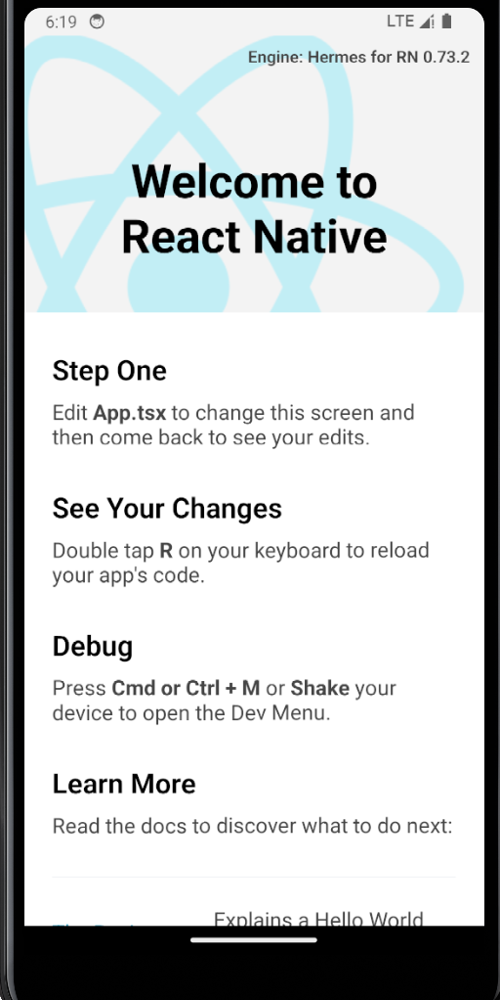

# 16-仿写小红书

## 01- 项目初始化

### 初始化项目

```bash
npx react-native init RedBookDemo
```

此时最终运行`npm run start` 选择 `a` => andorid 后可以在模拟器中看到如下界面



### 修改应用姓名

RedBookDemo/android/app/src/main/res/values/strings.xml

```xml
// 修改为如下代码
<resources>
    <string name="app_name">小红书</string>
</resources>
```

也可以通过以下路径来修改 applicationId

`RedBookDemo/android/app/build.gradle`

```gradle
defaultConfig {
  applicationId "com.redbookdemo"
}
```

### 修改应用图标

路径：`RedBookDemo/android/app/src/main/res`

导入相关静态资源文件

* 新建 `RedBookDemo/src/assets` 文件夹，并把需要的文件放进去即可

## 02：项目配置 TS 和 AsyncStorage

### 安装 TS

* 安装 TS

  ```shell
  npm install --save-dev typescript
  ```

* 生成 tsconfig.json
  ```shell
  tsc --init
  ```

* 安装类型声明（众多）

  ```shell
  npm install --save-dev @types/react @types/react-native
  ```

 ### 安装 AsyncStorage

* 集成 async-storage
  * `@react-native-async-storage/async-storage`

* 保存数据：AsyncStorage.setItem()
* 读取数据：AsyncStorage.getItem()

新建`RedBookDemo/src/utils/Storage.ts` 文件，内容如下

```typescript
import AsyncStorage from '@react-native-async-storage/async-storage';

export const saveData = async (key: string, value: string) => {
  return await AsyncStorage.setItem(key, value);
};

export const getData = async (key: string) => {
  return await AsyncStorage.getItem(key);
};

export const removeData = async (key: string) => {
  return await AsyncStorage.removeItem(key);
};

export const clearData = async () => {
  return await AsyncStorage.clear();
};
```

## 03：路由管理安装和介绍

### 集成 react-navigation

```shell
npm install @react-navigation/bottom-tabs
npm install @react-navigation/native
npm install @react-native/stack
npm install react-native-gesture-handler
npm install react-native-safe-area-context
npm install react-native-screens
```

### 构建导航栈

* 在 App.tsx 根节点构建导航栈
* 配置导航栈属性
* 
