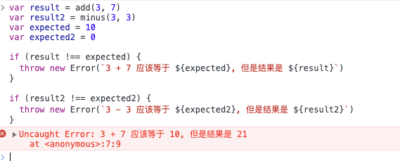
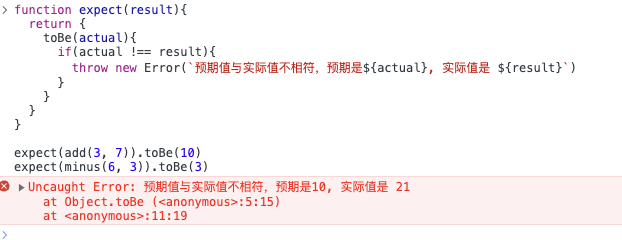
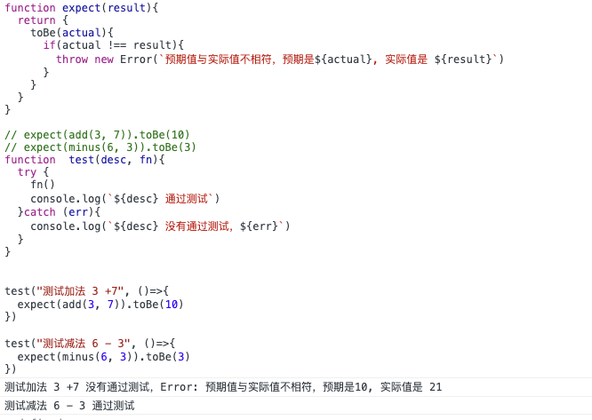
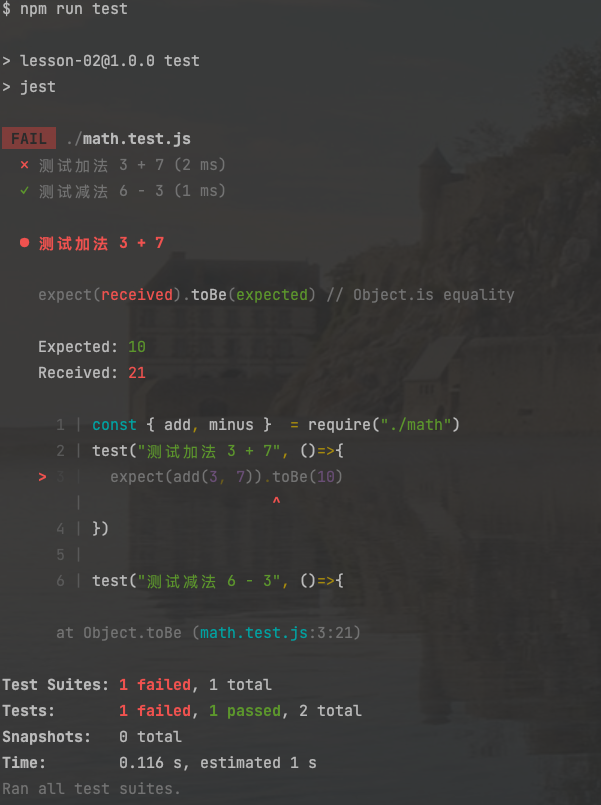
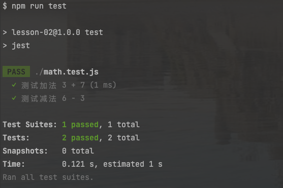
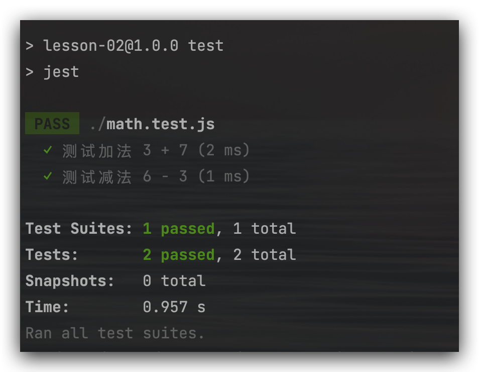

# 02-Jest 前端自动化测试框架基础入门

## 01 自动化测试背景及原理

> 日常生活中我们会遇到各种各样的bug，比如：安全性的 bug、逻辑上的 bug、性能上的 bug、展示bug。不出现 bug 是不可能的。bug本身并不可怕，可怕的是把 bug 真正带到了线上。

为了防止bug上线，目前惯有的采取的措施有什么呢？

* code review 的代码整合
* 测试小伙伴的测试验证
* 通过灰度发布的机制，在上线玩做一些局部的验证
* 还有其他
  * `TS、flow、Eslint、styleLint`
* 当前还可以使用**自动化测试**

下面，一步一步来实现自动化测试逻辑

假如我们有一个 js 工具库，内容如下

```javascript
function add(a, b) {
  return a + b
}

function minus(a, b) {
  return a - b
}
```

有一个 index.html 文件对其进行引用

```html
<!DOCTYPE html>
<html lang="en">
  <head>
    <meta charset="UTF-8" />
    <meta name="viewport" content="width=device-width, initial-scale=1.0" />
    <title>Document</title>
  </head>
  <body></body>
  <script src="./math.js"></script>
</html>
```

1. 假如我们有一个如下的测试文件，内容如下

   ```javascript
   // math.test.js
   var result = add(3, 7)
   var result2 = minus(3, 3)
   var expected = 10
   var expected2 = 0
   
   if (result !== expected) {
     throw new Error(`3 + 7 应该等于 ${expected}, 但是结果是 ${result}`)
   }
   
   if (result2 !== expected2) {
     throw new Error(`3 - 3 应该等于 ${expected2}, 但是结果是 ${result2}`)
   }
   ```

   打开`index.html`至浏览器中，然后复制 `math.test.js` 中的内容进入浏览器控制台中，结果没有报错

   假如目前有人不小心把功能库 `add` 函数改为了如下代码

   ```javascript
   function add(a, b) {
     return a * b
   }
   ```

   再次刷新 `index.html`, 然后重新复制 测试函数 `math.test.js` 内容到浏览器控制台中，结果如下，就会发现报错，然后进行排查修复。

   

2. 上述测试代码有太多的重复内容，如果工具库中增加了函数，又要新加一堆的逻辑，能不能进行封装处理呢？答案当然是可以的

   ```javascript
   function expect(result){
     return {
       toBe(actual){
         if(actual !== result){
           throw new Error(`预期值与实际值不相符，预期是${actual}, 实际值是 ${result}`)
         }
       }
     }
   }
   
   expect(add(3, 7)).toBe(10)
   expect(minus(6, 3)).toBe(3)
   ```

   重新复制上述代码到浏览器控制台中，结果如下，就会发现报错，然后进行排查修复。

   

   但是目前这个错误提示，并不能看出来，是哪一个函数的提示，我们接着进行优化

3. 优化如下结果

   ```javascript
   function expect(result){
     return {
       toBe(actual){
         if(actual !== result){
           throw new Error(`预期值与实际值不相符，预期是${actual}, 实际值是 ${result}`)
         }
       }
     }
   }
   
   function  test(desc, fn){
     try {
       fn()
       console.log(`${desc} 通过测试`)
     }catch (err){
       console.log(`${desc} 没有通过测试，${err}`)
     }
   }
   
   test("测试加法 3 +7", ()=>{
     expect(add(3, 7)).toBe(10)
   })
   
   test("测试减法 6 - 3", ()=>{
     expect(minus(6, 3)).toBe(3)
   })
   ```

   重新复制上述代码到浏览器控制台中，结果如下，就会发现报错，然后进行排查修复。

   > 如下错误，我们即可知道是哪个函数出错了，并且也知道出了什么问题

   

## 02：前端自动化测试框架 Jest

> Jasmine、Mocha、Chai、Jest

前端测试框架的应该在以下几点应该比较突出

* 性能
* 功能
* 易用性

### Jest 的优点

* 速度快
* API 简单
* 易配置
* 隔离性好
* 监控模式
* IDE 整合
* Snapshot
* 多项目并行
* 覆盖率
* Mock 丰富

## 03: 使用 Jest 修改自动化测试样例

> 我们这一节对上一节的代码进行用 jest 框架来改造

1. 新建文件夹`lesson-02`, 在内部进行 npm 初始化，然后一路回车即可

   ```shell
   npm init 
   ```

2. 安装 jest 库

   ```shell
   npm install jest -D
   ```

3. 修改`package.json`，添加如下脚本

   ```json
   {
     "scripts": {
       "test": "jest"
     },
   }
   ```

4. 新增`math.js`内容如下

   ```javascript
   function add(a, b) {
     return a * b // 注意：这里故意写错了
   }
   
   function minus(a, b) {
     return a - b
   }
   
   module.exports = {
     add,
     minus
   }
   ```

5. 新建`math.test.js`，内容如下

   ```javascript
   const { add, minus }  = require("./math")
   test("测试加法 3 + 7", ()=>{
     expect(add(3, 7)).toBe(10)
   })
   
   test("测试减法 6 - 3", ()=>{
     expect(minus(6, 3)).toBe(3)
   })
   ```

6. 在终端运行`npm run test`, 可以看到控制台中如下结果

   

7. 修改`math.js`中的 `add` 函数

   ```javascript
   function add(a, b) {
     return a + b
   }
   ```

8. 重新运行`npm run test`, 结果如下

   

## 04: Jest 的简单配置

## 04: Jest 的简单配置

Jest 将根据你的项目提出一系列问题，并且将创建一个基础配置文件。文件中的每一项都配有简短的说明：

```shell
npx jest --init
```

[Jest 配置解读](https://juejin.cn/post/7003595612977365028)

如果想在项目中，使用 ES Module 语法，比如更改`math.js`为如下语法

```javascript
export function add(a, b) {
 return a + b
}

export function minus(a, b) {
 return a - b
}
```

同样，`math.test.js`也需要进行调整更改

```javascript
import { add, minus } from './math'
test("测试加法 3 + 7", ()=>{
  expect(add(3, 7)).toBe(10)
})

test("测试减法 6 - 3", ()=>{
  expect(minus(6, 3)).toBe(3)
})
```

此时如果直接运行`npm run test`就会报错

```shell
 import { add, minus } from './math';
    ^^^^^^

SyntaxError: Cannot use import statement outside a module
```

显然 jest 不能识别 import 语法

此处要是用到了 babel, 安装依赖

```shell
npm install --save-dev @babel/core @babel/preset-env
```

在项目的根目录下创建 `babel.config.js` ，通过配置 Babel 使其能够兼容当前的 Node 版本。

```javascript
// babel.config.js
module.exports = {
  presets: [
    ['@babel/preset-env', {
      targets: {
          node: 'current'
        }
      }
    ]
  ],
};
```

接着再次运行 `npm run test`, 就会发现运行成功了



## 05: Jest 中的匹配器

### [Common Matchers](https://www.jestjs.cn/docs/using-matchers#common-matchers)

**toBe匹配器**

```javascript
test('two plus two is four', () => {
  expect(2 + 2).toBe(4);
});
```

但是如果，如果比较对象的话，如下

```javascript
test('isEqual', () => {
  const a = { name: '1'}
  expect(a).toBe({ name: '1'}); // 这里结果是 false，因为这里引用地址不一致
});
```

**toEqual**

如果要比较对象，我们使用 `toEqual`

```javascript
test('object assignment', () => {
  const data = {one: 1};
  data['two'] = 2;
  expect(data).toEqual({one: 1, two: 2});
});
```

### [Truthiness](https://www.jestjs.cn/docs/using-matchers#truthiness)

* `toBeNull` matches only `null`

* `toBeUndefined` matches only `undefined`

* `toBeDefined` is the opposite of `toBeUndefined`

* `toBeTruthy` matches anything that an `if` statement treats as true

* `toBeFalsy` matches anything that an `if` statement treats as false

```javascript
test('null', () => {
  const n = null;
  expect(n).toBeNull();
  expect(n).toBeDefined();
  expect(n).not.toBeUndefined();
  expect(n).not.toBeTruthy();
  expect(n).toBeFalsy();
});

test('zero', () => {
  const z = 0;
  expect(z).not.toBeNull();
  expect(z).toBeDefined();
  expect(z).not.toBeUndefined();
  expect(z).not.toBeTruthy();
  expect(z).toBeFalsy();
});
```

### [Numbers](https://www.jestjs.cn/docs/using-matchers#numbers)

数字先关的匹配器

* `toBeGreaterThan`
* `toBeGreaterThanOrEqual`
* `toBeLessThan`
* `toBeLessThanOrEqual`
* ...

```javascript
test('two plus two', () => {
  const value = 2 + 2;
  expect(value).toBeGreaterThan(3);
  expect(value).toBeGreaterThanOrEqual(3.5);
  expect(value).toBeLessThan(5);
  expect(value).toBeLessThanOrEqual(4.5);

  // toBe and toEqual are equivalent for numbers
  expect(value).toBe(4);
  expect(value).toEqual(4);
});
```

对于浮点小数的相等，可以使用 `toBeCloseTo` 代替 `toEqual`

```javascript
test('adding floating point numbers', () => {
  const value = 0.1 + 0.2;
  //expect(value).toBe(0.3);           This won't work because of rounding error
  expect(value).toBeCloseTo(0.3); // This works.
});
```

### [Strings](https://www.jestjs.cn/docs/using-matchers#strings)

* `toMatch`

```javascript
test('there is no I in team', () => {
  expect('team').not.toMatch(/I/);
});

test('but there is a "stop" in Christoph', () => {
  expect('Christoph').toMatch(/stop/);
});
```

### [Arrays and iterables](https://www.jestjs.cn/docs/using-matchers#arrays-and-iterables)

* `toContain`

```javascript
const shoppingList = [
  'diapers',
  'kleenex',
  'trash bags',
  'paper towels',
  'milk',
];

test('the shopping list has milk on it', () => {
  expect(shoppingList).toContain('milk');
  expect(new Set(shoppingList)).toContain('milk');
});
```

### [Exceptions](https://www.jestjs.cn/docs/using-matchers#exceptions)

If you want to test whether a particular function throws an error when it's called, use `toThrow`.

```javascript
function compileAndroidCode() {
  throw new Error('you are using the wrong JDK!');
}

test('compiling android goes as expected', () => {
  expect(() => compileAndroidCode()).toThrow();
  expect(() => compileAndroidCode()).toThrow(Error);

  // You can also use a string that must be contained in the error message or a regexp
  expect(() => compileAndroidCode()).toThrow('you are using the wrong JDK');
  expect(() => compileAndroidCode()).toThrow(/JDK/);

  // Or you can match an exact error mesage using a regexp like below
  expect(() => compileAndroidCode()).toThrow(/^you are using the wrong JDK$/); // Test fails
  expect(() => compileAndroidCode()).toThrow(/^you are using the wrong JDK!$/); // Test pass
});
```

## 06: Jest 命令行工具的使用

### jest -watch

> jest-watch-options
>
> ```shell
> Watch Usage
>  › Press a to run all tests.
>  › Press f to run only failed tests.
>  › Press p to filter by a filename regex pattern.
>  › Press t to filter by a test name regex pattern.
>  › Press q to quit watch mode.
>  › Press Enter to trigger a test run.
> ```

* `a` is equivalent to running `jest --watchAll`, which means it runs *all* tests, not just those since last commit.
* `f` is useful for focusing only on broken tests
* `p` is a way to filter quickly to specific test files
* `t` is similar to `p` but looks at the test title, i.e., the part that’s in quotes after `it` or `describe`
* `q` exits watch mode
* `enter` will trigger a re-run (useful, though the point of watch is that Jest will re-run any time there’s a meaningful change to files *within* scope of the current filters).
* (Not shown) During a test run, press *any* key to interrupt the run and returning to the watch mode menu. Useful if the test run is taking too long and you want to narrow for example, or the filters are wrong and you want to adjust them.

## 07: 异步代码的测试方法 (1)

### Promises

Return a promise from your test, and Jest will wait for that promise to resolve. If the promise is rejected, the test will fail.

```javascript
test('the data is peanut butter', () => {
  return fetchData().then(data => {
    expect(data).toBe('peanut butter');
  });
});
```

### Async/Await

或者，你也可以在你的测试用例中使用 async/await ，当然你需要在回调前使用 `async` 关键词

```javascript
test('the data is peanut butter', async () => {
  const data = await fetchData();
  expect(data).toBe('peanut butter');
});

test('the fetch fails with an error', async () => {
  expect.assertions(1);
  try {
    await fetchData();
  } catch (e) {
    expect(e).toMatch('error');
  }
});
```

当然你也可以使用 .resolves 或者 .rejects

```javascript
test('the data is peanut butter', async () => {
  await expect(fetchData()).resolves.toBe('peanut butter');
});

test('the fetch fails with an error', async () => {
  await expect(fetchData()).rejects.toMatch('error');
});
```

如果你预计`Promis` 会被拒绝，请使用 `.catch`方法。确保添加`expect.assertions`以验证是否调用了一定数量的断言。否则，履行的承诺就不会通过测试。

```javascript
test('the fetch fails with an error', () => {
  expect.assertions(1);
  return fetchData().catch(e => expect(e).toMatch('error'));
});
```

### [Callbacks](https://jestjs.io/docs/asynchronous#callbacks)

如果你不想使用 `promises`, 你可以使用回调 `callbacks`. 参数为 `done`, Jest 将等到`done`回调被调用后再完成测试。

```javascript
test('the data is peanut butter', done => {
  function callback(error, data) {
    if (error) {
      done(error);
      return;
    }
    try {
      expect(data).toBe('peanut butter');
      done();
    } catch (error) {
      done(error);
    }
  }

  fetchData(callback);
});
```

如果 done 函数从没有被调用，这个测试将会失败(以超时错误结束)。

如果 expect 语句失败了，那么它会抛出一个错误，并且不会调用 done 函数。如果你想在日志中查看它为什么失败了，我们不得不在 expect 外面加一层 try.catch 块，然后再 catch 块中 触发 done。 否则，我们将得到一个不透明的超时错误，该错误不会显示 expect(data) 接收到的值。

## 08: 异步代码的测试方法 (2)

### .resolves/.rejects

你也可以使用在你的 expect 语句中使用 resolves, 那么 jest 将会等待 promise 被处理。如果这个 promise 被拒绝了，那么这个测试将自动失败

```javascript
test('the data is peanut butter', () => {
  return expect(fetchData()).resolves.toBe('peanut butter');
});
```

如果你期望一个 promise 被拒绝，使用 .reject 匹配器。类似于 .resolves 匹配器

```javascript
test('the fetch fails with an error', () => {
  return expect(fetchData()).rejects.toMatch('error');
});
```

## 09: Jest 中的钩子函数


## 10: 钩子函数的作用域

## 11: Jest 中的 Mock（1）

## 12: Jest 中的 Mock（2）

## 13: 章节小结

## 14:【讨论题】关于前端自动化测试，你有多少了解呢？
