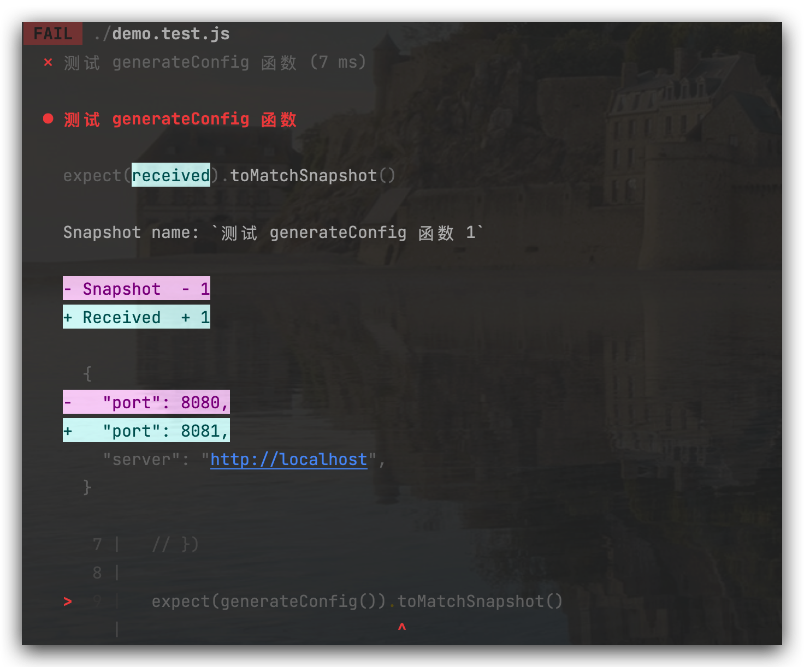
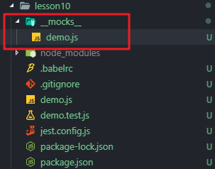
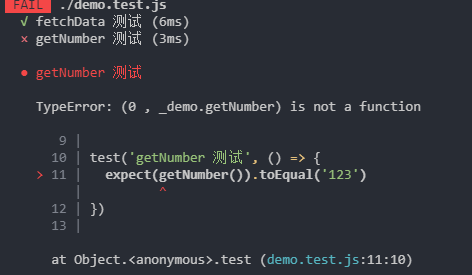
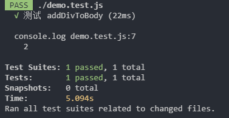

# 03-Jest难点进阶

> 本章主要讲解 Jest中 snapshot 以及高级 mock 技巧，帮助大家深入理解在不同情况下，如何使用高级知识点完成不同的测试需求。

## 01: snapshot 快照测试

### toMatchSnapshot

第一次进行快照测试后，会保存一个快照文件。再次进行快照测试后，会检测新的快照是否与之前保存的快照文件相匹配。如果不匹配，就会进行报错提示
比如如下代码

```javascript
// demo.js
export const generateConfig = () => {
  return {
    server: "http://localhost",
    port: 8080
  }
}
```

对应的测试文件

```javascript
// demo.test.js
import { generateConfig } from "./demo"

test('测试 generateConfig 函数', () => {
  expect(generateConfig()).toEqual({
    server: "http://localhost",
    port: 8080
  })
})
```

此时如果运行`npm run test`就会通过

以上过程未免过于麻烦，比如：如果更改了`demo.js`中的配置信息，我们需要相应的在`demo.test.js`中进行修改，过于繁琐，使用快照测试就可以避免这种麻烦

修改`demo.test.js`文件

```javascript
// demo.test.js
import { generateConfig } from "./demo"

test('测试 generateConfig 函数', () => {
  expect(generateConfig()).toMatchSnapshot()
})
```

此时如果运行`npm run test`就会通过，并产生一个`__snapshots__/demo.test.js.snap`文件，内容如下

```javascript
// Jest Snapshot v1, https://goo.gl/fbAQLP

exports[`测试 generateConfig 函数 1`] = `
{
  "port": 8080,
  "server": "http://localhost",
}
`;
```

此时如果更改了`demo.js`文件，比如改为如下代码

```javascript
export const generateConfig = () => {
  return {
    server: "http://localhost",
    port: 8081 // 更改为 8081
  }
}
```

再次运行`npm run test`,就会报错，错误如下



后面还有一句话: 检查你的代码更改的或者 运行`npm test --u` 来更新他们，使下次测试不会报错

```text
Snapshot Summary
 › 1 snapshot failed from 1 test suite. Inspect your code changes or run `npm test -- -u` to update them.
```

如果我们的代码中有一个动态数据，比如如下

```javascript
// demo.js
export const generateAppConfig = () => {
  return {
    server: "http://localhost",
    port: 8082,
    time: new Date() // 每次运行测试，都是一个新的时间
  }
}
```

```javascript
// demo.test.js
test( '测试 generateAppConfig 函数', () => {
  expect(generateAppConfig()).toMatchSnapshot();
})
```

对于上述代码，我们执行`npm run test`还是`npm run test -u` 后再次运行`npm run test`，结果都是测试不通过。因为时间和快照时间不一致，那么怎么办呢？我们需要更改测试代码如下

```javascript
test( '测试 generateAppConfig 函数', () => {
  expect(generateAppConfig()).toMatchSnapshot({
    time: expect.any(Date) // 这样再次进行快照测试时候，只要类型一致即可
  })
})
```

再次运行`npm run test` 测试就通过了

### toMatchInlineSnapshot

> 内联快照和普通快照(`.snap` 文件)表现一致，只是会将快照值自动写会源代码中。 这意味着你可以从自动生成的快照中受益，并且不用切换到额外生成的快照文件中保证值的正确性。

```javascript
// demo.test.js
test('测试 generateConfig InlineSnapShot', () => {
  expect(generateConfig()).toMatchInlineSnapshot()
})

test('测试 generateConfig InlineSnapShot', () => {
  expect(generateAppConfig()).toMatchInlineSnapshot()
})
```

执行完`npm run test` 你会发现，他没有在快照的单独文件中体现，而是在测试文件中体现，内容如下

```javascript
test('测试 generateConfig InlineSnapShot', () => {
  expect(generateConfig()).toMatchInlineSnapshot(`
    {
      "port": 8081,
      "server": "http://localhost",
    }
  `)
})

test('测试 generateAppConfig InlineSnapShot', () => {
  expect(generateAppConfig()).toMatchInlineSnapshot({
    time: expect.any(Date) // 这样再次进行快照测试时候，只要类型一致即可
  }, `
  {
    "port": 8082,
    "server": "http://localhost",
    "time": Any<Date>,
  }
  `)
})
```

## 02: mock 深入学习

之前我们通过这种方式来模拟异步请求

```javascript
// demo.js
import axios from 'axios'
export const fetchData = () => {
  return axios.get('/').then(res => res.data)
}
// 假设后端返回的数据：
// {
// data: "(function (){ return '123' })()"
// }
```

```javascript
// demo.test.js
import { fetchData } from './demo'
import axios from 'axios'
jest.mock('axios')
test('fetchData 测试', () => {
  axios.get.mockResolvedValue({
    data: "(function (){ return '123' })()"
  })
  return fetchData().then(data => {
    expect(eval(data)).toEqual('123')
  })
})

```

模拟异步请求是需要时间的，如果请求多的话时间就很长，这时候可以在本地 mock 数据，在根目录下新建 `__mocks__` 文件夹，里面新建一个 `demo.js`



意思是准备使用 `__mocks__` 中的 `demo.js` 来替换我们需要测试的 `demo.js`

```javascript
// __mocks__ 中的 demo.js
export const fetchData = () => {
  return new Promise((resolved, rejects) => {
    resolved("(function (){ return '123' })()")
  })
}
```

直接在 mocks 中写成 promise 同步的函数，直接 resolved 返回数据，现在去修改 `demo.test.js` 文件

```javascript
jest.mock('./demo')
import { fetchData } from './demo'
test('fetchData 测试', () => {
  return fetchData().then(data => {
    expect(eval(data)).toEqual('123')
  })
})

```

建议将 `jest.mock('./demo')` 置顶，表示使用 jest 去模拟当前文件夹下的 demo 文件，jest 就会**自动**到 `__mocks__` 目录下去找 demo 文件，先模拟，再引入模块

这种模拟数据的方式，就**不用**去模拟 **axios** 这个库，而是去直接模拟 **fetchData** 这个方法

使用 mock 的文件来替换我们真实的文件，从一个异步请求转变为同步函数

```javascript
jest.unmock('./demo')
```

取消模拟，这样测试就不会通过，jest 就不会使用我们 mock 的数据，而是使用真实的 demo 发送一个请求

还可以通过配置文件的形式，不用在代码中写

先注释掉 `jest.mock('./demo')`

修改 `jest.config.js` 文件，将 **automock** 设置为 **true**，默认 false，并解除注释

重启测试命令 `npm run test`，可以发现测试也是通过的

一旦设置了 **automock: true**，当我们导入方法的时候，会**自动**去找是否有 mock 目录，是否有 demo 这个文件，这和直接写 **jest.mock** 效果是一样的，这样当你 mock 的文件比较多的时候，就不用一行一行的 **jest.mock** 啦

如果我们需要测试两个函数，其中一个需要 mock，而另一个本身就是同步函数，不需要 mock，怎么写

先将 **automock** 改为 **false**，并且将 `jest.mock('./demo')` 还原，重启测试

这个时候在真实的 `demo.js` 中增加一个函数进行测试

```javascript
export const getNumber = () => {
  return 123
}

test('getNumber 测试', () => {
  expect(getNumber()).toEqual(123)
})
```

保存后测试用例是过不了的，因为我们的 **demo** 是通过 **mock** 替换的，mock 中我们并没有写 **getNumber** 这个函数



实际上我们希望的是，如果该函数被 mock 了，就使用 mock 中的函数，如果没有，就使用真实文件中的函数

 

```javascript
jest.mock('./demo')
import { fetchData } from './demo'
const { getNumber } = jest.requireActual('./demo')
```

fetchData 是通过我们 mock 文件中的函数，而 getNumber 则是使用 `jest.requireActual` 方法，从真实文件中引入的

这时测试就可以通过了

更多 mock 的细节可以参考官方文档 [mock-function-api](https://jestjs.io/docs/en/mock-function-api) 和 [jest-object](https://jestjs.io/docs/en/jest-object)

## 03: mock timers

对于定时器函数，如下

```javascript
// timer.js
export default (cb) => {
  setTimeout(() => {
    cb()
  }, 3000)
}
```

相应的测试代码

```javascript
import timer from './timer'

test('timer 测试', (done) => {
  timer(() => {
    expect(1).toBe(1)
    done()
  })
})
```

对于上述代码，需要等到定时器到时间，也就是3s后才会打印成功。这样的话，时间太长。

修改测试代码如下: 这样运行时就会发现立即触发了回调

```javascript
import timer from './timer'

jest.useFakeTimers()
test('timer 测试', () => {
  const fn = jest.fn()
  timer(fn)
  jest.runAllTimers()
  expect(fn).toHaveBeenCalledTimes(1)
})
```

那接着我们修改`timer.js`内容如下

```javascript
export default (cb) => {
  setTimeout(() => {
    cb()
    setTimeout(() => {
      cb()
    }, 3000)
  }, 3000)
}
```

这时候在运行`npm run test`就会发现报错，报错信息如下(愿因：runAllTimers 是运行所有的 timer)

```text
$ yarn test
 FAIL  ./timer.test.js
  ✕ timer 测试 (2 ms)

  ● timer 测试

    expect(jest.fn()).toHaveBeenCalledTimes(expected)

    Expected number of calls: 1
    Received number of calls: 2

       6 |   timer(fn)
       7 |   jest.runAllTimers()
    >  8 |   expect(fn).toHaveBeenCalledTimes(1)
         |              ^
       9 | })
      10 |

      at Object.toHaveBeenCalledTimes (timer.test.js:8:14)

Test Suites: 1 failed, 1 total
Tests:       1 failed, 1 total
Snapshots:   0 total
Time:        0.314 s, estimated 1 s
Ran all test suites.
```

那有没有一种办法，只想运行当前需要执行的 timer 呢 ？比如我们只想立即执行最外层的 timer，那么测试用例该如下写

```javascript
import timer from './timer'

jest.useFakeTimers()
test('timer 测试', () => {
  const fn = jest.fn()
  timer(fn)
  jest.runOnlyPendingTimers() // 我只运行在队列中即将被运行的 timer
  expect(fn).toHaveBeenCalledTimes(1)
})
```

还有一个更优秀的 Api:`advanceTimersByTime`, 先看修改后的测试代码

```javascript
import timer from './timer'

jest.useFakeTimers()
test('timer 测试', () => {
  const fn = jest.fn()
  timer(fn)
  jest.advanceTimersByTime(3000) // 立即让时间进入3s后
  expect(fn).toHaveBeenCalledTimes(1)
  jest.advanceTimersByTime(3000) // 立即让时间进入3s后, 这里可以看到 这个时间快进，是在上一个快进基础上的
  expect(fn).toHaveBeenCalledTimes(2)
})
```

在此执行结果正常

如果说我们有多个呢，如果你害怕 timer 被混用，可以利用之前的 beforeEach

```javascript
import timer from './timer'
beforeEach(() => {
  jest.useFakeTimers() // 测试时，发现不加 beforeEach 同样不会报错，只是这样更稳妥些
})
test('timer 测试', () => {
  const fn = jest.fn()
  timer(fn)
  // jest.runAllTimers()
  // jest.runOnlyPendingTimers() // 我只运行在队列中即将被运行的 timer
  jest.advanceTimersByTime(3000) // 立即让时间进入3s后
  expect(fn).toHaveBeenCalledTimes(1)
  jest.advanceTimersByTime(3000) // 立即让时间进入3s后
  expect(fn).toHaveBeenCalledTimes(2)
})

test('timer1 测试', () => {
  const fn = jest.fn()
  timer(fn)
  jest.advanceTimersByTime(2000) // 立即让时间进入2s后
  expect(fn).toHaveBeenCalledTimes(0)
  jest.advanceTimersByTime(3000) // 立即让时间进入3s后
  expect(fn).toHaveBeenCalledTimes(1)
})
```

## 04:【讨论题】Jest 中的 Mock 的实现

## 05: ES6 中类的测试

新创建如下文件

```javascript
// util.js
export default class  Util {
  init(){
    // 非常复杂
    // 涉及到异步请求等
  }
  a(){
    // 非常复杂
    // 涉及到异步请求等
  }
  b(){
    // 非常复杂
    // 涉及到异步请求等
  }
}
```

```javascript
// demo.js
import Util from "./util"
const demoFunction =(a,b) => {
  const util = new Util()
  util.a(a)
  util.b(b)
}

export default demoFunction
```

```javascript
// util.test.js
// 这里我们对 util 的 a b 方法进行书写逻辑校验
import Util from "./util"
let util = null
beforeAll(() => {
  util = new Util()
})
test("测试 util 的 a 函数", () => {
  util.a()
})

test("测试 util 的 b 函数", () => {
  util.b()
})
```

接着我们写测试文件`demo.test.js`

> 注意：我们想测试 demoFuncton 但是其内部调用了 Util类，是非常复杂的过程，那么怎么去模拟呢？我们可以使用 jest.mock 类进行模拟调用
>
> 如果类太复杂，使用 `jest.mock` 可以帮助你在测试时模拟类的行为，从而使测试更加可控和可预测。下面是一些使用 `jest.mock` 实现对类的测试的步骤：
>
> ps：如果引用的类太复杂，我们其实很多时候只需要知道它执行了这个方法即可，而没有必要真正的执行（具体的执行逻辑，在类的单独测试文件中进行测试）

```javascript
jest.mock("./util") // 会自动提到最前面开始执行

// jest.mock 发现 util 是一个类，会自动把类的构造函数和方法变成 jest.fn()，如下：
// const Util = jest.fn()
// Util.a = jest.fn()
// Util.b = jest.fn()
// Util.init = jest.fn()

import demoFunction from "./demo";
import Util from "./util"
test("测试 demoFunction", () => {
  demoFunction(1,2)
  expect(Util).toHaveBeenCalled()
  expect(Util.mock.instances[0].a).toHaveBeenCalled()
  expect(Util.mock.instances[0].b).toHaveBeenCalled()
})
```

这里引申出一个 **单元测试**  和 **集成测试** 的概念

对于上述文件`demo.test.js` 中我们使用到了 util 类，但是并没有真正执行其中的代码逻辑，只是真正测试了 demo.ts 中的函数`demoFunction`，可以理解它为**单元测试**，由此我们可以知道，使用`jest.mock`可以提高单元测试性能，当然也包括其他手段

假如我们在上述代码中不仅仅对`demoFunction`做了测试，同时也对`util`中的`Util`类做了测试，可以理解为`集成测试`。

单元测试是测试和组装软件的系统化技术，主要目标是发现与接口有关的问题1。

集成测试，也叫组装测试或联合测试，是在单元测试的基础上将所有模块按照设计要求组装成为子系统或系统进行测试

当然除了上述方法我们还可以对他进行

1. 自定义模拟:

* 新建 `__mocks_`文件夹，增加`util.js`文件，内容如下

```javascript
const Util = jest.fn()
Util.prototype.a = jest.fn(() => {
  console.log("a")
})
Util.prototype.b = jest.fn(() => {
  console.log("b")
})
export default Util
```

然后运行`npm run test`，结果一切正常

2. 自定义模拟2

> 前提是删除 \_\_mocks\_\_文件夹，或者改名为 其他名字，就不会走此文件的数据

修改`demo.test.js`文件，内容如下

```javascript
jest.mock("./util", () =>{
  const Util = jest.fn()
  Util.prototype.a = jest.fn(() => {
    console.log("__a")
  })
  Util.prototype.b = jest.fn(() => {
    console.log("__b")
  })
  return Util
})
import demoFunction from "./demo";
import Util from "./util"
test("测试 demoFunction", () => {
  demoFunction(1,2)
  expect(Util).toHaveBeenCalled()
  expect(Util.mock.instances[0].a).toHaveBeenCalled()
  expect(Util.mock.instances[0].b).toHaveBeenCalled()
})
```

再次运行`npm run test`就可以看到运行正常，且相应的 log 都被打印了

## 06: Jest 中对 DOM 节点操作的测试

> 需要安装 `jest-environment-jsdom`， 并且配置 `jest.config.js` 中的 `testEnvironment: 'jsdom'`

先安装 Jquery

```sh
npm i jquery -D
```

1

```js
import $ from 'jquery'
const addDivToBody = () => {
  $('body').append('<div/>')
}
export default addDivToBody

import addDivToBody from './demo'
import $ from 'jquery'
test('测试 addDivToBody', () => {
  addDivToBody()
  addDivToBody()
  console.log($('body').find('div').length)
  expect($('body').find('div').length).toBe(2)
})
```



在 `Jest` 里对 `Dom` 操作非常简单，`Jest` 实际是在 `Node` 的环境中，但 `Node` 本身不具备 `Dom`

原因是 `Jest` 在 `Node` 中自己模拟了一套 `Dom API`，一般称作 **jsDom**

这里不用 `JQuery`，直接使用 `document.getElementsByTagName` 这种原生 JS 的写法也是没问题的
