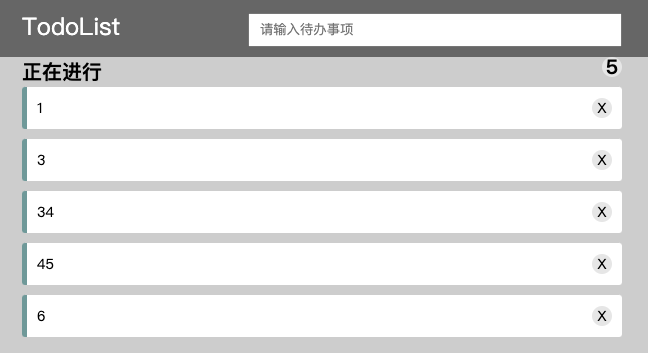

# 04-Vue 中的 TDD 与 单元测试

## 01：什么是 TDD ？

> Test Driven Development:TDD 测试驱动开发

### TDD 的开发流程

> 也叫做 Red-Green Development

1. 编写测试用例
2. 运行测试，测试用例无法通过测试
3. 编写代码，使测试用例通过测试
4. 优化代码，完成开发
5. 新增功能，重复以上步骤

### TDD 的优势

1. 长期减少回归 bug
2. 代码质量更好（阻止，可维护性高）
3. 测试覆盖率高
4. 错误测试代码不容易出现

## 02：Vue 环境中配置 Jest

1. 使用 vue-cli 初始化一个项目

   ```bash
   npm install @vue/cli -g
   vue create jest-vue // 按照相关提示选择就可以
   ```

2. 在脚手架中可以看到相关测试代码

   ```json
   // package.json
   {
      "scripts": {
        "test:unit": "vue-cli-service test:unit"
     },
   }
   ```

   ```javascript
   // jest.config.js
   module.exports = {
     preset: '@vue/cli-plugin-unit-jest'
   }
   ```

   ```javascript
   // tests/unit/example.spec.js
   import { shallowMount } from '@vue/test-utils'
   import HelloWorld from '@/components/HelloWorld.vue'
   
   describe('HelloWorld.vue', () => {
     it('renders props.msg when passed', () => {
       const msg = 'new message'
       const wrapper = shallowMount(HelloWorld, {
         propsData: { msg }
       })
       expect(wrapper.text()).toMatch(msg)
     })
   })
   ```

3. 脚手架生成的内容如下

4. 如果没有使用脚手架生成，我们可以在`package.json`中添加命令

   ```javascript
   {
     "scripts": {
       "test": "jest"
     }
   }
   ```

5. 然后执行 jest 初始化命令，生成配置文件`jest.config.js`

   ```bash
   npx jest --init
   ```

6. 然后根据需要修改`jest.config.js`

## 03：vue-test-utils 的配置及使用

1. 我们发现上一节中测试文件路径为`tests/unit/example.spec.js`,与我们之前的不是很相符，我们可以改名字为`hello.test.js`

2. 运行`npm run test:unit`后会提示没有文件匹配

   > 根据错误信息，我们可以看到默认读取的文件路径有两个，分别是
   >
   > `**/tests/unit/**/*.spec.[jt]s?(x)`
   >
   > `**/__tests__/*.[jt]s?(x) - 0 matches`

   ```text
   > vue-cli-service test:unit
   
   No tests found, exiting with code 1
   Run with `--passWithNoTests` to exit with code 0
   In /Users/yuangao/Code/Learn/MyGithub/Javascript/TDD-BDD/lesson-14/jest-vue
     11 files checked.
     testMatch: **/tests/unit/**/*.spec.[jt]s?(x), **/__tests__/*.[jt]s?(x) - 0 matches
     testPathIgnorePatterns: /node_modules/ - 11 matches
     testRegex:  - 0 matches
   Pattern:  - 0 matches
   ```

3. 我们目前的文件为`test/unit/hello.test.js`，均不符合上述正则匹配，我们可以修改`jest.config.js`，增加 testMatch选项

   ```javascript
   // jest.config.js
   module.exports = {
     preset: '@vue/cli-plugin-unit-jest',
     testMatch: [
       "**/tests/**/?(*.)+(spec|test).[jt]s?(x)"
     ]
   }
   ```

4. 再次运行`npm run test:unit`, 就可以正常通过了

接着我们看`hello.test.js`文件内容，目前看不懂，我们可以先按照简单的方式，修改为如下代码

```javascript
// hello.test.js

import  Vue from "vue"
import helloWorld from "@/components/HelloWorld.vue";

describe("测试 dom 正常渲染", () => {
  it("render props.msg when passed", () => {
    const divEl = document.createElement('div')
    divEl.className = "root"
    document.body.appendChild(divEl)
    new Vue({
      render: h => h(helloWorld),
      props: {
        msg: '我是孙悟空'
      }
    }).$mount(".root")
    expect(document.getElementsByClassName('hello').length).toBe(1)
  })
})
```

运行`npm run test:unit`后，正常通过

可以看出上面过程未免太过麻烦，那么有没有相应的工具来简化呢。当然是有的，就是`@vue/test-utils`

```javascript
import { shallowMount } from '@vue/test-utils'
import HelloWorld from '@/components/HelloWorld.vue'
// shallowMount: 浅层渲染，只渲染外层组件，不处理子组件中的同名属性
describe('HelloWorld.vue', () => {
  it('renders props.msg when passed', () => {
    const msg = 'new message'
    const wrapper = shallowMount(HelloWorld, {
      propsData: { msg }
    })
    // wrapper 还有很多其他的属性、方法
    expect(wrapper.text()).toMatch(msg)
  })
})
```

[shallowmount 官方文档](https://v1.test-utils.vuejs.org/zh/api/#shallowmount)

## 04：使用 TDD 的方式开发 Header 组件(1)

### 写测试相关代码

```javascript
// jest-vue/tests/unit/Header.test.js
import { shallowMount } from '@vue/test-utils'
import Header from '@/components/Header.vue'

const wrapper = shallowMount(Header)
const input = wrapper.find('input[data-test="input"]')

describe('TodoList.vue', () => {
  it('Header 包含 input', () => {
    expect(input.exists()).toBe(true)
  })

  it('Header中 input的初始值为空', () => {
    const inputValue = wrapper.vm.$data.inputValue
    expect(inputValue).toBe('')
  })

  it('Header中 input输入内容时数据更新', () => {
    input.setValue('hello world')
    const inputValue = wrapper.vm.$data.inputValue
    expect(inputValue).toBe('hello world')
  })

  it('Header 中input 框输入回车时候，无内容时，无反应', () => {
    input.setValue('')
    input.trigger('keyup.enter')
    expect(wrapper.emitted().add).toBeFalsy()
  })

  it('Header 中input 框输入回车时候，有内容时，向外触发事件 add, 并清空 inputValue', () => {
    input.setValue('111')
    input.trigger('keyup.enter')
    expect(wrapper.emitted().add).toBeTruthy()
    expect(wrapper.vm.inputValue).toBe('')
  })
})
```

### 写代码实现部分

```vue
<!-- jest-vue/src/components/Header.vue -->
<template>
  <div class="hello">
    <input
      type="text"
      data-test="input"
      v-model="inputValue"
      @keyup.enter="handlerAdd"
    />
  </div>
</template>

<script>
export default {
  name: 'hello-world',
  props: {
    msg: String,
  },
  data() {
    return {
      inputValue: '',
    }
  },
  methods: {
    handlerAdd() {
      if (this.inputValue) {
        this.$emit('add', this.inputValue)
        this.inputValue = ''
      }
    },
  },
}
</script>
```

## 05：使用 TDD 的方式开发 Header 组件(2)

### 写测试相关代码

```javascript
// /jest-vue/tests/unit/TodoList.test.js
import { shallowMount } from '@vue/test-utils'
import TodoList from '@/container/TodoList/TodoList.vue'
const wrapper = shallowMount(TodoList)

describe('测试 TodoList 组件', () => {
  it('TodoLis 组件初始化时，undoList 应该是空的', () => {
    expect(Array.isArray(wrapper.vm.undoList)).toBeTruthy()
    expect(wrapper.vm.undoList.length).toBe(0)
  })

  it('TodoLis 执行 addItem 的时候，会增加一个内容', () => {
    const str = 'i am first todo'
    wrapper.vm.addItem(str)
    expect(wrapper.vm.undoList.length).toBe(1)
    expect(wrapper.vm.undoList[0]).toBe(str)
  })
})
```

### 书写代码实现部分

```vue
<!-- jest-vue/src/container/TodoList/TodoList.vue -->
<template>
  <div>
    <TodoHeader @add="addItem"></TodoHeader>
    {{ undoList }}
  </div>
</template>

<script>
import TodoHeader from '@/components/Header.vue'
export default {
  name: 'todo-list',
  components: {
    TodoHeader,
  },
  data() {
    return {
      undoList: [],
    }
  },
  methods: {
    addItem(value) {
      this.undoList.push(value)
    },
  },
}
</script>

<style lang="stylus" scoped></style>
```

## 06：Header 组件样式新增及快照测试

`app.vue`中增加样式

```css
*{
  margin: 0;
  padding: 0;
}
```

`header.vue`中增加如下样式

```vue

<template>
  <div class="header">
    <div class="header-content">
      TodoList
      <input
        class="header-input"
        placeholder="请输入待办事项"
        type="text"
        data-test="input"
        v-model="inputValue"
        @keyup.enter="handlerAdd"
      />
    </div>
  </div>
</template>
<style scoped lang="stylus">
.header{
  background-color: #666;
  line-height: 60px;
  .header-content{
    width: 600px;
    margin: 0 auto;
    color: #fff;
    font-size: 24px;
    .header-input{
      float: right;
      width: 360px;
      margin-top :16px;
      height: 30px;
      line-height: 30px;
      padding-left: 10px;
    }
  }
}
</style>
```

`header.test.js`中增加如下页面

```javascript
it('header 样式发生改变，做提示', () => {
  expect(wrapper).toMatchSnapshot() // 进行快照测试
})
```

`npm run test:unit`运行后，文件中会多一个`jest-vue/tests/unit/__snapshots__/Header.test.js.snap`文件，内容如下

```javascript
// Jest Snapshot v1, https://goo.gl/fbAQLP

exports[`Header.vue header 样式发生改变，做提示 1`] = `
<div class="header">
  <div class="header-content">
    TodoList
    <input placeholder="请输入待办事项" type="text" data-test="input" class="header-input">
  </div>
</div>
`;
```

当页面中 ui 结构发生变化时，再次运行会提示报错

## 07：通用代码提取封装

## 08：UndoList 的实现（1）

### 编写测试部分

```javascript
// jest-vue/tests/unit/undoList.test.js
import { shallowMount } from '@vue/test-utils'
import undoList from '@/components/undoList'
const wrapper = shallowMount(undoList, {
  propsData: {
    list: [],
  },
})

describe('测试 undoList组件', () => {
  it('undo-list 参数为 [], count 应该为0，且列表无内容', () => {
    const countEl = wrapper.find('[data-test="count"]')
    const ListItems = wrapper.findAll('[data-test="item"]')
    expect(countEl.text()).toBe('0')
    expect(ListItems.exists()).toBe(false)
    expect(ListItems.length).toEqual(0)
  })

  it('undo-list 参数为 [1,2,3时候], count 应该为3，且列表有内容,且存在删除按钮', () => {
    const wrapper = shallowMount(undoList, {
      propsData: {
        list: [1, 2, 3],
      },
    })
    const countEl = wrapper.find('[data-test="count"]')
    const ListItems = wrapper.findAll('[data-test="item"]')
    const deleteBtnEls = wrapper.findAll('[data-test="delete"]')
    expect(countEl.text()).toBe('3')
    expect(ListItems.exists()).toBe(true)
    expect(ListItems.length).toEqual(3)
    expect(deleteBtnEls.exists()).toBe(true)
    expect(deleteBtnEls.length).toEqual(3)
  })

  it('undo-list 存在删除按钮时触发 delete 事件', () => {
    const wrapper = shallowMount(undoList, {
      propsData: {
        list: [1, 2, 3],
      },
    })
    const deleteBtnEl = wrapper.findAll('[data-test="delete"]').at(1)
    deleteBtnEl.trigger('click')
    expect(wrapper.emitted('delete')).toBeTruthy()
    expect(wrapper.emitted('delete')[0][0]).toBe(1)
  })
})
```

### 编写代码部分

```vue
<!-- jest-vue/src/components/UndoList.vue -->
<template>
  <div>
    <div data-test="count">{{ list.length }}</div>
    <ul>
      <li data-test="item" v-for="(item, index) in list" :key="item">
        {{ item }}
        <span data-test="delete" @click="handleDelete(index)">X</span>
      </li>
    </ul>
  </div>
</template>

<script>
export default {
  name: 'undo-list',
  props: {
    list: {
      required: true,
      type: Array,
    },
  },
  data() {
    return {
      inputValue: '',
    }
  },
  methods: {
    handleDelete(index) {
      this.$emit('delete', index)
    },
  },
}
</script>
<style scoped lang="stylus"></style>
```

## 09：UndoList 的实现（2）

接着我们实现 TodoList 中的测试代码和真实逻辑部分

### 编写 TodoList 的测试代码

```javascript
// jest-vue/tests/unit/TodoList.test.js
// 新增如下部分
import UndoList from '@/components/undoList.vue'

it('Todo list 调用 undoList 组件时候，应该传递 list 参数', () => {
  const undoListWrapper = wrapper.findComponent(UndoList)
  expect(undoListWrapper.props('list')).toBeTruthy()
})

it('TodoList 中 deleteItem 事件被调用时，undoList 数据应该减少一个', () => {
  wrapper.setData({ undoList: [1, 2, 3] })
  wrapper.vm.deleteItem(1)
  expect(wrapper.vm.undoList).toEqual([1, 3])
})
```

### 编写代码实现部分

```vue
<template>
  <div>
    <TodoHeader @add="addItem"></TodoHeader>
    <!-- 增加如下部分 -->
    <UndoList :list="undoList" @delete="deleteItem"></UndoList>
  </div>
</template>

<script>
  import UndoList from '@/components/UndoList.vue'
  
  export default {
    components: {
      UndoList,
    },
    methods: {
     	deleteItem(index) {
        this.undoList.splice(index, 1)
      },
    }
  }
</script>
```

## 10：UndoList 样式修饰及测试代码优化

```vue
<!-- App.vue -->
<style lang="stylus"> // 注意这里没有 scope
body{
  background-color: #cdcdcd;
}
</style>
```

```vue
<!-- jest-vue/src/components/UndoList.vue -->
<template>
  <div class="undo-list">
    <div class="title">
      正在进行<span class="count" data-test="count">{{ list.length }}</span>
    </div>
    <ul class="list">
      <li
        class="item"
        data-test="item"
        v-for="(item, index) in list"
        :key="item"
      >
        {{ item }}
        <span
          class="delete-icon"
          data-test="delete"
          @click="handleDelete(index)"
          >X</span
        >
      </li>
    </ul>
  </div>
</template>

<style scoped lang="stylus">
.undo-list{
  width: 600px;
  margin: 0 auto;
  .title{
    line-height: 30px;
    font-size: 20px;
    font-weight: bold;
    .count{
      float: right;
      display: block;
      line-height: 20px;
      height: 20px;
      width: 20px;
      text-align: center;
      background-color: #e6e6e6;
      border-radius: 10px;
      color: #000;
    }
  }
  .list{
    list-style-type: none;
  }
  .item{
    margin-bottom: 10px;
    line-height: 42px;
    font-size: 14px;
    background-color: #fff;
    border-left: 5px solid #629a9a;
    border-radius: 3px;
    text-indent: 10px;
    display: flex;
    align-items: center;
    justify-content: space-between;
    .delete-icon{
      height: 20px;
      width: 20px;
      line-height: 20px;
      text-indent: 0;
      text-align: center;
      background-color: #e6e6e6;
      border-radius: 10px;
      color: #000;
      margin-right: 10px;
    }
  }
}
</style>

```

最后运行，效果如下



## 11: UndoList 编辑功能实现(1)

因为要实现，可以编辑功能，之前存储的 undoList 数据结构，就不适合了。我们需要更改相应的结构，当然，测试用例中的数据结构也要进行更改, 结构类似如下

```javascript
[ { status: 'div', value: 1}, { status: "input", value: 2 } ]
```

修改测试用例设计部分

```javascript
把之前的 [1, 2, 3]
变为现在的
[
  { value: 1, status: 'div' },
	{ value: 2, status: 'div' },
	{ value: 3, status: 'div' },
]
```

修改测试文件涉及`/jest-vue/tests/unit/undoList.test.js`、`jest-vue/tests/unit/TodoList.test.js`

修改编码文件涉及`/jest-vue/src/components/UndoList.vue`、`/jest-vue/src/container/TodoList/TodoList.vue`

这里我们会发现我们这里做了两遍的工作：修改了测试文件、也修改了业务编码文件，为什么呢？

因为我们目前采用的是 TDD + 单元测试，**测试代码与业务组件**功能进行绑定了。正是这种耦合导致的这个现象。

那到底是怎么做呢？

**Tips:**

做业务开发时，采用这种 TDD  + 单元测试这种方式，并不太适合。

它适合于开发通用的函数库，比如 lodash 这种工具库，测试和业务就不会有太多的耦合，就很合适。
