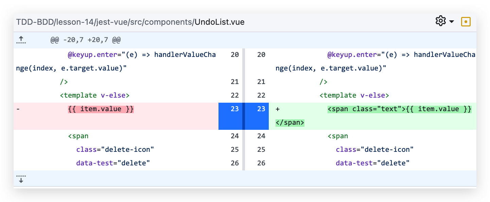

# 05-Vue 中的 BDD 与 集成测试

## 01: BDD 的概念以及与 TDD 的对比

### BDD

> Behavior Driven Development 行为驱动开发
>
> 先写业务逻辑代码，在基于用户行为进行测试代码的编写

### 直接写测试代码

```javascript
// /jest-vue/tests/intergration/TodoList.test.js
import { mount } from '@vue/test-utils'
import TodoList from '@/container/TodoList/TodoList.vue'
import { nextTick } from 'vue'

it(`
  1. 用户会在 header 输入框输入内容
  2. 用户会点击回车按钮
  3. 列表项应该增加用户输入内容的列表项 
`, async () => {
  const wrapper = mount(TodoList)
  const inputEl = wrapper.find('input.header-input')
  const content = '我是代办事项1'
  inputEl.setValue(content)
  inputEl.trigger('change')
  inputEl.trigger('keyup.enter')
  await nextTick()
  const listItems = wrapper.findAll('li.item')
  expect(listItems.length).toBe(1)
  expect(listItems.at(0).find('.text').text()).toBe(content)
  // 如果不想具体选择，也可以使用 toContain 方法来做判断
  // expect(listItems.at(0).text()).toContain(content)
})
```

对应的`/jest-vue/src/components/UndoList.vue` 有改动: 为元素增加一个类名，方便测试中的类选择器



### 对比

**TDD**

1. 先写测试在写代码
2. 一般结合单元测试使用，是白盒测试
3. 测试重点在代码
4. 安全感低
5. 速度快

### BDD

1. 先写代码再测试
2. 一般结合集成测试使用，是黑盒测试
3. 测试重点在 UI（DOM）
4. 安全感高
5. 速度慢

## 02: 使用 BDD 和集成测试进行 Vuex 项目的测试

> 我们使用 vuex 来存取数据

1. 安装 `vuex`

   ```shell
   npm install vuex@3 -D
   ```

2. 新建`store.js`文件，内容如下

   ```javascript
   import Vuex from 'vuex'
   import Vue from 'vue'
   Vue.use(Vuex)
   const store = new Vuex.Store({
     state: {
       inputValue: '',
     },
     mutations: {
       changeInputValue(state, payload) {
         state.inputValue = payload
       },
     },
   })
   export default store
   ```

3. 修改`main.js`代码，使用 store

   ```javascript
   import Vue from 'vue'
   import App from './App.vue'
   
   import store from './store'
   Vue.config.productionTip = false
   new Vue({
     render: (h) => h(App),
     store,
   }).$mount('#app')
   ```

4. 修改`header.vue`中的页面逻辑，使用 `vuex` 中的数据

   ```vue
   <template>
     <div class="header">
       <div class="header-content">
         TodoList
         <input
           class="header-input"
           placeholder="请输入待办事项"
           type="text"
           data-test="input"
           :value="inputValue"
           @keyup.enter="handlerAdd"
           @input="(e) => changeInputValue(e.target.value)"
         />
       </div>
     </div>
   </template>
   
   <script>
   import { mapState, mapMutations } from 'vuex'
   export default {
     name: 'hello-world',
     props: {
       msg: String,
     },
     computed: {
       ...mapState({
         inputValue: (state) => state.inputValue,
       }),
     },
     methods: {
       handlerAdd() {
         if (this.inputValue) {
           this.$emit('add', this.inputValue)
           this.changeInputValue('')
         }
       },
       ...mapMutations({
         changeInputValue: 'changeInputValue',
       }),
     },
   }
   </script>
   <style scoped lang="stylus">
   .header{
     background-color: #666;
     line-height: 60px;
     .header-content{
       width: 600px;
       margin: 0 auto;
       color: #fff;
       font-size: 24px;
       .header-input{
         float: right;
         width: 360px;
         margin-top :16px;
         height: 30px;
         line-height: 30px;
         padding-left: 10px;
       }
     }
   }
   </style>
   ```

5. 这个时候我们运行的测试代码`/jest-vue/tests/intergration/TodoList.test.js`，我们发现报错：

   ```text
   TypeError: Cannot read properties of undefined (reading 'state')
   ```

6. 我们增加如下代码即可

   ```javascript
   import store from '@/store'
   
   const wrapper = mount(TodoList, { store })
   ```

7. 我们发现只要写入上面的代码以后，就可以正常运行了，很方便快捷。

这里我们发现 BDD 的测试修改起来很方便，因为用户的行为不需要改变，UI不需要做改变。在梳理一下 BDD + 集成测试的优势

* 当采用这样的测试流程之后，我们还是首先进行编码业务的工作。方便快速迭代，
* 在进行编写测试用例后，如果修改代码，测试用例基本不用修改或者少量修改
* 如果测试用例通过，就可以保证页面正常显示，且用户操作基本可以正常通过

当然，它是有一些问题

* 代码覆盖率不会很高
* 代码覆盖率高不一定就好，代表代码能跑起来，当然反之亦然

**在项目中既可使用单元测试，也可以使用集成测试**

前端自动化测试，包括单元测试、BDD测试、TDD测试、集成测试。

而掌握前端自动化测试，既不是说你掌握了单元测试、也不是说你掌握了集成测试，而是说要根据具体项目需求去做出正确的判断，在什么情况下使用单元测试，什么情况下使用集成测试，什么时候使用TDD, 什么时候使用 BDD

测试业务的时候，优先采用 BDD + 集成测试

测试函数库的时候，优先使用 TDD + 单元测试

当然你也可以穿插使用

## 03：异步测试

> 我们使用 axios 发送请求获取数据

1. 安装 `axios`

   ```shell
   npm install axios -D
   ```

2. 修改`/jest-vue/src/container/TodoList/TodoList.vue` 中的代码，如下

   ```vue
   <script>
   	import axios from 'axios'
     export default {
        mounted() {
         /**
          * { success: true, data: [ {status: 'div', value: '孙悟空' } ] }
          */
         axios
           .get('./getUndoList.json')
           .then((res) => {
             this.undoList = res.data
           })
           .catch((e) => {
             console.log(e)
           })
       },
     }
   </script>
   ```

3. `/jest-vue/tests/intergration/TodoList.test.js`中写入相关测试逻辑

   ```javascript
   import { nextTick } from 'vue'
   
   it(`
     1. 用户进入页面时，请求远程接口数据
     2. 列表应该展示远程返回的数据
   `, async () => {
     const wrapper = mount(TodoList, { store })
     await nextTick()
     const listItems = wrapper.findAll('li.item')
     expect(listItems.length).toBe(3)
   })
   ```

4. 在项目中可能会有相关报错, 建议升级依赖版本

   ```json
   "jest": "^29.6.3",
   "jest-environment-jsdom": "^29.6.3",
   ```

5. 我们可以在`tests`文件夹下，模拟接口数据

   ```javascript
   // /jest-vue/tests/__mocks__/axios.js
   export default {
     get: (url) => {
       return new Promise((resolve) => {
         resolve({
           success: true,
           data: [
             { status: 'div', value: '孙悟空' },
             { status: 'div', value: '猪八戒' },
             { status: 'div', value: '沙僧' },
           ],
         })
       })
     },
   }
   ```

6. 再次运行`npm run test`后，就会提示测试通过。

7. 注意：如果页面中有定时器 setTimeout, 可以利用之前学过的 `jest.useFakeTimers()`等相关 API，就可以实现进行定时器加速。

## 04：路由页面的代码组织
