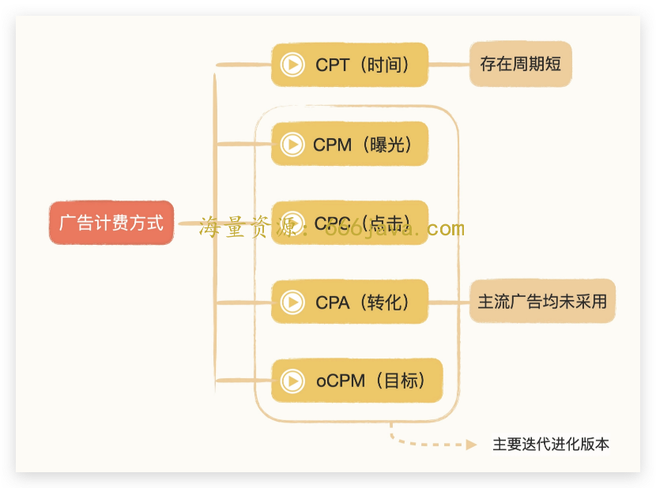
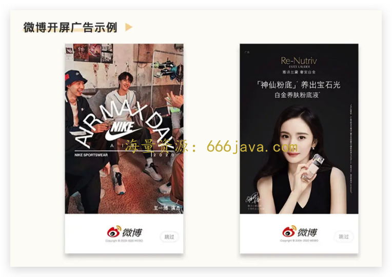
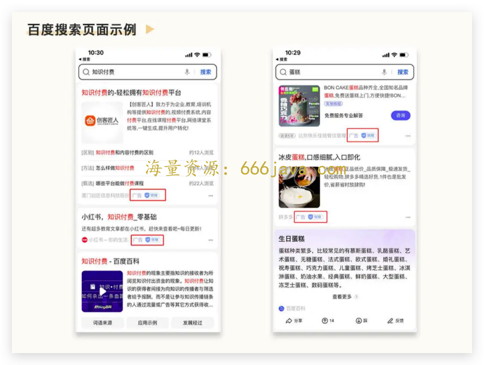
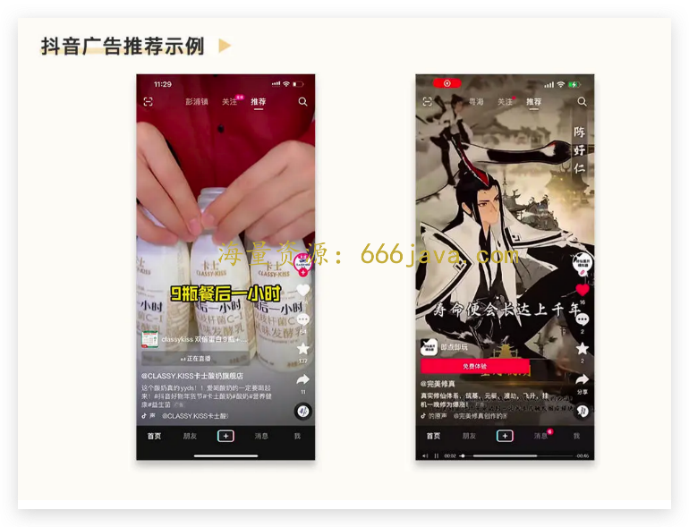
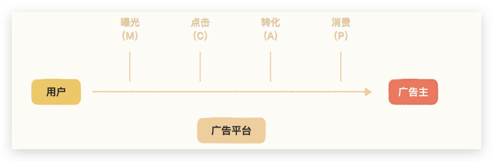
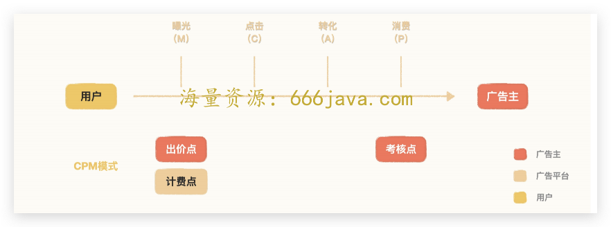
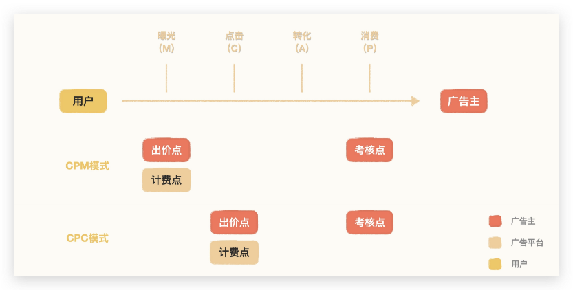
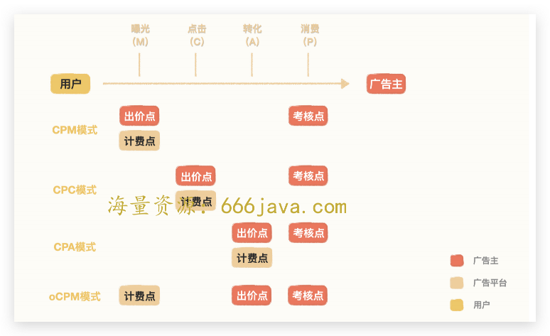
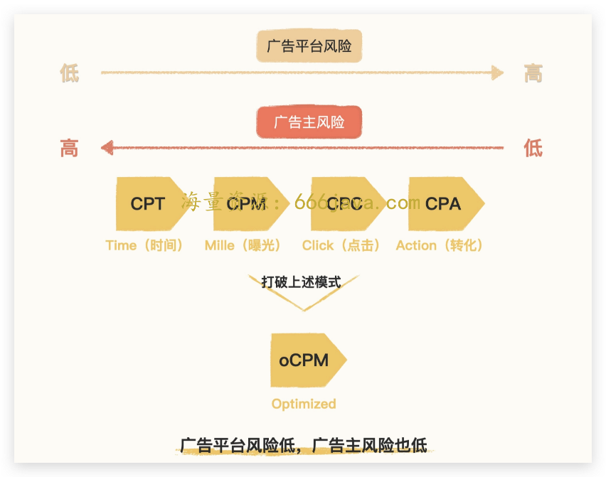
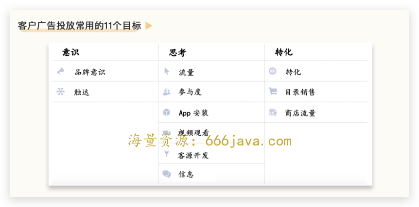

# 03-效率：为什么 Facebook 的客户以中小为主？

<audio controls="" title="03-效率：为什么 Facebook 的客户以中小为主？">
  <source
    id="mp3"
    src="/mp3/business-thinking/03-效率：为什么Facebook的客户以中小为主？.mp3"
  />
</audio>

你好，我是雄峰。

本节课是我们价值创造篇的第二课，今天我们来聊聊 Facebook 商业化成功的背后很容易被忽略的一个点——以 oCPM 计费方式为代表的智能投放工具。

以 oCPM 计费方式为代表的 **智能投放工具** 的推出，大幅提升了中小客户广告投放的效率，推动 Facebook 广告客户从最初的几万扩张到 900w 规模，客户规模力压老大哥 Google。21 年 Facebook 1000 亿美金的广告收入中，有接近 70%来自中小客户。

学习智能投放工具能够帮助我们理解商业效率的提升对于平台扩大广告客户供给端的重要性。分析智能投放工具演进历史，你也可以从中学习商业产品设计的两个关键知识点：

1. **激励相容**。通过分析 oCPM 计费方式的产品设计机制，了解其在原有计费方式上做了什么样的优化和改动，进而学习“激励相容”这个商业产品设计领域中最重要的原则，这个原则能够很好地指导你去思考如何达成用户、客户以及平台的三赢状态。
2. **简化客户**。通过投放目标操作简化的过程， **学习“内敛复杂，简化客户”的商业产品理念**，从而避免技术人容易陷入的唯技术论的问题。不管内部系统多么复杂，对外都需要贴近客户的思考模式，简化客户理解和操作的门槛。

此外，这节课还可以让你紧跟行业趋势。oCPM 出价工具是近十年以来互联网广告领域最大的产品创新，国内各大厂都在紧跟这一策略的优化和迭代。了解 oCPM 的来龙去脉，你能够更好地了解商业产品的演进方向，紧跟行业最佳实践。

## **广告计费方式概览**

在互联网发展的二十年里，互联网广告的计费方式从 CPT（时间）开始，总共发生了三次较大的迭代进化，大致分为 CPM（曝光）、CPC（点击）和 oCPM（目标）三个，其中 CPT（时间）存在周期较短。而 CPA（转化）会导致头部广告平台收益受损，因此并未成为行业主流。

接下来，我先分别介绍一下这几个主流广告计费方式，让你对它们有一个大概的认知。

**CPT：** 按时间来计费（Cost Per Time）。互联网广告最开始的形态是类似电视广告，会让广告主按时间长度去买断一个展示位置的广告。这种模式存在的周期很短，占比也很小，很大原因在于售卖不充分，所以很快演化到了下面的 CPM 模式。

**CPM：** 按千次曝光计费（Cost Per Mille）。在这种模式下，广告平台可从浏览器的 Cookie 信息中，获取一部分用户的个人兴趣信息，而广告也可针对不同用户播放不同的内容。举一个例子，微博的开屏广告对外是按照 CPM 进行售卖的，针对男性用户可能会曝光运动广告，针对女性用户，可能会曝光美妆广告。

这种计费模式对广告主而言个性效果更佳，对广告平台而言，由于可参与购买的客户更多，所以广告溢价更高。正是 CPM 计费方式对用户数据的使用，使得互联网广告开始区别于电视广告。但是这种模式下客户依旧是大的品牌广告主，客户结构与电视广告并无明显差异。

**CPC**：按点击结算（Cost Per Click）。Google 于 2000 年率先在搜索引擎推出的广告计费模式，因此最开始也叫“关键词广告”。我们日常在使用百度或 Google 的时候，搜索结果页或者内容推荐页上会有几率展示客户投放的广告，比如我们在百度上搜索“知识付费”和“蛋糕”，广告就会在搜索结果页中插入展示。

对广告主而言，CPC 对比 CPM 最大的区别在于 **广告曝光本身不收费用，只有用户点击广告之后才会进行广告扣费。** 这种计费模式对中小广告主来说，广告效果更加可控，因此获得了大量中小广告主的青睐。在 oCPM 没有出来之前，CPC 一直是行业主流的计费模式。

**oCPM**：按效果优化，按曝光计费（optimized Cost Per Mille）。这个广告计费模式是由 Facebook 于 14 年率先在信息流场景推出的，抖音目前采用的就是这种计费模式。

比如我们日常在刷抖音的过程中，抖音会展示与你兴趣度关联更高的广告。比如你如果爱玩游戏，则会给你推更多的游戏广告；你如果喜欢美食，则会给你推美食相关的广告内容。

oCPM 对比 CPC 最大的区别在于，对广告主而言进一步降低了风险，同时对广告平台也降低了风险。

为什么这么说呢？假设你开了一个饭店，打 CPC 广告就相当于给饭店引流，饭店进去了一堆人，但是不确定中间有多少人会点菜消费，因此对于广告主而言还是存在风险的。oCPM 计费方式可以让广告平台围绕客户的最终目标来引流，你明明白白告诉广告平台，我只愿意为最终消费的客户付费，对于作为广告主的你，风险大大降低。

oCPM 有意思的地方在于， **虽然是按照客户的目标去优化广告效果，但也是按照曝光进行计费的，** 具体的产品机制下面会详细解释。正因为出价方式从点击深入到了目标，降低了广告主投放广告的风险，同样也提升了广告主投放广告的商业效率，因此在 oCPM 的出价模式下，广告主的数量对比 CPC 模式翻了好几倍。

## **用激励相容理解出价方式的演进逻辑**

相信通过上面的对比讲解，你已经对广告计费方式的分类有了一个大致的认识，接下来，我们进一步去拆分广告系统，进而带你去理解 oCPM 以及商业产品设计领域中最重要的原则——“ **激励相容**”。

广告系统最核心的三个角色分别为：用户、广告主以及广告平台。

广告平台作为中间方， **核心目标是在促成双方达成推广目标的基础上，最大化自身收益。**

对于一个用户而言，他在广告平台的转化链路包含四个环节：曝光（M）、 点击（C）、转化（A）、消费（P）。

如果你今天打开了抖音，开屏内容是微软 Surface 电脑的广告优惠活动，对于微软而言你就是一个有效曝光（M）。而抖音在这个链路里充当的就是广告平台的角色。

假设有上万人看到了广告，其中一千人感兴趣，点击（C）了广告（其中包括你）。然后你觉得优惠力度不错，还恰好需要，就把电脑买了，这叫做转化（A），这时候转化（A）和消费（P）是一样的。如果微软把购买 Surface 的方式做一下调整，要求你去线下才能购买，那么转化（A）和消费（P）就是区分开的，广告转化链路就是一个层层漏斗行为。

在这个层层漏斗行为中，广告平台和广告主在广告转化链路里的利益点并不一致。我们先从 CPM 模式说起。

### CPM 模式分析

在实际决策过程中，作为广告主微软，它购买抖音的开屏广告， **本质上是在购买用户曝光（M）**，作为广告主的一员，微软需要参与广告竞价， **出价点是曝光** **（** **M)**。

微软打广告的核心目标是为了促进 Surface 电脑的销量。 **核心目标，就是考核点消费（P）**。开屏广告按照 CPM 进行计费，站在广告平台的角度， **计费点** 也是曝光（M）。在这种模式下 **出价点远离考核点**，要经过点击、转化才能到自己的考核点，中间不确定因素多，这就导致了 **广告主决策成本高，因此只有大品牌相对可接受 CPM 模式。**

### CPC 模式分析

CPC 相较于 CPM， **最大的变化就是计费点和出价点下移到了点击环节** **，** 本质是点击率预估环节由广告主转到了广告平台，因为平台更了解用户的使用习惯，也有更多的用户数据，预估点击率当然比广告主自己来得更容易。虽然只做了这一个调整，但实现了用户、广告主以及广告平台的三方共赢，这就是“ **激励相容**”策略的完美实践。

> 激励相容是机制设计理论中的一种，是指在真实博弈环境中，每一个角色都会有自利的一面，会按自利的规则行动。如果能有一种制度安排，能使得每一个角色最大利益互相吻合，这一制度安排就是“激励相容”。

接下来，我们以“激励相容”的角度去分析 CPC 模式对于各方利益优化的考量。

**对广告主**：买的是点击，而自己的核心目标是用户的消费。出价点进一步靠近考核点，大大降低了广告主预估收益的难度，广告主利益保障得到了提升。过往在 CPM 模式下，高估会导致广告主 ROI 降低，低估则量级受限。但是转移到 CPC 模式下，高估，广告主则会获利，低估，则只影响曝光量级但不影响 ROI，广告主风险大大降低。

**对广告平台**：不管低估还是高估都会影响平台收益，虽然广告平台需要承担点击率预估不准的风险，但是由于广告平台手握用户数据，对比广告主的经验预估准确太多，因此广告平台绝对有动力、有能力提升预估准确性。在风险有限的情况下，还可进一步扩大引入客户的规模，提升广告竞价的水位。

**对用户**：广告主有动力优化广告素材，为平台用户提供更高质量的广告内容，吸引用户点击，提升自己广告在众多广告的竞争力，变相 **提升了用户对平台的满意度**。

### CPA 模式分析

如果考虑更深一步，我们会很自然地思考，如果计费点和出价点继续下移，是否可以达到广告主、广告平台以及用户三方的激励相容呢？

答案是否定的。这种计费方式在行业中确实存在，叫 CPA（按转化进行计费），但是主流广告平台均没有采用。

因为该模式与 CPC 对比，虽然对广告主有利，但是对广告平台不利，会影响广告平台收益。主要有两个原因：

- **风险高。** 出价点越靠近广告主的考核点，广告平台需要预估的东西越来越多，承担的风险也越来越大。从过往单纯预估点击率，变为进一步在点击率的基础上预估转化率，难度大大增高。
- **薅羊毛。** 因为广告主的出价点和广告平台的计费点均在转化点上，而广告平台没有办法有效监督转化数据是否正确，这就导致广告主有动力作弊，薅平台羊毛。

> 一个关于薅平台羊毛的小例子：我们假设抖音现在按照 CPA 进行计费，它给某电商 App 做了推广，抖音给该产品曝光了 10w 个用户，大概有 1w 个人点击了这个广告，由于广告转化最终发生在客户 App 中，真实的激活数量只有客户自己知道，客户实际激活有 5000 个用户，但是谎称只有 4000 个用户，则平台计费时会少收入 1000 个用户的费用。

CPA 模式对大的广告平台而言，期望风险已经超过了期望收益，并没有达到激励相容的目标。因此，该模式为小广告平台在初期为吸引客户采用的计费方式，虽然对客户有利，但并不为大的广告平台所采用。

### oCPM 模式分析

Facebook 主张的 oCPM 之所以厉害，是因为它分离了计费点和出价点，创造性引入了“ **按效果优化、按曝光收入**”的产品理念： **出价点下移，技术侧解决了转化率预估困难的问题，帮助客户优化实际目标效果。计费点上移，解决了广告主薅羊毛的风险问题，最大化平台收益。** 既解决了 CPC 模式下考核目标偏差大的问题，又解决了 CPA 模式下被客户薅羊毛的问题。

该模式对广告主和对广告平台都有利，对用户无影响，也能达到激励相容的目标。

**对广告主。** 出价点进一步下移，进一步贴近客户考核点，降低了客户决策的成本和难点。往后客户只需要设定好出价目标，再做好广告素材，就可以让广告平台去帮助自己寻找想要的用户。

**对广告平台。** 计费点上移，杜绝了计费点和出价点一致的作弊风险。原因在于如果广告主不回传或者少回传真实转化数据，数据建模无法完成，则会导致转化率预估偏低，广告拿量困难，如果广告主多回传广告数据，广告平台则会进行高估，费用也由客户自己承担。

此外，oCPM 模式下还会设计 **超成本赔付机制**，核心是为了解决广告主投放信心问题。在广告投放初期，由于数据样本不稳定，必然会有所波动，但是该种波动对平台有利，对客户不利，因此都会通过超成本赔付机制约束自己，以此获得广告主信任。

最后，我们通过一张图来总结一下各计费方式对于广告主和广告平台的风险点考量。

可以看到，计费方式越往右，广告平台风险越大，而广告主的风险则越小，愿意参与广告投放的广告主也就越多，相应的就是广告主优化素材的动力和空间也越弱。计费方式越往左，广告平台风险越低，而广告主的风险则越高，愿意参与广告投放的广告则越少，相应的就是广告主优化素材的动力和空间也越强。

oCPM 打破了这个模式，既降低了广告主的风险，优化了商业效率，又降低了广告平台的风险，提升了商业收益。

为了帮助你更好地理解 oCPM 对商业效率的提升，还是以之前开饭店举例，我们假设你是一家饭店的老板，在一个偏僻的地方开了一个饭店，人流稀少，需要对外打广告给饭店引流，现在本地有四个广告平台供你选择：

A 平台，按照 CPM 模式进行收费，它可以在市中心的位置给你打广告，它会预估这个位置一天会有多少的曝光，按照曝光跟你进行收费，并不能保证有多少客户会进入你的餐厅消费。

B 平台，按照 CPC 模式进行收费，它可以给你的餐厅引流客户，并按每进入一个人收一次费用，但是他并不能保障进来的客户有多少人会真实在餐厅产生消费。

C 平台，按照 CPA 模式进行收费，它也可以给你的餐厅引流客户，并承诺只有客户有消费才会向你收取费用，但是 C 平台可以覆盖的客户有限，一天只能够给你导入几个客户，没有办法满足餐厅的翻台率要求。

D 平台，按照 oCPM 模式进行收费，它跟 A 平台一样，也是按照曝光收费，不同之处在于它的技术能力非常厉害，可以精准计算出看过你们餐厅的用户有多少会进入餐厅消费，间接可以达到 C 平台的效果，并且可以跟你承诺如果收了广告费后客户没有进入餐厅消费，则进行赔付。且 D 品台用户规模足够大，可以满足你翻台率的要求。

如果是你，你会选择哪个平台？

在广告预算有限的情况下，我们自然会优先选择 C 和 D，尽量把 C 用满，但是 C 流量有限，所以还需以 D 为主。oCPM 之所以伟大，则在于其创造性的引入了 **“按效果优化、按展示/点击收入”的产品理念**，既优化了客户广告效果，提升了商业效率，又保障了广告平台的收入， **达到了广告主风险低以及广告平台风险低的双赢情况。**

## 复杂与客户无关

如果说 oCPM 体现了 Facebook 超强的技术实力以及商业策略能力，那么投放目标简化则体现了 Facebook“简化客户”的商业产品思维。

早在 14 年，Facebook 广告投放端的广告优化目标就全部切换成了以客户目标为导向，客户不用再去理解广告平台复杂的曝光和点击概念，而是根据自己的目标去设定，把单一“点击”细化到了客户广告投放常用的 11 个目标，具体可见下图。

我们继续上面开饭店的例子，你在 C 平台打广告实现了饭店盈利，有一些做生意的朋友过来找你请教，也想学学如何打广告，但是他们做的生意跟你不一样，假设有甲乙丙三个朋友：

- 甲：当网红。他的目标是希望有更多的人关注他的抖音号。
- 乙：美食城生意。他的目标是给美食城引入更多客人，好持续收取美食城店铺的租金。
- 丙：房地产生意。他的目标是让更多的人看到新开发出的楼盘。

可以发现，甲乙丙三个人买广告的目的都不一致：

- 甲的目标是更多的人关注自己的抖音号和抖音内容的评论，因此在广告平台可以选择“互动率”这个营销目标去买广告。
- 乙的目标是更多的人进入美食城，给美食城的店铺导流，因此可以选择“店铺客流量”这个营销目标去买广告。
- 丙的目标是打响楼盘的影响力，因此可以选择“覆盖人数”这个营销目标去买广告。

而把这三个目标放在四种出价方式中，只有 oCPM 可以一步到位，因为投放目标都是按照客户自身的需求来的，最大化接近客户的考核目标。

因此，业内会把 Facebook 推出的 **oCPM 出价工具以及投放目标简化操作流程统称为“智能投放”工具**，广告主只需要定目标、做广告素材就可以，其余的东西全部交给了平台处理，所以该功能被称为广告投放领域的“自动驾驶能力”。

## 小结

讲到这里，我们今天这节课也就接近尾声了，最后我来给你总结一下今天的关键内容。这节课内容比较多，我帮你抽象为了下面三点，你可以自检一下有没有都理解了。

**激励相容：** 我们从互联网广告计费的演进过程开始，介绍了 CPT、CPM、CPC、CPA 以及 oCPM 五种互联网广告计费方式，详细地分析了计费模式的演进逻辑，深度理解了激励相容的理念：如果一种制度设计可以达到全链路受益，这一制度安排就是激励相容。

**简化客户：** 从投放目标简化出发，换位思考客户的真实交易场景，不管内部系统实现如何复杂，对外尽量简化客户理解和操作门槛，做到复杂与客户无关。

最后，我们回到标题的问题，“效率：为什么 Facebook 的客户以中小为主？”

oCPM 为代表的智能投放工具相当于广告投放领域的“自动驾驶”工具，这个工具大大降低了广告主投放广告的门槛和风险，让 **中小广告主** 不用担心买广告会亏，也不用学习太多广告专业的知识，大幅度提升了广告投放的 **效率**。

## 课后思考

最后，我也给你留了一道思考题：激励相容和简化客户的思想，在我们生活中是无处不在的，你能不能举一个相关的例子？

欢迎你在留言区和我交流互动。我们建立了一个 [读者交流群](http://jinshuju.net/f/DuxzBi)，欢迎你的加入！如果你觉得有所收获，也可以把文章分享给你的朋友一起学习。我们下节课见。
