# 04-收益（上）：阳光养猪场等网赚游戏为什么在 19 年后突然火了？

<audio controls="" title="04-收益（上）：阳光养猪场等网赚游戏为什么在19年后突然火了？">
  <source
    id="mp3"
    src="/mp3/business-thinking/04-收益（上）：阳光养猪场等网赚游戏为什么在19年后突然火了？.mp3"
  />
</audio>

你好，我是雄峰。本节课是我们价值创造篇的第三课，学习收益的提升是如何改变休闲游戏行业格局，并创造一个大的市场机会。

内容开始之前，我们先来聊一个有趣的现象。

曾几何时，很多游戏不仅不用花钱玩，玩的时候还可以赚钱。每次玩的时候，你还都可以获得一定的金币或者钻石，碰到一些关卡需要特定道具，不用花钱，通过看广告免费解锁道具即可，金币累积到一定规模后更可以兑换成现金或者实物奖励。

这类游戏叫做网赚类休闲游戏，引领这个行业风潮的是一款名为《阳光养猪场》的游戏。

阳光养猪场的玩法非常简单，每天固定任务，不断地把小猪养成并合成大猪，不同级别的猪在一个时间段可产生不同的金币收益，收益到了一定程度则可兑换现金。

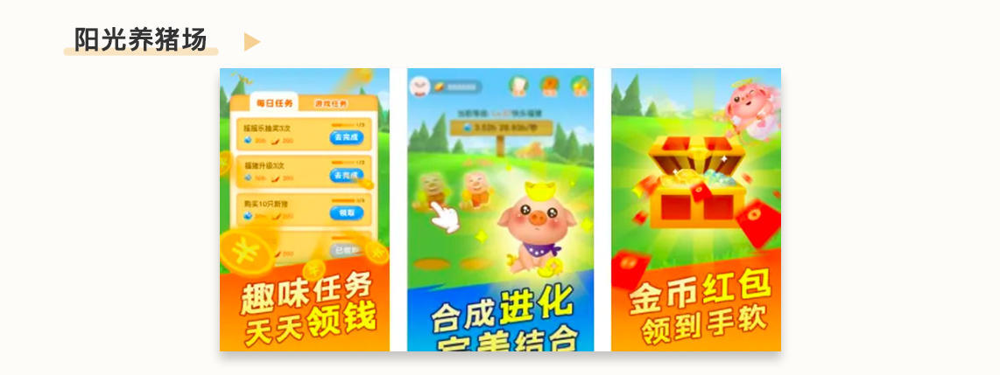

就这么一个产品，2019 年末登顶国内 App Store 游戏免费榜单，曾一度霸榜一个多月，而过往榜单的第一名要么是王者荣耀，要么是和平精英。坊间传闻该产品日广告收入巅峰时期可达到 3000w，比很多游戏一年的收入都高。

阳光养猪场的成功，也带动了行业内网赚类休闲游戏的爆发。即使在现在 App Store 的游戏免费榜上，你也可以经常看到这一类游戏的刷屏。

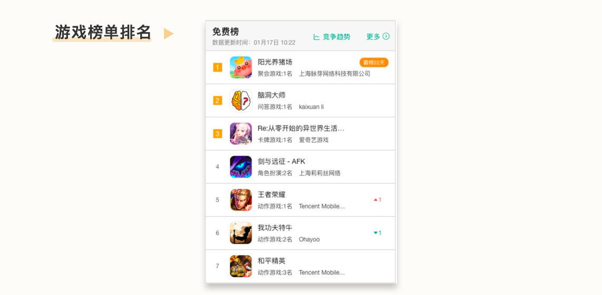

我相信你一定很好奇，为什么这么简单的产品机制到 19 年才开始爆火？这种网赚类产品是怎么挣钱且有那么高的收入的？

这节课，我会带着你梳理休闲游戏行业变现模式演进的历程，从供给端和变现端看看这类产品是怎么一步步变成今天的样子。下节课，我们再去了解它是怎么受到广告联盟的影响爆火的。从中，我们再去学习广告联盟产品的本质以及商业闭环理念。

## 供给端：为什么休闲游戏开发者越来越多？

游戏行业依据变现模式来分，大致可分为两类，一类是内购游戏，简称 IAP 游戏（In-App Purchase），内购游戏玩法重度，画面精良且游戏沉浸感较强，通过内购增值进行变现。典型的就是王者荣耀、和平精英以及阴阳师等。

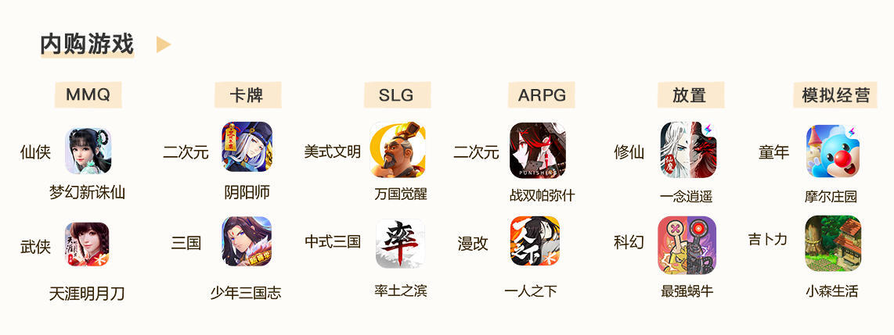

还有一类则是休闲游戏，简称 IAA 游戏（In-App Advertising），休闲游戏大多玩法简单、游戏内容轻度、风格简洁、游戏时间碎片化而且即时娱乐性较高，收益方式以广告变现为主，典型的就是阳光养猪场、地铁跑酷等。

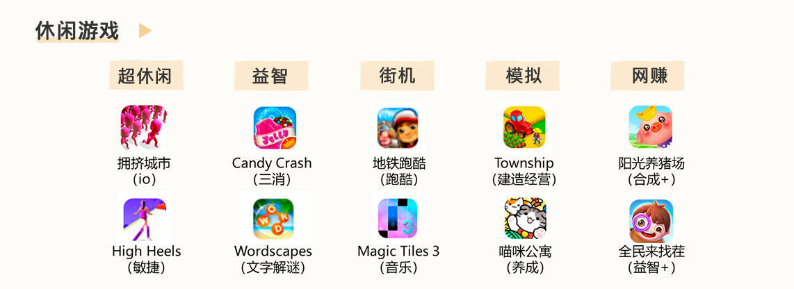

前者年收入超 1500 亿+，后者年收入只有 400 亿+左右，后者规模虽然不如前者，但是增长速度极其惊人，我们可以将休闲游戏从业者逐步壮大的过程大致分为三个阶段。

### 关注：2014 年 Flappy Bird 爆火

大家是从什么时候开始关注休闲游戏的呢？Flappy Bird 这个小游戏相信你并不陌生，一个个人开发者的作品在 14 年爆火全球，并通过接入 Google 的广告联盟 Adsense 达到日收入 5w 美金。

这个产品带给了行业极大的震撼。一方面，没有人能想到低成本的游戏也可以通过有趣的玩法和社交媒体的传播，形成行业爆款，最高有 5000w 的活跃用户。另一方面，这类游戏通过广告变现也获取了不低的收入。5w 美元日收入在当时已经足以跻身一线手游收入规模，也就是这个时候，“休闲游戏”吸引了不少中小开发者和发行商的注意。

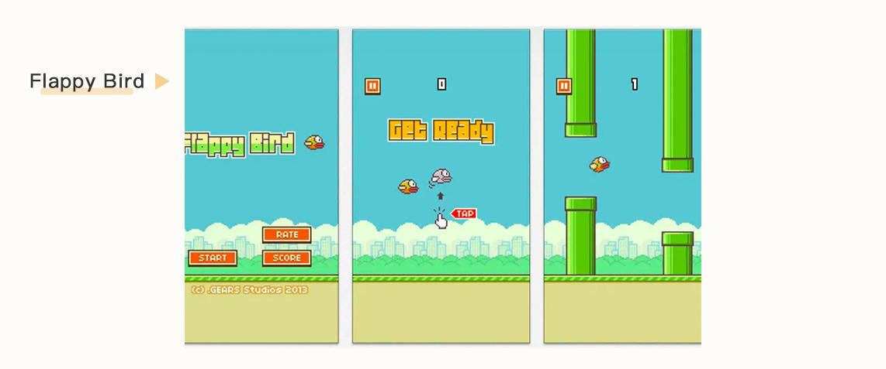

但我们要知道的是，Flappy Bird 的成功具备偶然性，大部分休闲游戏的日活用户在 50w 已经算不错了，但规模依旧只有 Flappy Bird 的 1%，那么可赚取的收益也就是 500 美金一天，一个月下来也就 1.5w 美金。

所以当时国内的休闲游戏开发者更多的是 **关注和小规模投入**，而获取收益的方式主流还是走原有的短代支付进行内购收费。

### 尝试：2015 年运营商关停短代支付

你没有看错，早期的游戏很多可以在没有网络的情况下玩，它们大多走的就是短信内购支付，这类游戏也叫单机游戏。

在移动支付没有发展起来的时候，短代支付是这类游戏的主流支付方式。简单理解，就是用户如果想在游戏里获取一些特殊的道具，就可以通过短信扣除等额话费，再由对应的移动运营商给游戏开发者进行结算。最典型的游戏有汤姆猫和地铁跑酷等。

这种支付方式最大的特点就是， **容易诱导用户在不知情的情况下付费支付，行业称之为“暗扣”。**

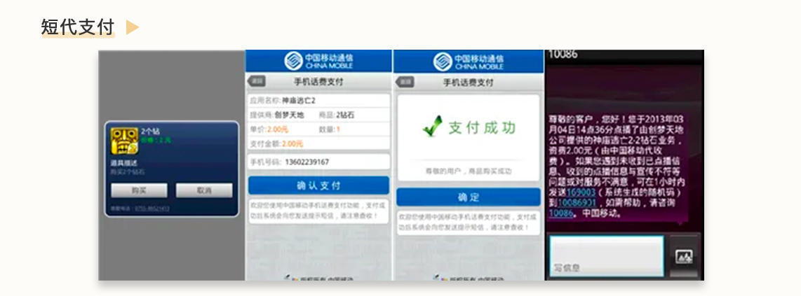

2015 年以前，行业的这一部分游戏基本上都是通过短代支付进行内购变现，暗扣收入占比高达 50%以上，随之而来的就是大量用户的投诉。2015 年 4 月份开始，国家监管部门针对短代暗扣进行了一系列整顿，三大运营商连续出现多个省市计费被关停的突发情况，单机游戏开发者收入大幅度下滑。

在短代支付走不通之后，过往看不上广告变现模式的开发者反而不得不投入更多的精力进行尝试以减少收入的损失。也就是从这时起，大量单机内购游戏开发者转型休闲游戏开发，并开始尝试广告变现。

### 投入：2018 年游戏版号停发

如果说上述两个原因，仅仅只是推动了游戏开发者去关注和尝试休闲游戏和广告变现，那么 2018 年游戏版号停发则迫使许多游戏开发者不得不去转型，投入广告变现的商业模式。

版号，简单来说就是国家发给游戏可以内购支付的“通行许可证”，如果没有版号，则游戏无法开启内购。如果你喜欢玩吃鸡手游的话，可能有印象，2018 年上线的绝地求生手游版本，因为国内没有版号，虽然坐拥千万级用户，但是一分钱也赚不到，直到后面“和平精英”获得了版号，将前者的用户更新到后者上，才开启了内购支付。

从 2016 年 7 月开始，所有的手游只要有内购就必须申请版号。最开始版号只要申请就给予通过，2017 年全年下发接近 1 万款游戏版号。但在 2018 年 3 月份，版本审批开始暂停，期间有 9 个月的停发。即使后来恢复发放之后，版号的下发数量也缩减了 90%，导致原有的大量无内购游戏版号的开发者不得不转型休闲游戏开发，更换游戏赛道。

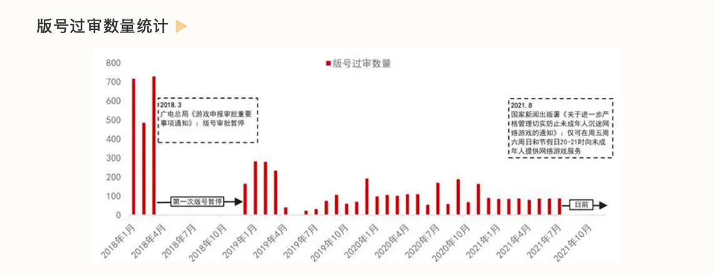

## 变现端：为什么广告联盟变现效率越来越高？

前面说了休闲游戏开发者越来越多的原因，现在我们来聊一下休闲游戏的变现方式。这里就不得不提到“广告联盟”了。

广告联盟是什么呢？就是各大广告平台（谷歌/百度/腾讯）或者聚合广告平台（ironSource/AppLovin）面对中小媒体和开发者，推出的一站式广告变现解决方案。你只需要把流量接入广告联盟，最后按收益进行分成即可。

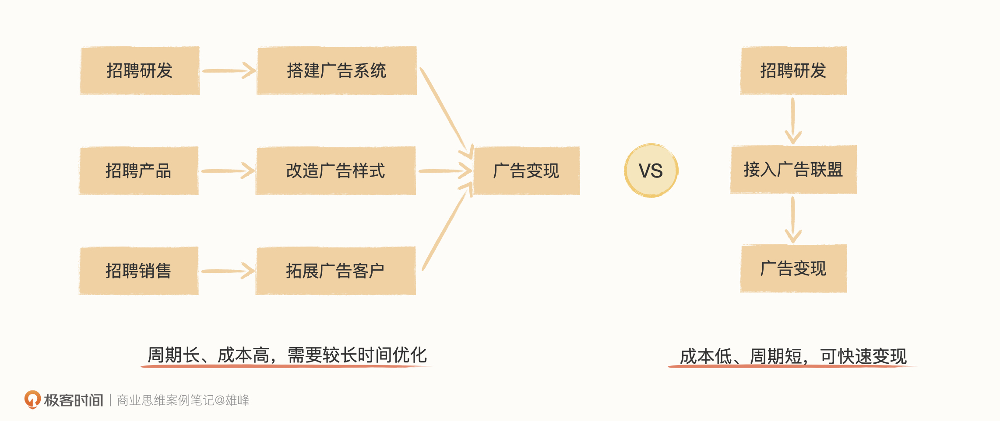

或者，你也可以这么理解。假设你有一块地，收获的方式有两种，一种是自己来种，这意味着你既要买全套的农用设施，又要自己全程去种，最后还得负责卖；还有一种就是承包出去，给有能力种好地的人来处理，他们来负责所有的东西，按年给你分成就好，省心省力。

广告联盟就和后者类似，游戏开发者把自己的流量给到广告联盟进行变现，自己参与收益分成。在整个变现的流程中，开发者只需要做好游戏，尽可能壮大自己游戏的流量规模，最后通过双方分工产生效能。

从 2014 年到 2018 年期间，广告联盟的变现效率已经从最开始的 eCPM 几块钱变成了二三十块钱，翻了接近 10 倍，其中最关键的策略为广告样式优化、深度出价工具推出以及反作弊策略升级三个。

### 广告样式：原生和富媒体两个方向的迭代

广告联盟最开始的广告样式只有两种，一种是插屏广告，另外一种则是横幅广告。这两种广告样式都对用户体验不太友好，因此点击率低。

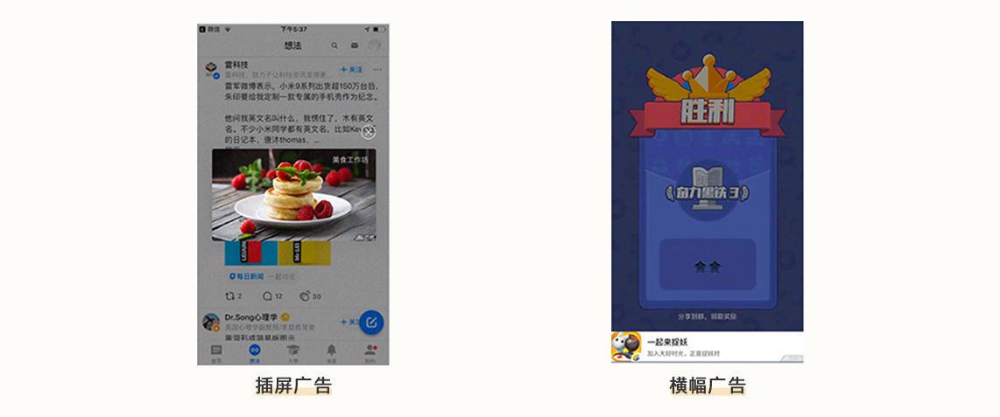

想要吸引用户点击广告，办法有三种。 **一种是让用户分辨不出来这个是广告**， **另外一种则是让用户有兴趣点击广告**，还有一种方案我们后面解释。

根据前两种方法，广告联盟在 2015 年之后陆续推出了 **原生广告** 以及 **开屏广告** 两种产品样式，前者让用户分不出来这是广告，后者让用户愿意点击广告，均大幅度提升了广告点击率。

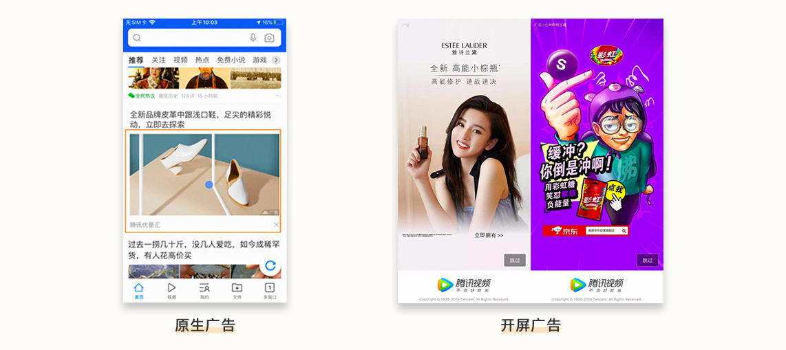

**原生广告，** 将广告与内容融合，成为产品的一部分，让用户自然而然地点击广告，因此在广告的样式上不仅要跟产品进行融合，在广告推荐上也会参考上下文以及用户兴趣做到精准推荐，最大的商业产品应用则是信息流广告，也就是 Feed 广告。 **而开屏广告，** 则以 App 或游戏启动作为曝光时机，提供 5s 的动态广告内容，可图片也可短视频，广告对于内容素材的制作要求较高，就是为了最大程度提起用户点击广告的兴趣。

### 出价工具：oCPM 吸引更多客户投放联盟

再说出价工具的推出。平台一般会把流量分为站内和站外两类，站内属于公司内产品的流量，站外属于联盟广告流量。站内流量好比是大的商场，由于自身可管控，客户在里面买的任何一个商品都是有保障的，站外流量好比是一个集市，鱼龙混杂，好坏很多时候凭运气。

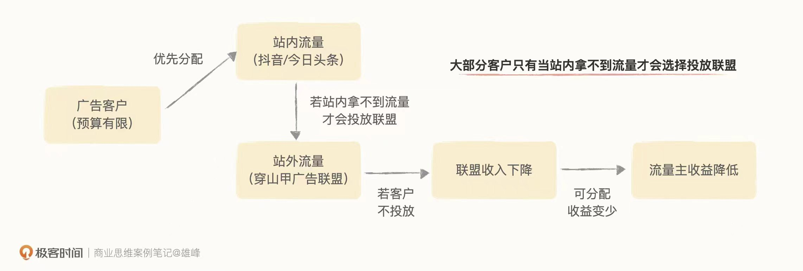

在出价工具迭代前，广告联盟较难保障客户的广告效果，因此客户在预算有限的情况下，也不会优先分配给联盟，进而导致了客户之间竞争的不充分，联盟广告的售卖价格一直较低，也无法给开发者分配更多的收益，形成了一个死循环。

但是，广告联盟的出价工具在这几年也从 [CPC 进化到了 oCPM](https://time.geekbang.org/column/article/541362)，过往广告主在联盟买广告，只能够买点击，现在因为有了 oCPM，可以根据自己的需求定制考核目标，可以买激活用户以及付费用户，甚至可以设定一个 ROI 目标（买回来用户付费金额/广告成本），质量相对有了很大的保障，因此也有越来越多的客户愿意投放广告联盟。

### 反作弊升级：减少劣质流量，加大惩治力度

这几年广告平台反作弊能力也不断提升。一方面是技术能力在提升，判断作弊的维度更多了；另一方面是数据样本量丰富，很多作弊的设备以及 IP 入库即可判断是有问题的。

反作弊的终极目标是去除所有作弊流量， 但是从实际结果来看这一点几乎无法实现，因此反作弊策略会围绕着两部分去升级。

一种是围绕流量方作弊逻辑展开的。接入广告联盟的流量方（休闲游戏开发者），收益都来自联盟的分配，因此流量方天然有动力作弊，比如伪造真实用户来点击广告骗取联盟收益，因此广告联盟需要不断了解流量主是如何作弊平台的，避免把假流量算钱。 **当作弊成本大于作弊收益之后，流量主也失去了作弊动力。**

另一种则是围绕广告主如何判断作弊流量开展的。举一个例子，假如京东在广告联盟投放广告，如果京东从各项数据判断导入的流量没有问题，那么 **广告平台即使自己判断有问题，但只要广告主不追究，平台也是默许的状态**。用时兴的话来说，当一个东西看起来是鸡，摸起来是鸡，吃起来也是鸡，那它为什么不是鸡？

## 小结

到目前为止，阳光养猪场这类休闲游戏已经能够存活下来了，我们来做个阶段性的总结。

今天，我们从供给端和变现端两个角度分析了以“阳光养猪场”为代表的休闲游戏是怎么“活下来的”。

从游戏供给端来看，2014 年，Flappy Bird 这个研发成本不高的游戏爆火，通过广告变现也能获取不低的收入，但它的成功太偶然了，只是引起了其他游戏开发者对于休闲游戏这个赛道以及广告变现方式的注意。2015 年，休闲游戏赖以生存的短代支付方式关停，迫使大批单机内购游戏开发者转型休闲游戏开发，并开始尝试广告变现。一直到 2018 年，游戏版号停发，导致大量没有内购游戏版号的开发者不得不转型休闲游戏开发，更换游戏赛道。

经过这三轮事件的推动，庞大的供给端已经初具雏形。

再看变现端是怎么进一步推动休闲游戏发展的。首先，就是广告样式的增多，整体向原生和富媒体两个方向进行迭代，让广告不再生硬，也让用户愿意点击广告。接着，就是我们上节课提到的 oCPM 工具的推出，大幅提升了广告主投放广告的效率，吸引了更多客户在联盟投放广告。最后，就是反作弊策略的升级，让劣质流量减少，整体的变现效率得以提升。

供给端和变现端的配合，给阳光养猪场这类休闲游戏提供了发展的沃土，接下来，就是它们登上游戏榜单的时刻了。那么，是谁给了它们进一步壮大的机会呢？它到底做了什么，让这类游戏爆火呢？

## 思考题

最后，我也给你留了一个思考题。你认为休闲游戏这个品类崛起，除了上述原因以外，还有哪些点呢？

欢迎你在留言区和我互动。我们建立了一个 [读者交流群](http://jinshuju.net/f/DuxzBi)，欢迎你的加入！如果你觉得有所收获，也可以把文章分享给你的朋友一起学习。我们下节课见。
