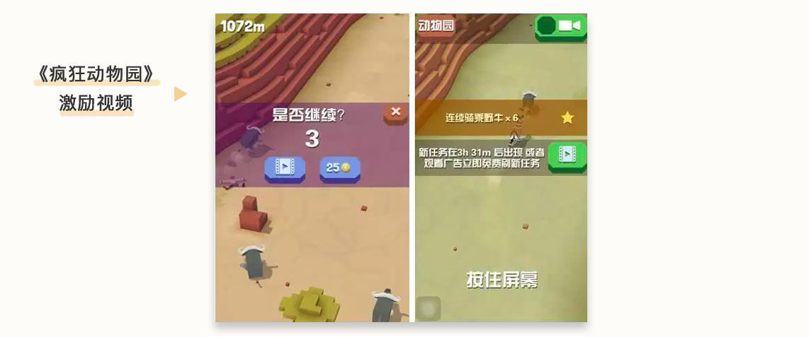
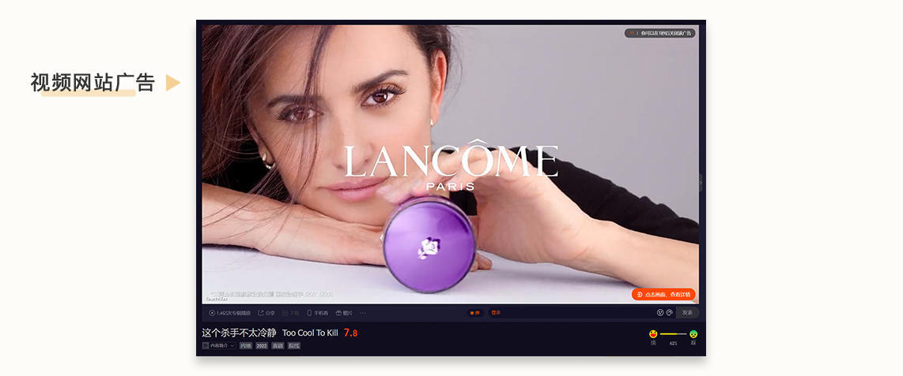
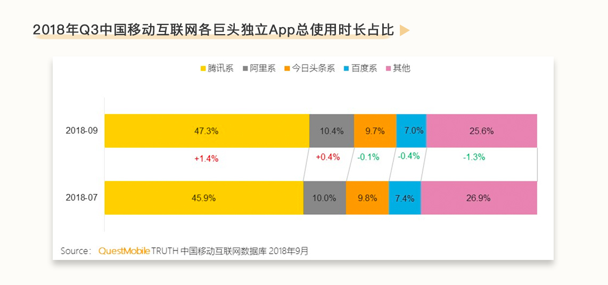
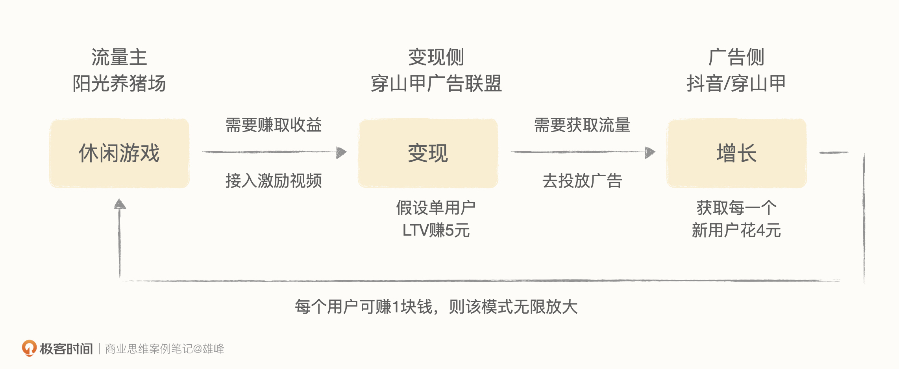

# 05-收益（下）：阳光养猪场等网赚游戏为什么在 19 年后突然火了？

<audio controls="" title="05-收益（下）：阳光养猪场等网赚游戏为什么在19年后突然火了？">
  <source
    id="mp3"
    src="/mp3/business-thinking/05-收益（下）：阳光养猪场等网赚游戏为什么在19年后突然火了？.mp3"
  />
</audio>

你好，我是雄峰。这节课我们继续探究“阳光养猪场”爆火背后的原因。

说了那么多供给端和变现端的变化，但是发展到 2018 年以前，休闲游戏依旧只有几十亿的规模，对比 IAP（In-App Purchase，内购游戏）游戏千亿级的市场，IAA（In-App Advertising）休闲游戏规模相对较小。

如果说，之前供给端和变现端的发展让休闲类游戏能够“活下去”，也能通过广告变现模式赚取收益，那么 **穿山甲广告联盟就是让这一类游戏“活得更好，做得更大”的原因**。而穿山甲广告联盟自身，也在这个阶段一跃成为了国内广告联盟的第一名，市场占有率超 50%。

穿山甲的核心策略有两个。一个是提升广告联盟的变现效率，同样的流量可以产生更高的收益，核心由变现效率、内部预算以及算法效率三个策略驱动。另一个是帮助开发者做增长，帮助开发者做大游戏自身的流量，让高价变现和低价买量形成了一个增长闭循环，这个点最终促成了穿山甲成为行业第一。

听起来很简单，但是其中有很多门道和细节，那么，穿山甲广告联盟到底做了什么，进一步扩大了休闲游戏的市场规模呢？

## 变现效率：激励视频商业产品形态

上节课我们说过，大幅度提升广告点击率的方式有三种，一种是原生化，一种是富媒体化。现在我们来聊一聊最后一种：利益化。简单理解就是看广告会给用户带来好处，这个好处就是足以打动用户的收益或者权益。

激励视频就是典型利益化的商业产品形态。它将短视频广告融入到 App 和游戏的场景当中，成为“任务”之一，用户观看短视频广告后可以得到一些应用内奖励。

例如休闲游戏《疯狂动物园》的做法则是当角色闯关失败致游戏无法继续后，用户可通过观看视频或者使用金币来获得复活的机会。

这种产品形态大幅度提升了用户观看广告的意愿，广告点击率大幅度提升，而激励视频为了在 30s 内尽可能让用户进行广告转化，因此呈现的内容较为夸张。

夸张到什么程度呢？它跟小时候看的 [电视广告](https://www.bilibili.com/video/BV12K411K7R4?spm_id_from=333.337.search-card.all.click) 很像，具备很强的广告冲击力，因此广告转化率也不低。

你可能会想，如果激励用户去看广告，是否会导致广告虚假点击呢？其实我们换一个场景就可以很好的理解了。假设我们在视频网站看视频内容，如果没有充会员，则会先看一个 30s 或者 60s 的广告，才可以看视频内容。

**激励视频本质上激励的是用户观看广告的行为，但是不激励用户去点击广告，因此主观上并没有诱导用户点击广告的情况，流量也不算虚假。** 阳光养猪场在这个激励策略上更近一步，用现金这种普适性高的奖励来吸引用户，因此用户的转化效率和观看广告的次数也在逐步提高，但也会带来流量质量下滑的情况，因为总会有一批薅羊毛的用户进来。

## 内部预算：字节内部增长和高额分成

穿山甲广告联盟成立的初衷也很有意思，这个项目立项的目的并不是为了赚钱，而是为了帮助字节内部产品“抖音”和“今日头条”做用户增长。是不是很奇怪？

我们回到 2018 年，会发现字节系产品占移动互联网总时长的 10%左右，这意味着有 90%的用户使用时长并不在字节的平台上。因此，字节就需要去各大平台打广告获取用户。但是 2018 年字节和腾讯还有百度都有非常激烈的竞争，一直都有因为竞争加剧互相封锁流量的行为。

为了避免这种情况，字节瞄准了“其他”这部分行业占比 25%左右的流量，推出广告联盟产品进行合作，从而侧面覆盖这一部分用户，投放抖音和今日头条这两个产品的广告，进行增长转化，实现字节系产品的曲线增长。

基于这个目标，大量抖音和今日头条的买量预算都在通过穿山甲广告联盟进行对外投放。可以说， **这一笔预算只花在了穿山甲上，结果就是，不仅提升了自家产品的新增，也侧面提升了穿山甲广告平台竞价水平**。

此外，由于穿山甲的核心是服务于公司系产品的增长，并不在乎利润规模，所以分给开发者的比例达到 90%左右，仅保留了业务正常运转的利润。相当于地主家有一些特殊的种子可以让你收成更好，但地主 **就找你要了一个成本价，收益全分**。这种情况下，开发者的收益怎么可能不好。

## 算法效率：广告精准推荐效果好

如果说上面的策略其他家还可以模仿和快速跟进，而这一个策略基本上树立了穿山甲的行业护城河，那就是字节广告系统中台能力的复用和穿山甲的优化。

字节跳动最出名的就是推荐系统，穿山甲广告系统也很大程度上复用了内部系统的能力，同时自己也根据站外流量的特性搭建了算法团队单独优化。因此在广告预估和推荐上，能够为用户推荐高精准的广告内容，变现效率远高于其他家。

## 增长闭环：帮助开发者做大规模

最后，如果单纯只是提升了原有流量的变现效率，流量盘子不变的情况下，开发者收益也是有限的。所以在变现之外，穿山甲将重心放到了帮助开发者扩大流量盘子上，也就是如何用赚到的钱帮助开发者低成本买广告，循环做大规模。

这是一个很颠覆商业产品认知的理念。过往而言，商业产品只负责解决变现效率即可，其余的就交给开发者自己来处理，过往大多数广告联盟也是这么处理的。但是穿山甲在推出广告变现服务的同时，也 **进一步面向行业推出广告投放、产品留存优化等一系列增长能力**，相当于不仅仅帮你种地，还告诉你说还有哪些地好，你赶紧花钱买下来，可以获得更好的收成。

正因为穿山甲的带动，休闲游戏的开发者发现，可以在广告平台上实现低价买量，同时又可以在广告联盟上进行高价变现，形成低买高卖的增长飞轮模式，推高了行业的爆发，才有了如今休闲游戏规模持续壮大的现象。

## 小结

现在，我想你应该能够明白“阳光养猪场”这一类游戏是如何活下去，又是怎么在 19 年爆火的了。

供给端和变现端都在逐步发展，所以活下去并不难。但在 2019 年突然爆火，就是因为字节跳动旗下的 **穿山甲广告联盟**，以及 2018 年推出的 **激励视频商业产品。**

激励视频十几倍于过往的变现效率，给休闲游戏行业带来了两个改变。

一方面，它扩大了休闲游戏的市场空间。休闲游戏都是通过广告进行变现的，过往一个日活跃 50w 的休闲游戏，一天只能够赚 2w 块钱，激励视频可以帮它把收益翻十倍，一天可以赚 20w。

另外一个是改变了休闲游戏的增长方式。过往休闲游戏用户的 LTV（用户生命周期总价值）只有几毛钱，买广告肯定是亏本的，只能够想办法通过病毒传播和渠道合作等方式免费获量，激励视频让休闲游戏用户的 LTV 变成了几块钱，这时候开发者发现买广告也是划算的，因此实现了休闲游戏的“增长-变现”的飞轮模式，从而带动了整个休闲游戏的大爆发。

穿山甲无疑是一个改变行业格局的现象级产品，也带给了行业很多不一样的思考，我个人认为有如下两个点，也是我希望你可以记住的两个点。

- **广告联盟的本质**

广告联盟的本质，就是平台优势能力的合作外延。穿山甲除了自身团队非常厉害以外，激励视频的广告形态其实跟抖音的视频广告内容比较类似，加上中台算法能力的支持、独家的广告预算以及赋能行业的增长能力，都是字节本身的优势能力，正是 **将这些优势能力打包聚合对外，才形成了对竞品的强大竞争力。**

类似的逻辑在其他行业也有所体现，比如华为进入光伏逆变器产业，从外行变成行业第一，也是复用了内部强大的数字化能力，大幅度改造了光伏逆变器的运营效率。

- **商业闭环的理念**

穿山甲进入广告联盟行业并不是从原有的盘子切了一块，而是做大了整体的蛋糕。做大收入规模的点不仅仅只是提升流量的变现效率，还解决了供给端增长模式重构的问题。

穿山甲因为其高收益的产品能力以及体系内增长能力的外溢，有效 **帮助流量方重构其增长模式，进而做大了整体的流量规模，反过来哺育了自身商业化规模的增长**，这才形成了业务飞轮模式。

## 练习题

除了休闲游戏以外，还有哪些行业因为激励视频这种高 eCPM 的商业产品能力而兴起的呢？

欢迎你在留言区和我交流互动。我们建立了一个 [读者交流群](http://jinshuju.net/f/DuxzBi)，欢迎你的加入！如果你觉得有所收获，也可以把文章分享给你的朋友一起学习。我们下节课见。
