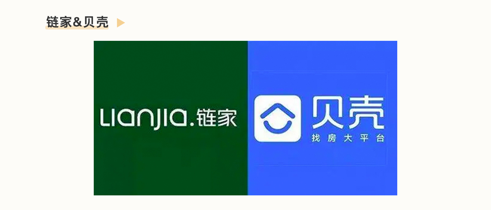
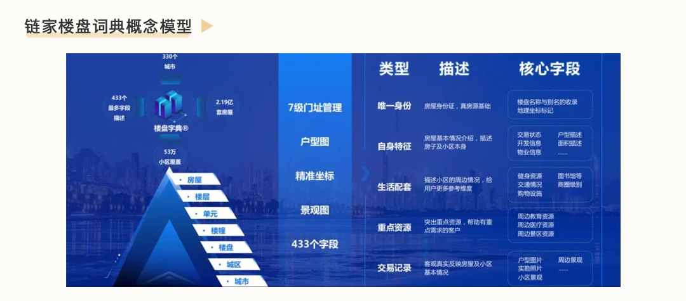
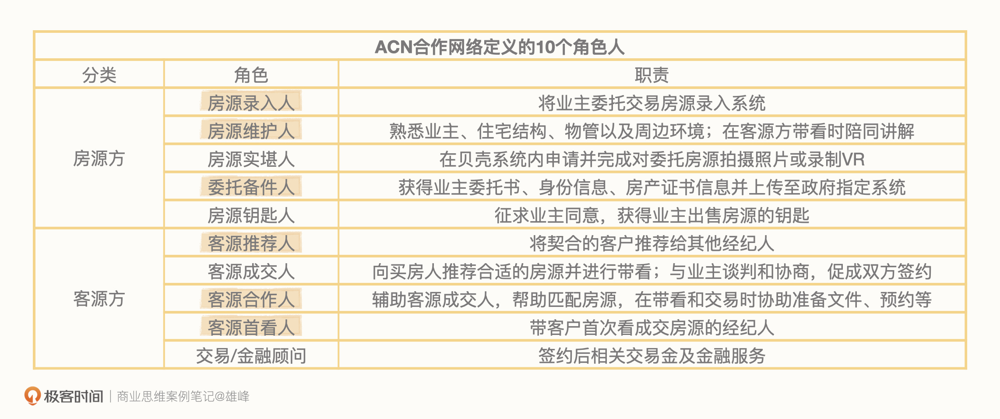
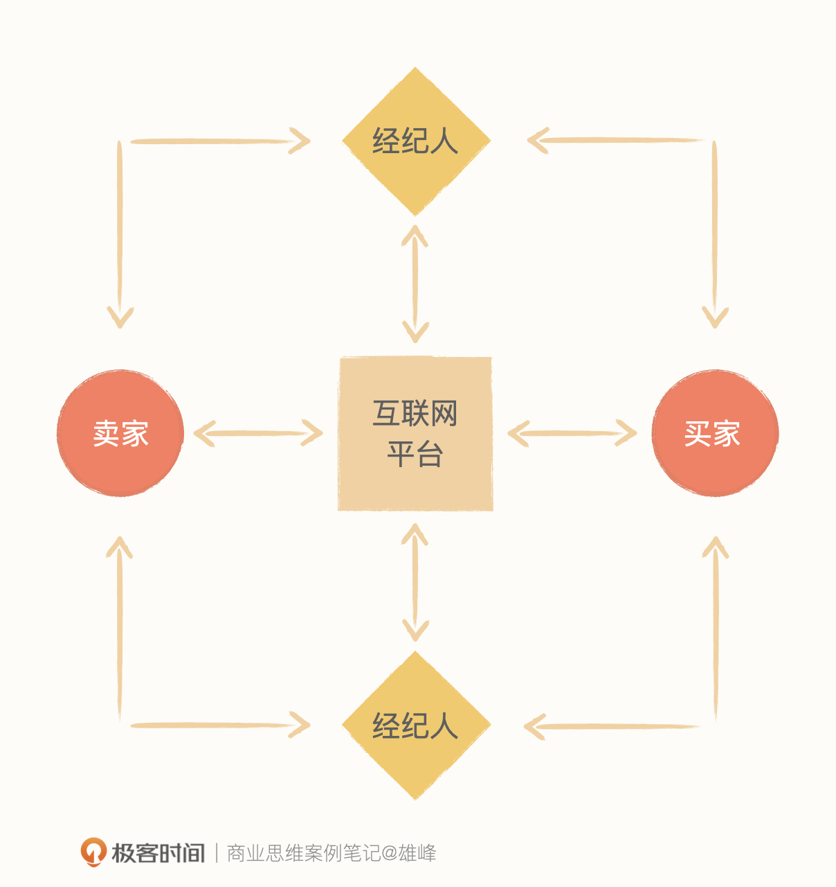
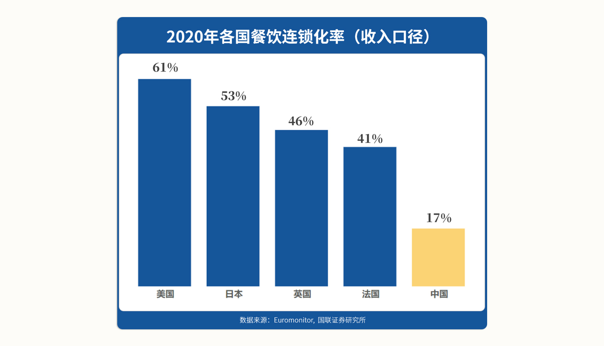

# 06-体验：链家为什么可以从线下起家反超所有互联网房企？

<audio controls="" title="06-体验：链家为什么可以从线下起家反超所有互联网房企？">
  <source
    id="mp3"
    src="/mp3/business-thinking/06-体验：链家为什么可以从线下起家反超所有互联网房企？.mp3"
  />
</audio>

你好，我是雄峰。本节课是我们价值创造篇的第四课。

说到改善体验，你可能想到的是消费者的体验，但是我今天想介绍的“改善体验”，甚至改善了从业者的体验。

今天的主角是链家及其线上业务贝壳找房，我们来看看 **改变博弈结构是如何改善用户和房产经纪人两者的体验，从而创造惊人的商业价值的**。

在房产中介领域，链家是一个奇迹。链家是当前国内规模最大且口碑最好的房产中介公司，2018 年推出的上线业务贝壳找房，上线两年，市值一度超过百度等传统 IT 巨头。

链家及贝壳给到用户和行业两个非常出名的印象，一个是服务体验非常好，不管是买卖房客户还是链家内的房产经纪人，另一个则是从线下起家干掉了线上的对手。

这里我来举两个例子，方便你更好的理解。

首先， **服务体验好**。2020 年有一部爆火的电视剧叫《安家》。讲的是上海一个房产中介卖房子的故事，剧里面的房产中介完全站在客户角度，千方百计地帮助客户买好房子，而不是仅仅为了促成交易。

电视剧最有争议的部分就是：现实中到底有没有这样的房产中介。微博也有一个讨论，生活中跟电视剧最像的房产中介是哪一家。大多数人给的反馈是链家，搞笑的地方在于电视剧官方的合作伙伴是 58 和安居客，这也侧面说明了用户对于链家的服务体验更加认可。

再说 **线下“干掉”了线上**。2013 年是移动互联网爆发元年，当时几乎所有的行业都受到了巨大的冲击，这里面也包括房产经纪行业。因为互联网最大的优势是降低信息的不对称性，而当时的房产经纪行业看上去就是依靠信息不对称赚钱，大家普遍认为这个行业会被互联网化。出乎所有人意料的是，移动互联网到了房产中介行业就“移不动了”。

到了 2018 年，整个行业由互联网成立的房产中介公司基本上都被干没了，相反是链家这一家传统房产中介公司越做越好，并推出了线上化房产中介平台贝壳找房。

接下来我会带你详细地分析链家及贝壳是怎么做的，从中学习 **更改博弈结构是如何优化行业从业者生存状态** 的，又是如何在给用户带来良好体验的同时，创造惊人的商业价值的。

## 不好的体验是怎么产生的？

在刚才的例子中，我提到了互联网可以降低房产经纪行业表面上“信息不对称”的问题。而链家的创始人左晖认为，房产中介行业表面的问题是信息不对称，根本上是行业的博弈模式问题：C 端单次博弈，B 端零和博弈。

- 单次博弈：用户和经纪人会倾向于短期利益最大化，吃相难看，房产中介不受人尊重。
- 零和博弈：经纪人赢家通吃，输家什么都没有，恶性竞争导致行业留存差、难发展。

行业的博弈模式导致优秀的房产经纪人缺失，没有给到用户良好的体验，而 **好的体验一定来自有尊严的服务者。**

可能现在，你对于这两个概念以及最后的这句话还不是很理解，别着急，我们可以先从行业的基础情况开始说起。

### 行业状况：充满了不信任

当时的行业里是充满了不信任的。至于不信任到什么程度，我们可以从三个角度来看一下。

**首先，消费者与经纪人不信任。** 在早几年的时间里，房屋中介主要的盈利点是“吃差价”，而且几乎有一套共同的“话术公式”：对卖房的人降低预期，告诉他房子的各种问题，压低价格；对买房的人拉高预期告诉他这片区域多好，而且好多马上要涨价了，抬高市场行情，以此创造出一个差价空间。

此外，还有一个“虚假房源”套路：大部分中介官网挂出来的低价房源都是虚假信息，电话问的时候承诺有房，等人过去告诉你房子卖掉了，然后给你推荐同小区一套价格高一点的房子，通过这种方式大量引流。

所以大家一说起房产中介就是坑蒙拐骗，信誉极差，“黑中介”是当时出现频率相当高的常用词。

**其次，经纪人和经纪人不信任。** 对于经纪人而言，谁手上的独家房源越多，谁手上的客户越多，谁的业绩就更好，所以经纪人都会牢牢地将客户和房源信息掌握在自己手里，甚至连讲个电话都要离门店远远的，生怕同事撬走自己的客户。

此外，业主为了多卖溢价，通常会将房子在多家公司登记，资源重复必然导致竞争，甚至恶性竞争的出现。这两方面的因素都导致了经纪人之间不信任的产生。

**最后，平台和经纪人不信任。** 员工对公司忠诚度极低，有的员工会将自己掌握的客户信息当成自己的资产，用各种方式来变现，甚至是卖给其他公司。一个客户去一家公司买房，登记自己的信息之后，可能立刻就会收到另外一家公司的销售电话。可以说，行业中有大量贩卖信息而私下获得收益的情况。

### 行业问题：C 端单次博弈，B 端零和博弈

德国社会学家卢曼说，一切的信任和信用都起源于重逢。在没有重逢的地方就不会有信用，也不会有信任。以此，我们来继续深挖造成这种不信任的两个底层原因。

首先是 **C 端单次博弈**。二手房市场是一个国家政策多变、价格信息不对称以及非标准化商品的市场。

买房卖房对于大多数人来说，虽然是一生中最大的一笔交易，但也只会发生一两次，导致买房卖房的人必然不太会有太多的精力去研究每一个环节以及每一套房子， **强依赖于经纪人帮忙把关二手房交易的各个环节进行有效服务。信息差，就导致经纪人在中间有非常大的操作空间。**

此外，房产中介行业面临的另外一个问题是从业者从业时间短、职业程度不高。

整个房产经纪行业，大约有 150 万经纪人，每年共成交 500 万套房，算下来就是每人每年成交 3 套。但是，这个行业的平均从业时间特别短，只有 6 个月。这 6 个月，也就是大部分经纪人的整个职业生涯，只够卖 1.5 套房，然后就要换行。

如果是你，面对一辈子可能接触一次的客户，一份可能干了半年就一辈子不再干的工作，你会怎么做？

大部分经纪人都会想办法最大化自身利益，狠狠地赚上一笔，这就是我们在最开始说的 C 端单次博弈。单次博弈可能让个别经纪人赚点小钱，让个别店家某一个时段能赚钱，但长期来看却从根本上给房地产中介行业的口碑造成了伤害。这也是旅游城市容易出现宰客的原因。

再来看 **零和博弈**。房屋中介的收益分配机制也存在很大的问题，赢家拿走所有，输家两手空空。前段时间闹得沸沸扬扬的谢娜买房跳单事件，就是这个问题导致的。通过 A 中介看了一个房子，然后再通过 B 或 C 中介谈判，降低中介费用，选择最便宜的成交。这就导致了经纪人和经纪人之间恶性竞争，从业者的收入区间落差也极大，通俗地说就是涝的涝死，旱的旱死。

## 良好的体验来自有尊严的服务者

左晖说过这么一句话：

> 链家不要求经纪人做到非常好的服务，核心的要求就是不要提供差的服务，品质在 60 分就可以。因为在今天这个行业中，很多企业都只能达到 10 分、20 分。只要你能够达到用户的基本需要，就可以达到 60 分，那就可以完全跟你的竞争者区分开来了。

那么链家是怎么解决行业中服务体验问题的呢？还是前面提到过的那句话，“ **良好的体验一定来自有尊严的服务者。**”

我们先从 C 端的改变开始说起。

### C 端改变：单次博弈改变为重复博弈

“买房”这个动作虽然频次低，但它的讨论频次可是一点也不低。不管是单纯咨询还是有购房意愿，大家都会或多或少地接触到一些经纪人或中介公司。而好的经纪人和中介公司，都需要时间的沉淀。

链家认为导致单次博弈的根本在于经纪人从业时长太短。而改变这个问题的核心，就在于延长经纪人的从业时间，让诚信推动复利。他们可以将国内经纪人的从业时间 6 个月对标到美国的 12 年，形成“越老越值钱”的现象。

于是，链家从两方面着手，一方面打破行业陋习，让用户信任链家。另一方面提升职业安全感，激励经纪人成为有尊严的服务者。接下来我们具体聊聊链家是怎么做的。

#### 用户：打破行业陋习，获取用户信任

首先是赢得用户信任的问题，链家通过阳光交易模式和楼盘词典，走出了破除行业陋习的第一步。

**不吃差价：** 2004 年，链家首推阳光交易模式，承诺不吃差价，打破行业潜规则。阳光交易就是把“买方、卖方、中介方”三方放在一起，从而避免吃差价的问题发生。

**推出真房源：** 2011 年提出真房源和真实数据，建立全国房源的楼盘词典（楼盘字典：房屋信息大数据库，包括房屋面积、地址、出售价格、房龄、周边信息等），做到一手信息的准确。并且从 2013 年开始提供服务承诺，如果你在链家买房子出了问题，链家兜底。

真实房源的推出让链家短时间内失去了大量流量。因为站在购房者的角度，会认为链家的房源价格比其他家更贵，就纷纷跑到了对手那边。但对手都是虚假房源，线上承诺有，线下一看没有，然后给购房者再介绍其他更贵的房源，一来二去用户也不傻，反而更加信任链家，复利效应逐步凸显。

#### 经纪人：提升职业安全，赢得职业尊严

在提升用户体验的同时，链家也关注到了从业者的体验。我们可以从 3 方面来看：

**重构供应链：** 上述挑战行业陋习的策略，一度导致大批量经纪人离职，链家也没有考虑从同行挖人，毕竟大家都在这个圈子太久了，底层思考逻辑很难改变。因此链家开始从职校、技校招募新人，重构经纪人品质，到后面也开始招聘大学生了。

**提升职业槽**：经纪人要让用户更加认可其专业度，则需要全方位提升其对房产交易各环节的业务知识。从 2011 年开始，链家每年都会在全国范围组织公司经纪人参加两次专业考试——搏学大考，作为衡量经纪人专业水平的重要手段。

**激励并有尊严：** 告诉员工卖什么不关键，不卖什么才关键，有所为有所不为，构建终身职业的价值观，只有终身职业才不愿意欺骗消费者，从而让员工获得用户的尊重，确保员工配得上想要的职业尊严。为此，链家给的底薪也超出行业一大截，因为只有当一个人有安全感的时候才会有做事情的底线。

这些改变最终形成的结果就是，链家经纪人的平均从业时长达到 3 年，远高于行业 6 个月的标准，且行业口碑第一。

### B 端改变：零和博弈变多赢博弈

我们再来看 B 端零和博弈的改变。

什么是零和博弈变多赢博弈呢？简单来说，就是把一个人赚的钱变成多个人一起赚。链家推出了 **ACN 经纪人合作网络：** 从过往赢家通吃的局面更改成为经纪人合作卖房策略，按照贡献分配佣金，所有的付出都有相应的回报，减少 B 端的零和博弈。

链家将经纪人的服务工作链路拆解为 10 个（房源方 5 个，客源方 5 个），每一个环节的贡献者都可以按照最终成交比例进行抽佣，一个经纪人可能会同时承担多个角色，最多承担 6 个角色。

这样的好处非常明显。对于一个新人而言，也可以快速进入这个行业，从最基础的工作做起，也可以从中间获取一部分收益。从业者的收入中位数得到了提升，也大大提升了行业稳定性。

## 为什么互联网房屋中介平台干不过链家？

了解了链家是如何通过更改博弈结构，从而优化行业从业者生存状态，创造出商业价值之后，我们再来讨论第二个大问题：为什么房产中介行业“移不到线上”了。

互联网改变行业有两个常用手段。

一是 **高频打低频**。比如微信使用频率很高，但是携程并不是，那么微信在服务模块继承火车票机票，就可以和携程、去哪儿竞争，这就是高频打低频，用非常大的流量降低获客成本。

二是 **标准化供给**。构建一系列规则和策略让非标商品标准化， **降低用户决策成本。** 淘宝之于零售，美团之于餐饮，滴滴之于出行均是如此。

这里我要说“但是”了。虽然互联网房企中介平台均复用了上述策略，但是不了解行业，盲目套用方法论的结果是：从线上往线下打的互联网房企都歇菜了。

### 二手房交易最关键的点在于供给

有一个最大的互联网房产中介叫做爱屋吉屋，这个平台推出的第一天主张的就是“去门店化，佣金减半”，通过低价模式大量吸引用户，从而降低获客成本。但它忽略了一个最关键的问题：二手房交易市场最关键的不是用户，而是房源，有好的房源是不愁用户的。

不过，好的房源是凭空就到中介到手里了嘛？不是的，还需要“卖房人”这个媒介。我们试想一下，卖房的人大多都不会太年轻，他们对于线上会存在一些不安全感，很难优先通过线上网站去售卖。

而传统门店构成了一张网络，形成了一种“麦当劳”的存在。它们围着小区开，融入社区。人们在买房、卖房或者租房时，很难不去线下问一下，这就导致线下相比线上可以第一时间获取有效房源和客户，而优质房源甚至可以在中介内部进行消化。

所以，爱屋吉屋虽然线上流量成本对比链家要便宜不少，但 **无法跟链家一样获得一手优质房源，导致空有流量但没有转化的情况**。用户很多但是好房子不多，最终用户还是会流失的，很难形成互联网高频打低频的模式。

### 标准化方式需通过经纪人实现

如前面所说，房产是不标准的极致，互联网很难对房产进行标准化。试想一下，线上有办法把房间保养情况、通风状况、房间噪音、社区环境等等一系列非标信息进行信息化呈现吗？即使有办法进行呈现，你作为买方，是否敢在线上直接购买呢？

这就导致互联网房屋中介平台，很难跟其他平台一样，仅仅依赖平台即可进行双端服务，而需要优质经纪人对买卖双方进行服务。我们刚才也讨论过，优质经纪人的优质服务，恰好就是链家独有的优势。

## 小结

最后我来给你总结一下今天的关键内容。房屋中介行业的本质问题在于：C 端单次博弈，B 端零和博弈。导致行业陷入了恶性竞争，从业者无序发展。解决的关键方案在于更改其博弈结构，让 C 端从单次博弈变为重复博弈，让 B 端从零和博弈变多赢博弈。

- 重复博弈：延长经纪人的从业时间，让诚信推动复利，长期从诚信中受益。
- 多赢博弈：经纪人合作卖房，按照贡献分配佣金，所有的付出都有回报。

链家在这个过程中逐步壮大，一方面持续的进行并购，另一方面推出贝壳平台吸引其他中介加入合作，用链家的经验改造其他中介的业务模式，进一步扩大了市场占有率。当链家和贝壳市场占有率越来越高，也在很大的程度上改善了购房者和从业者的体验。

这个体验的提升和普通认知下消费者体验的提升有什么不同呢？对于个人来说又有什么样的启发呢？

简单来说，就是 **解决问题的方案并不是直接去解决问题本身，可以往问题的背后再看一步。**

早些年餐饮行业一直被诟病的问题是食品安全问题，比如地沟油、劣质食品等，给消费者带来了非常差的体验。按照一般的认知经验，解决方案通常会是严查食品安全、加大打击力度等，但实际上收效甚微。虽然这个问题在每个国家都一定会存在，但为什么中国相对于美国来说会更严重一些呢？

核心在于中国餐饮的连锁集中度远不如美国那么高。

我们以 2020 年的数据为例，美国的餐饮连锁率达到了 61%，但是中国只有 17%。头部连锁占有率变高的情况下，作恶成本也就会变得非常高。同时，优势餐饮企业通常会提供更为丰厚的薪酬以及职业培训机制，凭借品质和服务不断扩张、并购，提升公司的市场占有率。

随着占有率提升，又反向约束企业更需要注意餐饮品质问题，不然影响的就是全公司。这一点其实跟链家的发展脉络很相似。

作为价值创造的最后一节课，我希望跟你再聊一下链家及贝壳的创始人左晖先生。很遗憾他于 21 年因癌症去世，但是他几乎凭一己之力改变了房产中介的现状，留给了行业非常宝贵的思考，非常值得学习。我用三个短句来概括我的学习心得和感受，也希望它们能够对你有所启发。

**第一句，激励人性的美好。**

左晖曾经说过，链家和贝壳的核心能力是找到了经纪人被激励的核心因子，他认为，激励不是来自于平台，不是来自于老板，而是来自于消费者，房产中介生意本质上是一个激励经纪人的生意。

《详谈左晖》有这么一段抚慰人心的话。

> 他正在这里干着活，外面来了一个大妈，端着一盘饺子，对他说“怎么还没下班”，把饺子给他吃。我觉得这是真正激励他的事情。

左晖是一个相信人性美好的人，因此也致力于让从业者成为有尊严的服务者。

**第二句，拥有极大的人格魅力。**

有贝壳的朋友跟我说过，左老板从 01 年开始从事房地产中介行业，这个行业最初的从业者素质相对较低，用现在的话说大多是社会闲散人员，但就是这么一波人跟了左老板 20 年，不离不弃，此外链家从 14 年发起全国并购，而其中一半的创始人依旧在贝壳工作。

**第三句，抽身思考的能力。**

传播学家麦克卢汉有句名言：“我不知道世界上是谁最先发现了水，但肯定不是鱼。”有很多企业身在行业中，会默认行业通行的做法是天经地义、理所当然的，链家是极少的、身处一个行业而变革一个行业的存在，这一切都离不开左晖先生的思考和推动。

左晖先生去世的讣告，最后一句话用了左晖经常说的话来纪念他： **做难而正确的事情**。

## 课后思考

最后，我也给你留了一个思考的问题，除了房产中介行业以外，还有哪些行业是互联网轰轰烈烈涌入但并没有很好的改变呢？

欢迎你在留言区和我交流互动。我们建立了一个 [读者交流群](http://jinshuju.net/f/DuxzBi)，欢迎你的加入！如果你觉得有所收获，也可以把这节课分享给你的朋友一起学习。我们下节课见。
