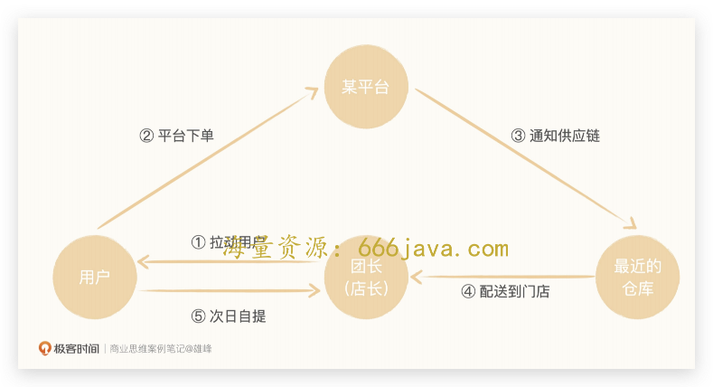
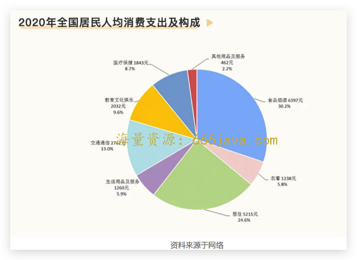
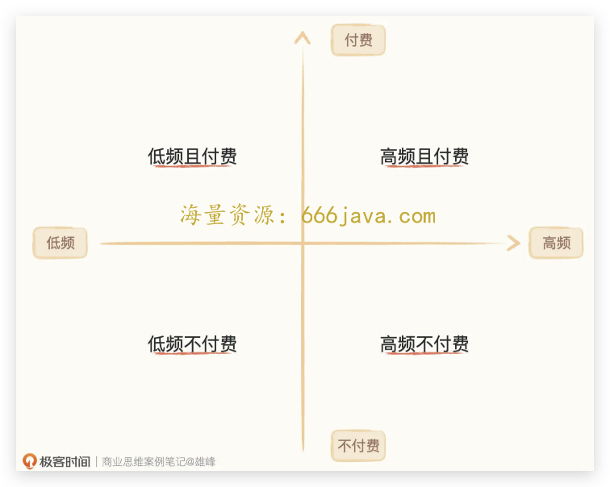
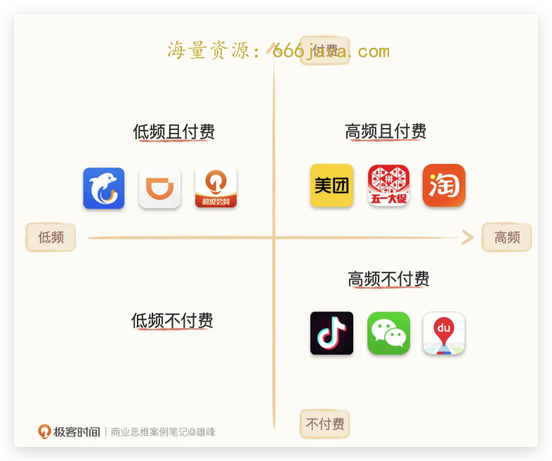
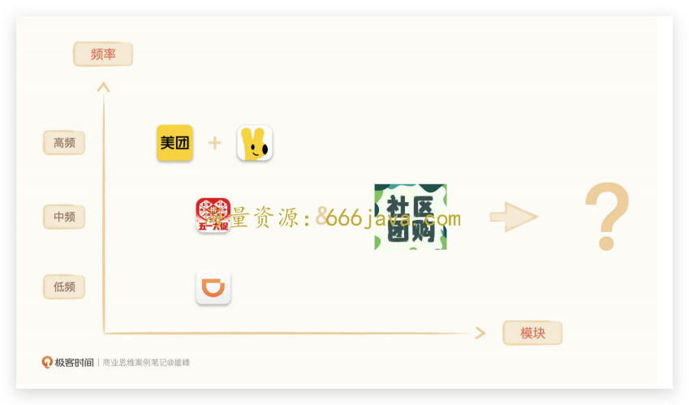
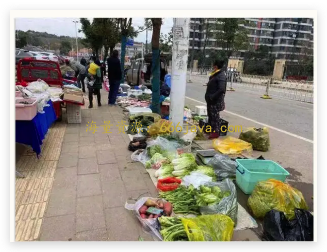

# 08-二维解构：社区团购为什么成为 20 年巨头必争的赛道？

你好，我是雄峰。从这节课开始，我们进入商业洞察的板块。

2020 年之后互联网最火热的赛道是什么？我相信如果社区团购说自己第二，没人敢说第一。

短短一年时间，这个行业涌入了几乎所有的互联网巨头，包括阿里、腾讯、美团、拼多多、京东以及滴滴，坊间传闻字节也动过插足社区团购的念头，各家大佬也纷纷给自家社区团购业务打气站台。也因为社区团购的兴起，行业又进行了新一轮的挖人竞赛，身边的朋友只要业务跟电商沾点边，基本上都接到了猎头挖人的电话。

我相信你一定很好奇，社区团购到底是一个什么样的业务？为什么成为了各大互联网巨头的必争之地？为什么恰好是 20 年才开始兴起，之前干什么去了？

别着急，接下来我会带你详细去拆解这些现象背后的原因，并学习一个解构行业的工具——二维解构法，拆解用户的使用频率和付费意愿，去寻找后面的业务机会，进而调整产品的商业模式选择。

最后，我们可以再延伸一步，去思考技术的进步对于环境会造成什么样的正负向影响。

## 什么是社区团购？

社区团购，简单理解就是一个区域的人共同买一件或一批东西。规模化购买，成本相对会低廉很多，不过，尽管这个业务模式在 16 年就已经有了各种各样的尝试，却一直没有成功。核心在于社区团购配送的东西主要以生鲜为主，而生鲜的毛利相对较低且损耗高，那么单次配送如果无法降低物流成本，则会导致亏损。

这个模式直到 19 年才开始火爆全网，核心是兴盛优选模式跑了出来并实现了规模化盈利。

我们现在提到的社区团购指的都是兴盛模式，而不管是拼多多还是美团，亦或是滴滴的橙心优选，借鉴的也是兴盛模式。兴盛优选的模式是以 **社区门店为基础，采用“平台预售+次日用户自提”的模式提供电商服务。**

社区团购大致的流程是什么样的呢？

我老妈就是社区团购的忠实用户。对她而言，过往可能买个菜、买个油需要走到离家 500 米以外的超市，有了社区团购之后，直接在小程序上下单，选择离家最近的自提点（一般是楼下的便利店）线上支付，等第二天商品达到之后，便利店的老板微信通知你来拿就好了，价格便宜又方便。

为什么兴盛模式能够跑通且盈利呢？或者说，这样能跑通的社区团购模式，优势是什么呢？

我们可以数一数新模式的几个优点。

- **预售的模式：降低库存和物流成本**

以销定采的方式可以提前知道到底有多少货需要卖，减少了提前备货导致的生鲜损耗成本，而平台也有足够的时间进行集单配送，降低了物流成本。

- **社区自提：降低配送成本，保障生鲜质量**

以社区便利店为自提点，减少了终端门店的租金成本的同时，也因为无需配送免去了终端的配送成本，更关键的在于社区便利店都有冰箱，免费打通了冷链储藏这一环节，保障了生鲜食品的品质。

- **便利店合作：降低了其获客成本**

团长基本都是便利店的老板，在门口打一个广告就可以告知社区的大妈大爷，线上买单线下提，价格还便宜，平台无需再大费周折地获取新用户。

- **集采规模优势：降低了采购成本**

上述环节可大量节约成本，平台将这部分让利给到用户，形成了跟线下明显的价格差异（基本上便宜 30%-40%以上），吸引了大量的用户，而大规模用户又可以有效地跟供应商谈判降低成本。

兴盛优选之所以能够有效地整合社区便利店团长，除了由于它的母公司本身就是湖南省最大的连锁便利店（芙蓉兴盛），有较强的整合基础以外，另一方面，兴盛优选也给社区便利店切切实实带来了人流和收益，来提菜的用户多少会在店里有一些小东西的消费，买包烟买瓶水之类的，也可带来额外的收益。

## 巨头为什么纷纷杀入社区团购？

有一说一，即使兴盛优选模式跑通了盈利模式，关注到这个机会的应该也是类似兴盛的便利店企业或者电商生鲜企业，前者是 711、罗森等，后者是每日优鲜和叮咚等，为什么相反盯上这个业务模式的基本上是互联网巨头，阿里、美团以及拼多多，连八竿子打不着的滴滴都加入了这一行当？

### 市场空间的庞大

有一次跟做投资的朋友吃饭，他问了我一个很有意思的问题：国内互联网游戏产业一年的收入和养猪产业一年的产值哪个大？

我的判断是养猪产业，但是我并不确定养猪产业比游戏行业大多少。朋友告诉我，国内游戏行业一年的收入大概在 1500 亿左右，但是养猪产业一年的产值在 1.5 万亿以上，十倍于游戏行业的规模。

猪肉只是居民生活消费很小的一部分，并且我们也不能说养猪产业的产值全部都是居民消费所带来的，但还是可以做一个直观的对比：“线下”的规模远比线上庞大。

我们以 20 年国家统计局的数据为例，一个居民全年食品烟酒的花费大概在 6000 元左右，考虑到不同地域的生活成本的不同，即使打上一折，算上国内 14 亿人口，这也是一个几十万亿的市场规模。

### 触达线下模式的机会

有规模还不够，同样也需要能够跑通线下的模式。这就是“兴盛优选”的意义了。

在兴盛优选出来之前，生鲜赛道其实已经打了 8 年，涌现出了四种模式。

**店仓一体模式** **：** 既是线下店铺，可以对外营业，又是仓库，可以接线上订单。代表企业是盒马和永辉。

**前置仓模式** **：** 在离消费者较近的地方建设小仓库，可以实现就近配送，时间压缩在半小时或者 1 小时内，代表企业是叮咚买菜、每日优鲜。

**到家平台模式** **：** 电商平台接入传统线下商超、零售店为消费者提供生鲜服务，平台负责配送。比如大润发接入淘宝的淘鲜达，山姆接入京东的京东到家。

这三种模式都无法很好的解决生鲜品类高损耗、配送时效要求高导致的成本问题，虽然已经有了 6、7 年的努力，但是传统农贸生鲜链路只有不到 5%的份额被线上所转化。

而只有第四种模式，兴盛优选的社区团购模式完美地解决了“最后一公里”的成本问题，有效地降低了损耗，让互联网有机会从线上渗透进线下产业，用标准化的方式改造最后一公里的零售服务。

更重要的是，2020 年的黑天鹅事件“新冠疫情”让过往习惯线下买菜的用户不得不线上买菜，进一步催生了市场的爆发。

### 二维解构法：频率+付费

如果说前两个机会点让每个人都想在社区团购上插一脚，那通过二维解构法，我们就能够理解为什么盯上这个业务模式的基本上都是互联网巨头了。

我们前面提过，并不是只要市场空间大，巨头和产品就会 [选择切入](http://time.geekbang.org/column/article/545373)，而是要看新的业务空间与其原有业务结构是否可以发生协同。恰好 **社区团购的模式属于付费+高频，与电商巨头和本地服务巨头的协同点非常高**，这才是巨头们纷纷杀入社区团购的根本原因。

这是怎么判断出来的呢？移动互联网发展到今天，任何为用户提供服务的 App，都可以用“频率+付费”两个维度构建一个横纵坐标系，用四象限的方式对产品进行归类。

**“频率”代表了用户规模**，使用频率越高用户规模越大 **，** 比如微信对于每一个人而言都是使用频次最高的产品，这也奠定了微信流量霸主的地位。

**“付费”代表了商业模式**，不付费则做外部广告，付费则做增值或者电商变现。微信频次很高，但是用户使用时并不会进行付费，因此微信的主变现模式是把流量导给其他可变现的业务，比如广告或者游戏。相反淘宝虽然频次弱于微信，但用户可以直接在里面进行电商购物，因为用户使用淘宝的行为就是为了购物。

现在，你可以想一想我们常用的美团、滴滴、抖音等等 App，都应该放在哪个象限中呢？

付费和频率两个判断依据，拆分出了四个象限，而我们常用的 App，也可以这样去分类：

**A.高频+付费**：美团、淘宝以及拼多多；

**B.高频+不付费**：微信、抖音以及地图；

**C.低频+付费**：出行领域的滴滴，旅游领域的携程，知识领域的极客时间；

**D.低频+不付费**：大把但不重要。

通过这些结构拆解，你会发现任何高频领域，市场的竞争激烈程度都相当激烈，而具备付费能力的业务也是红海中的红海，而 **社区团购恰好就是一个刚需高频且付费的市场，也恰巧这个领域暂时还没有巨头的涌现。**

加班狗可以每天只吃外卖，但是对于二三四线生活的居民而言，买菜是日常必须做的事情之一，也是必须支出的费用。这一部分用户过往的购买行为均发生在线下，这意味着下沉市场仍有几亿人没有变成各大电商平台的忠实用户，将这部分人群转化为平台的活跃用户，能成为新的增长点。

美团、滴滴和拼多多作为交易平台，对于单量和用户的追求永无止境，而三家公司原主营业务在 2020 年均看到了天花板，抢占社区团购，成为不约而同的选择。

巨头们不仅仅只是盯着卖菜这一块业务，也不会仅仅依靠卖菜业务赚钱（生鲜基本不赚钱），而是 **通过缩短交易环节的方式，重构了商品流通渠道，一手对接源头供应商，一手对接消费者，** 通过低价引流的同时，逐步推出酒水饮料、母婴百货等高利润商品，来获取利润， **最终让用户的消费行为从线下迁移至线上，形成消费闭环。**

因此，社区团购对于互联网巨头而言就是用户频率之争，就是付费用户之争。这是巨头下沉的超级战略，若想拿下广袤的下沉市场，社区团购是必不可失的流量入口。

还是那句话，市场机会大并不代表你会成功。这么多巨头的涌入，成功的只有一两家，最终是谁不好判断，但是谁不行肯定好判断。 **任何业务模式的相互融合，可简单理解为频次的叠加，用频次这个维度去拆解社区团购对于各家现有业务的加成，你就会发现滴滴机会不大。**

- **美团+社区团购：高频+高频**。美团过往的业务是到家和到店，一个人吃饭有三种状态，要么去线下消费，要么点外卖到家，但是买菜做饭跟这两者是互斥的，美团切入这一领域可以补齐所有用户生活消费领域，加之美团拥有配送团队和较强的地推经验，切入完全没问题。
- **拼多多+社区团购：中频+高频**。拼多多是依靠生鲜起家的平台，同时拥有下沉市场，社区团购的用户场景天然契合拼多多的业务场景，买了水果顺便买菜，加上拼多多拥有电商供应链的优势，切入也没有问题。
- **滴滴+社区团购：低频+高频，无。**

怎么到“滴滴+社区团购”就是“无”了呢？低频难带动高频的核心原因，就在于流量有限成本昂贵。

试想一下，你在一个一天或者几天才打开一次的产品上，会不会有想法去打开一个新的功能呢？换位到巨头的角度，滴滴面对一个星期就打开一次产品的用户，是会立马给你推打车的服务还是推买菜的服务？如果把流量给后者，自己立足之本的业务也无法保障，舍本逐末的策略必然是下下之策。

所以当初大家判断滴滴应该是第一个在社区团购市场上挂掉的产品，核心在于没有滴滴流量的支持，社区团购需要自己去拓展流量，而伴随着巨头的涌入，拓客流量（便利店+用户拉新）的成本会变得越来越高，高亏损情况下滴滴无法投入很久。唯一的出路，是滴滴证明这一块业务的价值然后独立融资，拉有流量的平台支持（腾讯+阿里），但是这个机会伴随着行业整改而消失了。

## **为什么社区团购现在又不温不火了？**

到目前为止，你应该已经对这节课最开始的几个问题有了清晰的答案了。但我们可以再往后看一步，看看社区团购的现状。

从 2020 年的烈火烹油，到 2021 年的相继倒闭（该年 7 月份倒闭了第一家社区团购公司同程生活），再到 2022 年的巨头大幅收缩和裁员，大家对它的关注也从过往社区团购万亿市场规模如何影响中国互联网的格局，再到如今如何实现盈利这类基本问题上了。这中间既有政府监管的原因，又有这门生意本身的问题。

### 政府为什么会监管？

在各大互联网巨头热火朝天布局“社区团购”的时候，20 年年底人民日报罕见下场点评社区团购：别只惦记着几捆白菜、几斤水果的流量，科技创新的星辰大海更令人心潮澎湃。

过往政府对于互联网科技创新都是极大的容忍和鼓励态度，但为什么在社区团购领域，会有这么大的反应呢？

社区团购业务之所以可以成立，本质是生鲜领域上冗长的供应链导致的。生鲜从源头到消费者手上需要经过 5-6 道的加价，所以导致价格虚高。对消费者而言，冗长的供应链让消费者付出了更高的价钱，对互联网巨头而言，这就是效率优化的空间。但是政府的视角与上述两者并不相同， **冗长的供应链也是维系就业稳定民生的关键。**

社区团购对标的对手是摊贩、便利店、夫妻店、传统菜市场，这波人熬过了 2020 年年初的疫情，又开始面对互联网巨头的冲击。

**问题的关键在于，如果把这些“竞争对手”消灭了，社会会是一个什么样的环境呢？** 尤其是该产业链上都是中国底层的个体户，资本积累差、技能单一且年龄较大，如果真的把他们清出了市场，他们又能干什么？这也是社区团购所遭受到的舆论影响远高于其他行业的原因，因为影响的是最弱势的底层。

这其实给了做业务的人一个警醒，让我们思考技术的进步所带来的社会性影响。凯恩斯在 1930 年曾经提过一个词 **：技术性失业**。他表示也许有些读者还没有听说过它的名字，不过今后几十年他们将频繁听到这个词。这个词的意思是，我们寻求节省劳动力的速度超过为劳动力提供新的就业机会的速度所导致的失业。

因此 2020 年末，人民日报很直白地点评了社区团购，紧接着市场监管总局联合商务部要求互联网社区团购企业严格遵守“九不得”，新规重点限制的是补贴以及商家选择权，到了 2021 年 3 月又开出了对不少社区团购企业的罚款，把社区团购企业拉到了做零售这门和菜贩子一起竞争的标准上。

### 模式本身的问题

那这门生意本身还存在着什么样的问题呢？

首先，就是 **无法速胜，需 ROI 为正。** 在监管的要求下，丧失了补贴这个大杀器，各家社区团购业务也较难快速统一市场，需要慢慢地做，这就会导致这是一场短期看不到尽头的战争，持续的亏损可能活不到业务证明自己的时间点。

还有一点就是 **资本市场发生了转向，现金为王** **。** 过往资本机构考核一个互联网业务最关键的指标是用户量和交易额，即使有亏损也是容许的，但是在 21 年开始整个资本市场迎来了一次大转向，盈利要求越来越严格。

最后，当所有人都涌入社区团购这个市场，构建模式最关键一环的“团长”则会变得稀缺，这意味着成本也会逐步往上涨，同时，吸引用户的流量 **成本也在往上涨**，这样意味着过往赚钱的生意变得不赚钱。

## **小结**

讲到这里，我们今天这节课也就接近尾声了，最后我来给你总结一下今天的关键知识点。

**二维解构法：频率+付费**。任何为用户提供服务的 App，都可以用“频率+付费”两个维度构建一个横纵坐标系。二维解构法可以用来判断市场的机会空间，确认自己所进入的市场到底是红海还是蓝海，商业模式是走增值付费还是广告变现。

**频率叠加判断：** 基于二维解构法，我们可以把产品的各个模块理解成用户频率之间的组合，即可用于判断模块之间是否有机会做到有机融合，高频模块可带低频模块，因为高频模块的流量充裕，可以进行用户导流，相反，低频模块很难带动高频模块，因为低频模块很难把本就稀少的流量转让出去。

**技术外部性影响：** 在做业务创新的过程中，不能够仅仅只看到正面的效应，还需要看到其破坏性创造反向所带来的影响，尤其是业务模式影响到最底层人民的现有利益，则需要更加慎重。在企业发展的基础上，一定是需要承担更多的社会责任和外部影响的。

商业洞察能力，最关键的一环就是抽象看待业务模式的能力。过往我们都会具象地聚焦在业务的某一处细节，相信学完这一讲的你，已经能够尝试把一个业务模式简化成抽象的符号去理解了。

下一讲，我们继续用二维解构法，看看它如何与需求的二八定律去配合，从而判断一个产品商业模式的瓶颈。

## **思考题**

最后，我也给你留了一个思考的问题。想一想，你还能想到哪些产品目前是高频带低频的模式呢？

欢迎你在留言区和我交流互动。我们建立了一个 [读者交流群](http://jinshuju.net/f/DuxzBi)，欢迎你的加入！如果你觉得有所收获，也可以把这节课分享给你的朋友一起学习。我们下节课见。
