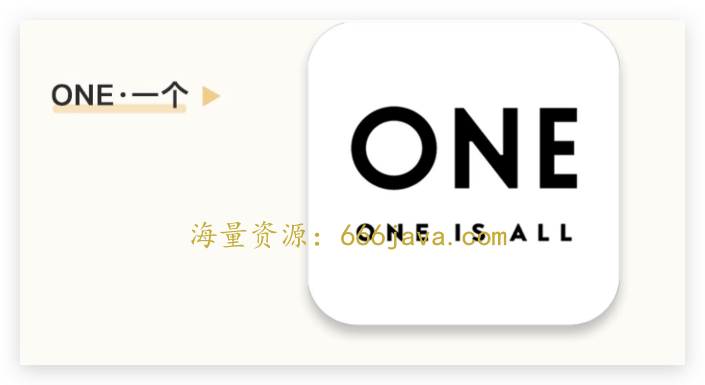
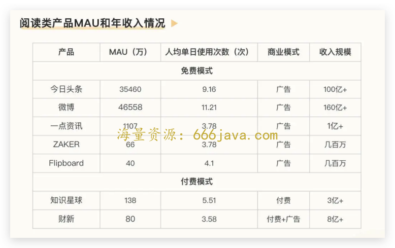
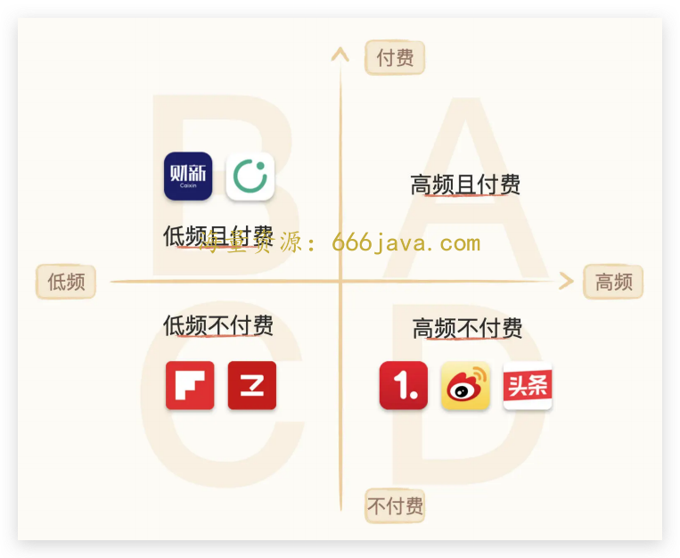
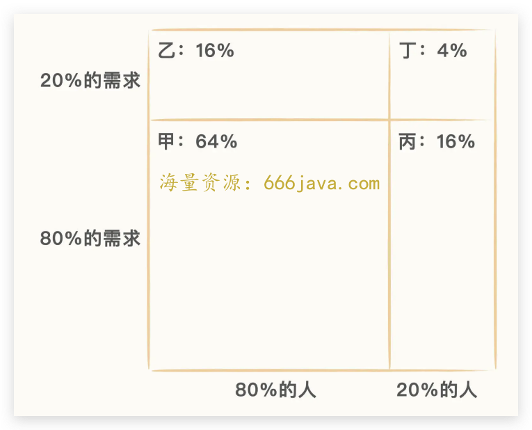
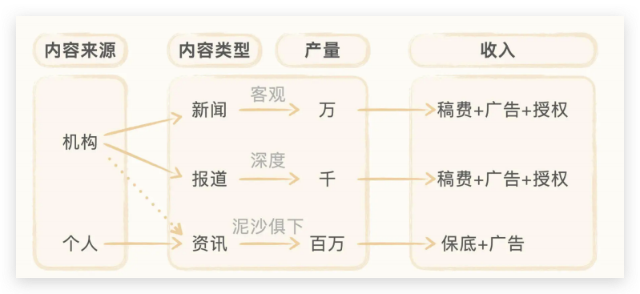
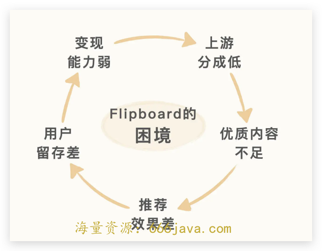

# 09-二八法则：为什么 Flipboard 等免费精品阅读领域做不大呢？

<audio controls="" title="09-二八法则：为什么Flipboard等免费精品阅读领域做不大呢？">
  <source
    id="mp3"
    src="/mp3/business-thinking/09-二八法则：为什么Flipboard等免费精品阅读领域做不大呢？.mp3"
  />
</audio>

你好，我是雄峰。

今天我们从韩寒在 2012 年的时候推出的一个阅读类产品“ONE·一个”开始说起。这个产品秉承“复杂世界里，一个就够了”的理念，每天给用户推 1 张图片，1 篇文章，1 个问题，1 款东西，在 24 小时内就登上 App Store 免费排行总榜第 1 名。

ONE 属于精品阅读类的产品，这类产品主打少量而精致的长文内容，阅读完一篇文章大致需要 10 多分钟，一个用户一天大致可以阅读 5-6 篇文章，国内类似的产品还有豌豆荚一览、知乎日报、ZAKER 以及大象公社等等。

不过，刚才说的这些阅读 App，都有一个“祖师爷”——Flipboard。

Flipboard 在互联网时代可谓是起了一个大早又赶了一个晚集，从巅峰时期的过亿用户到如今只有几十万用户，形成了鲜明的反差，而它在国内的跟随者们如今也纷纷销声匿迹。

今天我们就来聊聊以 Flipboard 为代表的一系列精品阅读 App 为什么会失败，为什么会出于用户规模和变现空间的两难境地，从中学习如何利用用户需求的二八法则来判断产品的市场潜力，进而了解内容类产品的产品设计机制以及商业模式运营的逻辑。

## 高光和落寞

Flipboard 是一款诞生于 2010 年的移动阅读应用，2010 年乔布斯发布 iPad 一代时，专门在台上演示了 Flipboard。该应用在 2011 年当选最佳 iOS 应用，并被美国著名科技博客网站 TechCrunch 评至当年最佳 iOS 应用的榜首，早在 14 年全球用户就达到了 1 亿左右。

我 10 年前买了人生中第一个 iPad，主要就是为了用 Flipboard 看科技媒体资讯，它优美的封面设计、顺滑的动态翻页以及卡片式界面交互，让我阅读资讯的体验耳目一新。同时，里面聚合了大量优质内容，我可以根据自己的兴趣选择关注。

由于这个产品在国外取得了巨大的成功，国内也纷纷涌现了类似的产品，比如我在最开始提到的 ZAKER 新闻还有鲜果阅读等等。但是伴随着时间的发展，领先的市场份额逐步被以今日头条所代表的个性化阅读和以财新为代表的付费阅读所蚕食。

你可以看一下这些产品如今的 MAU 和年收入情况：

你会发现，Flipboard 处于很尴尬的境地，免费模式下的用户规模追不上今日头条，同样的用户规模下变现收益也做不到财新和极客时间等付费产品的规模，这背后的原因是什么呢？

## **尴尬的定位**

基于上面的数据，我们已经对 Flipboard 的商业模式和用户规模有了一个大致的认知。还记得上节课说过的二维解构法吗？基于这个方案，我们可以建立一个自己对 Flipboard 业务模式的认知，按照二维解构法可以把 Flipboard 和其同类型产品，大致可拆解为如下四个部分：

A. 高频且付费：图文内容领域，无；

B. 低频且付费：财新和知识星球；

C. 低频不付费：Flipboard、ZAKER 新闻；

D. 高频不付费：今日头条、微博、一点资讯。

我们来进一步分析一下 BCD 三个区域，看看它们有什么不同。

### **B 区域：依赖增值付费**

用户规模较小，广告变现的 ARPU（每用户平均收入）值较低，每个用户最多一年十几块左右。不过，这类产品独家控制了上游的优质内容，以优质知识类内容为主，让用户愿意进行付费。

因此，在小规模、高 ARPU 的模式下，也可以获得非常不错的年收入，财新的会员付费一个人一年在 698 元，知识星球里面的付费内容不等，高的有几千元一年，低的也有几十块。

反过来，由于赚取的收益也不错，也可以给上游内容方进行更丰厚的分成，维持优质内容的产出。

### **D 区域：依赖广告变现**

用户规模足够大，内容偏娱乐资讯类，适合采用广告变现的商业模式。因此，不管是头条还是微博，都有上百亿的年广告收入。头条号也会基于内容的曝光给上游的内容生产者进行一定的广告分成。

此外，由于平台足够大，也可以给内容生产者带来更大的名气，而名气也可转变为收益。比如微博上的网红大 V，可以通过自己的影响力接广告获取收益。

### **C 区域：模式的进退维谷**

Flipboard 的尴尬点就出来了，产品流量不足导致广告收益不高，做增值变现又因为内容来自上游媒体，内容不独家且不稀缺，用户的付费意愿并不足。

那问题来了，为什么 Filipboard 无法向右走，做到头条或者一点资讯的用户规模，或者向上走，做到财新或者极客时间吸引用户增值付费呢？

这里我们可以从产品定位再往深看一步，看看产品定位背后的产品机制。我先说结论，核心在于 **Filpboard 的内容产品机制导致其选择了一个用户规模小众的市场，并且无法让用户为其付费，导致无法构建一个正向的内容循环机制。**

## 有问题的产品机制

互联网行业中任何内容型产品基本上可以拆解为三部分，分别为 **用户需求、平台策略以及内容类型**。用户需求是其中最关键的部分，产品选择满足什么样的用户需求，决定了产品选择多大的市场规模，进而决定了产品的内容导向以及分发策略。而这也是一切产品设计机制的原点。

### 用户分层：需求二八法则

前面我们提到了，Flipboard 所推的内容是优质的知识类内容，阅读这一部分需要花一定脑力，而愿意花脑力消费内容的用户天然属于少数。

为什么这么说呢？美国著名的战略学家布热津斯基提出过一个非常出名的“奶头乐”理论。这个理论是在 1995 年美国旧金山的一个会议上提出来的。会议号称要解决“全球化”带来的一系列问题，其中最迫切的一个问题就是贫富分化：20%的人占有 80%的资源，而且这个比例越演越烈，该如何进行解决？

布热津斯基认为：谁也没有能力改变这个“二八现象”。解决大多数人群不满的办法只有一个——就是在他们的嘴里塞一个“奶嘴”，安慰他们的情绪。虽然这不解决问题，但是也不会发生更严重的后果了。

奶头大致是指两种产业。

第一种，是发展发泄性的产业，包括色情业、赌博业，游戏、体育等等。

第二种，是发展满足性的产业，就是娱乐节目、明星八卦之类的。

大众是二八区分的，80%的人对于时间是一种消费的概念，更多是通过各种东西来消磨日常的时间，20%的人对于时间才是一种投资态度，比如此刻在看极客时间的你。精品阅读，正是 20%的人对于时间持投资态度的体现之一。

因此，才有了用户分层的需求二八法则，这个是字节战略大神朱时雨在自己的文章 [《会有小而美的事情发生吗》](https://mp.weixin.qq.com/s/lc5i1Pz6LXiI6kokTp_9lQ) 中，提出的需求分析框架：

> 同一个需求对用户是二八分层，同一类群体对需求也是二八分层，因此可以得到一个不同群体和不同需求的四象限乘积，以此判断什么是刚性需求，什么是小众需求以及什么是伪需求。

这四象限乘积是怎么分出来的呢？我们一个个来看。

**甲**：80% 用户的 80%的需求， **普罗大众的刚性需求**。普罗大众对内容是消费的态度，因此娱乐八卦、时事热点、搞笑糗事等内容都是消费的大头。

**乙**：80%用户的 20%的需求， **普罗大众的垂类需求。** 这类需求可以有，但不是必须有。这种内容和功能可以继承在 App 内，也可以单独独立出来，比如搞笑内容的最右，早期的糗事百科，再比如长视频速看的片多多。但是现在很多头部产品也继承了这一部分内容。

**丙：** 20%用户的 80%需求， **小众用户的刚性需求。** 小众用户对内容则是投资的态度，因此会更偏向深度、严肃等高质量内容。比如财新、知识星球、Flipboard 或者极客时间。

**丁：** 20%用户的 20%需求， **小众用户的小众需求，公司伪需求的高发地，个人创业方向的切入点。** 需求受众小难以形成大的用户规模，公司创业相对来说非常不划算，所以，留给了个人空间。

这部分需求的核心是在低成本的情况下寻找到相同的用户。因此，我们会发现这类特别小众的需求，主要存在于豆瓣的群组和抖音/B 站的各类 UP 主中，比如徒步是小众爱好，徒步领域还有特殊的轻量化徒步，想了解这一块的内容，就会关注类似领域的 UP 主。

基于划分出来的框架，我们可以完成行业主流内容产品的归类。

你会发现，Flipboard 锚定的领域是精品内容方向，核心是帮助用户发现优质内容，本质还是 Save time 的概念，也决定了其市场规模受限。

### 内容标准和呈现方式

如果说 20%中 80%的刚性需求，只是让 Flipboard 的市场规模受限，那为什么 Flipboard 和知识星球、财新以及极客时间发展趋势并不一致，最终还是落寞下去了呢？我们再来看看它的内容标准和呈现方式。

- **内容生产**

Flipboard 是一个内容的聚合器，其本身不生产内容，内容全部来自外部的授权。

在内容行业中，内容的生产者大致可分为两类： **机构和个人**。内容的类型可分为三类： **新闻、报道以及资讯**。机构生产的主要是新闻+报道，少部分是资讯，个人（自媒体）生产的主要是资讯。

首先，我们看新闻和报道。新闻的供给每天在几万条左右，报道是基于事实基础上的观点产出，产量在几千条左右，这两者都属于 **严肃内容且需要采编权**，一般只有报纸、杂志等批准的新闻网站才能拥有，因此这一部分内容生产规模有限。

以大家常用的腾讯新闻为例，腾讯新闻的新闻内容都来自传统媒体，比如南方周末、新京报等，腾讯新闻不具备采编权，只拥有转载权。

再来看资讯。资讯的供给由于公众号和头条号的兴起，这一部分每天在百万条左右。

将资讯和新闻、报道的内容对比，会明显发现，严肃内容的产量是远跟不上资讯内容的产量，前者是日以万为计量的规模，后者是以百万为计量的规模，当然，前者品质也远高于后者。

- **内容选择**

**内容型产品的内容选择标准有两种：一种是大而全**，平台提供全量的内容，让用户自己做选择。 **一种是少而精，** 平台对内容做一轮自己的价值判断，确认哪些是好的哪些是差的。

Flipboard 主打的是精品阅读产品，内容的选择标准上也是少而精的模式，帮助用户节约时间。

从用户端需求来看， **内容型产品对用户内容呈现方式有两种：一种是订阅，一种是推荐。**

推荐，是基于用户 **需求模糊** 的设定，用户并没有明确意向，会根据平台推荐的内容进行持续反馈，好的推荐会让用户有“哦哈”眼前一亮的感觉。

订阅，是基于用户 **需求明确** 的设定，用户知道自己想要什么样的内容，平台提供用户到内容的通路。

Flipboard 选择的是订阅模式，进一步强化精品阅读用户的阅读习惯，帮助用户节约时间。

但是，这种“少而精”的内容标准+“订阅”的模式，让生态机制陷入了不能闭环的机制。

- **恶性循环**

优质内容本来就偏少，再进行一轮筛选就会更少，这少部分内容则具有很强的商业价值。可是问题点来了，我是上游内容提供方，Flipboard 可以拿什么来激励我持续提供和产出呢？

广告收入依赖于流量规模的壮大，而订阅模式下的用户群体相对较少，广告变现收入空间低，可分成给上游的利益则极其有限，无法管控优质内容，进而无法推动用户增值付费。最后，商业模式陷入了恶性循环的状态。

内容型产品有一个 **用户规模和内容引入的变量临界值。** 简单而言，就是用户规模足够产生对应的影响力或者收益空间，才可以吸引上游内容生产者的持续生产或者持续合作，如果没有达到这个临界值，则产品会陷入持续找内容和持续找用户的双重困境。

当财新等重磅新闻媒体在 17 年开始推进优质内容付费，当知识星球于 17 年推出有效帮助个人作者变现手段的时候，Flipboard 的优质上游内容来源逐渐减少，对存量用户的吸引力也在逐步减弱，我也是在这个时间点逐步从 Flipboard 流失的。

## 小结

讲到这里，我们今天这节课也就接近尾声了。

今天，我们先通过上节课学习的“二维解构法”和行业数据，对 Flipboard 有了一个大致的认知，了解了其在内容产品领域中，处于低频，且以广告为主的模式。

随后我们通过需求的二八法则，分析了其产品低频的原因。核心在于，人群对于需求是二八分层的，80%的用户对于内容的需求是 kill time，消费的是娱乐性内容，20%的用户对于内容的需求是 save time，消费的是知识性内容。Flipboard 选择的是精品阅读领域，满足的是 20%的用户需求，因此是低频产品。

再之后，我们分析了其产品模式给商业变现空间带来的限制。少而精的内容以及订阅的呈现方式，进一步强化了其对于小众用户的需求满足，但也限制其商业空间的发展，导致其无法给商业内容生产者提供较好的利益分配。平台缺少优质内容，处在了既无法吸引大众用户使用，又无法吸引小众用户付费的尴尬境地。

**从行业数据以及二维解构法，我们能快速了解一个产品的定位 ，再进一步，也可以通过用户分层的二八法则来深入分析产品机制。**

用二八法则对用户和需求进行叉乘分析，可将需求归类为“大众群体的大众需求”、“大众群体的小众需求”、“小众群体的大众需求”以及“小众群体的小众需求”。

大众需求做广告变现，小众需求做增值变现，远离小众群体的小众需求。以 Flipboard 为代表的精品阅读内容产品，之所以走向失败，核心就在于切入了小众市场但没有控制上游做增值，导致其商业闭循环无法形成。

最后，如果用一句话来总结今天我们学习到的关键内容，我希望你记得这么一句话：

**80%用户的 80% 需求，是高频产品需求，这类产品适合做广告变现。20%用户 80%需求，是低频产品需求，这类产品适合做付费变现，当然，付费变现的前提是内容高质且独家。**

## 思考题

最后，我也给你留了一个思考的问题。我们可以用字节战略大神朱时雨的需求二八法则拆解一下，看看是否有 **不符合** 上述定义的产品呢？

欢迎你在留言区和我交流互动。我们建立了一个 [读者交流群](http://jinshuju.net/f/DuxzBi)，欢迎你的加入！如果你觉得有所收获，也可以把这节课分享给你的朋友一起学习。我们下节课见。
