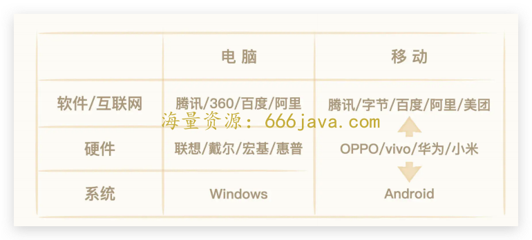
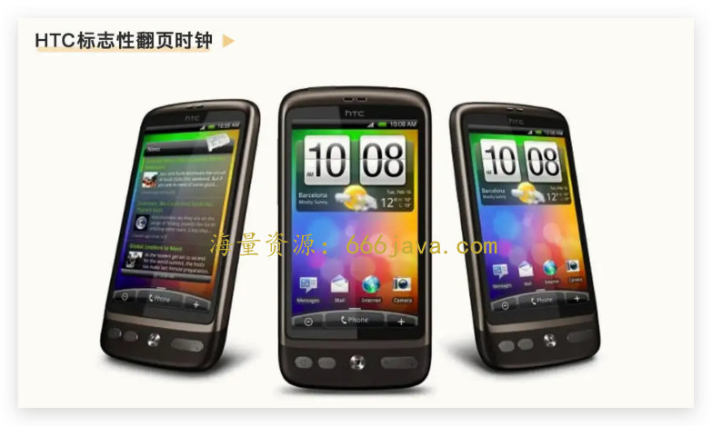
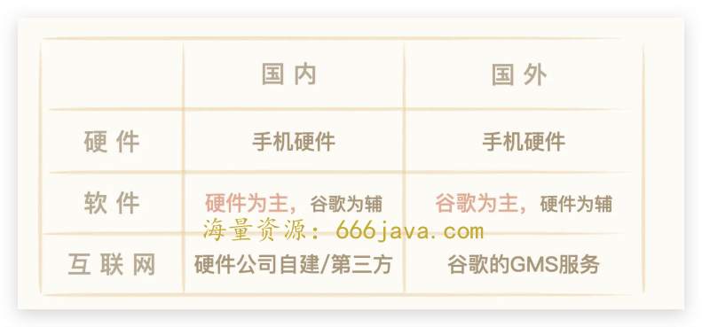
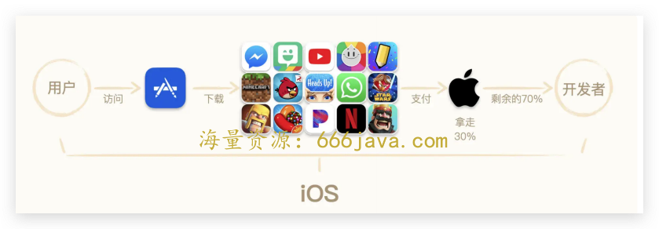
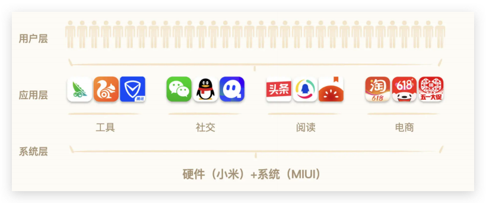
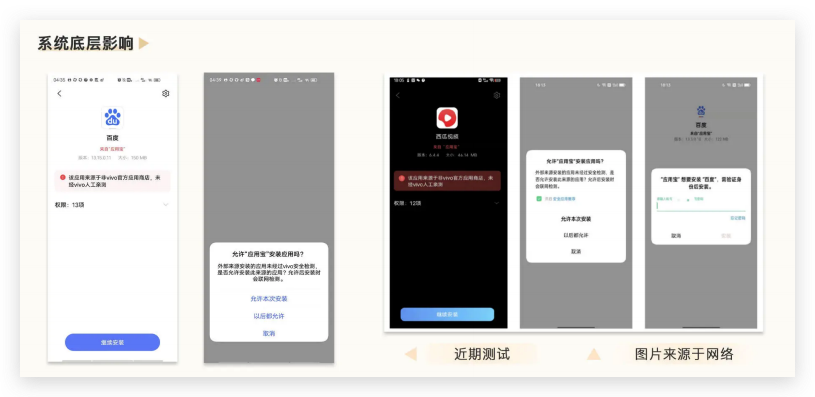

# 10-盐铁官营：手机厂商为什么可以在移动互联网时代闷声发大财？

你好，我是雄峰。

在互联网从业者的印象中，硬件厂商属于传统制造业公司，软件或者互联网业务在硬件公司内，既不重要也无法贡献收入，因此互联网人较少跳槽去硬件公司。但 2012 年之后，这个现象在逐步发生改变。

硬件厂商怎么突然有吸引力了呢？一方面，国内手机硬件厂商大力发展软件及互联网业务，开出的薪酬媲美一线大厂。另一方面，厂商的盈利模式突破了硬件限制，一线手机厂商的互联网业务收入达到了几百亿左右的规模，远高于大家熟知的 B 站等互联网当红炸子鸡，真的做到了闷声大发财。

为什么移动互联网时代的手机厂商要涉及软件以及互联网业务？为什么互联网业务又可以产生那么大的收入？

回顾智能手机业务的发展史，核心原因有三点：

1. **新的规则**：苹果定义了智能手机“硬件+软件+互联网”三位一体的规则，新的游戏规则下，不得不尝试去做；
2. **新的机会**：Google 的安卓系统开源，又因为某些原因无法进入中国，让国内厂商有机会涉足这一领域；
3. **新的收益**：国外“苹果税”以及国内第三方应用商店等业务的盈利规模，让手机厂商意识到了互联网业务可以带来大量收入，且并不逊色于硬件收入。

接下来，我会带你回顾智能手机业务发展史，从中学习国内硬件厂商互联网变现模式：盐铁官营。

## 摸着苹果过河：新的游戏规则

中国科技的发展有一句名言：摸着美帝过河。回到手机业中，从 2007 年之后，大家都是摸着苹果过河。

iPhone 是手机行业的颠覆者，是智能手机时代游戏规则的制定者，重新“定义”了智能手机：大屏幕、手指可触碰交互、有强大的系统、有着丰富的 App 生态，这才是智能手机。

它的关键在于构建起了“硬件-系统-互联网生态”三位一体的架构：有着强劲的硬件基础和芯片创新，有 iOS 这样操作简单但功能强大的手机系统，有 App Store 构建起来的互联网生态内容，大大延展了手机原有通讯能力以外的能力，改变了用户使用手机的场景。

**过往只能够打电话和听歌的手机，变成了移动时代的电脑**——这就是 iPhone 定义的游戏规则。在苹果打造的规则下，一个传统手机硬件公司需要掌握系统软件和互联网的能力，才对用户有吸引力。

真的要做吗？可是当时手机厂商面临着两个难点。一方面，iOS 是一个比 Windows 更封闭的系统，并不对外授权；另一方面，自己又不具备这个能力，无法推出类似的系统和互联网生态服务。

不做吗？可是会 **面临被淘汰的风险。**

这个时候，谷歌来了。它带着安卓，推出了“开放手机联盟”合作方案，用对标 iOS 的系统能力，App Store 的生态支持以及开源免费的合作模式，吸引手机硬件厂商的合作。

### 系统：为什么安卓要开源？

安卓（Android）系统是 Google 面向手机推出的智能操作系统，对标 iPhone 的 iOS 系统。2007 年 1 月份，苹果的 iPhone 发布，仅仅一年之后，第一部安卓手机 HTC G1 诞生。不同于 iOS，安卓是一个开源系统，通过 AOSP（Android Open Source Project，安卓开源项目）的方式开放给所有硬件厂商。

安卓选择开源有两个原因。一方面是谷歌当时 **影响力受限**。虽然谷歌在互联网鼎鼎有名，但并没有涉及手机产业，必须要和手机厂商合作才能够推广安卓系统。只有当越来越多的人用上安卓手机之后，安卓才具备对开发者的影响力，让开发者为安卓生态推出更为丰富的 App，来满足用户的需求。如果不开源免费，厂商用起来不放心。

另一个方面则是谷歌的 **商业模式** 导致。 **提供免费服务来获取广告收入，才是它的主要收入途径**。所以，虽然安卓是开源的，但是安卓手机里面内置的，类似账号系统、地图、商店、浏览器、邮箱等等 GMS 服务，可以获取大量的用户，进而产生广告收益。

安卓系统的免费开源，除了让 **苹果以外的手机厂商有了进军智能手机领域的可能性**，也第一次让 **手机硬件厂商有了优化和管控系统底层的能力**。免费开源，大大提升了硬件厂商的可扩展性，让硬件手机有了向上拓展互联网业务，向下优化系统的可能性，一改 PC 时代“硬件是硬件，软件是软件”的业务机制。

### 软件：定制系统可提升手机销量

如果说开源系统给了手机厂商一个拓展边界的可能性，那么后续定制系统的优化，就是让这条路更为广阔的一个契机了。

早期的安卓系统体验可以说非常差。因为它最开始对抗的目标是键盘手机设计，例如 Windows Phone，而不是针对触屏手机的 iOS 系统。在 iPhone 强大之后，安卓才有了相关的领域。这就导致之前的触屏手机非常卡顿，用户体验异常糟糕。

系统体验不好也会影响手机的售卖，加上安卓开源的背景，厂商也在思考如何优化系统的体验——不然手机卖不出去。而最早这么干的就是 HTC 的 Sense 操作系统，这是安卓最早的定制系统。

在 HTC 推出了第一款 G1 手机之后，就发现了大量安卓的问题。因此，在随后的手机中，就推出了定制的 Sence UI，那个标志性的翻页时钟，直到现在也依然是多少人无法忘却的经典，加上很多丰富的交互体验细节以及控件，这些也是当年很多用户买 HTC 的核心原因。

而 HTC Sence UI 的成功也给了国内手机厂商一个启发： **易用且好看的系统** **，** **可以增加手机的销售卖点。**

### 互联网：硬件厂商可以拓展新的盈利模式

我们再来说说苹果建立的新规则中的另一条——“互联网”。

在安卓手机产业里面，硬件由厂商管控，系统则由厂商和谷歌共同管控，互联网服务领域主要是谷歌负责提供。虽然厂商也可以推出自己的互联网服务，但是不能够与谷歌形成明确的冲突。此外，谷歌的 GMS 服务做得确实不错，拥有很庞大的生态支持和良好的体验，这就导致手机厂商在海外市场也是以硬件盈利为主。

但是在国内，这个情况就大不相同了。 **大部分厂商都可以赚取“硬件+互联网”两块收入，个别厂商互联网增值的收入甚至远高于硬件收入**。而这一切的核心原因，就是谷歌的 GMS 服务没有办法进入中国，导致互联网服务需要第三方提供。

很多人看到了这个机会，所以，市面上出现了大量对标的产品。比如第三方应用商店豌豆荚和应用汇，比如第三方手机地图百度和高德等等。

当时硬件厂商并没有意识到互联网业务的重要性。一方面是觉得专业门槛高做不来，另一方面也是觉得赚的钱不多。为了弥补没有 GMS 的缺失，甚至出现了一些现如今觉得很搞笑的局面：厂商出钱让一些开发者给手机提供第三方 App 服务，覆盖几千万台出货设备。要知道，如今除了微信这个必备 App 以外，任何非厂商的 App 内容预装都需要支付一笔不菲的费用。App 预装的收入，在互联网整体收入中占比也不低。

打破行业固有印象的是小米。小米创始人雷军在 2012 年提出了著名的 **铁人三项理论** **，** **硬件+软件+互联网**：通过高性价比的硬件（一部手机卖价比成本价还低 500）和基于安卓深度定制的 MIUI 系统，让手机具备非常强的卖点，再通过大规模用户形成流量，来进行互联网增值变现。

简单总结就是 **硬件不赚钱，通过硬件利润获取的市场规模，赚取互联网增值收入。**

就在大家都打算看笑话的时候，小米三年内一跃成为了国内第一大的智能手机公司，并且国内业务利润最大的来源也来自于互联网业务。于是，其余厂商纷纷跟进。

从整个的发展历程来看，硬件厂商并不是一开始涉足软件及互联网领域的时候就有清晰的认知。“清晰的认知”，是在苹果定义的智能手机新规则下，国内手机特有的特殊性机会（谷歌的 GMS 服务无法入华）以及各厂商持续探索的结果。

## 手机厂商商业模式的选择

到现在，最开始我们说的手机厂商闷声发大财的三个原因，你可能已经能够完全明白前两个了。至于第三个，新的收益，我们也来好好说说。

任何互联网业务做盈利变现，都逃离不开下面这五种变现模式或者其组合。

- **广告：** 应用或者游戏本身是不收费的，靠展示广告来赚取收益。广告是几乎所有互联网公司都会选择的盈利模式，比如抖音的广告、淘宝的直通车广告等；
- **增值：** 通过一项或多项核心权益吸引用户按项目或者按月付费，比如腾讯视频会员、QQ 会员以及直播平台的打赏功能，游戏也属于其中一部分；
- **买断：** 用户为一个高质量游戏或者软件支付一次性费用，买断该游戏的使用权。比如 Adobe 系列、PS5 游戏等；
- **抽佣：** 提供某一项服务或者实体产品，在交易的环节进行抽佣，从而获取相关收益。比如联运游戏的抽成、比如外卖平台的外卖抽成；
- **收税：** 由于平台构建了一个生态体系，在平台发生的一切虚拟交易，平台均可进行监控且参与分成。收税是比抽佣更进一步的模式，比如苹果构建起来的 App Store，行业上叫苹果税。

既然前面已经说了“摸着苹果过河”，那我还是先说说苹果是怎么做的。

### 苹果生态闭环：收税

由于苹果在最开始手机售卖的时候，就构建起来了闭环的生态体系（iOS 系统+App Store 生态+Apple Pay），用户想在 iPhone 安装任何一个应用或者游戏，都必须得通过 App Store，这就导致它可以要求用户在应用或者游戏内的所有付费行为，包括会员付费、版权购买、游戏充值、文章打赏等，都收走全额的 30%。

任何厂商如果想绕开这个体系，被苹果发现，都会导致产品被下架，相当于在 iPhone 手机中封杀了这个产品，用户无法通过正常的途径安装、使用该产品。

这个业务有多赚钱？2020 年苹果财报显示，以 App Store 为主的互联网软件服务收入达到了空前的 536 亿美元，占了苹果整体收入的近两成，羡煞了所有互联网公司。

在苹果生态内的所有开发者，大到奈飞这种千亿美金级别的公司，小到个人开发者，都必须遵循这一规则。由于这种模式的强制性，所以行业也把这一行为称为“苹果税”。

### 依托底层权限：盐铁官营

不过，国内安卓手机厂商并没有构建起来类似于苹果的闭环生态体系，核心有两个原因：

- **谷歌生态开放，底层无垄断权：** 相对于苹果，谷歌允许第三方商店的存在，安卓系统底层也允许开发者绕开 Google Play（谷歌的官方应用商店）安装应用或者游戏。这意味着，如果某些头部应用不上手机官方商店，用户也可以用第三方商店实现下载，无法实现有效管控。
- **国内安卓手机厂商份额不够集中：** 早期国内的安卓手机厂商有几十家，且没有任何一个市场份额占比达到 20%，这就导致，面对一些巨头应用，比如爱奇艺、腾讯视频等产品，并没有办法强制其接受类似苹果税的分成机制。相反，巨头的 App 不上该手机，还会影响硬件（手机）的销量。

国内手机厂商虽然无法跟苹果一样收“苹果税”，但也依托于系统底层能力，探索出了一条商业化的思路，我称之为“ **盐铁官营模式**”。

国内厂商没有能力收“苹果税”，但 **退一步的思考就是：哪些 App 收入高、用户有强需求且依赖系统底层权限呢？** 答案是，应用商店+浏览器+安全产品为主的工具系产品。

简单而言，盐铁官营模式，就是厂商依托于手机出货预装以及系统底层权限，推出应用商店、浏览器、安全等一系列工具产品，与第三方形成差异化体验或者让第三方体验变糟，从而将用户使用工具产品的需求全部自营化，从而实现手机厂商对互联网业务的切入。

在手机厂商眼中，整个系统运作是一个三层结构：最上面是用户层，中间是应用层，最下面是系统底层。系统并不直接服务于用户，而是通过各种 App 来服务用户，因此收入都被 App 所获取。

那具体要怎么闷声发大财呢？厂商的操作分为了四步走。

**第一步** **，** **推出对标产品：** 对标行业第三方优质产品，推出对标产品。假设我们就是小米应用商店，或者 OPPO 应用商店，那要找的对标产品就是豌豆荚。

**第二步** **，** **收回预装权限**：我们之前提过，有的厂商甚至会让一些开发者给手机提供第三方 App 服务，覆盖几千万台出货设备。那么从现在起，就不会再让第三方产品预装在手机当中，相反，要给自家产品留出流量空间了。

**第三步** **，** **系统底层影响**：如果用户还是希望下载第三方产品呢？那么这个时候，就可以通过系统底层收口，提供比第三方更好的体验，或者让第三方体验变差。什么叫让第三方体验变差呢？比如用应用宝或者豌豆荚下载应用，则会被导流到厂商自身的官方商店当中，如果用户坚持用第三方商店下载应用，则需要经过一系列繁琐的操作才可以实现。

**第四步** **，** **广告和抽佣**：在流量规模做大之后，通过广告展示以及联运抽佣的方式赚取互联网收入。

这四步走的思路跟古代盐铁管营思路一致，这也是我们分析了众多原因之后，发现手机厂商不得不选择的一条盈利的道路： **通过行政命令（厂商通过底层权限）的方式限制准入，把高收入、高利润的产业收归“国有”，从而实现高额利润。**

正是通过“盐铁官营”的思路，厂商成功做大了自身互联网业务的收入，即便不算上其他工具产品，一线手机厂商商店的广告收入，日均也都在 2000w 以上的规模，这还不算商店的联运游戏收入以及其他手机工具的收入。

顺着这个思路，硬件厂商会把所有工具化产品和基础化产品进行闭环，比如日历、短信、电话甚至计算器等，挖掘一切可以挖掘的空间。如果原有的工具型产品矩阵已经挖掘完毕，则会开始向内容型产品进行扩展，但这无法利用原有盐铁官营的底层优势，极大考验产品团队自身的业务能力。

## 厂商互联网营收的困境

最后，我们还可以把时间线拉长，往“闷声发大财”之后再看一眼。不管是苹果税还是盐铁官营模式，在这几年都受到了行业不小的冲击。

一方面，是由于反垄断的调查以及各家公司发起的不正当竞争诉讼，比如 Epic 在美国起诉苹果垄断。另一方面，则是大家都在想办法绕过国内厂商的限制，比如原神首发的时候没有上线国内应用商店，而是通过 Tap Tap 和官网等不抽佣的平台发布，也获得了极大的成功。

更关键的地方在于，厂商的互联网营收和手机出货规模强相关。如果手机业务面临出货压力，就会导致相关的互联网营收也受到限制，用户都是硬件出货带来的，无法独立硬件业务获取新用户。这就导致硬件厂商的互联网从业者都面临着一个新的命题： **如何证明自身业务的价值。如果硬件业务不行了，互联网业务的变现天花板又在哪里？**

## **小结**

最后，我来为你总结一下今天的关键内容。国内手机硬件厂商涉足软件及互联网业务的原因有三个：

- 苹果定义了智能手机“硬件+软件+互联网”三位一体的架构，不跟进就会被时代淘汰；
- 谷歌的 GMS 服务无法入华，给了国内手机硬件厂商涉足软件及互联网业务的机会；
- 苹果税的存在及第三方 App 的盈利规模让硬件厂商认识到了互联网业务的潜力机会。

国内厂商因为无法跟苹果一样做到生态闭环，从而衍生出了盐铁官营的变现思路：通过系统底层权限优势造成差异化体验将对手进行清出，通过手机硬件大规模出货扩大市场规模，做大关键利润业务（应用商店+浏览器），从而实现硬件厂商互联网营收业务的飞速发展。

当然，你肯定也很好奇什么时候才可以应用“盐铁官营”的思路。其实，盐铁官营的业务思路适合用在 **软硬件闭环或者具备底层权限的产品身上**，前者以手机硬件为代表，后者以病毒安全为代表，本质上是 **裁判员入场当运动员。**

## 思考题

最后，我也给你留了一道思考题。想一想，硬件厂商的互联网从业者如何在硬件下滑的基础上，证明自己的业务价值？

欢迎你在留言区和我互动。我们建立了一个 [读者交流群](http://jinshuju.net/f/DuxzBi)，欢迎你的加入！如果你觉得有所收获，也欢迎把文章分享给你的朋友一起学习。我们下节课见。
