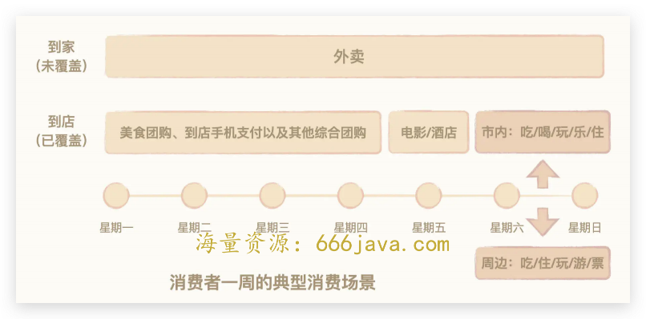
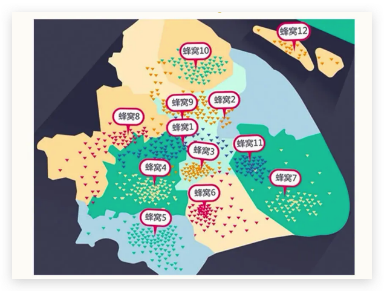
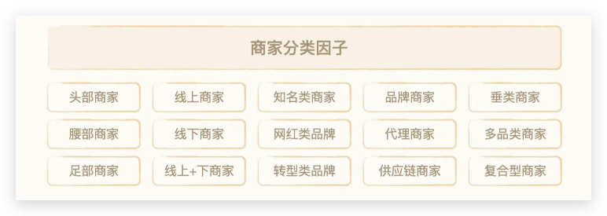
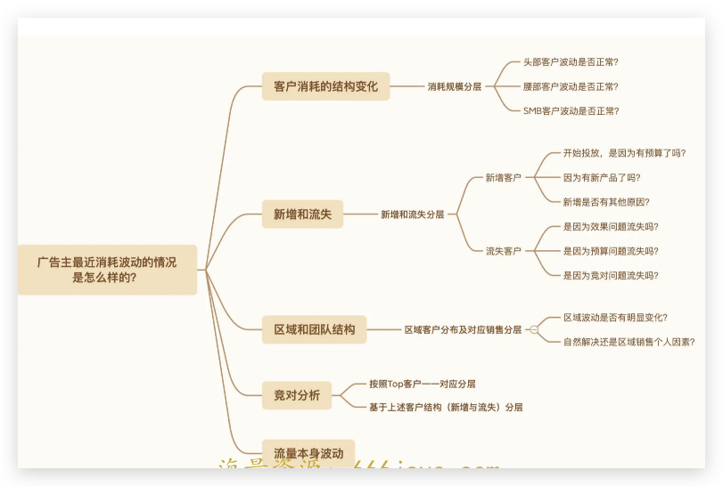

# 11-分层运营：外卖市场上为什么美团可以后发制人？

你好，我是雄峰。本节课是我们商业洞察篇的第 4 课，今天我们来聊聊美团的外卖业务。

说到美团这家公司，业内的印象是两个，一个是没有边界，只要跟线下相关的业务，一切都是它想尝试的方向，专注而不专一。另一个是后发先至，在团购、电影票、协议酒店、外卖、景区门票这些业务当中，没有哪个是第一个做的，但都做到了行业老大的位置。

有人说这是创始人王兴个人性格决定的，有人说这得益于美团强大的地推能力，也有人说这是其战略强大的体现。

今天我想聊一些不一样的角度。基于美团外卖业务后发先至的业务剖析，我们可以学习两个关键知识点，一个是 **美团做新业务的方法论**，另一个则是 **美团的结构分层运营方法论**，从而更深入的理解为什么美团做业务可以后发先至。

## 美团为什么要做外卖这个业务

我们可以先了解一下美团发展外卖业务的背景。做外卖业务可以说是必然的结果。这其中既有美团大战略外延所覆盖的方向，也有团购业务发展到一定阶段后的焦虑；有美团情报部门对于对饿了么的及时洞察，更有美团对于外卖市场的深度分析和机会判断。内外因素交加下，美团在 13 年开始了外卖业务的尝试。

### 美团战略外延

美团的战略是搭建以“本地生活服务”为大场景的超级平台。这句话怎么理解？简单来说，就是通过满足消费者线下不同需求，让用户形成使用路径，从而达到掌控线下流量的目的。

美团有外卖业务之前，核心业务就是团购、电影票以及酒店业务，落到消费者一周的消费场景上来看，基本都是 **到店业务**。也就是说，只要出门消费，大多都可以在美团上解决。

但总有一批人或者一批人的一部分时间是 **不出门的** **，** 比如在校的大学生，上班的白领或者周末的宅男。这部分，美团就没有办法通过现有的业务进行有效的服务，服务场景存在很大的空白。这就是后来美团外卖所覆盖的到家业务。

因此，外卖业务可以很好地跟美团当前团购业务形成协同 **，团购是让消费者出门消费，外卖是让消费者在家消费，团购是满足消费者省钱的需求，外卖是满足消费者便利的需求，团购是解决商家短期营销需求，外卖是解决商家长期销售需求**，外卖+团购的组合让美团在本地生活服务的产业链布局更完整。

### 美团进入新行业的方法论

美团的二把手王慧文在公开场合分享过美团进入新行业的方法论：

> 我们通常不是先研究对手，而是先研究市场，形成自己对于市场空间的判断和认知，先找到先入场玩家的致命错误，再给出“修正版”的商业模式，并努力让自己不犯致命错误。

我们如果也想应用这个方法论，就要回到当时，看看美团是怎么研究外卖市场的呢？

外卖市场当时分为两拨，一拨人是做校园市场的饿了么，另外一拨人是做高端外卖的到家美食会， **这两个先入场的玩家都犯了第一个致命错误：误判了市场空间。**

回到 2013 年的时间点，外卖和团购相比还是线上小众消费行为，因此第一个问题就是：中国的外卖市场，体量究竟有多大？美团分别派了两拨人，一拨人去美国调研 GrubHub（2003 年创建的外卖独角兽），另外一拨人调研国内的饿了么和到家美食会。

GrubHub 到 2013 年日订单量也就只有 10w 个左右，而与其对标的到家美食会日订单量也就只有 4w，按照两国人口差进行估算，“到家美食会”的天花板也就 20w 不到的空间，但是这个判断是建立在“中国外卖市场与美国差不多”的判断之上的。

可是在调研饿了么之后，美团又得出了一个截然相反的结论：抓取饿了么当时在学校市场渗透率做得最好的上海交大（饿了么创始人母校）的订单数据，用上海交大的校园人数和订单量的关系，推算出 **全国大学生每天的外卖单量就应该有 150w-200w 单**。

如果进一步把外卖扩展到白领用户、社区用户当中去，估算大概有 1000w 单的市场空间，虽然今天只美团的市场单量已经有 5000w 左右，但是 9 年前通过调研得出“1000 万日订单量的市场规模”，已经是一个相当大胆的判断了。

在确定 **外卖市场空间巨大** 后，美团决定介入外卖业务。但是问题来了：既然美团预估市场这么大，为什么饿了么还在不温不火地经营着？是美团预估出了问题，还是饿了么决策出了问题？经过进一步的调研，发现是饿了么的外卖思路出了问题。

### 饿了么的市场误判和策略错误

饿了么是 2009 年从上海交大起家的校园创业项目。两位创始人康嘉和张旭豪都喜欢玩游戏，为了节约时间经常叫外卖，但当时叫外卖体验太糟糕，于是决定自己做一个外卖网站。

当时外卖网站的盈利模式都是抽佣制，一个外卖订单抽几块钱。饿了么另辟蹊径，给商家导订单不抽佣，但是给商家提供一套叫 Napos 的外卖系统，通过这个系统，实现外卖自动接单、修改菜单、设置某个菜品售罄等功能， **收取商家服务费**。

过往商家接到外卖电话不仅要手写记录客户信息，还要记录菜单，再通知后厨去处理，送单的时候经常忘。有了这个系统后，直接出单到后厨，也有了一个记录， **大幅度提升了店家的效率**，也让饿了么区别于其他外卖网站，迅速发展。

不过，优点也是缺点，这个也限制了饿了么进一步拓展业务的思路。你可以先想一想，什么样的餐饮商家对于 Napos 外卖系统有需求？

那就是本来就做外卖业务的商家。因为那些有外卖业务的商家才会了解做外卖生意的痛点。 **饿了么当时的生意本质上是对有外卖生意的商家做了“线上化”升级**，给已经有外卖业务的餐厅提供了一个帮助消费者远程订餐的工具。

这种做法只能挖掘最早期的用户和商家，导致开业四年的饿了么并没有覆盖拥有 100w 大学生的武汉。

是不是很好奇？从学生市场起家的饿了么，竟然没有覆盖武汉这个大学城？其原因就在于，饿了么会派人去学校门口数进出的外卖车数量，如果外卖车多，就判断这个学校有外卖的需求，他们就开，外卖车少就不开，结果当时武汉高校没什么外卖车。

到这里，你会发现，饿了么在当时犯了两个错误：一个是 **误判了市场空间**，仅仅只算了“线上化”的那部分订单；另一个是 **策略有误**，仅服务有外卖业务需求的商家和有外卖需求的用户，而没有做市场培育的工作。

## 外卖行业的分层运营

前面提到的美团进入新行业的方法论： **研究市场、形成认知、找到对手致命错误、给出解决方案**。

而饿了么的两点致命错误，美团也给出了自己的解决方案：一个是 **大幅度扩张**，尤其是饿了么没有进入的城市。另一个则是 **培育市场**，说服那些原本不做外卖的餐厅以及原本不吃外卖的用户加入进来，形成“餐厅越多-用户越多-餐厅越多”的正循环。

美团过往在做团购业务的过程中，总结出了一套分层运营能力。简单理解，就是 **通过某种维度对市场、商家或者用户进行分层，从而使用不同的运营策略进行服务切入，实现收益最大化。** 这样的分层运营能力，又是怎么使用在外卖业务上的呢？

### 用户分层：如何选择初期的目标用户

我们先从用户分层来说。你可以想一想，喜欢以及有意愿点外卖的用户群体，如果进行类型划分的话，大致可分为哪几类？

在当时， **大致可分为校园用户和白领用户**，校园用户的代表是饿了么，白领用户的代表是到家美食会，而这两类用户存在着巨大差异，导致了线上化的难度也大不一样。梳理下来，大致有 4 个差异点。

- **时效要求不同。** 大部分白领的午休时间只有 1-2 个小时，如果配送延迟会导致用户体验很差，而校园市场学生群体的时间相对较多，迟到一会儿也没事。

- **品质要求不同**。白领消费能力更强，相较于价格，更注重餐饮品质、服务质量以及口味多样性，而学生群体中便宜则是王道。

- **配送人力不同。** 校园周边的餐馆订单相对集中且配送集中，一个外卖员送的外卖很可能是一栋楼里面的几个寝室，十个订单只需要配送一个楼，但是白领市场的订单是分散的，十个订单需要配送十个楼，这需要配送需要一套严密的调度系统配合来提升配送效率。在当时智能手机刚开始普及的时候，很难做到人手一部，这就导致外卖员出去了，但是平台不知道人在哪里——总不能每一个外卖员配一个 iPhone 吧？

- **成本要求不同。** 用户群体的差异，导致了市场拓展的难度不一样，谈校园周边的小商铺远比谈写字楼旁边的大餐厅来得容易。同时，这也影响了自建配送队伍的问题。校园周边都是餐厅自己请人做配送，没有成本；白领市场则需要自建配送团队，这对企业的组织能力和财力都是极大的考验。

综上考虑，美团优先跟随饿了么 **选择校园市场进行切入，实现低成本扩张。**

### 城市分层：如何选择拓展的城市

全国有 350 多个地级市，不可能一上来就覆盖所有的城市，美团外卖依照过往做团购业务的经验和数据，并结合城市的消费水平、人均 GDP、餐馆数量等维度，将这些城市分成了 S、A、B、C、D、E、F 等十几级。S 级是北上广深这样的超级城市，A、B 级是各省省会，加上青岛、宁波、苏州这样的副省级，C 和 D 是三四五线城市。

同时，参考饿了么已经拓展的城市，美团发现排名前四的城市分别是上海、北京、广州和杭州，而位列第 5 名的却是福州。依据过往做团购的经验，在中国城市消费能力中，福州一般排在 30 名左右。美团由此反向推导出了一个关键性结论： **饿了么起码有 25 个城市没有做好。**

如果是你，你会如何选择要拓展的城市呢？

美团的策略是，依赖之前做团购的经验，对城市进行分层。 **优先拓展 S+A 级这种 GDP 靠前的城市，但在饿了么还没有进入的城市重点发力，从而形成市场的先发优势**。核心逻辑在于，S 级城市竞争太过激烈，重兵投入必然导致投入产出很低，短期更多是跟进对手即可。CD 级城市订单数量有限，而 AB 级城市 top 级选手关注度不够，使用田忌赛马的思路来最大化投入产出比。

美团一次性就进入了 30 个城市，其中 18 个是饿了么的空白市场，整个 2014 年平均 1.5 天就开拓一个新城市。美团依托于自身强大的地推经验，在 2014 年暑假招了 1000 个人，集中培训一个月，派到了 B、C 等 100 个城市开拓市场，等饿了么反应过来，已经来不及了。

### 蜂窝分层：如何选择合作的商家

淘宝的商品是面对全国市场销售，某一个商户上架了耐克的鞋子，则全国用户都可以购买；美团外卖受到地域、时效以及配送成本的约束，一个商户的商品只能够做一定区域的辐射，一个业务片区是由不同的商户组成的，这些 **商户各自覆盖不同的经营范围，每个经营范围就是一个个的圆孔，所以这个片区结构在美团内部被称为“蜂窝结构”。**

先问你一个问题，如果进入任何一个新的校园蜂窝，拓展什么样的学生校园蜂窝商圈结构效果最好呢？

必然是 **大学城以及特大型高校的蜂窝结构拓展性价比更好**，单位蜂窝可服务的用户群体也会更高，而蜂窝内的商家拓展，最好是 **选择已经有外卖基础的商家进行合作**。但是考虑到美团大多进入的是饿了么没有切入的市场，外卖基础必然薄弱。因此，需要对用户和商家进行培育，吸引过往不点外卖的用户以及不做外卖生意的商家使用美团外卖。

最开始美团也吃了亏，一上来参照做团购生意的思路疯狂拓展所有商家，但当时学生并没有很强的外卖认知和需求，导致每一家商家订单量极少的情况。

换位想一下，你是某大学校园的快餐店老板，美团外卖跟你说来我们平台送外卖有生意。好，你同意了。然后第二天来了一个订单，这时候你到底要不要为了这一个订单找外卖员去配送？线下生意又很忙，你必然要先服务已经坐下来吃饭的顾客，外卖也会延后。

这就进入了一个死循环，因为学生单量少，导致商家不提供好的服务，又因为商家不会提供好的服务，学生觉得外卖还不够好用，那就不点外卖了。

后来，美团在成都的一个拓展经理找到了新的思路， **在短期无法突破蜂窝内大循环的情况下，先切入有限商家做蜂窝小循环**，不再拓展所有商家，而是从商家中选择有限的几家，具体逻辑我们可以分为 6 步：

**A.有限供给**：选择 8 家口味不一样且价格实惠的商家，告诉他们明天马上有大量订单过来，要先准备好外卖员；

**B.学生补贴**：去学校大规模发传单，补贴学生，培育外卖习惯，让上架的商家有订单；

**C.商家认知**：由于只有 8 个商家，这意味着每一个商家会落到不少的外卖订单，就会改变原有认知——原来外卖订单有这么多也是可以赚钱的；

**D. 体验优化**：第一天过去之后，拓展经理找到 8 个商家开会，今天有哪些订单配送延迟，有哪些菜品遭到投诉，如果明天还这样我就下掉你们，重新找新的；

**E.商家跟进**：尝到甜头的商家必然会把外卖订单放到更关键的位置，同时去找到更好的配送员，也让后厨更用心地准备菜品，即可给学生群体提供更好的体验，培育习惯；

**F. 正循环开始**：外卖需求变多之后，拓展经理只需要去旁边找其他商家沟通，愿不愿意参与，我们可以从 8 家拓展到 12 家。只要看到外卖生意好，那就没有道理不加入了。

### 补贴分层：如何选择补贴的对象

最后，我们来说一说中国互联网行业里非常重要的一个竞争方法——补贴。这个方法的核心在于快速将一个不成熟的市场催熟，同时，善于补贴的公司可以比对手更快速地获得行业竞争力。

王慧文后来在清华开了一些课程，如果你感兴趣的话，可以看一下《王慧文的清华产品课》，里面总结过：

> 美团的估值当中，1000 亿美金来自美团外卖，外卖业务大概总共补贴了 20 亿美金，所以投资回报率还是相当高的。

在实际的分层运营体系当中， **补贴的本质是让消费者体验一个更好的消费模式，从而构建新的用户习惯。** 在具体补贴策略中，需要尽量避免不补贴之后用户流失的情况。因此， **选择什么样的用户或者商家进行补贴** 是其中的重点。

美团和饿了么在 14 年和 16 年均开展了大规模补贴，不同之处在于，14 年双方竞争校园市场，16 年双方竞争白领市场。

如果是你，针对校园市场和白领市场，你会把补贴的费用花在用户身上还是商家身上？

我先说结论： **校园市场优先补贴用户，白领市场优先补贴商家。**

为什么这么说呢？

**对于学生群体而言，他们更在乎是否便宜。** 学生并不需要那么多好的商家提供外卖餐食，有限商家即可满足。那么这个阶段则更需要想办法补贴用户，让学生群体体验手机外卖点单的好处，培育新的用户习惯，只要用户变多了则必然有更多校园商家会入驻外卖平台。再进一步，则可以细分到针对什么样的学生群体做补贴以及什么时间段做补贴。

初期，美团和饿了么都是这么做的，双方并没有有效的分出高下。

**对于白领群体而言，他们更在乎是否有想要的商家。** 对于上班族来说，每天中午吃什么是最难的选择，潜意识的需求是需要更多有品质的选择，因此便宜并不关键，关键在于好不好。所以需要更多的补贴商家，让商家可以来外卖平台入驻，让上班族体验在公司就可以吃到去商场才可以享受到的美食，培育新的用户习惯。进一步，则可以细分到优质商家分层，是优先补贴高端还是中端，是补贴连锁餐饮还是个人餐饮。

美团就是这么做的，通过补贴优质商家，进一步吸引了更多的用户，但饿了么更多还是在补贴用户，这就导致了双方在白领市场拉开了很大的差距，而美团也开始跃居行业第一的位置。

当然，上面所讲述的分层运营机制相对简单，美团在实际工作中的分层运营机制比上述所讲的复杂得多。

我们以商家为例，美团内部有大概十几种分层的维度，不同的商家有不同的运营机制，从而实现业务不同的目的。

## **小结**

今天我们通过讲解美团外卖的案例，重点讲述了美团如何运用分层运营策略，实现了在外卖市场的后发先至，同时也解释了美团进入新行业的方法论和互联网补贴的本质逻辑。最后，我来给你总结一下今天的关键内容，希望对你做分层运营能够有所启发。

**分层运营：** 通过某种维度对市场、商家或者用户进行分层，从而使用不同的运营策略进行精细化运营，实现收益最大化。

比如美团对外卖用户进行分层，不同用户使用不同的策略进行服务；比如对国内城市进行分层，将城市分为饿了么切入和没有切入两部分，从而重点服务没有切入的头部城市等。

**任何同时拥有供给端和用户端的平台型业务都可以运营分层运营的思路** **。** 通过不同维度去切分供给端和用户端，从而找到业务优化的方向，其中切入维度决定了分层空间和视角。可以说，分层运营是产品运营工作必备技能项。

**我们以常见工作的一个问题切入，你就可以理解分层的细化粒度。**

假设我们的问题是，广告主最近消耗波动的情况是怎么样的？

那么，切入的维度有哪几个呢？

有客户消耗结构变化，新增与流失，区域与团队结构，竞对分析以及流量本身波动这几个。具体来看，我们可以这样分析：

**美团进入新行业的方法论**：美团通常不是先研究对手，而是先研究市场，形成自己对于市场空间的判断和认知，先找到先入场玩家的致命错误，再给出“修正版”的商业模式，并努力让自己不犯致命错误。

**补贴策略的本质：** 让消费者体验一个更好的消费模式，从而构建新的用户习惯，而达不到这个目的补贴，都是浪费。

## **思考题**

美团在多领域的后发先至，除了团购和外卖业务以外，还有酒店业务，这其中还有哪些原因呢？欢迎你在留言区和我互动。

欢迎你在留言区和我交流互动。我们建立了一个 [读者交流群](http://jinshuju.net/f/DuxzBi)，欢迎你的加入！如果你觉得有所收获，也可以把这节课分享给你的朋友一起学习。我们下节课见。
