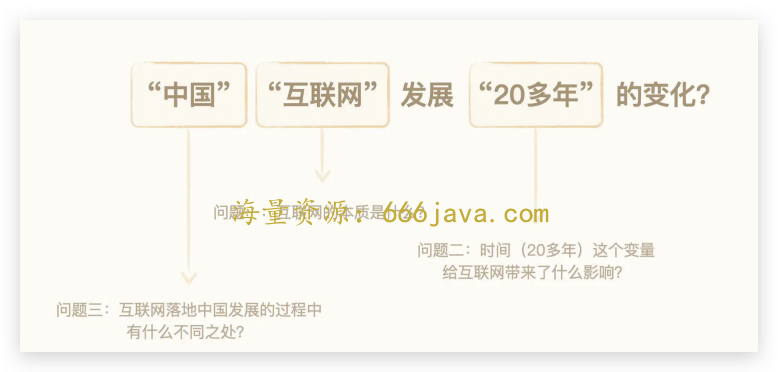
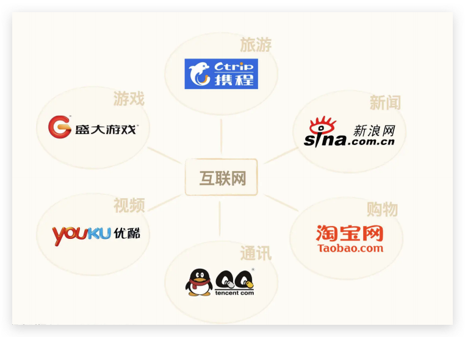
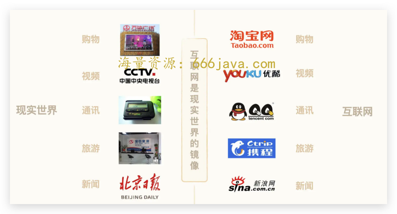
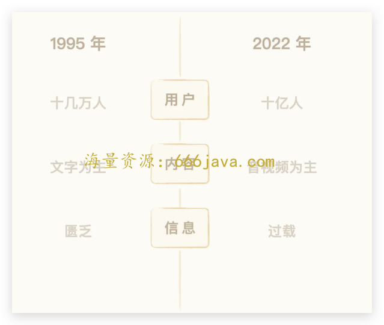
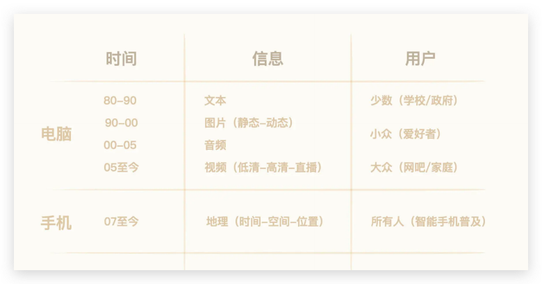
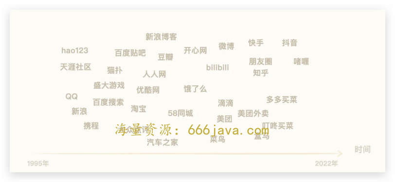
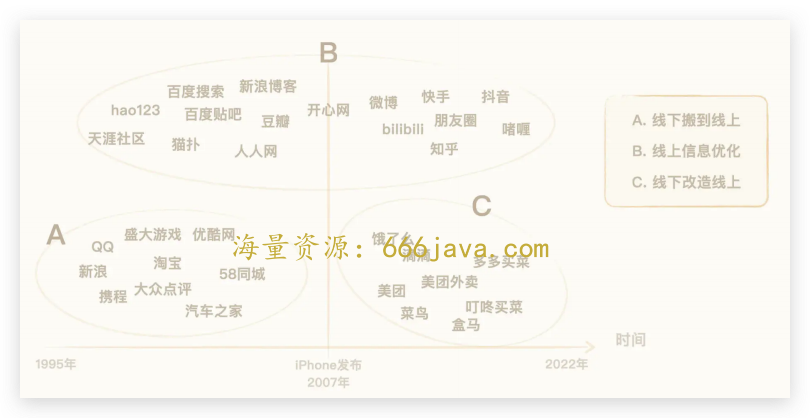

# 14-练习课（上）：如何用结构性思考去理解 20 多年中国互联网发展的变化？

你好，我是雄峰。本节课是我们商业洞察的第 6 讲，也是这章节的练习课。

整个章节，我们都在尝试用抽象的符号来理解业务模式。今天，我们就尝试把这样的思路应用在工作中。

这次练习课能带给你 3 个关键价值，我先说其中最关键的： **学会用结构性思考框架来理解业务，为关键性对话做好结构性呈现的准备，获取资源**。

对于业务的同学来说，这个价值至关重要。可以说，没有这个能力价值，就无法向更高的层次进阶。

我们可以从这个关键价值中拆解出两个关键词，结构性思考和关键对话。

先说 **“结构性思考”**。和线性思考不同，不是问什么答什么，而是在面对一个复杂问题时，可以基于多个不同的维度切入分析，用多种视角构建对事物的分析框架，从而深入细化，得出更立体、更深刻、更有洞察性的结论。

如果可以基于同样的信息量，还能够分析得出不一样的结论，且大家都有“哦吼！”眼前一亮的感觉，那就非常有价值了。

再说 **“关键对话”**。沟通最大的问题往往在于，人们想当然地认为已经沟通了，但却经常进行“无效沟通”。我们自己知道了还不行，还需要让关键资源对象理解（老板们和业务协同方）。

那么，如何在短时间内让他人理解并支持你呢？这就叫关键对话。这个场合，往往要求陈述者拥有在短时间内梳理关键信息、判断重点的能力，并进行结构性的表达。

说起来可能有点抽象，那么我们就从实际案例着手，看看如何构建结构性思考的框架能力。

## 场景设定

我们模拟一下今天的练习场景。

假设大老板交给你了一个开放性任务： **分析一下中国互联网发展 20 多年的变化**，要求你在 5 分钟内做一个简单的汇报，这个事情明天就要搞定。面对这个问题，我们该怎么做呢？

既然是练习课，我们先明确一下解题的思路。

1. 我们要知道大老板问的到底是什么，把问题圈定在一定范围内，避免扩散，导致分析的问题和老板想要的不一样；
2. 我们要把问题拆解出来，搭建出来汇报的框架，让汇报更全面、有条理；
3. 在汇报的时候，我们的呈现方式和效果也很重要。

思路明确之后，我们就用结构性框架去梳理 20 多年来中国互联网发展的脉络，尝试找到驱动其高速发展的底层逻辑有哪些，再去和大老板汇报。

## 问题界定：大的问题拆解成小的问题

复杂问题往往很难第一时间给予回答并给出解决方案。因此，我们要先对问题进行关键词界定，在关键词圈定的范围内，再把大问题拆解成多个小问题，避免出现问题过大，分析时无从下手的情况。这也是结构性思考的第一个关键技巧。

回顾大老板的问题：中国互联网发展 20 多年的变化。想一想，你可以从中提取出哪几个关键词呢？

我们可以从中 **界定出三个关键词**，进而拆解成三个层层递进的问题，让三个小问题间接地帮助我们理解大老板提问中几个最关键的点，也为接下来的问题拆解和分析提供思路。

我尝试拆解出来这样三个关键词和问题：

- 问题一：什么是互联网？

——互联网是主体，第一步，需要先明确互联网是什么，才好进行后续的分析。

- 问题二：时间（20 多年）这个变量给互联网带来了什么影响？

——变化每时每刻都在发生，我们是一个长周期视角，什么因素在 20 年内长期起作用，才是关键。

- 问题三：互联网发源于美国，对比美国，中国的互联网的发展有什么不同之处？

——进一步圈定范围，同时可找出差异点。

大问题拆解过后，我们就知道老板想要的到底是什么了。接下来，又要怎么做呢？

## 问题拆解：多维度构建问题的分析框架

按照我们最开始说的解题思路，把大问题拆解成小问题只是第一步，第二步则是依次对小的问题进行拆解分析，填充自己的汇报内容。这一步的关键则在于 **选择什么样的维度进行分析以及如何进行分析**。

维度寻找和问题分析常用的技巧有多种，这里，我们尝试用概念反向定义、长周期视角以及关键维度来分析。

### 步骤 1：概念定义

先来看我们刚才拆分出来的第一个问题：互联网的本质是什么？

任何分析的基础前提是对于主体的有明确定义。我们要分析互联网，首先就要明确互联网的定义。毕竟互联网太过于庞大，每个人都有自己不同的理解，如果没有对抽象概念形成统一的认知，那么再怎么给大老板汇报，再怎么进行分析讨论，都不会有结果。

那互联网到底是什么呢？维基百科上对互联网的描述是这样的：成千上万的人通过电脑和网络光纤，串联成了一张庞大的信息网。

这个定义是对的，但是无法帮助我们更好地理解互联网。商业分析工作中，要对一个概念性事物进行定义，如果直接去定义比较困难，那么常用的办法就是 **通过其创造或影响的事物进行反向定义**。

中国互联网发展初期（1996 年开始），主要互联网的公司有这些：

你会发现，这些公司在现实世界中都有参照物。比如携程对标的是线下的旅行社，新浪作为门户网站对标的是新闻媒体，盛大把线下的街机游戏厅搬移到了线上，腾讯创始人马化腾先生也曾说过，QQ 就是网上的 BB 机。

简单总结，互联网的本质到底是什么呢？或者说，你能用现实世界和互联网的关系，给互联网下一个定义吗？

**总体来说，互联网是** **现实世界在虚拟网络上的镜像。** 现实世界是由原子（物质世界最小单位）所构成的，互联网是由比特（信息世界最小单位）所构成的，所以美团的创始人王兴也提过，互联网早期就是比特对原子的镜像。

现在，我们已经知道大老板想要了解的对象到底是什么了。接下来，我们继续拆解第二个小问题，看看 20 多年这个变量，给互联网带来了什么变化。

### 步骤 2：关键要素

要想了解互联网的变化，我们就一定要从影响互联网发展的要素开始说起。

影响互联网发展的因素千种万种，哪些因素是最关键的呢？这里我先解释一下，为什么最开始问题拆解的时候，我选择的关键词是“20 年”而不是“变化”。

因为我们需要梳理的不是短期的影响因素，而是“20 年”这个周期下的影响因素。那么筛选标准就是：影响因素的可持续性。

这个时候， **长周期视角** 会派上用场。简单来说，就是把所有的因素罗列出来，用长达 20 年的周期来审视，哪些因素持续起作用，哪些因素短期起作用。由此，我们就可以判断出，哪些是最关键的因素。

比如 08 年的金融危机，倒闭了一批互联网公司，18 年的游戏版号停发，也倒闭了一批游戏公司，它们对当时的互联网行业都产生了较大的影响。但是，放到 20 年的一个周期当中，你就会发现，危机和政策对于行业的影响相对有限，因为它们只是影响了一个阶段的发展，让河流的河道发生了一些转移，但是不影响互联网的奔涌向前。

那到底哪些才是关键因素呢？我们回到源点去了解一下互联网最初的状态，看看那时候的互联网是什么样的。

互联网，在上世纪 80 年代起源于美国大学，94 年中国才接入世界互联网。由于当时的电脑设备非常昂贵，买电脑+牵网线需要大几万块钱，在当时“万元户”就已经是富翁的时代，这是一笔非常大的支出，所以当时互联网的使用者大多都是学校或政府人员，电脑发烧友相对较少。

在那个时候，网上的信息也相对匮乏，能够寻找到的信息相对有限。而且网速非常慢，很多时候就十几 KB。于是，很多发烧友就自建网站来搬运文字内容，比如最出名的 CFido（中国惠多网）站点。

早期我们还可以看到腾讯创始人马化腾先生（Pony Ma）搬运搞笑笑话（Pony Ma 还有一个搞笑事迹，早期 QQ 没有用户，自己模仿女孩子做产品冷启动），除了马化腾先生以外，丁磊、雷军、求伯君（金山的创始人，雷军的老板）都曾经是 CFido 的站长。

从上面的描述，我们可以提炼出几个关键信息：95 年的互联网网民少、信息匮乏，因为宽带问题，网上可加载的内容以文字为主。

我们再拿 22 年大家使用互联网的情况与 95 年做一个切片对比：

想一想，通过对比，你会得出哪几个关键信息呢？我的总结是这样的：

1. **用户增长迅速** **：** 从过往的几万人暴涨至十亿人，增长了十万倍；
2. **内容结构变化** **：** 过往以文字为主的内容，到如今以音视频为主；
3. **用户信息爆炸** **：** 从过往互联网上缺少内容，到如今内容过多形成了信息过载。

这些变化背后的推动力是什么呢？简单来说，就是用户越来越多了，网速越来越快了。这两个因素叠加，又导致了网上的信息开始爆炸。因此，我们判断影响中国互联网这 20 多年高速发展的关键因素是两个， **一个是网速（宽带+4G）的提升，一个是用户（PC+手机）的普及。**

网速提升之后，你就会发现， **信息朝着富媒体的方向不断演进**，文本 → 图片（静图 → 动图）→ 音频 → 视频（低清 → 高清 → 直播），信息内容越来越丰富，越来越生动，让产品可组合尝试的空间也越来越大。试想想，如果没有 4G 的出现，怎么会有短视频的爆发？3G 上刷短视频，你一定会有鬼畜般的体验。

**另一方面，随着上网设备的价格降低（电脑 → 手机）以及易用性提升（打字 → 点击 → 语音）**，越来越多的人开始接触网络。从最早使用电脑的学校/政府机构（少数），再到电脑爱好者（小众），到后来的网吧及个人的普及（大众），最后到现在智能手机的覆盖（所有人），过往在 PC 时代，上网要会打字，现在点击 App 就好了。

此外，我们还可以补充一点。当智能手机开始普及，互联网进入了移动互联网时代，信息传输的维度又增加了一个： **在富媒体信息以外，传输地理空间信息。** 而这也为很多新的模式开展奠定了基础，比如外卖业务，地图导航业务等。

了解了驱动互联网发展的最关键因素。简单来说，就是网速的提升和用户规模的放大，促进了信息的爆炸，进而诞生出了我们今天所使用各式各样的互联网产品。接下来，我们就要说互联网这 20 年里的变化了。

如果我们把过去 20 多年的产品拉出来，如何进行有效的归类呢？

还记得我们前文提到的几个关键点吗？

> 互联网是现实世界在虚拟网络上的镜像。
>
> 用户变多和网速变快，让网上的信息越来越多，从信息匮乏变为信息过载。
>
> 移动互联网对比互联网多了一个可传递的信息：地理位置信息。

其实，互联网产品的分类，大致也可以按照上述关键信息，拆解为三类，这三类的产品，也就是 20 年这个变量给互联网带来的影响。

1. **从线下搬到线上。**

互联网是现实世界在虚拟网络上的镜像。因此，一段时间内，互联网就是把线下信息搬移到线上，让用户在网上也可以接触到大量线下才可以了解到的信息和服务。随着网络的普及和带宽速度的提升，搬运到网上的信息也越来越多，大家都在想什么样的信息可以搬到网络上，比如最早的新浪等新闻门户，再到优酷视频网站等，这也是早期第一波致富的方向。

1. **线上信息优化。**

随着搬到网上的信息越来越多，用户在网上也不断生产着各种信息。

那么，在信息已经从过往匮乏的状态转变为信息过载的情况之后， **如何让一个人更快地获取自己想要的信息呢？**

基于这个需求，互联网也在不断演化出新的产品形态。从门户导航站到搜索引擎，再到 UGC 社区，再到个性化推荐，整个过程都在不断简化用户获取信息的门槛，让用户从主动获取信息转为被动接收信息，并根据用户接收的反馈进一步迭代。

1. **线上改造线下。**

移动互联网的爆发以及物联网的逐步完善，让互联网可以清晰地知道每一个用户所处的地理位置和空间信息，甚至每一个硬件的信息。

为什么美团外卖这个业务后面可以成立？因为智能手机开始普及。国内最早服务白领市场的外卖平台，到家美食会，只能够服务 80 块客单价以上的客户，核心在于配送成本高，手机没有普及，所以配送员送单的时候，只能够一单一单地送。手机普及之后，才可以知道配送员的实时位置和未来运动的方向，采用智能拼单，大幅度降低了配送成本，也就有了外卖这个生意模式的产生。

### 步骤 3：差异对照

分析到现在，我们还剩下一个小问题：中国互联网对比美国互联网有什么特点呢？

互联网发源于美国，迅速成长，中国在互联网阶段基本上是跟风，除了豆瓣可以说是原创以外，其余互联网产品或多或少有美国模式的影子。而在移动互联网时代，很多模式反而是中国走在世界前列。

如果说互联网阶段是 C2C 模式（Copy to China），那移动互联网阶段则是另外一个 C2C 模式（Copy form China），为什么会有这些差异呢？把中美互联网重点产品拉出来对比，会发现有三个明显的差异化特点，我们从现象分析入手，一个一个来总结。

**现象一：** **国外的互联网服务基本上来自美国，少部分来自本国**

> 喜欢出国旅游的朋友都知道，大部分国家的互联网产品都被美国互联网所统一。比如搜索统一用“Google”、比如看视频基本用“YouTube”或者“Netfile”、比如社交基本用“Facebook”或者“Instagram”等，少部分互联网产品才是本国产物。
>
> 中国早期的模式基本 Copy 自美国，但胜出的却是本土企业，这种情况不仅出现在中国，在东亚都是如此，比如日本最大的电商网站不是亚马逊，而是乐天，通信软件不是 WhatsApp，而是 Line。

总结下来你会发现，中国互联网的特点之一，就是 **外国模式，本土企业崛起。**

一个原因是本土企业对比跨国公司做了更好的本地化适配和策略，比如百度推广搜索引擎的时候，大量依靠地推和网吧渠道，此外，还有收购网址站的策略（hao123），这些都是 Google 当时没有做的。

另一个原因则是文化传播和中国国情，涉及到信息安全领域的产品较难进入中国，变相地给中国互联网企业发展营造了一个特殊的安全网。

**现象二：** **国内互联网有些产品是国外所没有的**

> 16 年是刷新产品经理认知的一年，出现了很多不认识的产品和商业模式。
>
> 比如当我们认为互联网已经是一切的时候，国内安卓手机第一的位置悄然让步给了 OPPO 和 vivo，且这两者还是通过线下门店获得了胜利；快手日活用户已经有一千多万，是中国流量第四大的手机应用，仅次于新浪微博，但是绝大多数互联网人并不知道还有这么一个玩意。
>
> 王兴曾说过一个数据，中国的本科率大概只有 4%左右。总理也曾说过，中国月收入 1000 元以下有 6 亿人，城乡分割和东西部经济差异巨大。大量急速版产品在 2016 年出现，因此，16 年被誉为互联网的“下沉元年”。

我们再来总结一下，会发现中国互联网的特点之二： **复杂中国的多样性红利**。

核心原因就在于中国社会阶级和区域经济发展情况差距极大。智能手机的普及让绝大多数人接触了网络，但这无法改变人们的消费模式和思维惯性。这就导致人群与人群之间有着极大的认知鸿沟和消费差距，也就出现了很多在一线城市看起来无法理解的产品和模式，比如极速版产品，比如社区团购等，这也是美国互联网发展所没有的现象。

**现象三：** **国内互联网模式（O2O）开始输出走向世界**

> 美团的大股东之一是腾讯，而腾讯大股东之一是 Naspers（南非报业集团），所以 Nasper 也是最早知道外卖模式优势的公司。因此，它们在海外也投了不少外卖公司，除了外卖以外，还有共享单车，共享充电宝也从中国走向了全球。

再总结一下，我们会发现中国互联网的特点之三： **后发模式的优势。**

为什么中国的 O2O 发展得都比国外好？不管是外卖模式，还是社区团购等，核心就在于中国的基础建设相对比较落后，人力相对便宜，这就导致模式改造的时候，阻力并不是很大。

用美团创始人王慧文的话来说：中国的反动势力（指的是外卖的基础建设上）不如美国那么强，这也造就了外卖平台模式在中国的兴起。试想想，如果头部餐饮公司都有自己的外卖团队，哪里还有饿了么和美团的机会呢？

同理，为什么美国外卖模式空间相对有限？一方面是因为美国头部连锁餐饮份额占比较高，用户可选择的店家并不如中国那么多，另外一方面则是这些头部连锁自建配送团队，麦当劳每天的外卖单量是美国外卖老大 GrubHub 的好几倍。

不知道你现在有没有感觉，我们刚才的分析过程，像不像以前做的阅读题？很像。但是这里更需要我们做一个中美互联网产品的差异对照，通过这样的方式总结出事物的特点，和反向定义有着异曲同工之妙。

## 小结

到此为止，我们已经大致准备好了老板想要了解的内容。具体怎么做的呢？我来给你做个总结。

在第一个解题步骤中，我们通过 **问题界定** 的方式，将大问题拆解成了小问题。在这个过程中，最关键的技巧就是关键词的提取，提取什么样的关键词决定了你拆解问题的方向，也可以帮你圈定分析的范围，减少分析的复杂度。

在第二个解题步骤里，我们对每一个小问题进行了分析，但是分析的角度各不相同。

首先，我们完成了 **概念定义。** 任何复杂问题都有一个主体，分析的前提，是大家对于主体认知也是一样的，或者说，必须和你的定义对齐，不然再怎么分析，源头对不齐，分析的结论也必然不会可信。

其次，我们提取了 **关键要素**。任何问题影响的因素都是不一样的，我们需要找到关键的影响因素，由于我们分析的是 20 多年的跨度，因此，我们需要采用长周期视角。

最后，我们还做了 **差异对照。** 其实这个分析方法呢，也会经常用在寻找关键要素上，比如我们做竞对分析的时候。你有的我没有的，我有的你没有的，把这些点一个个拎出来，也可以分析出不同的影响因素。

还记得我在这节课最开始说的 3 个对你的关键价值吗？我们最开始只说了学习结构性思考做好关键对话准备，现在，你应该能看到另外的一个关键价值了，那就是 **看清中国互联网发展的本质。**

中国互联网这 20 多年来，诞生过各式各样的商业模式和产品形态，我们可能对其中某一个产品或者某一类产品有较好的理解，但是对全貌并没有一个清晰的认知，很多产品和模式的诞生是知其然，而不知其所以然。

今天我们通过“解决老板的问题”，用一个优雅的框架解构了互联网，也让你站在更高的维度理解了中国互联网发展的前世今生。

但是问题还远没有结束。在这个练习里，我们还有最后一步没有做——向老板汇报。在理解互联网发展的前世今生这件事上，我们还缺一个“更好地把握未来”这样完美的收尾。

下节课，我们继续完成这个“5 分钟汇报”的练习，完成一整个“结构性思考”的流程体验。

## **思考题**

这节课的最后，我也给你留了一道思考题。我们分析了互联网过往 20 多年的发展脉络，想一想，这些关键因素是在某一刻才奏效的吗？

欢迎你在留言区和我交流互动。我们建立了一个 [读者交流群](http://jinshuju.net/f/DuxzBi)，欢迎你的加入！如果你觉得有所收获，也可以把这节课分享给你的朋友一起学习。我们下节课见。

## **精选留言** **(3)**

01： 对于关键要素，在中国互联网发展上我拆解成了三个方面，技术驱动、创新驱动和资本驱动。

1）技术驱动是一个长期的过程，早年我用56K调制解调器上网产生了几百块的网费还被老爸一顿骂，而在基础设施和技术驱动下，也是通过了一段时间才让固定宽带和移动网络资费不断下降，这个过程是一个缓慢的过程，同理计算机的CPU、GPU算力也是一个积累的过程；

2）创新驱动，这里的创新不管是From美利坚还是本土创新，虽然开始爆红是一个时刻，但正在做好还是一个长期的过程，外卖、打车、共享这些都在后面经过了漫长的用户习惯培育，可能最早冲在前面的前辈们已经死在了沙滩上，所以关键不是起跑在第一，而是中长跑

3）最后是资本驱动，这个我觉得可以勉强算是一个时刻奏效的方式，因为资本的力量你知道的……突然之间网络大电影、网剧、什么MCN在我们普通大众还不知道的时候就迅速蔓延，站着我个人的角度其实有些不太理解这个是市场选择还是市场逼着我们选择，所以资本可以利用其自身强大的优势在一个短时间形成一个改变发展局势的力量。

作者回复: 非常棒的分析，确实这个角度跟我文中会有一些区别，也非常棒。后面有一篇文章会讲资本的情况

02： 自互联网进入中国以来20多年，历经浮浮沉沉的发展，原始技术的积累促进了互联网技术的发展，包括软硬件的发展，同时基建发展也很迅速，这就给互联网网民的普及带来了很大的好处和机会，而网民的普及用户群体的报增反而又正向反馈给了技术的发展，这两个因素的相辅相成，促进形成了具有中国特色的互联网

作者回复: 这两个因素是推动世界互联网的发展，中国有独特的因素才导致了有特殊性，比如文化地域的原因，比如城乡结构的差异化极大等等

03：这三点关键因素，我认为并非是在移动互联网发展某一特定时间点才奏效，无一不是随着这20年互联网从PC时代迈入移动互联时代中逐渐成长，互相促成了如今中国移动互联网不同于美国的独特生态。随着人们生活质量的提升，移动通讯设备的越来越普及，对于移动通讯进一步期望与市场需求的提升促使手机硬件商和通讯运营商有理由推动硬件与通讯网络的迭代更新，推动了移动网络的更迭升级与移动通讯设备硬件性能的提升；而网速的提升与通讯硬件性能升级改善了用户的体验，进一步挖掘市场中的需求，用户越来越多，令这个市场推动发展的循环得以继续下去；移动互联网中越来越多的用户群体，配合越来越快的网速以及智能机的登场，使得互联网用户中的更丰富的交流与创作诉求得以发掘，移动互联网得以进入富媒体时代。这个时代中应运而生的智能机则使得地理空间信息的传输成为了可能，同时以地理信息为核心展开的外卖，打车，同城服务等等业务模式也有了可建立的技术支点，这些新兴业务模式进一步提高了互联网在人们日常生活的渗透。所有这三个关键因素，随着人们生活水平的上升与技术的提升，相辅相成，促进中国互联网这20年走出了一条独特的道路。

作者回复: 中国互联网应该是全球互联网里面非常特殊的存在，可以说除了美国以外就中国互联网发展最好，同时在一定层面超越了美国。
