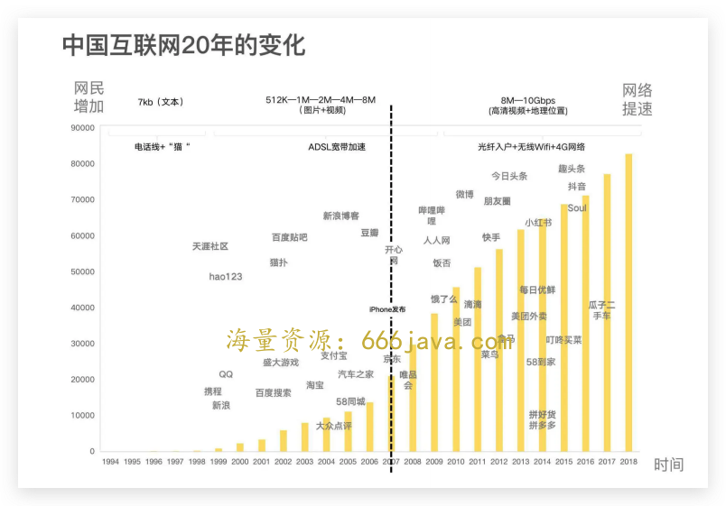
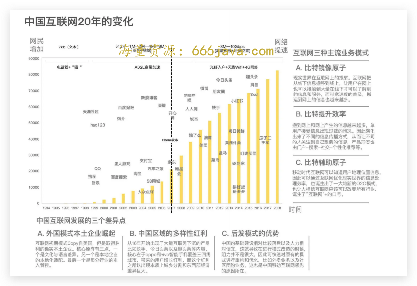
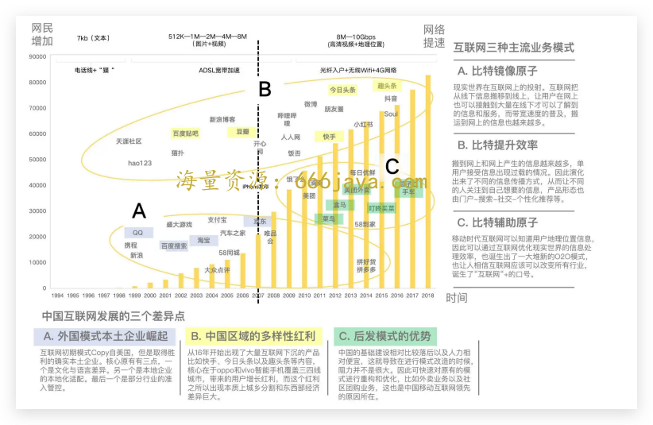

# 15-练习课（下）：如何用结构性思考去理解 20 多年中国互联网发展的变化？

你好，我是雄峰。这节课我们继续解答练习课中的情景问题：向老板分析 **一下中国互联网发展 20 多年的变化。**

上节课，我们因为需要知道老板到底想要什么，学习了界定问题的方法，将老板想要了解的大问题拆解成了小问题；接着，也用了反向定义、长周期视角、对照分析这几个技巧来分析了三个小问题，把我们要汇报的内容填充完整了。

这节课，我们就需要学习一下，怎么才能把我们整理好的素材完美地呈现给大老板了。

## 结构呈现：怎么样呈现更加简洁和有力？

上节课说了那么多，相信你对于中国互联网发展的底层逻辑和脉络应该有了一个相对清晰的认知，但是我们的目标是跟老板在短时间内把“中国互联网发展 20 多年的变化”这个复杂的东西说清楚，毕竟你不太可能让老板开会之前还阅读一个 7000 字的长文。

用字节战略大佬朱时雨的话来表述：一个问题好比是一个西瓜，你可以通过各种维度来切割分析，不管你最后的分析结论是什么，厨房里也许残瓜满地，但 **你在客厅端出来的，应该是一个切好的果盘。**

这个时候，就需要用到三个关键呈现的技巧，一个是 **信息提炼**，一个是 **用图说话**，另外一个是 **延伸判断**。

### 信息提炼：关键内容是什么

上次老板的问题是，中国互联网发展 20 多年的变化。假设你来汇总全文，你会先呈现什么样的信息呢？

这时候， [金字塔思维](https://www.shangyexinzhi.com/article/4723850.html) 的协作方法就起到了作用，我们肯定要先讲出最关键的信息，做到 **结论先行**。

结论先行为什么重要？因为在重要的场合做沟通，前 5 分钟的内容决定了大家是否有兴趣听下去，如果没有办法先对全局信息做一个概括和输出，会导致大家没有兴趣听你的细节分析和逻辑。

因此，在全文的关键信息上，需要先获取听众的注意，如果是我写，我会把关键结论进行高度提炼。

结合上节课我们通过关键词和 3 个小问题提取出来的关键结论和信息，汇报内容如下：

> 上次我收到的命题是分析“中国互联网发展 20 多年的变化”，我认为老板想了解的核心是“中国互联网发展至今，这 20 多年变化背后的关键因素有哪些（先对齐信息）”。
>
> 基于这个判断，我梳理了大量信息，这里先说结论，我个人认为最关键的因素有三个（结论先行）：
>
> 第一点， **网速的变快+用户的变多**：互联网的本质是现实世界在互联网上的投射。
>
> （问题一，互联网的本质是什么）
>
> 伴随着网速越来越快，从文字到图文再到视频，越来越多的内容和服务都可以在互联网上构建，从获取新闻信息再到电商购物都可以实现。
>
> 用户越来越多，从过往信息匮乏到信息过载，因此用户获取信息的手段也在不断简化且越来越多样，例如从门户，到搜索，再到社交等。
>
> （问题二，“20 年这个变量给互联网带来了什么影响”中，因素的总结）
>
> 这个阶段中国主要在模仿美国，比如淘宝对标 eBay，百度对标 Google，QQ 对标 MSN 等。
>
> 第二点， **智能手机时代增加了地理维度**：过往互联网不管如何发展，都还是现实世界在互联网世界的投射，或者是在互联网世界不断地优化信息获取的效率，但是到了移动互联网时代，由于智能手机和物联网的发展，互联网逐步有了改造线下的能力，因此诞生了 O2O 等业务模式。
>
> （问题二，“20 年这个变量给互联网带来了什么影响”中，互联网变化的总结）
>
> 第三点， **中国国情和本土互联网的创新**：中国互联网跟世界互联网的区别在于，大量本土企业打败了同模式下的海外公司。
>
> 这个现象一方面取决于本土企业本地化创业的能力，另一方面也是受到了中国的文化以及国情到影响和限制。比如 QQ 战胜了 MSN，淘宝战胜了 eBay 等。同时，互联网从一、二线往四、五线覆盖之后，又由于区域经济文化发展不平衡，诞生了一批国内才出现的产品。比如从三、四线城市崛起了快手，各式各样的极速版，更开始出现了中国向国外输出的产品模式，比如外卖业务。
>
> （问题三，互联网落地中国发展的过程中有什么不同之处）

### 用图说话：一张图把问题说清楚

光有高度提炼的信息并不足够。任何一个结构内容的表述，一定要有一个“杀手页”内容。简单来说，就是别人看一页内容就可以清晰地知晓你通篇想要表达的核心关键点。因此，我们要尝试把上述的内容汇总在一张图上。

下面这几张图就是我基于汇报内容做的图示，我们结合表述的内容看看它是怎么丰富起来的。

**第一步：明确信息陈述框架** **。** 整个图有三个坐标轴，下横坐标是时间线，记录了每一年的时间点以及这个时间点诞生的重点产品，纵坐标是用户规模，记录了每一年网民变化的情况，上横坐标则是网速宽带的变化以及对应媒体内容的变化（文字-视频）。

中间我也标注了一条 PC 互联网到移动互联网的分界线，可以说，整个大的信息基本都囊括到了一个图表上。

**第二步：补充关键结论陈述**。我们前面提到过互联网三种主流的业务模式，一个是线下搬到线上，一个是线上优化效率，一个是线上改造线下。而中国互联网对比全球互联网的差异又有三点，一个是外国模式本土崛起，一个是中国区域的多样性以及后发模式的优势。这些关键结论需要有效地表达在图表内容中。

**第三步：做到图文信息关联**。信息虽然都汇总到了一个表格上，但是并没有进行有效分类。简单来说就是信息量很多，那要如何让人看得更清楚，更理解我们表述的内容呢？这就需要 **通过关键结论去反向优化信息陈述框架**。

简单来说，表格内容的信息要有效地和关键结论映射上，从而让结论更可信、更容易理解。要做到这一点并不容易，需要大量的时间，做的时候，一定要有耐心。

### 延伸判断：让呈现形成闭环

结束了吗？还是没有。

我们准备好了内容，准备好了呈现方式，甚至上面的一段话我们都可以作为自己的讲话内容。但是，做到了上面那一部分是 60 分，如果再把下面的给做掉，那就可以拿到 80 分以上—— **在表述完核心内容之后进一步做信息的延伸以及判断。**

我们拿到的问题是：中国互联网发展 20 多年的变化。上面说了变化的原因和逻辑，但是不是还是多少有些意犹未尽？意犹未尽的核心，就是缺少下一步的判断。具体来说，就是下一步互联网发展的方向在哪里。如果可以给予一个有效的延展回答，那就是一个很好的加分项，至于对错并不关键，关键的是分析角度。

我们先思考一下过去驱动中国互联网发展的三个关键因素在当前的情况是怎么样的：

1. 移动网速提到了 5G，宽带光纤达到了 1000M，但是网速的提升并没有带动新的产品和体验出现，相反，全球互联网除了元宇宙以外，短期内并 **没有新的模式产生和落地**；

2. 手机出货量开始下滑， **人口红利基本到顶**，过往基于人口红利衍生出的各种模式也开始出现巨头合并（抖音和抖音极速版）。但是移动互联网对传统行业的改造还在逐步进行当中，除了出行和本地生活以外， **互联网也在逐步向医疗、保险、智慧城市以及高端制造渗透**，持续改造线下和传统行业；

3. 中国本土创新各种模式基本到顶，伴随着国家管控社区团购的开始以及游戏行业版号的暂停发放，倒逼国内互联网企业从区域互联网（主要市场是中国） **向海外开始发展**，提升全球竞争力。

因此，我个人判断下一阶段的机会，主要在三方面：

1. **互联网持续线上化** **：** 比如 VR、元宇宙以及全息影像。这一部分可以很好地发挥宽带升级所带来的体验效果，从而进一步占据用户的使用时长，从游戏领域渗透到办公领域（试想想远程戴一个设备可以实现无缝沟通）等。因此，我个人非常看好字节的 [Pico](https://www.thepaper.cn/newsDetail_forward_19481478) 方向；

2. **互联网改造线下** **：** 比如 AR、高端制造、物流网络。这一部分可以很好地发挥互联网对于信息高效的处理，以及算力对于决策效率的提升这两者的优势，从而赋能传统行业，优化甚至重构其流程，进而提升效果；

3. **中国互联网出海** **：** 比如游戏、电商、服务。这一部分生产力的外溢（中国游戏研发人力以及中国工业生产能力）可以极大地扩大供给端的爆发，而在需求端则需要中国公司持续的探索，从而构建一条赚取海外收益的通路。

## **小结**

到这里，商业洞察板块的练习我们就已经完成了。今天的小结，我会依据练习，和你聊聊这两节课的价值。如果要说商业思维课哪节课最重要，我个人会把这次练习课放到第一位，核心原因有三个。

1. **看清中国互联网发展的本质。** 我们是上节课说过，中国互联网这 20 多年来，诞生过各式各样的商业模式和产品形态，我们可能对其中某一个产品或者某一类产品有较好的理解，但是对全貌并没有一个清晰的认知，很多产品和模式的诞生只是知其然而不知其所以然。这两节课，我们通过汇报的情景问题，用优雅的框架解构了互联网，也站在了更高的维度来理解中国互联网发展的前世今生。
2. **用案例学习结构性思考并梳理业务机会。** 上一篇我们提过这一点，很多时候在职场工作，能否晋升往往取决于特殊时间的关键对话，比如在对上汇报的过程中有条理地陈述自己对业务的分析和判断，再或者在跟 boss 聚餐的时候，说了一下自己的一些想法。这往往要求陈述者拥有在短时间内梳理关键信息和判断重点的能力，并进行结构性的表达。说什么固然重要，但表述背后的逻辑也是不容忽视的。
3. **理解过去从而更好把握未来。** 前面的一节练习课是教你如何判断自己的具体业务是否靠谱，而这一篇内容是站在更高的维度，理解过去从而预测未来，找到潜在风口的业务，寻找弯道的超车机会。一个人能不能做成一番事业，除了个人努力以外，更多的则是能否把职业发展锚定在一个大的公司或者行业趋势中，以此形成杠杆叠加作用。

最后，我想和你分享下这几年在腾讯做校招面试官的感触。简单来说，就是互联网的毕业生越来越优秀，但是行业留给新人的机会也越来越少，成为一个好的产品经理，光靠天赋是不够的，还需要大量的实践机会，很多时候你的老板之所以是你的老板，仅仅只是因为入行比你早，做的业务比你多。

因此，我看到大量的新人从最开始的激情再到迷茫再到后面的躺平，有时候会安慰一下新同学，要支棱一点，也要储备好新的技能点为后面做准备，关键是，后面的机会在哪里呢？

今天这节课的关键，并不仅仅只是对结构性思考做一个阐述，更多的也是为未来机会做一个判准和准备。

## **思考题**

在今天课程的最后，我也给你留了一道思考题，想一想，为什么除了 Tiktok 以外，国内的互联网企业出海最成功的是游戏呢？

欢迎你在留言区和我交流互动。我们建立了一个 [读者交流群](http://jinshuju.net/f/DuxzBi)，欢迎你的加入！如果你觉得有所收获，也可以把这节课分享给你的朋友一起学习。我们下节课见。
