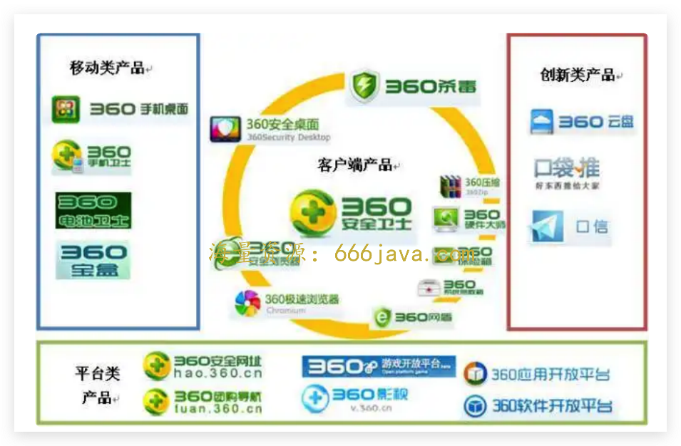
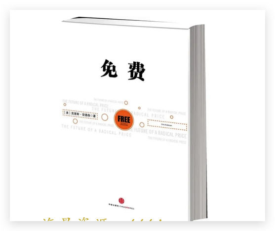
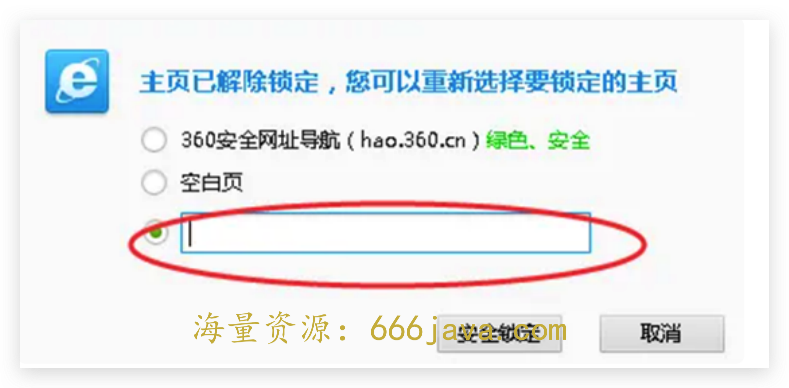
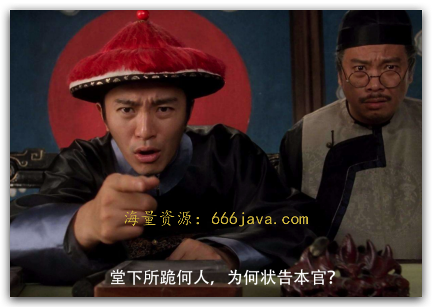

# 16-权限：为什么 360 在移动端没有延续 PC 端的辉煌？

你好，我是雄峰。

今天是我们商业思维第三模块的第一讲，这个模块的核心内容是非规律世界。

还记得我们在导读里面讨论的什么是非规律世界的问题吗？商业世界不是物理世界，没有成功的金科玉律，没有坚不可摧的底层逻辑。 **过往促使你成功的策略和模式，可能在新的环境下会让你错失更多的机会。**

接下来的几节课，我都会从这个方向切入，多维度讲述互联网企业发展的真实案例，帮助你进一步理解商业世界的不确定性。

周鸿祎和他的 360，在 PC 时代可以说是仅次于 BAT（百度/阿里/腾讯）的存在。11 年上市招股书上披露的数据表示，360 的月活用户有 3.39 亿、用户覆盖率达到 85.8%，号称“中国互联网用户数排名前三的公司”，上市后市值一度达到 4 千亿人民币。

到移动互联网时代，360 虽然推出了很多产品、做了很多尝试，但并没有取得移动互联网的“船票”业务，公司市值也一落千丈，曾经的巨头之一在移动时代被后浪赶超。360 的创始人周鸿祎在 PC 时代掀起跟各大巨头的战争，但号称“红衣大炮”的周老板到了移动互联网也没了声响，以至于 17 年网络上开始刷屏一篇文章 [《人民想念周鸿祎》。](https://mp.weixin.qq.com/s/JBgbjY6XlOP2uhyPBRxpnA)

360 曾经成功的因素到了移动互联网时代为什么会失效呢？

今天我们来梳理一下 360 安全的发展脉络，并从中学习两个关键知识点。一个是互联网免费商业模式在 PC 端的最佳实践——360 的三级火箭模式，还有一个，是安全软件在 C 端市场的特殊性——裁判员和运动员。

## **360 在 PC 端的辉煌**

360 最重要的产品在 PC 时代有且只有一款，那就是 360 安全卫士。

你一定记得这款为电脑提供安全防护和病毒清理功能的安全产品。360 也是依靠这一款软件，逐步渗透杀毒、浏览器、网址站、搜索以及手机助手等业务，构建起了 **360 的产品矩阵**。

2011 年初，来自艾瑞的一份针对“日均用户数”的统计显示，排名前十名的客户端产品中，360 的产品占据了四个席位。其中 360 安全卫士排名第一，巅峰时期超过了 QQ。

### **PC 电脑为什么多病毒**

为什么 360 安全软件有那么大的用户体量呢？核心在于当时 PC 电脑环境病毒多。缺少了安全软件，就容易被病毒或者木马程序渗透，给电脑带来风险，也会泄露个人隐私。因此，在当时，安全软件是电脑最刚需的软件之一。

这里要注意一下，我们上面提到的 PC 电脑，默认的是安装 Windows 系统的个人计算机，除了有微软系统以外，还有 Linux 和 Mac 两种系统的电脑。说来奇怪，相比之下只有 Windows 系统才那么不安全，病毒和木马程序泛滥。这里面，大致有三个原因。

- **原因一：权限管理不善**

设想一下，如果在一个银行体系里，所有的人都可以轻易获得金库钥匙、删除监控以及控制安保的权限，那么金库丢失的概率是不是会大大增加？

可以说， **病毒的泛滥和权限的失控有着不小的关系。**

最早的 DOS 系统（微软第一代操作系统），权限是开放的，任何程序都可以进入最底层去控制系统，这就导致了病毒的急剧泛滥。等到 Windows 9 对权限进行了一定的收紧，病毒的诞生和传播也受到了一定的限制。

到了 XP 时代，有一个很烂的 IE6 浏览器，间接导致病毒开始通过互联网传播，且 IE6 默认是最高管理权限，这让整个系统瞬间回到 DOS 时代，病毒可以轻易地通过浏览器对电脑进行控制。当然，后面微软意识到了 IE 浏览器的问题，也一直在不断迭代升级。

- **原因二：** **早期黑客共享文化**

黑客这个群体有两个典型的特质，一个是崇尚自由共享，另一个则是喜欢炫技。

前者会导致大家有什么东西都会在网络上进行相互分享，自由传播，这里面也包括大家制作的各种病毒程序；后者，则让黑客有动力去挖掘各种高难度漏洞，然后制作出新的、复杂的病毒。这也是为什么早期你经常听到某一类新闻说“某某天才黑客发现某某漏洞制造出了病毒”等等。

- **原因三：** **经济利益很庞大**

很多事情是因爱而起，因利做大。Windows 环境下之所以有那么多的病毒和木马程序，跟它的行业体量也有关系。什么意思呢？

假设你弄一个木马程序去盗取用户的个人信息，一个用户的信息价值 10 块钱，在当时的环境下，Linux 和 MAC 加起来的用户也不超过 2000w，而同时期的 Win 是 5 亿+的全球用户规模。你是黑客，你当然想赚大的，毕竟 **针对体量大的用户群体下手，才有足够的利益产生。**

权限管理不善、黑客共享文化以及庞大的经济利益，这些都让安全软件成为了刚需。

### **安全软件的变迁历程**

安全软件的确是当时的刚需，可是 360 是一下就做起来的吗？

今天我们都知道，360 是做互联网安全的企业。但是上世纪 90 年代，还没有互联网安全的概念，当然也没有 360。

那个时候，这个市场叫杀毒软件市场。更早的时候，还不是软件，而是硬件——防病毒卡。也许你还记得电脑桌面上曾经有一个睡觉打呼噜的小狮子，这就是行业最早的老大，瑞星公司。

国内杀毒软件的老大，经历了五次轮换，我来给你盘一下。

**第一阶段：瑞星。** 91 年瑞星最开始做防病毒卡，取得了行业第一。

**第二阶段：江民。** 94 年江民防病毒公司成立，趁着瑞星创始人生病，公司群龙无首期间，顺势做大市场，成为了行业第一。

**第三阶段：瑞星。** 98 年瑞星创始人王莘回归之后，发现市场已经被江民占据，于是另辟蹊径，以超低价格对硬件厂商捆绑销售瑞星杀毒软件。当时，一套正版杀毒软件零售价格应该在 100 元左右，而瑞星以低于 10 元的超低价，向联想、方正等电脑厂商供货，让出厂的电脑自带瑞星的杀毒软件。

**第四阶段：金山。** 2000 年初的时候，金山看到了这一市场，为了更快地切入市场，金山推出了免费试用和降价的策略，一方面可以让用户先安装试用金山毒霸吸引大量的用户，另一方面把价格降到 50 元左右，而当时的江民和瑞星最低的价格都在 200 元以上，金山快速崛起。

你会发现不管是瑞星、江民还是金山，大家的竞争维度都是一个点： **价格**。围绕价格的点打来打去，做的都是价格战，而用户对于品牌没有深度依赖，只要够用且价格便宜就会快速迁移。

**第五阶段：360。** 周鸿祎祭出了“ **免费**”这面大旗。2007 年 360 切入了杀毒这个领域，一方面赠送卡巴斯基杀毒软件半年的使用权，一方面推出 360 安全卫士解决杀毒以外的周边问题。等到 2008 年自研杀毒软件成熟之后，开始取代卡巴斯基，关键还是免费给所有用户使用，瞬间取得了巨大的成功。

360 的成功，可以说是开启了以免费模式进攻颠覆传统软件企业的开端，且获得了巨大的成功，以后几乎所有互联网企业打击传统软件企业，都会祭出“免费”这种商业模式的大旗。

### **免费的商业模式：三级火箭理论**

免费经济学，最早是克里斯·安德森提出的，他是写《 **长尾理论**》的作者，他的另一本书《 **免费：商业的未来**》，同样震撼了整个互联网。后来雷军把这两本书，称为互联网的理论基础，周鸿祎在做 360 的时候逢人就推荐这本书。

在克里斯看来， **免费，是指将免费商品的成本进行转移，比如转移到另一个商品或者后续服务上。免费的真正精髓，其实是一个“二段”收费。**

而在互联网领域，最常用的变现模式就是广告，通过 **一个免费产品快速占据市场用户的规模，吸引用户的注意力和使用，再把这一部分注意力售卖给广告，进行变现**，实现了“羊毛出在猪身上”的模式。

这个理论具体又是怎么应用的呢？周鸿祎基于这个理论，推出了 360 的三级火箭理论。

**第一级火箭** **，** **完全只考虑用户是否会用以及市场是否足够广阔，做好流量的沉淀。**

360 瞄准了安全市场，推出免费的安全杀毒产品。因为免费，可以说当时国内每一台电脑都安装了 360 安全卫士等杀毒产品。这一阶段，360 快速实现了对市场的垄断和扩张，实现了流量池的沉淀。

**第二级火箭** **，** **在原有流量的基础上，延伸出用户商业的场景。**

想一想，如果原有的产品无法进行变现，那么是不是可以把用户导入到一个可以变现或者二段变现的产品中，延伸出可以变现的流量池呢？

360 在 2008 年推出自己杀毒业务的同时，也推出了 360 安全浏览器。在用户浏览网页的时候引导用户安装和替换自己的 360 安全浏览器。随后，又持续推出了 360 网站导航、软件下载、手机商店以及搜索引擎等工具，而这些都是具备变现潜力的产品。

**第三级火箭，将用户进行盈利转换，实现商业收入的闭环。**

随后，浏览器通过网址站广告、搜索分成广告以及工具栏广告获取商业收入，手机商店也通过游戏联运以及应用广告获取商业收入。

2010 年，360 的收入是 5379 万美元，折合人民币约 3 亿左右，甚至随后几年都保持几倍的收入增速。到了 2015 年，360 的年收入达到了 40 亿左右的规模，这个也远超当时安全市场的收入空间了。

### 安全软件的特殊性：裁判员和运动员

除了市场的刚需以及“免费”这面大旗，360 的成功还有什么特殊性吗？或者说，为什么它的三级火箭理论可以实现得那么完美呢？

过往安全软件处理病毒的机制，是等出现类似的病毒再进行处理，所以需要确保病毒库是最新的。这种处理机制有一个滞后性的问题：如果出现一个新的病毒或者病毒库更新不及时，那么电脑就容易中招。

后面，金山变了一个思路，引入了云查杀技术，查杀率达到了 100%，连国外的王牌杀毒软件都做不到，一时间所有人都非常好奇。

后来，金山对外公布了云查杀逻辑： **针对用户电脑里面所有可疑的文件和程序一律打上可疑文件的标签，也就是变相建立了一个白名单。只要是不在白名单里** **，** **全部进行处理。** 当然，副作用也很大，稍微有问题的灰色软件也都会被杀。好处也很明显，那就是大部分用户不会安装灰色软件，这一部分用户并不受影响。

简单理解，过往是先放进来，有问题再处理。现在的方式是给每一个文件都发一个证明，如果没有证明，统一会被拘留，然后再辨别好坏。好的放了，有嫌疑的继续关押，除非你有办法证明自己是好的，再被添加到白名单——真的是宁可错杀一千，不可放过一个。

不过问题又来了，如果杀毒软件把这一套机制拿去对付自家竞品呢？这就导致 **杀毒软件既是裁判员又是运动员，造成了竞争环境的不公平。**

这句话要怎么理解呢？我给你举一个例子，你的电脑原来用了 A 浏览器，装的是杀毒软件甲，一段时间内大家相安无事。等过了一段时间，杀毒软件甲推出了一款 B 安全浏览器。

经典场景出现了（懂得都懂）：

当用户通过 A 浏览器打开某些网站的时候，安全软件会提示你，“访问某某网址有危险，推荐你用 B 安全浏览器，安全又可靠”。然后，你下载安装了新的浏览器。等下次打开某网址的时候，系统就会默认使用 B 安全浏览器了，或者通过安全软件提示设置，引导用户使用 B 安全浏览器打开。在不知不觉当中，你就从使用 A 浏览器变成了使用 B 浏览器。

那么对于其他家产品而言，甲就是不正当的竞争关系，凭什么你就说自己安全，我们就不安全了？凭什么你给你家的产品做很多系统默认设置，我们被排之门外？但是，由于安全软件的权限是最高的，在应用层对它并没有相应的处理方式，所以常常会出现下图滑稽的一幕：

**当好坏都是自己说的时候，安全软件其实是一个病毒软件。**

## **360 在移动端的没落**

故事的开头总是绚烂的，但是之后，360 又是怎么没落下去的呢？

在移动端刚火的时候，360 想复制过往在 PC 端成功的模式，围绕“安全”继续做大做强、再创辉煌。但推了一段时间之后发现，安全并不是移动端用户的刚需，同时，安全软件也没有办法跟 PC 端一样获取底层权限。

可以说，“非规律世界”在 360 移动端的发展上有着强烈的体现。

### 移动端病毒较少

前面我们说了，PC 端病毒兴起的原因有三个：权限管理不善、黑客文化的兴起以及庞大的经济利益。

这三个原因在移动端都发生了变化。

首先就是 **权限管理机制**。不管是 iOS 还是 Android，都吸取了微软做系统的经验教训，在应用安装的来源和应用获取系统权限的范围，都做了 [极大的限制](https://time.geekbang.org/column/article/548476)。

以 iPhone 为例，所有的应用必须从 App Store 上下载，而 App Store 上面所有的应用都需要人工审核和校验，极大程度上杜绝了恶意应用的来源。此外，所有的底层权限都不开放给绝大多数应用，从而降低了这些应用作恶的风险。

其次，就是 **黑客文化的衰退**。互联网发展到今天，逐步从开放走向封闭，共享精神不再。加上法治环境的不断健全，黑客的很多行为在今天会存在刑事问题，很多黑客想通了，纷纷转型白帽子（安全防护），安全又有保障。

最后一点，就是 **经济利益的方向有所变化**。病毒针对用户，那真的是属于赚不到钱又会惹得一身骚的事情，大规模传播开来之后就会有杀毒软件来解决。但是如果针对企业下手，一方面可以获取不菲的收益，另一方面是涉事企业为了避免声誉，都会低调处理，也大大降低了病毒曝光的风险，可以持续获益。

这就导致过往在 PC 端刚需的安全产品，到了移动端变成了伪需求。

### 折腾的业务方向

除了刚需条件的变化外，我们还可以进一步思考，想一想，360 是真的想做安全么？

其实并不是，360 最关注的，本质还是是权限问题，如果有底层的权限，做不做安全并不重要。在 360 模式下， **权限，是开启后续变现的基础。**

过往 PC 端时代 360 可以一往无前，核心在于 **底层权限让它具备了裁判员的身份**，在跟运动员竞争的过程中，可以制定对自己有利的环境和游戏规则。

所以，当 360 发现移动端安全市场不再成立， [底层权限被厂商所管控](https://time.geekbang.org/column/article/548476) 之后，就开始切换业务思路，不再只是从安全产品着手，而是尝试所有可获取底层权限的相关业务。

“不管是自己研发、投资或是合作，通过各种方式去获取底层权限”，当我们用这个思路去理解的时候，就很容易理解 360 后续业务布局的逻辑了。

- **“如果权限都被手机管控了，那么我自己去造手机就好了。”**

2012 年，360 联合华为发布了 **第一款 360 特供机**。这款手机内置了 360 全家桶（全系产品），对标的正是小米刚发布的小米 1 青春版，两者性价比都足够高，可以覆盖足够广的用户，便于扩大手机用户规模。

不过因为多方面原因，华为取消了跟 360 的合作。即便这样，周鸿祎获取底层权限的决心也没有被阻挡，后面 360 也一直尝试跟多家手机厂商进行合作。

- **“如果我造不出一个 iPhone，那么我会想办法让部分 iPhone 为我所用。”**

2013 年，360 投资了 **太极助手**。苹果越狱团队 Evasi0n 发布了 iOS 7 完美越狱工具，这个工具可以让所有支持 iOS7 的产品在 5 分钟内完美越狱，使用这个越狱工具的用户，则会被默认安装一个太极助手软件，变相绕开了 App Store 的底层机制。

- **“在我的手机没有出来之前，我先通过 ROM 获取底层权限。”**

同一年，360 还推出了自己的 **刷机助手**（可帮助安卓手机安装纯净版系统）。在早期各家安卓手机系统体验差、预装软件多、内存不够的情况下，360 通过提供干净的 ROM（手机重刷的系统包）来吸引用户刷机，获取刷机用户的底层权限。

2014 年， 360 斥巨资与酷派进行合作，成立了大神和奇酷两个手机品牌，大举进军手机行业。如果不是中间被酷派和乐视联手坑了一把，360 还是很有希望的。

## **小结**

讲到这里，我们今天这节课也就接近尾声了。这一章节虽然是围绕“非规律”来展开，但是，我也希望你能够从中看到 360PC 时代发家的业务逻辑，一个是免费的商业模式在 360 的最佳实践逻辑：三级火箭理论。另一个则是安全软件在 PC 时代的特殊性，既是运动员又是裁判员，在一定程度上造成了不公平的竞争环境。

最后，我来给你总结一下今天的关键内容。

**免费的商业模式：** 通过一个免费产品快速占据市场用户的规模，吸引用户的注意力和使用，再把这一部分注意力售卖给广告，进行变现，实现了羊毛出在猪身上，狗来买单的模式，实现“二段”变现。我们目前大部分的产品都是这种业务模式，比如腾讯新闻、抖音等等。

**三级火箭模式：** 一级火箭是通过免费模式构建一个基础流量池；二级火箭是在原有流量的基础上，延伸出商业变现的场景；三级火箭是将用户进行盈利转换，实现商业收入的闭环。

搜狗在 PC 时代的发展也是这个逻辑。一级火箭是通过搜狗输入法积累用户，二级火箭，是把用户导入到搜狗浏览器这种有商业机会的产品，最后的三级火箭，则是通过网址站和搜索引擎进行变现。

**裁判员和运动员：** 我们在前面的内容有提过厂商的变现模式盐铁官营，其实本质就是底层权限影响了竞争的公平性。

安全软件，在一定程度上可以制造对自家产品更有利的竞争环境，或者影响友商的用户体验。国内的安全软件开创了这一模式，同时也开启了一个潘多拉的盒子，导致国内的杀毒软件有点像病毒软件，做了太多僭越安全软件本身该做的功能。

最后，360 将 PC 成功的经验强行复制到移动时代，阻碍了它在新时代寻找新的机会点。最典型的例子，就是 360 在 17 年退出了对今日头条的投资，售卖了原有的股份。而当时 360 还在死磕手机业务，锲而不舍追求底层权限的控制，从而让后浪拍死了前浪。

当然，360 虽然丢失了 C 端市场，但是基于过往安全行业的积累，也在 B 端安全站稳了脚跟，从个人安全市场转型到了如今的企业安全市场，成为中国乃至世界最大的安全软件公司之一，实现了业务模式的转型。

## 思考题

最后，我也给你留了一个思考的问题。想一想，PC 时代的三级火箭模式，在移动端还适用么？

欢迎你在留言区和我交流互动。我们建立了一个 [读者交流群](http://jinshuju.net/f/DuxzBi)，欢迎你的加入！如果你觉得有所收获，也可以把这节课分享给你的朋友一起学习。我们下节课见。

## 拓展阅读

关于《人民想念周鸿祎》的回复： [《周鸿祎：致想念我的人民》](https://mp.weixin.qq.com/s/vgPURtBeP40WzYbigYNRRw)
