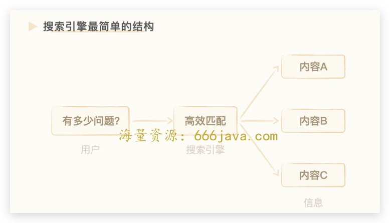
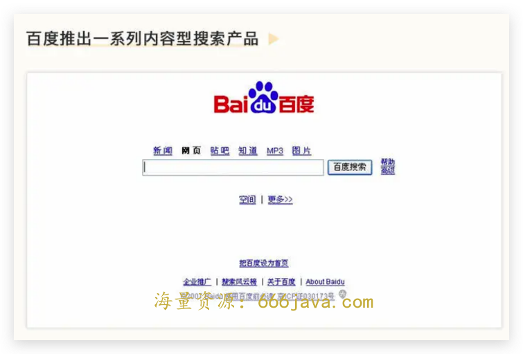
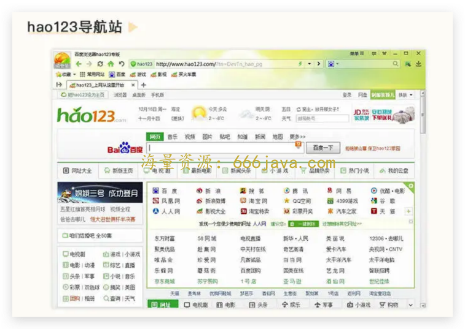
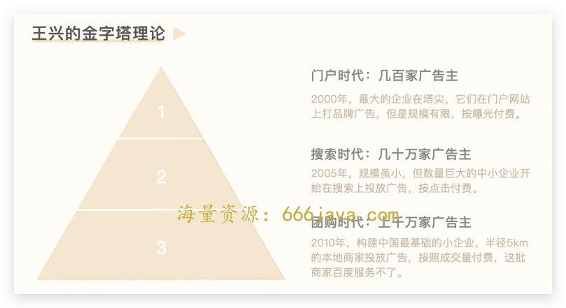
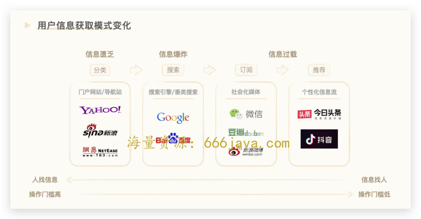
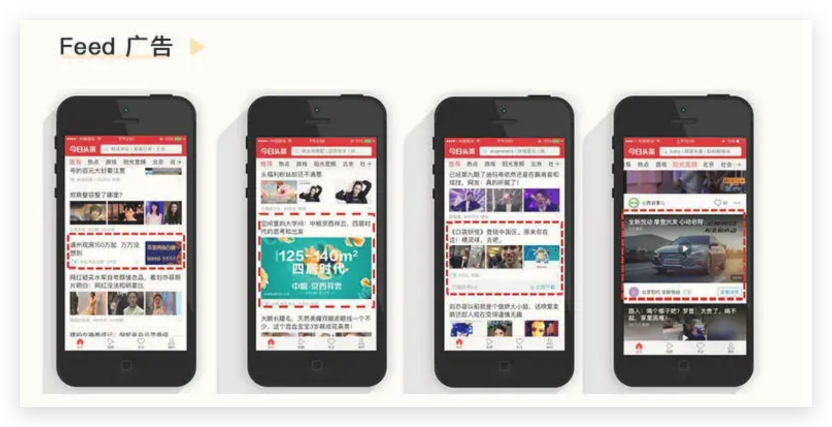
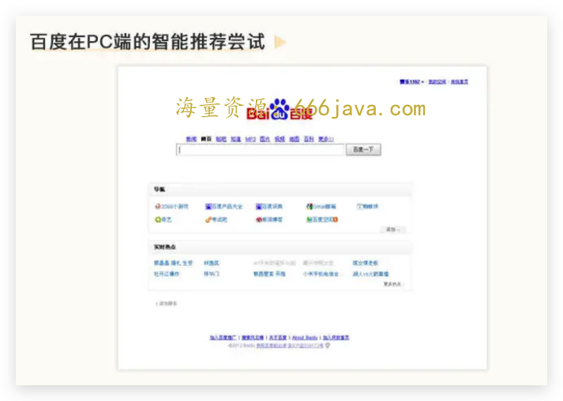

# 17-环境：为什么百度在移动时代坐视字节的崛起？

你好，我是雄峰。这节课是非规律世界的第 2 讲，我们来聊一下百度，这个 PC 时代的王者，移动时代的迷途羔羊。

BAT 代表了 PC 互联网时代最大以及最重要的三家公司，分别是百度、阿里以及腾讯，它们在各自的领域战胜了自己在国外最大的对手。阿里战胜了 eBay 和亚马逊，腾讯战胜了 MSN，百度战胜了谷歌。

伴随着移动互联网的发展，阿里和腾讯依旧屹立在移动互联网的潮头，但是百度却逐步掉队，市值一度只有前两家的十分之一。

到了如今，大家提到 B，更多的会想到字节跳动（ByteDance）。曾经仰望百度的字节，如今已经成为了国内最大的广告平台，并进一步往海外扩展。字节的创始人张一鸣曾经说过： **字节初期的成功，很大程度在于百度忽视了我们所做的业务，本质上，大家处理的都是信息效率的问题。**

为什么百度会在移动时代落后？这是一个非常大的命题，再过几年应该会成为 MBA 商业课程的分析案例，而且分析角度很多，例如组织管理、战略反复、业务布局等。这里，我说个不一样的观点，百度在移动时代落后的根本原因，就是 **固守优势（搜索业务），忽视了移动互联网爆发后更多的新增机会**，让自己错失了移动互联网开疆拓土最好的时机。

接下来，我将带你分析百度曾经做对了什么，帮助自己取得国内搜索的领先优势，又在移动端做错了什么。最后，我们也可以聊聊，基于百度的经验教训，又可以学习到什么。

## 百度曾经的辉煌

百度之所以成为 PC 时代的一哥，一方面是因为做的业务是搜索引擎，在 PC 端时代，搜索引擎是用户获取信息最关键的入口，没有之一，更可以说是最大的流量入口。另一方面，是因为百度在中国区域战胜了谷歌，成为了搜索引擎一哥，顶峰之后市场份额占据 70%。

很多人会认为百度胜之不武，“成为一哥的原因是因为一哥退出了中国”，这种论调有太多的情绪所在。从过程来看，百度确实做对了不少事情，它的成功也并非只是因为谷歌的退出。Caoz 老师（大咖啊！）经常在自己的公众号“ [caoz 的梦呓](https://mp.weixin.qq.com/mp/profile_ext?action=home&__biz=MzI0MjA1Mjg2Ng==&scene=124#wechat_redirect)”抨击类似的观点，有兴趣的可以翻一下曹大的公众号。

下面，我们来分析一下百度曾经为什么如此辉煌。

### 搜索引擎的诞生：信息爆炸的必然

我们前面在 [互联网的发展脉络](https://time.geekbang.org/column/article/552161) 中有提到，伴随着互联网上信息的增多，单用户接收到的信息也就越多，用户从过往的信息匮乏转变为信息过载。

那么，如何让用户更简便地找到自己想要的信息呢？在这样的需求背景下，搜索引擎应运而生了。

我们要怎么理解搜索引擎呢？你可以把它当成一个信息的高速公路，公路一端连接着用户的疑问，另一端连接着海量的信息。在这条高速公路上，搜索引擎会通过高效的数据算法能力，帮助用户做好信息的匹配机制。

高速公路的两端分别连接着问题和内容。左侧代表了搜索引擎的用户规模，通常取决于用户可以提出多少的疑问。对于做搜索引擎这个业务的公司，这里还有两个潜台词， **一个是哪些问题是用户会使用搜索引擎来解疑的（用户的规模）？另一个则是，有多少用户会优先使用“我”这个搜索引擎（使用优先级）？**

而这两个问题，本质上都直接指向了这条公路上“内容”的部分。

思考一下，为什么你不在百度搜索衣服，但是会去淘宝搜索衣服呢？

因为百度无法提供有效的电商决策信息，包括商品的详细信息、评价信息、价格信息以及卖家的店铺信用机制等。淘宝屏蔽了百度的爬虫抓取，形成了一个信息孤岛，导致用户在想要购物的时候，会默认选择使用淘宝，而非百度。

**搜索引擎的本质是信息管道，如果没有有效的上游内容，用户也不会选择来使用这个管道。**

PC 时代的百度，核心策略就是两个：一个是巩固搜索的内容护城河，通过独特的信息来吸引用户使用；另一个则是扩大搜索的用户规模，在同质信息内容上吸引用户优先且“只用”。

### 信息侧：内容护城河

百度很早就意识到了打造内容护城河的重要性。

用户的搜索 Query 可以很好地告诉平台“我想要什么内容”，如果用户在精准 Query 之后还需要翻屏继续找内容，这就说明搜索结果不符合用户需求。于是，凭借着对用户需求的敏锐度，百度在上游信息获取上也做了大量的投入和建设。

2002 年，百度推出了一系列内容型搜索产品，比如百度 MP3 搜索，百度图片、新闻搜索；2003 年又推出了当时最大的兴趣社区产品“百度贴吧”，这个产品后来一度占据了百度线上流量的 11%；2005 年，又上线了百度知道，将互动问答平台与搜索业务结合；2006 年上线了百度百科，便于用户通过搜索引擎查询大量的基础词。

这些独家内容壁垒成为了百度当时最大的优势。很多刚刚接触互联网的小白第一个打开的页面就是百度，百度提供的 MP3 搜索、图片搜索、贴吧等产品能很好地满足他们的娱乐需求。

加之当时的版权环境并不完善，且百度利用了“互联网内容的避风港原则”，即使内容上有大量侵权以及盗版的问题，只要遵循“通知-删除”的操作，也没有办法引来内容服务商对百度的诉讼，给自己创造了极大的便利。不过，这也对当时的文化产业产生了极大的冲击（没有了收入），以至于当时国内顶级音乐制作人宋柯感慨道：唱片已死。

谷歌并非没有意识到这个问题，但因为谷歌遵守版权规定，没有提供盗版的 MP3 服务（有一说一，外企在遵守规则方面做得比国内企业好太多，不管是劳动法还是裁员福利），眼看大量用户流失。

### 用户侧：流量推广术

除了内容护城河的打造，百度在用户推广方面也比谷歌更加落地。总结下来有两个特色，一个是收购 hao123，另一个则是覆盖网吧渠道。

我们先说 **收购 hao123**。当时的互联网用户可分为两部分： **搜索引擎的使用者和导航站的使用者。** 用户对于互联网逐步熟悉之后，虽然其中有一部分会转变到使用搜索引擎，但随着互联网用户的增加，导航站的使用率、用户数还会增长。百度收购 hao123 之后，可以把导航站的用户收纳其中，也为自己的搜索引擎提供了后续新增用户群体。

hao123 是最大的中文互联网网站之一，可以排进全国前五位。根据百度当初的数据统计，来自 hao123 的请求量占百度搜索量的十分之一，整个网站的流量则占到当初百度整体流量的 40%，收购 hao123 的 5000w，最后每年可以给百度创造十亿左右的收入。

再说覆盖网吧渠道的策略。当时使用电脑的用户也可以分为两拨， **一部分是用家庭电脑，一部分则是用网吧的电脑。**

2008 年，全国的 PC 网民大概有 3 亿，其中有 1 亿是网吧网民。按照第三方的数据监控来看，百度占网吧搜索流量的 85%以上。这么高的占比是怎么做到的呢？

当时，百度效仿网游行业的推广策略，采用百度广告联盟的分成模式，与网吧管理软件服务商进行合作： **网吧的浏览器默认使用 hao123 网址站+百度搜索引擎，双方的收益进行一定比例分成**。既扩大了自己的用户，又让网吧服务商获得了收益。

在谷歌退出中国的时候，百度实际上已经是国内第一了，只是谷歌退出之后，百度的市场份额一家独大了。

## 百度移动时代的摇摆

我们在最开头说过，百度在移动时代的落后可以找出很多原因。但是我个人认为，最关键的因素只有一个：百度固守优势（搜索优先）。此外，则是押注 O2O 导致错失封堵字节的时机，也失去了智能推荐领域的爆发。 **本质上，就是错误地估计了信息分发的模式，不只有搜索引擎，还有个性化推荐；也错误预估了信息分发的市场规模，其依旧处于持续壮大的阶段，从而让字节有了机会。**

### 执念：搜索优先论

我的大学基友毕业后去了百度，他跟我说在百度做内容业务最痛苦的点就是要跟搜索扯上关系。百度的一切业务都以搜索为重心，任何业务的扩展都需要回答一个问题：这个可以给搜索带来什么？或者，这个是否可以利用到搜索的优势？

**这就导致一切跟搜索无关的业务，在内部的地位都会变得完全不重要。**

问题来了，搜索在 PC 时代是最关键的内容入口，但是到了移动时代，搜索只是众多入口中的一个，还不是最关键的那个。

这个变化的背后有两个核心原因。

先说 **移动 App 的崛起稀释了搜索引擎的入口价值**。垂类 App 不允许搜索引擎索引，而是将用户时间圈入私家领地，让原有的、可以被百度所爬取的信息变成了一个个信息孤岛，用户的需求从网页转移到了 App 上，使用路径逐步发生迁移。

想一想，你在电脑上会通过百度打开 58 同城的网页，在手机上会重复这个路径么？必然不会。你会直接打开 58 同城的 App，这变相地降低了搜索引擎的重要性。

再来说 **手机是大众的碎片化使用场景这个因素**。想一想，现在我们用 PC 的目的是什么呢？大部分都是处理工作、玩游戏或者找资料，因为 PC 是生产效率工具。但到了移动时代，手机已经成为了每一个人不可或缺的一部分，用户的使用时长在逐步增长，而这部分时长需要更多的娱乐内容填充。但是百度并没有重视娱乐和消费内容的建设和投资，用户增长的时长，也与百度没有关系。

可以说，百度把 PC 时代的成功方法论强行复制到了移动时代，但忽略了大环境的变化，刻舟求剑，不知变通。

### 歧途：打不下来的 O2O

之前跟百度的朋友聊天的时候，大家也都在困惑，为什么当初百度要在 2013 年-2015 年之间重点押注 O2O 业务呢？

O2O，也就是指将线下的商务机会与互联网结合，让互联网成为线下交易的平台。这类业务既不满足搜索相关的特性，又与百度技术导向的企业能力相背离，偏偏百度砸了几百亿要去做这块业务。

直到后来朋友丢给了我一篇文章，内容是美团创始人王兴 2010 年在公司内部的讲话，我才初步明白这其中的缘由。

我们仔细看下这张图：

按照王兴的理论逻辑，搜索时代只能够服务线上的广告主，但是团购时代可以服务线下半径 5km 的本地商家，将广告主服务从几十万拓展到上千万，从而成就最完美的商业模式。

回到当时的情景来看，百度已拥有 14 个“亿级用户数”的产品（百度搜索、百度手助、百度地图等），流量早已不是问题，到了移动时代，在搜索市场也依旧是一家独大的局面。核心问题在于如何让非搜索、移动端的流量找到可持续的商业模式，跟搜索一样达 200 亿的收入规模。

为什么当时百度不去做自己擅长的广告呢？

一方面，当时手机端屏幕小于电脑，直接移植 PC 端的广告模式体验较差。在移动端信息流广告出来之前，一直没有像样的变现方式，广告形态都是 banner、积分墙之类的，转化效率很低，用户体验也很不好。另一方面，移动搜索中与本地生活服务相关的占比反而越来越高，团购“交易抽佣”的商业模式也非常清晰。这样，也不难理解百度要切入这一块业务的原因。

但问题来了，O2O 业务是一个极重线下人工运营的工作，可以说，地推才是 O2O 的护城河。美团是从阿里挖来了 [中供铁军](https://zhuanlan.zhihu.com/p/115431067) 的负责人干嘉伟，才让线下扫街团队管理变得更加精细化和规范化。但是技术范的百度很难跟对手一样自建线下团队，只能够依托于代理商体系。而代理商是看到利润才会重点投入的主，在业务不明朗的关键时候并不会跟美团血拼，加上代理商不好管控，百度在线下也逐步落后于美团。

而更严重的问题就在于，百度深陷 O2O 战争的时候，不仅错过了巩固搜索上游内容的好机会，也错过了围堵字节成长的好时机。

## 字节：闷声大发财

字节跳动的创始人张一鸣和美团的创始人王兴是老乡，都是福建龙岩人。有意思的是，王兴相对来说更高调，喜欢在不同的场合输出自己对于产品、商业以及组织模式的理解；相反张一鸣特别抵触，在他的观点中，认为：如果这个事情很重要，那为什么要对外说？如果你不想要巨头参与竞争，你为什么要引起巨头注意？同一个事情，具体执行知道和 CEO 知道，产生的效果是完全不一样的。

所以，在很长一段时间内， **字节都不参与行业活动，也不做对外宣传，一直游历在巨头的视线之外。核心目的，就是不引起百度的注意，因为二者做的本质上都是信息分发的业务，同时字节也在大量挖百度的人，更关键的是，字节判断，信息分发到了移动时代依旧是一门大生意。**

### 新的信息分发方式：个性化推荐

从 PC 时代进入到移动时代， **最大的变化有三点：信息量变得越来越大，用户量越来越大，用户使用网络的时间也越来越长**。

三个点的变化，意味着需要解决三个问题：

1. 信息量变大之后，需要分发的信息也就越来越多。在搜索引擎之外，是否还有其他新的信息分发方式，提升信息的分发效率？
2. 用户量越来越多意味着用户越来越基础，大量用户可能不会打字，在搜索以外还有没有其他更友好的体验方式？
3. 用户使用的时长变多之后，用什么样的内容可以更好地填充用户时间？

这就在搜索引擎以外，延展出了新的信息分发方式，一种是订阅关注（SNS 时代），另一种是推荐算法（Feed 时代），这两种方式都可以简化信息获取的方式，让用户获取信息变得更加容易，上手门槛更低。

订阅关注和推荐算法这两者相比，个性化推荐的门槛是最低的，易用性也是最强的。搜索，需要用户较为准确地提出问题、打字；订阅，需要用户选择要关注的信息来源；而个性化推荐只需要根据用户的点击行为进行迭代反馈，好的点击喜欢，不好的点击不喜欢，时间越久，用户就会觉得越好用。

想一想，你的父母会打字吗？以我老妈为例，打字只能够用手写笔，信息输入很慢。那如果打开微博都不知道要关注谁呢？假设这些都不会，那最简单的方式，就是 **基于兴趣信息进行推荐强化** 了。

除此之外，头条最开始切入的内容模块是娱乐，当碎片化时间变多之后，娱乐内容是很好的 [kill time](https://time.geekbang.org/column/article/546770) 的方式：12 年 App Store 里排在前几名的都是搞笑 App，微博上很多热号也是做搞笑内容火起来的。张一鸣为此做了很多的研究，因此，头条的第一个 App 就是搞笑囧图，然后就是内涵段子，都是“娱乐内容+个性化分发”的产品机制，再到后面演化出了“全部内容+个性化分发”的今日头条，也是字节跳动的看家产品。

但是，百度依旧沉迷于强化搜索分发的模式，并没有意识到移动互联网来临之后，玩法在发生变化。

### 新的商业变现形态：Feed 广告

当年促使百度深陷 O2O 大坑的原因之一：移动端流量变现的方式并不是很清晰。这个问题在今日头条用户规模有 3 千万的时候，也同样困扰着张一鸣。

2019 年张一鸣在员工大会回忆当初 13 年做今日头条，那时候虽然大家对于广告有很强的信心，但也都不知道该怎么做。直到大家看到了 Feed 广告的产品形态，基于今日头条 App 试点了第一单 Feed 广告后，有了一定效果，再到 2014 年 Facebook 广告收入占比超过 50%以后，开始意识到并坚定地认为 Feed 广告是移动广告未来的趋势。

Feed 广告也叫信息流广告。简单来说，就是在资讯内容、好友动态中插入广告，让用户以阅读资讯的方式来阅读广告，属于 [原生广告](https://time.geekbang.org/column/article/542727) 的一种形式。它最大的特点是“内容即广告，广告即内容”，而且能够以图片、图文、视频等形式来呈现广告，用户原生体验好。

随后，字节的广告收入便一日千里，依托信息流广告，2014 年还没过完，就完成了全年 20 亿的广告收入目标，达到了百度十分之一的规模。

那个时候百度在干什么呢？依旧在 O2O 的线下泥潭中与美团以及饿了么鏖战，从而错失了追击字节跳动最好的机会。等到 2017 年再开始追赶信息流业务的时候，今日头条已经有 5000w 的 DAU，并逐步孵化出了火山、抖音等新产品，移动互联网逐步进入下半场，追赶的难度相当大。

此前，百度并非没有看到个性化推荐和信息流广告的机会。早在今日头条成立之前，百度就曾在 PC 上尝试过智能推荐。在 2011 年的百度世界大会上，百度公布了新首页，在固有的搜索框之下，增添了网站导航、实时热点，新鲜事等版块，打造“一人一百度”的口号。

但这个尝试很快就中断了，因为新首页影响了搜索流量，分流了部分用户，而信息流模块没有添加广告，反而会挤占用户时长，也就意味着不赚钱的推荐与搜索左右互搏，影响到了搜索的流量和收入，百度的教训又一次复现了“创新者的窘境”。

## **小结**

好了，我们今天的内容到这里也就差不多了。我来简单总结一下今天说到的关键内容，主要有三个。

**信息的分发模式：** 互联网发展这三十年，信息逐步从匮乏到过载，信息的分发模式逐步从门户分类发展到搜索引擎，再到社交订阅以及如今的个性化推荐，用户获取信息的相关性在逐步提升，获取信息的门槛在逐步降低。百度从 PC 时代转移到移动互联网时代，虽然做的还是信息分发的工作，但是并没有跟上最新的机会。

**环境变化导致优劣转化：** 非规律世界这一框架的内容核心，就是希望你能建立一个认知概念——不要迷信原有成功的经验。很多时候，成功只是时代机遇下的运气，百度在 PC 时代如此重要的原因，就在于搜索引擎是最大的互联网流量入口，而到了移动时代，百度不重要的原因，就是搜索引擎不再是最重要的入口。 **当大的环境发生变化的时候，如果恪守原有优势（搜索）而不去拓展新的方向（新的信息分发机制），则会落后于时代。**

**移动时代的广告形态：** Feed 广告可以说是移动互联网广告最大的基石和创新。虽然这个模式在 2006 年就被 Facebook 提出，但是直到 2014 年 Facebook 通过移动广告获取了 74 亿美元的收入，移动端收入第一次超过了 PC 端，才奠定了行业对于移动广告的新认知。

## 思考题

在课程的最后，我也给你留了一道思考题。想一想，除了百度，还有哪些优势变劣势的案例？

欢迎你在留言区和我交流互动。我们建立了一个 [读者交流群](http://jinshuju.net/f/DuxzBi)，欢迎你的加入！如果你觉得有所收获，也可以把这节课分享给你的朋友一起学习。我们下节课见。
