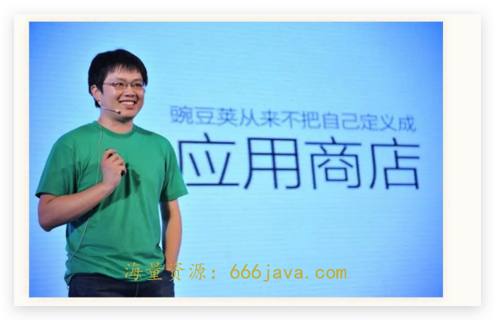
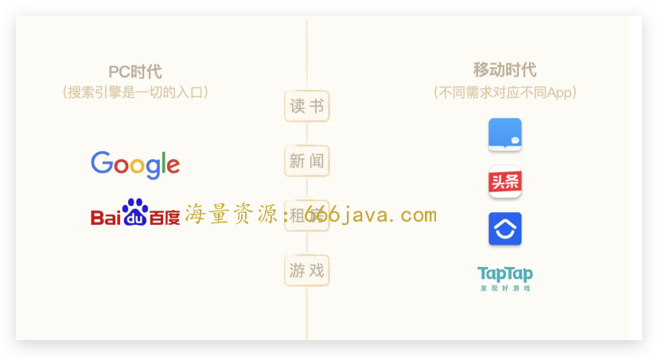
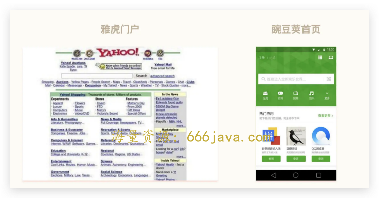
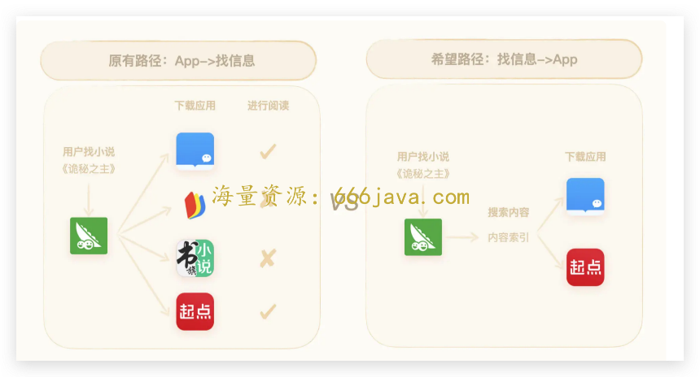
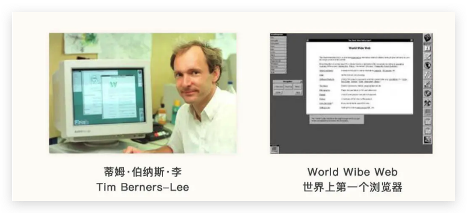
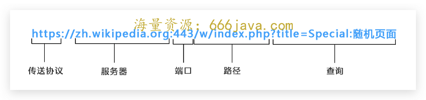
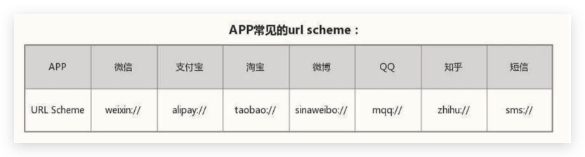

# 18-规则：豌豆荚做不起来应用内搜索？

<audio controls="" title="18-规则：豌豆荚做不起来应用内搜索？">
  <source
    id="mp3"
    src="/mp3/business-thinking/18-规则：豌豆荚做不起来应用内搜索？.mp3"
  />
</audio>

你好，我是雄峰。本节课是非规律世界的最后一篇，今天内容的关键词是规则。切入的公司是豌豆荚，一个移动互联网时代初期的明星产品。

豌豆荚之所以是当时的明星产品，有这么几个原因。

1. **风口业务**

豌豆荚是李开复博士旗下创新工厂中最亮眼的项目之一，它所做的应用分发业务又是当时最大的风口之一，在当时稳居市场前三名，而更关键的点在于，这么大的市场地位主要依赖于产品的口碑传播。在排名第一的 91 助手被百度以 19 亿美金纳入麾下之后，也进一步拉高了豌豆荚的估值和想象力空间。

1. **硅谷文化**

有供职过豌豆荚的朋友曾经说过，豌豆荚的内部福利是他见过国内创业公司最好的且没有之一，非常接近硅谷。大部分员工的薪酬是行业的一倍以上。创始团队的成员很多来自谷歌，因此内部文化也崇尚谷歌，极其自由开放、透明、扁平化，人性化福利不只覆盖正式员工，也包括实习生，记得有一个学妹跟我聊过，实习后回学校，HR 还会寄一大堆零食大礼包过来慰问。

正是这两个原因，让当时豌豆荚对外的形象有两个非常鲜明的特点，对用户来说，它是体验非常好的应用分发产品，对从业者来说，它有着极具吸引力的公司文化和福利待遇，一切都具有很大的想象空间。

然而，在 2013 年 91 助手被百度 19 亿美金收购之后，巨头们想收购豌豆荚未果，于是自己亲自下场分发业务，比如腾讯的应用宝，加上 15 年之后 [硬件厂商应用商店](https://time.geekbang.org/column/article/548476) 的崛起，豌豆荚逐步脱离应用分发第一梯队。这其中既有竞争对手的因素，又有自己赌错赛道的原因。

**当时豌豆荚并没有把自己定义为应用商店，而是未来的搜索入口，** 因此并没有重视原有分发业务的内容以及商业化建设，反而将大量资源投入去做应用内搜索业务，结果既错失了自建供血系统的机会，应用内搜索也没有做起来，不得已在 16 年以 2 亿美金的价格被阿里巴巴收购。

接下来，我会带你详细地去复盘什么是应用内搜索，以及为什么会有这一块业务的产生，再去分析豌豆荚做不起来应用内搜索的原因。

从中，我们再去了解任何一个新时代的机会到来，最初 **规则** 的设定对于后续业务的影响，以及百度产品大神俞军的一个产品理念： **用户是很难被教育的，要迎合用户，而不是改变用户。**

## 豌豆荚为何执念应用内搜索

在解释什么是应用内搜索之前，你可以先想想，我们在 PC 时代寻找信息和服务的动作，和移动互联网时代有什么区别。

在 PC 时代，我们的大部分需求都通过搜索引擎满足，但是到了移动时代，大部分需求都会通过对应的 App 来满足。

比如你想查一本书，如果在电脑上，你会用谷歌或者百度去搜索，但如果在手机上，你会打开微信读书或者多看阅读去看看，用户的使用路径发生了根本的变化，这就导致在移动互联网时期，App 进入了信息孤岛化的状态。

### 什么是应用内搜索？

豌豆荚的创始人王俊煜打了一个形象的比喻：移动时代的各个应用就好比大海里的水缸，由于应用间的壁垒关系，各个水缸之间是不通的。这就导致用户如果想去获取一个内容，必须得去一个又一个的水缸中找，体验差且效率低。

那有没有可能推出一个新的移动搜索产品呢？ **通过应用内搜索技术打通 App 之间壁垒的现状，索引其中的各类内容直接展现给用户，并且引导用户直接调起应用来消费这些内容**，构建起移动时代的一个搜索引擎。不仅实现信息的一站式聚合、查询以及消费，更让开发者通过内容直接获得持续的流量和用户，这就是应用内搜索，也是豌豆荚想要做的事。

### 豌豆荚为什么要做应用内搜索？

豌豆荚是怎么想到这块业务的呢？这里面，既有用户需求的满足，又有业务方向的判断，同时也有豌豆荚应用分发业务切入的优势。我来综合分析一下后两个原因。

我们前面在练习课有提到过，互联网信息量越来越多的趋势下，为了进一步提升信息的处理效率，PC 互联网时代的信息分发是从以雅虎为代表的门户网站过渡到了以谷歌为代表的搜索引擎，因为后者对信息的处理效率远高于门户时代。

你会发现，移动互联网初期的应用商店和 PC 互联网初期的门户网站有些类似，在信息分发的处理方式上，都是把各品类最常用、最新、最热的 App 或者游戏推荐给用户。

站在豌豆荚的角度，可以从两个角度分析应用商店的问题。

**从用户体验需求来看，用户下载应用的目的是为了体验后面的内容和服务，这一部分为什么平台不能够直接满足？**

比如你想要在商店里面下载一个小说 App，但是本质上，你是为了读《诡秘之主》这本小说，可能的动作路径就是一个个下载软件，然后进去看有没有《诡秘之主》这本小说。那有没有可能直接从源头出发，引导用户在商店里面就搜索自己想看的小说《诡秘之主》，然后直接提供具备小说内容的 App 呢？

从平台价值方向看，如果用户熟悉了应用所提供的服务，则会降低来商店的需求， **平台与应用属于一锤子买卖，那么平台的价值度则会很低**。在这种情况下，有什么办法可以提升平台的长期价值吗？

在这种思考框架下，业务坐标系就出来了：

PC 时代门户是雅虎，搜索是谷歌。移动时代门户之一是豌豆荚，那么对应移动时代的谷歌呢？

加之豌豆荚创始团队大部分来自谷歌，自然就会理解为什么豌豆荚要做应用内搜索业务。当时豌豆荚作为国内最大的应用商店，具备不少应用的流量支配权，那么通过流量换内容的方式开展合作，就可以较快切入这一业务方向。

一切逻辑推演都很顺利，但为什么豌豆荚的应用内搜索没有做起来呢？我这里先说结论：核心在于 PC 时代与移动时代的信息使用路径发生了变化，而变化的根源，就在于这两个时代初期规则的不同。

## PC 时代搜索建立的基础

微软必应搜索的负责人沈向洋说，搜索的大厦建立在三件事的基础上：

第一，人写了很多东西放到互联网上；

第二，互联网把它们都联系在一起；

第三，每个人每天都在点击这些东西，给出反馈。

当我们在说移动端的应用内搜索做不起来的时候，我们需要回到历史的长河中去看一看，为什么 PC 互联网时代可以做成通用搜索业务？当初成功的基石到了今天是否发生了变化？

### 网站互通：HTTP 和浏览器

上个世纪 80 年代，互联网的雏形已经显现，大家可以通过电脑 Email 等方式交流，但是想要大规模分享信息，就需要开发客户端软件。可问题是这些客户端软件只支持自己服务器上的内容，无法与其他人互通，这个时候就迫切需要一个统一的客户端软件，通过互联网进行有效的信息共享。

1989 年蒂姆·伯纳斯·李提出了一个构想：构建一个新的网络结构，允许在不同计算机之间分享信息，方便研究人员分享及更新信息。这个构想最终成了 WWW（World Wide Web）万维网的基础，我们现在说的互联网，严格意义上指的就是万维网。

他的方案完美解决了当时信息在万维网上传播的几个关键问题：

**Q1：** **怎样标记分布在整个互联网上的万维网文档？**

A1：创建网页地址（统一资源定位符 URL）。使每一个文档在整个互联网的范围内具有唯一的标识符 URL，也就是我们如今常说的网址。

**Q2：用什么协议实现万维网上各种超链的链接？**

A2：创建了 HTTP（Hypertext Transfer Protocol）超文本传输协议，允许用户通过单击超链接访问资源。

**Q** **3：** **如何用统一的语言让信息在所有的计算器上显示一致？**

A3：使用 HTML 超文本标记语言（Hypertext Markup Language）作为创建网页的标准。

**Q** **4：** **用什么样的工具方便用户找到想要的信息？**

A4：创建世界上第一个 Web 浏览器， World Wide Web，称为万维网浏览器，简称 WWW。

伯纳斯构建起了这么一套基础标准，让网站的建设变得标准化，也让任何一个人都可以通过浏览器访问任何一个可被访问的网站，而这其中，最关键的就是 HTTP 允许通过 **单击超链接访问资源，这意味着网站与网站之间的信息可以进行相互访问**，为信息的共享传播奠定了基础。

### 信息传播：爬虫技术和 Robots 协议

伯纳斯·李发明万维网之后，1993 年只有 130 个网站，1996 年就有十万个了，1993 年 Web 服务器占比 1.5%，1996 年就已经有 50%的服务器是 Web 服务器。如此快的增长速度，也伴随着巨量的数据，而数据一多，要找到特定的数据就尤为困难，于是就出现了 **早期的搜索引擎技术，通过搜索来获取想要找的特定数据，而搜索引擎好用与否的基础，就在于是否有更多的内容。**

最早的万维网搜索引擎之一的 ALIWEB，它的数据来源于用户的主动提交。但是这种方式的问题在于，用户要么没有动力，要么不知道你这个网站，最终这个产品只能消失在时代的历史中。

另一拨人想到了更聪明的获取数据的办法，让爬虫去探索万维网，获取网站的信息，再通过算法索引内容来建立搜索引擎，就不需要被动等待站长提交。

如果我们把互联网比作一张大网，那网络爬虫就是在网上爬行的蜘蛛，不仅可以爬取当前页面的数据信息，还可以基于网站与网站之间的链接关系，通过一个节点继续爬行到下一个节点，也就是通过一个网页继续获取后续的网页。这样蜘蛛就可以爬行到整张网的节点，网站的数据也就可以被抓取下来。

这里我们也可以延伸一下，爬虫也会造成网站信息和个人信息泄密的风险。1994 年，荷兰工程师傅马丁·科斯特起草了 robots 协议，而起草这份协议的原因，正是由于马丁·科斯特自建的网站经常被爬虫所淹没。马丁认为，被爬虫抓取数据这件事是把双刃剑，良好的爬取可以提高网站的曝光率，而恶意的爬取可能会导致服务器压力暴增，最终崩溃。

因此 robots 协议也称为爬虫协议，网站可以建立一个 robots.txt 文件来告诉搜索引擎哪些页面可以抓取，哪些页面不能被抓取。如果把网站视为酒店里的房间，那么 robots.txt 就是主人在门口悬挂的“请勿打扰”，这个文件告诉来访的爬虫哪些房间可以进入，哪些不能进入。

需要说清楚的点是，robots 协议并不是一个规定，只是一个约定俗成的协议，并不具备任何法律效力，但在早期大家也都默认遵循这个规则。此外，robots 协议默认是没有的，也就是说你的网站只要诞生在互联网的那一刻，默认就是分享的状态，只有你不想被分享的信息才需要添加 robots 协议。

好了，等到 Google 开始建立的时候，搜索引擎最关键的基石都已经具备，而这个基石就是自由的获取内容：

1. **信息上网：** 人们会通过互联网来分享自己的信息；
2. **信息开放：** 网站的信息可以直接被索引和爬取，可通过爬虫技术进行索引爬取；
3. **信息保护：** 不想被爬取的信息可以通过 robots 协议进行保护，有效降低了信息开放的难点。

## 移动时代应用内搜索的区别

PC 时代促使搜索引擎成立的基石，到了移动时代已经不复存在，这一切的核心都是 iPhone 在初期定义的规则： [App+App Store](https://time.geekbang.org/column/article/548476) 这一套相对封闭的体系，让用户和开发者习惯了 App 的使用体验以及封闭的模式。接下来，我详细地说一下双方的区别。

### **App 信息不开放：没有 URL**

爬虫技术要起作用，第一个关键点是需要知道网站以及网站每一个资源的 URL 在哪里，网址通过一堆字符确定了服务器、端口、内容和传送的方式，爬虫靠着他提供的“地址”敲响每个服务器的大门。

但是到了 App 时代，并没有类似网站时代的 URL 逻辑，每一个 App 内的资源都是单独命名、单独定义、单独协议，这就导致了爬虫并不通用，针对不同的 App 可能要制作不同的爬虫，仅仅是爬虫制作和维护的成本就远高于 PC 时代，爬虫也没有办法从一个 App 延展到另外一个 App 上，这跟 PC 时代完全不一致。

此外，App 自身的信息也默认并不对外公开， **可以说从 App 诞生的那一天就在里面植入了 Robots 协议，把“一切不对外开放”写得清清楚楚**。换句话来说，如果你不获得对方的授权，做了爬虫也没有用。

因此，移动时代为了获取 App 内信息，很多时候都会对 App 进行反编译破解，相反的，App 为了避免自己的信息被爬取，也会进行 App 加固或者诉诸法律程序。

### **App 之间不互通：没有统一的 HTTP 协议**

PC 时代 HTTP 的存在，让网站之间可以互联互通，点击链接就可以跳转到另外一个网站上。但是移动互联网刚开始的时候，没有移动版的“HTTP”。App 之间交互没有共有协议，主要依靠 App 自定义的私有协议支持。

假设你现在要跳转到微信的某一个功能或者某一个页面上，那么 URL 的开头就是 weixin://，后面的链接内容如果微信不告诉你，你压根就跳不过去。即使你知道了，微信还会对访问过来的来源进行鉴定，看看是不是不认识的人。

### **头部 App 的高筑墙和长尾 App 的消亡**

唯一一条获取应用内信息的通路只有： **跟 App 合作，获取 App 的授权。** 豌豆荚采取的方式是： **流量换内容。** 这个思路乍看起来没有问题，但是忽略了时间发展下的动态变化。我们顺着下面的逻辑去推演一下。

**Q1：** **什么样的产品愿意跟豌豆荚拿内容换流量？**

**A1：头部产品不缺流量，愿意合作的一定是中尾部 App，或者行业竞争剧烈需要流量供给的品类（比如视频）**。从时间的角度来看，App 越来越头部化，容易演化出超级 App，比如微信；竞争激烈的品类必然会进化出头部产品，比如滴滴和美团。

这些头部产品并不会把内容给到豌豆荚，更没有任何人希望跟 PC 时代的搜索引擎一样，上游会有一个入口来卡扣自己的流量。所以移动互联网时代的 App 都在想办法规避自己的信息被人所获取，对自己的 App 进行安全加固，把自己的内容圈定在自己的藩篱内，避免被爬虫反编译破解。头部 App 合作不了，豌豆荚就只能去找一些中长尾的 App 合作。

**Q2：如果找更多的腰部和尾部进行合作，如何维持长期的合作？**

**A1：长期合作的前提是** **豌豆荚提供的流量持久而稳定。** 流量换流量属于持续合作，不是一锤子买卖。只有保持长期流量的供给，合作产品才有动力持续合作内容，但在接下来的应用商店竞争过程中，豌豆荚的流量在萎缩，这个基础也在丧失，就导致原本愿意合作的产品后续并不愿意合作。

**Q3：在已达成合作意愿的产品，如何给用户提供较好的搜索体验？**

**A3：** **好的搜索体验的基础是较多的内容索引。** 早期豌豆荚的应用内搜索技术需要开发者配合做数据的接入合作，沟通通常需要一两个月，后面虽然调整了接入逻辑，由豌豆荚去适配开发者的内容结构，但也需要两周左右的时间。对比 PC 时代 Google 的爬虫一天可以爬取上亿条，效率不可同日而语，导致可被索引的内容也相当有限，自然也就无法提供较好的搜索体验。

这就是豌豆荚做应用内搜索面临的问题：

1. **重新搭建规则**：移动时代没有 PC 时代的信息互通规则，需要自己独自去探索应用内搜索的规则且需要获取行业的认同；
2. **重新拓展内容**：App 孤岛化，需要通过自身流量供给让内容接入，可拓展的空间非常有限；
3. **重新建设索引**：没有通用的协议，导致信息的接入效率较慢且信息量不足，无法扩展较多的信息索引和接入，导致推出的应用内搜索用户体验感较差。

### 用户没有来商店搜索内容的需求

上述的问题只是搜索内容建设遇到的问题，而最关键的问题在于： **用户并没有养成来商店搜索非分发内容的习惯。** 试想想，你有想法去 App Store 或者任何第三方商店搜索内容么？比如，你去 App Store 上会搜索“哪些小说会比较好看么”，即使有，这部分用户代表主流么？这就是常识的判断。

**不管豌豆荚认不认自己是不是应用商店，关键在于大多数用户的认知下它就是应用商店。** 用户虽然来豌豆荚下载 App 是为了看《诡秘之主》，但是搜索的方式还是找到可以看《诡秘之主》的软件，并不会在商店里面直接搜索“诡秘之主”。

豌豆荚试图改变已有用户使用产品的习惯，但是可提供的内容又有限，产品体验并不够惊艳。而竞争对手又围绕着应用分发这个市场大力投入，不断撼动豌豆荚原有的分发大盘。在豌豆荚 all in 应用内搜索业务的时候，新用户看豌豆荚的面目是模糊的：它到底是一个商店还是一个什么？

互联网产品做久的人会有一种执念，认为自己可以通过产品改变用户的使用习惯，可以提供更好体验的产品给到用户，成为福特是每一个产品人的执念。好比 100 多年前，·福特先生到处跑去问客户：“您需要一个什么样的更好的交通工具？”几乎所有人的答案都是：“我要一匹更快的马”。但是福特最终发明了汽车，从而开启了汽车时代，但大多数的产品人并不是福特。

百度产品大神俞军在多年前分享了自己做产品的十二条方法论，其中有两条我分享一下：

> 发现需求，而不是创造需求。
>
> 用户是很难被教育的，要迎合用户，而不是改变用户。

当一个产品被赋予了超出它本身范围以外的期望，那么这款产品到最后难免会是悲剧。

## **小结**

这篇文章帮你复盘了 PC 时代搜索引擎可以连通一切的原因，核心就在于伯纳斯·李构建的万维网基础框架，其中最关键的是以下三个点：

URL：让互联网上的每一个文件都得到独一无二的标识；

HTTP：允许用户通过单击超链接访问资源，从而实现网站之间的信息互通；

浏览器：创建了世界上第一个浏览器，让所有网页都通过浏览器进行显示。

而基于这个基础下演化出来了爬虫技术和 robots 协议，让网上的信息在准许的条件下进行默认分享，从而给谷歌这类通用搜索引擎的诞生奠定了基础。

相反等豌豆荚想要做应用内搜索的时候，上述的一切 **规则都需要自己重新搭建**，难度可想而知。而最关键的点在于，用户更多还是把豌豆荚当成一个应用商店，当产品的定位被用户认定之后，再想要进行改变，则是非常难的事情。

用俞军的话来说： **用户是很难被教育的。**

我这里先摆明一个观点，站在曾经的同行的角度来说，我是自发内心的尊重豌豆荚这家公司，身边也有不少曾经在豌豆荚从业的朋友，基本上在各自业务领域也都有不错的发展。

虽然豌豆荚最终被阿里低价收购，但是回过头来看，豌豆荚给从业者带来了极大的勇气，向巨头都难以踏足的领域进发，尝试改变行业，它的产品理念也获得了行业的认同以及尊重，可能互联网世界不多一个的 91 助手，但是缺一个豌豆荚。

## **思考题**

在这节课的最后，我给你留了一个和豌豆荚目标相关的思考题。想一想，你觉得应用内搜索现在是哪个产品做起来了呢？

欢迎你在留言区和我交流互动。我们建立了一个 [读者交流群](http://jinshuju.net/f/DuxzBi)，欢迎你的加入！如果你觉得有所收获，也可以把这节课分享给你的朋友一起学习。我们下节课见。
