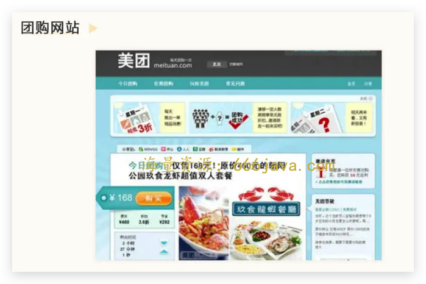

# 19-资本（上）：为什么杨浩涌二次创业一定要融大钱？

你好，我是雄峰。

今天是我们非规律世界的第四节课，我们来聊一聊风险投资这个大家熟悉又陌生的领域，切入的例子是赶集网创始人杨浩涌二次创业的项目——瓜子二手车。

为什么要聊风险投资？如果让我来总结推动互联网这二十多年快速发展的关键因素，我会认为这三个点是最关键的： **产品的创新、技术的进步以及风险投资的推动**。

这其中，风险投资作为幕后英雄，推动了大量初创企业的诞生以及壮大。可以说，没有风险投资，就没有今天的互联网世界。

为什么切入点是瓜子二手车？因为这个产品的发展及创始人的变化，非常好地体现了风险投资的非规律性。

如果用行驶中的车辆来比喻创业公司的话，那么车上会有三个主要角色：分别是司机、副驾驶、乘客。在过去，投资人更像是“乘客”的角色，并不会对公司的方向产生影响。但是到了竞争激烈的移动时代，风险投资更像是“副驾驶”的角色。有些时候，副驾驶会配合驾驶员让公司朝着更好的方向发展，有些时候则会取代驾驶员，自己下场操控车的行驶方向。

为什么很多创业者会有一种错觉，认为风险投资不干预公司发展呢？如果风险投资不盈利，他们如何对自己的投资人交代呢？如果一个投资公司迟迟看不到盈利，看不到退出的机制，那风险投资会如何处理呢？

杨浩涌所创立的赶集网，和 58 同城均为当时国内信息分类网站领域的龙头，彼此为了拉开差距，在市场营销上进行了大手笔的投入，但这并没有拉开双方的规模差距，甚至导致了业务利润率大跌。

持续性的同行战争已经不符合投资人的利益了，过往支持杨浩涌的投资人反过来与杨浩涌沟通，是否存在合并的可能性。因此在 15 年，双方背后的投资人老虎基金（全球最大的对冲基金）强力推动双方合并，由于赶集网整体的流量规模和收入对比 58 同城都少一些，加之 58 同城优先上市，导致最后赶集网被 58 同城所并购。

这两节课的内容，我会基于风险投资的视角进行分析，从而帮你解答移动时代的几个关键现象：

1. 为什么移动互联网会掀起补贴大战，比如团购大战、外卖大战、打车大战等？
2. 为什么补贴大战过了几年又掀起了合并大潮，比如 15 年滴滴与快滴、58 与赶集、美团与大众等？
3. 为什么二次创业的杨浩涌会大规模融资，让瓜子累积融资了 40 亿美金，远高出第二名一个身位？
4. 为什么现在风险投资不爱投资互联网了呢？

这节课，我们就先从什么是风险投资开始收起，回答前两个问题。

## 简说风险投资

互联网传播最广的财富故事是这样的。

> 一个邋里邋遢的大学生拉上三两个好友（最好是哈佛或斯坦福辍学），在自家的车库里面捣鼓出了一个科技领域的东西。
>
> 之后来了一两个风险投资人看中了这个项目，当下对这个公司拍板估值几百万美金要求入股，告诉年轻人，“你们只需要冲就好，亏了也没事儿”。
>
> 一穷二白的年轻人们接受了这笔风险投资，然后公司从车库搬出来不断发展壮大，短短几年就成功上市，二十多岁的小伙子也成为了亿万富翁。当然，投资他们的风险投资人也获取了上百倍乃至千倍的回报。

这个故事的基石就是风险投资的支持，接下来我将简单带你了解一下什么是风险投资。

### 风险投资的运作流程

风险投资简称风投（Venture Capital，缩写为 VC），由于它主要是针对创业方向的投资，因此也叫创投。简单理解，就是具备资本实力的投资者（个人、机构或者公司）对具有潜力但没钱的项目进行投资，用钱换取公司一定的股权，并期望以后获得较高的投资回报。

风险投资的核心工作，可以用四个字来概括：募、投、管、退。下面，我们来假设自己是一个投资机构，看看这四个工作是怎么进行的。

首先，“ **募**”，也就是融资，是风险投资运营的第一环。风险投资是高风险的项目，一轮基金很容易全部亏没，为了分散风险避免亏的全是自己的钱，风险投资往往会大量去行业募资，从中收取服务费。

再来，“ **投**”，也就是投资。我们作为风险投资机构，要去筛选项目、调查、做公司估值、投资谈判，把风险资本投给那些有着巨大增长潜力的创业企业。当然了，我们给每个创业企业不同阶段投资的金额是不一样的，前期的金额一般会小一些，虽然前期风险高，但是收益也会更高。

接着，“ **管**”，就是管理。要记得，风投从来都不是一投了之，我们还要在这个被投资的公司里扮演一个积极的角色，时不时为公司提供建议，监督进展等等。不过大部分时候，我们的管理是不参与具体业务的，更多的，是帮助被投企业攒合作资源，给出业务方向的建议，还有一个很重要的点在于避免被投企业卷钱跑路。

最后，“ **退**”，也就是退出。风险投资是一种“为了卖而买”的投资。简单来说，如果最后卖不出去，砸在手里没有任何获利，背后的投资人会很愤怒，与投资人沟通的业务群分分钟变成维权群。因此，投资的目的就是退出、获利。通常我们会在投资之后的 4-10 年这个阶段，通过发起合并、收购或者 IPO（首次公开募股）的方式退出，兑现自己投资的收益，再分给其他的投资者。这样，下一轮募资的钱也就准备好了。

### 风险投资的收益逻辑

风险投资之所以被称为风险投资，是因为投资的风险性很高。很多时候投资 100 家公司，可能 99 个都会死掉，而高风险则对应着高回报，可能存活下去的那一个，不仅能够收回所有损失，还可以创造大量的财富，这就是风险投资领域中极致的“二八法则”。

这个极致的“二八法则”可不是我瞎说，我们可以看 2 个例子。

第一个，是吴军老师在《浪潮之巅》这本书里举过的 Google 的例子。当年红杉资本投资 Google 的那轮基金高达十几亿美金，但只有 Google 一家投资成功了，可以说，如果没有 Google，那一轮基金就是亏损的。

另外就是字节跳动。可以说，主流投资人都完美的错过了字节，后面做业务复盘的时候都表示：字节是移动时代最大的投资机会，如果错过了字节，就是错过了最大的投资红利。

持有这类观点的人有高瓴资本的张磊、创新工厂的李开复、IDG 的熊晓鸽等，而他们早期都有机会投资字节。相反，字节最早期的投资人王琼，用了 70 万美元赚取了超过 100 亿美金的收益，得到了万倍以上的回报，这是可以载入史册的风险投资行为。

国内某著名 VC 机构内部做过一次复盘会，会上放出来一张图，上面是他们投资过的所有公司以及这些公司给基金带来的回报。其中有两个非常有意思的点，一个是回报最大的一家公司，占全部回报的 90%，剩下的公司加起来占 10%。另外则是把回报最大的那家公司给踢掉，剩下公司里面回报最大的那家公司，还是占比 90%。

你会发现，这个极致的“二八法则”导致风险投资领域有一个关键特点： **风险投资不怕投错，就怕错过。**

因此，风险投资会广撒网，期待其中结出一两个丰硕的果实。但是当所有风险投资机构都这么做的时候，就会产生一个问题： **资本大规模涌入** **，** **会推动行业竞争的加速发展以及泡沫的产生。**

## 移动时代的玩法变了

有人说互联网时代是产品经理的时代。早期这么喊的原因有两点：

1. **移动互联网初期市场大** **、** **机会多**：用户在不断地增长，也没有行业龙头，各个产品都有可能性，而产品经理岗位非常适合把产品从 0 到 1 打磨出来，从而填补用户不同的需求缺口；
2. **行业热度的炒作**：一方面，大量 CEO 都说自己是一个产品经理（腾讯马化腾、360 周鸿祎、百度李彦宏、小米雷军等），另一方面，人人都是产品经理口号的传播，这意味着一个小白都有一个自己是产品负责人的错觉，给无数的攻城狮们添了多少本不该有的堵。

这两个原因让人有一个莫名的信仰：好的产品本身，就可以解决一切问题。

但这就是一个错觉。就好比一个胖子和一个瘦子打架，瘦子身段灵活，时不时可以给胖子来几拳，看起来瘦子很厉害，胖子一直在被动挨打，但是瘦子干不死胖子，只要他挨了胖子一下，就完蛋了。

实际上，移动互联网发展到一定阶段之后也跟上述逻辑一样。很多公司只重视产品和技术，通过这样的专注力也赢了其他公司好几次，但是资本丰厚的对手并不怕输，只要还在这个赛道上持续玩，大资本玩家可以通过资本的玩法（比如补贴、收购等），迅速实现对竞争对手的超越，用自己的体量压倒对手。

而这一切，就是从 10 年前的千团大战开始的，我将这个时间点称为移动时代资本玩法的起源点。资本的涌入很大程度上改变了行业的玩法，“产品唯一论”也在逐步退出神坛。

### 补贴始于千团大战

团购模式来自美国的团购网站 Groupon，简单理解就是人多折扣大。网站推出某一个低折扣服务之后，上面有人数限制和截止日期，对于服务感兴趣的人会去找朋友参与拼团，达到人数后即可享受服务，而平台方则会进行交易的抽佣。

团购模式存在的 **本质** **，** **是服务的去库存**。对于一家健身中心或者比萨店来说，高昂的投入是物业装修等固定资产，而增加顾客人数并不意味着增加很高的边际成本，所以他们愿意以非常低的价格把这些“空余位置”给到团购网站，让后者为其找到大量新顾客，增加“翻台率”。所以团购网站大多数是服务团购，而非商品团购，前者的价格浮动空间很大，后者则浮动较低。

由于团购的商业模式清晰明了、没有太高的门槛，国内创业者又看到了 Groupon 快速盈利的效果，于是，这个业务瞬间点燃了大家的激情，最激烈的时候，国内涌现出数量高达千家的团购网站。

团购属于平台型产品，一方面连接线下商务，另一方面连接用户，平台在中间做交易撮合的匹配。 **平台型产品有一个双边平台效应：在双边平台定律下任何一端的增长都会在一定程度上放大另外一端的价值。**

虽然团购具备本地化属性（上海的团购北京用户无法享用），一定程度上会弱化双边平台的定律，但是还是具备一定的效果： **北京的用户变多可以让平台具备对北京商家更好的谈判能力，而北京好的商家变多则会吸引更多北京用户来使用。**

这个时候，产品体验对于双边规模的快速增长起到的作用则相对有限，毕竟你的按钮摆得更好看、页面设计得更加漂亮都解决了不了一个问题：让你的用户或者商户变得更多。

相反平台更加需要资源端的优势：要么花钱买来更多的用户，那么花钱引入更多的商户。加之市场竞争变得越来越激烈，那么补贴用户就成了大家快速增长的出路，资本的作用开始显现。

当时的团购市场主要分为两大势力，以拉手、美团、窝窝团、24 卷等为代表的创业型公司，以及糯米、大众点评为代表的巨头做背书的公司，它们每家都获得了大量的融资。各家铺天盖地的广告、阵地战、拉锯战蜂拥而至。1 元看电影、9 元吃大餐的价格屡见不鲜，低价也代表着当时团购网站厮杀的激烈程度，在补贴策略的培育下，市场规模快速扩大，用户习惯也快速养成。

### 补贴的商业模式

我们在 [分层运营](https://time.geekbang.org/column/article/549599) 里面提到过美团王慧文的一个观点： **补贴的本质是让消费者体验一个更好的消费模式，从而构建新的用户习惯。** 这话站在平台本身来说并没有错，补贴可以缩短新产品教育市场的时间，正常推广一个新产品需要 3 年才可以覆盖到主流用户，但是补贴之后可能 1 年就可以，比如移动支付，比如移动打车等。

但是补贴还有另外一个功能，王慧文并没有说， **那就是快速清出对手，实现行业垄断，通过垄断实现规则的重新制定。**

创业公司在资本的支持下，对用户或者商家进行大力度补贴，跑马圈地，实现市场规模的快速扩大，成为行业领先的企业。业务规模扩大之后，再借助龙头优势进一步获得更大的融资，通过补贴与对手拉开差距，甚至将对手清出市场，实现对行业的垄断。后面，再借助垄断的地位进行规则的重新定义，实现税收的商业模式，降低亏损并实现盈利，同时企业也进行 IPO 上市，早前支持的投资机构也在这个时候获利退出。

你会发现，千团大战，打车大战，到了后面的外卖大战、直播大战、单车大战以及 20 年的社区团购大战，都是这个逻辑的延续。

### 补贴模式的困境

不过，“快速清出对手，实现行业垄断，从而实现规则的重新制定”，补贴另一个功能的最大问题是有两个前提设定。

**一个是行业可以跑出一家龙头，而不是多家。** 但是实际上而言，资本不是一个人，而是很多不同的人，换句话说，有 20 个不同的资本，大家支持的对象并不一样，有的能跑出来，有的就跑不出来。比如出行领域，滴滴背后是金沙江创投和腾讯，快滴背后的投资人是经纬中国和阿里。比如信息分类领域，58 同城背后是华平投资和软银赛富，赶集网背后是今日资本和红杉资本。

这就导致一个现象：行业跑不出龙头企业，而是两强并立甚至群雄崛起的局面。补贴虽然很好的培育了市场，但是并没有达到清出对手的目的，持续补贴就会意味着持续亏损，资本继续给钱的动力就不大了，除非你业务本身对我其他业务有战略帮助（早期腾讯巨额支持滴滴和美团核心目的之一是为了铺开支付业务）。

**一个是政府对于补贴策略并不干预。** 但是后续，政府对于互联网企业的野蛮生长、过度补贴开始实施干预，比如在网约车领域，交通部运输部出台了网约车管理暂行办法中提到：不得以低于成本的价格进行不正当竞争；比如在社区团购领域，国家市场总局联合商务部出台了固定社区团购经营行为的“九个不得”，瞄准社区团购低价倾销和不正当竞争等。这就要求互联网企业必须寻找补贴以外新的增长方向。

这就导致如果持续补贴会陷入恶性战争，如果不进行补贴，短期大家又难以分出胜负，而资本的耐心是有限的。

### 企业同类项合并

前面我们有说过：风险投资是一种“为了卖而买”的投资，给 VC 背后的投资人创造更多的收益。

补贴大战到了一定阶段，摆在 VC 面前的是一种尴尬的情景：

> 投的企业无法获得行业第一，导致短期无法上市退出获利。加大补贴投入是一个无底洞，还不知道亏多久，不继续投入就会输掉这个业务，原有投资就打水漂了。

副驾驶（资本）开始影响驾驶员（企业）： **把方向盘交给我，我想提前下车了。**

在 **资本的紧缩**、 **监管的趋严** 以及 **业务成长的乏力** 这样多重因素的叠加下，过去不想卖的想卖了，或者不得不卖了，过去不想买的也开始买了，在资本的助推下，行业在 15 年掀起了同类项合并的大潮。你可以看下这些报道：

> 2015 年 2 月 14 日，滴滴打车和快的打车宣布以 100%换股的方式正式合并。合并是双方所有投资人共同的强烈期望，投资人均看好出行市场，恶性、大规模、持续烧钱的竞争不可持续，合并可以避免更大的时间成本和机会成本，新公司可以马上加速，开展很多新的业务。
>
> 2015 年 4 月 17 日，58 同城与赶集网达成战略合并协议。赶集网此次通过与 58 同城合并将实现上市梦想，背后的蓝驰创投、红杉资本、老虎基金等 6 家投资机构获得退出机会。
>
> 2015 年 10 月 8 日，美团与大众点评宣布达成战略合作，双方已共同成立一家新公司（新美大）。红杉资本将成为最大股东，也是此次合并最大的推手。
>
> 2015 年 10 月 26 日，携程宣布与百度达成一项股权置换交易，携程将拥有约 45%的去哪儿总投票权（从百度手里获取的），而百度将拥有携程 25%的股份，成为第一大股东，同时可减少对去哪儿的烧钱支出（一段时间内去哪儿赚 10 亿要亏 10 亿）。

并购成为那一阶段风险投资主要的退出方式。总的来说，并购和上市相比会容易不少，但是收益率也相对会少很多，只是相对风险更低。但是很多创业者并不甘心，赶集网的创始人杨浩涌就是其中之一：为什么被并购是的我赶集，而不是赶集并购 58？

## 小结

资本的话题可以聊的有很多，这节课就先说到这里。我先对这节课的重点内容做一个总结。

**风险投资的目的**：风险投资是具备资本实力的投资者（个人、机构或者公司）对具有潜力但没钱的项目进行投资，用钱换取公司一定的股权，并期望以后获得较高的投资回报。在募、投、管、退这四个环节里，“退”是其中最关键的一环，因为任何投资行为都要 **套现获利**。

**补贴可以达到的效果：** 对消费者来说，能够让其体验一个更好的消费模式，从而 [构建新的用户习惯](https://time.geekbang.org/column/article/549599)。对企业来说，可以快速清出对手，实现行业垄断，通过垄断实现规则的重新制定，因此在移动互联网时代，资本用补贴构构建起了新的玩法。

**补贴模式的困境和归宿：** 纯补贴行为较难达成市场的领先地位，反而会让行业陷入无止境的补贴大战，而持续的补贴并不符合投资人长期的利益。因此，用资本挑起的战争，往往会被资本结束。这也是 15 年行业掀起同类型合并的根本原因。

下节课，我们来回答这节课最开始提出的后两个问题：为什么二次创业的杨浩涌会大规模融资，让瓜子累积融资了 40 亿美金，远高出第二名一个身位？为什么现在风险投资不爱投资互联网了呢？

## 思考题

在下节课开始之前，你可以先想一想，为什么同类型企业都希望优先上市呢？比如优酷先于土豆，比如 58 先于赶集。

欢迎你在留言区和我交流互动。我们建立了一个 [读者交流群](http://jinshuju.net/f/DuxzBi)，欢迎你的加入！如果你觉得有所收获，也可以把这节课分享给你的朋友一起学习。我们下节课见。
