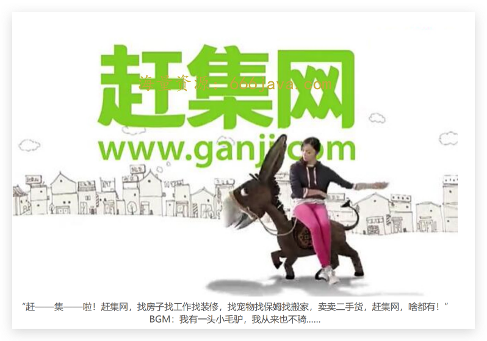

# 20-资本（下）：为什么杨浩涌二次创业一定要融大钱？

你好，我是雄峰。

上节课我们了解了两件事，一个是风险投资是什么，一个是移动时代资本的涌入改变了玩法。 在补贴会陷入恶性战争，不进行补贴短期内大家又难以分出胜负的情况下，副驾驶（资本）开始影响驾驶员（企业），发起并购，提前结束战争——“ **把方向盘交给我，我想提前下车了**”。

我们最后的话茬留在了杨浩涌的问题上，说的是被并购一方的很多创业者并不甘心，赶集网的创始人杨浩涌就是其中之一：为什么被并购是的我赶集，而不是赶集并购 58？

这节课，我们就回答这个问题，同时回答非规律世界版块中，资本这个角度涉及到的另外两个问题：为什么二次创业的杨浩涌会大规模融资，让瓜子累积融资了 40 亿美金，远高出第二名一个身位？为什么现在风险投资不爱投资互联网了呢？

## 杨浩涌的资本势能

在中国市场上，杨浩涌是一个明星创业者。2005 年创办的赶集网，是当时分类信息网站领域的龙头之一，你不一定记得这个公司，但是你大概率记得这个著名的广告：

58 同城先于赶集网上市，整体在资本、用户、收入上都领先于赶集网。不过，双方持续的烧钱导致利润大跌，这不符合公司和投资人的利益，后面杨浩涌不得不把公司卖给 58，从而实现自己和背后投资企业的退出，进而开启自己的第二阶段事业：瓜子二手车。

明星创业者的好处有两个，一个是自己有钱，另一个是容易拿到钱。这为瓜子急速狂飙的发展提供了充沛的弹药。

### 为什么 58 和赶集会合并

杨浩涌后面有过一次反思：为什么滴滴快的、携程去哪儿以及 58 赶集这类公司需要合并？为什么社交、电商领域并没有发生上述的合并？他的判断是：

> “如果两家公司在前端的用户体验不能做出差异化，可能合并就会变成必然。”

简单来说，这类强依赖线下资源的产品较难做出体验化差异，双方的投入重点都是在资源端的扩张上。

举一个例子，不管打车界面设计得如何花里胡哨，对于打车的你而言，关注的永远只有三点：

1. 有没有车可以打；
2. 司机的响应速度；
3. 打车的价格。

在同一个行业里，两家龙头公司背后都有非常多的资金支持， **双方的用户体验做不出差异的时候，对用户来说，那** **就是谁补贴多就用谁。** 所以这样的战争永无止境。

资本是把“双刃剑”，它有好的一面，也有残酷的一面。如果是资本把这个战争挑起来，当发现没有必要继续投入的时候，资本就会来结束它。这个时候，合并就成为了解决问题的唯一方式。

### 怎么避免被合并的命运

谁都希望自己属于合并的那一方，而不是被合并的那一方。那要怎么避免被合并呢？这个时候，终局思维就派上了用场。我们来提前预习一下：

> 杨浩涌认为：你在做这个事情的时候要想清楚它最后什么样、倒推回来要做什么，终局是跟市场格局相关的。

用终局思维去看一个行业最终的格局，就会发现 **大部分行业赛道都是赢家通吃的状态**。头部占据了 70%的市场份额，第二名占据了 20%，剩余的所有占据了 10%。

如果是这种格局下，那么在做决策的时候就会非常清楚公司要朝哪个方向来发展，是该放大行业规模还是做大业务利润。大家在投入的时候，就会算大账而不是算小账。我们不应该思考当前投一个亿的广告是赚还是亏，而是反过来想， **我要拿到市场第一的话，该投多少广告。**

如果要避免自己是被合并的那一方，那就一定要处于行业的第一名，所以杨浩涌一直认为“不关注竞争对手”就是骗人的话（相反，链家的创始人左晖先生一直表示自己不关注对手在做什么，只关注用户在想什么）。

因为如果不关注竞争格局，自己无法在行业里面获取头部地位，就没有办法获得资本的支持，从而跟自己的竞争对手拉开差距，把公司带入发展的下一个阶段。然后就会陷入一个怪圈：因为体量小，所以不赚钱，因为不赚钱，所以体量小。

那么，瓜子二手车是怎么获取头部地位，避免被合并的命运的呢？

### 瓜子二手车：广告遥遥领先

杨浩涌在做瓜子二手车创业的时候，发现这是一个很有意思的行业。

1. **行业足够宽广**：美国同领域的公司价值百亿美金以上，中国完全有这个可能的空间，十亿美金以上是风投喜欢的生意；
2. **行业格局未定**：人人车虽然阶段性领先，但是月成交量才 300 不到，跟整个二手车几十万的交易量相比，完全不占头部优势；
3. **没有巨头的直接进入**：各家巨头都是以投资的方式进入，并没有大体量玩家。

杨浩涌在做瓜子二手车的时候，借鉴了赶集网的血泪教训：在产品之外打造大玩家的行业势能，通过势能获取资本的支持，再通过资本想尽一切办法去拉开和对手的差距，避免跟对手“打巷战”。因为巷战就算能杀敌一千，也要自损八百，这种损耗是永无止境的。

于是，瓜子二手车开启了“扩张-融资”的头部扩张模式。可以说， **这是一个认知领先的创业者携海量资本改变了行业竞争格局的故事。**

> 第一阶段：瓜子从 15 年 9 月份开始，拿出 1 个亿，铺开盖地地打广告，直接把交易量从 200 拉到了 1700。虽然人人车开始跟进广告，但是只有 700 的成单量。由于瓜子取得了第一阶段的领先，就开始吹瓜子才是行业第一，同时进行了第一轮融资，16 年 9 月份，A 轮就拿到 2.5 亿美元。
>
> 第二阶段：由于瓜子已经取得了行业的阶段性领先，第二名的人人车去融资的时候相对就会困难一些。毕竟瓜子行业是老大，估值是 10 亿，老二总不能比老大更高吧？但是老二并不认为我是老二，应该估值更高，这就是人人车当时的心态，也导致了融资进展并不顺利。直到 17 年，人人车才获得了滴滴 2 亿美金的融资，而同期瓜子二手车完成了 B+轮融资 4 亿美元，又开启了铺开盖地的广告大战，启动了很多城市的扩张。
>
> 第三阶段：瓜子进一步的扩大，让其占据了行业的领先位置。原先投资人人车的腾讯后面转投了瓜子。在 2018 年 3 月份，由腾讯领头，瓜子二手车完成 C 轮融资 8.18 亿美元。截至 2021 年 4 月底，瓜子二手车 App 月活用户（MAU）规模达到了行业第一，是行业第二名的 7 倍以上，二手车交易量也达到了线上平台的 65%左右，而曾经的对手人人车已于 2020 年破产。截至目前，瓜子二手车累积融资达到了 30 亿美金。

瓜子二手车的发展可以用一句话概括： **瓜子二手车，广告遥遥领先**。以至于后面对手做业务复盘的时候，不管是人人车还是优信二手车，都认为应该模仿瓜子重点砸广告上， **通过资本的方式快速扩张，这就是移动互联网时代典型的资本打法。**

## 风险投资当前的困境

最后，我再回到这两节课的开始，和你聊聊杨浩涌瓜子二手车快速扩张背后的推手——风险投资。风险投资在这二十多年来有效推动了中国互联网的高速发展，虽然中间催生了很多泡沫，但是不可否认的是，如果没有风险投资的支持，大量有想法、有能力的年轻人不会踏入创业的旅途，也不会有如今的字节、美团、滴滴、拼多多等，给年轻人创造了大量的财富机会。

但是，这两年风险投资行业遇冷，在资金来源、投资方向、退出机制上都面临着前所未有的挑战。风险投资当前的困境，也在很大程度上加剧了互联网的寒冬。资本不再像之前一样疯狂，让任何一个想法都可以获得很多支持，而没有资本的支持，很多新的项目也就没有开始的可能了。

为什么当前风险投资行业会遇到困境呢？核心有三点。

- **行业发展见顶，没有好的投资方向**

补贴推动互联网发展的故事，始于千团大战，终于单车大战。几家单车企业，几百家风投机构争先恐后地涌入，最终一地鸡毛，投资人大量亏损。这也侧面说明，互联网已经没有特别好的投资标的物了。

等到了 2017 年的时候，无人货架、无人零售又成了新的行业热点，问题是：很多无人货架的公司就是一堆钢架和二维码，这种公司如何估值？

- **一、二级市场倒挂，估值困难**

快手在 21 年 2 月份上市，最高的时候，达到了 417 港元/股的历史新高，当时所有快手的朋友都要喜提豪宅了。但是接下来的半年里，快手的股价一度下探到了 60 港元/股左右，跌幅 85%，而同样情况的中概股公司（中国概念股，是指外国投资者对所有海外上市的中国股票的统称）不在少数，可以说 21 年的中概股是跌得爹妈不认，中概股也成为了中“丐”股。

二级市场（股票市场）下跌这么严重，一级市场（公司初步的投资市场）必然也没有很好的溢价。简单来说，老大在股市都从 500 亿美金跌到了 100 亿美金，凭什么你老二没有上市的还认为自己值 200 亿美金？这也是大量为市场企业估值大幅降低的根源所在，即使是字节这么大的独角兽公司，一级市场的估值也在今年大幅下滑。

- **风险投资机构退出困难**

我们前面说过，风险投资是一种为了卖的买，这意味着投资公司的钱一定是要进行变现回收的。过往机构变现的途径主要有两个，一个是美股 IPO（首次公开募股），另一个是企业并购，把公司卖给巨头。

前者伴随着中美之间的经济博弈以及滴滴引发的事件，美股 IPO 这条路变得极为困难，而没有 IPO，也就没有退出。后者伴随着反垄断法的出台，大型互联网公司（腾讯/阿里）收购新公司都得经过详细审查，这也导致了大公司投资的迅速降温。过往很多公司创立的目的并不是上市，而是为了卖给大公司，一旦这个通路没有，那么很多项目也就没有做的必要了。这也是 21 年年底各大公司传出解散战投团队的原因。

三个要素叠加下，风险投资迅速遇冷，有的时候我们可以反思一下，非规律世界的定律如此不容忽视，那为什么我们一直会认为风险投资的钱好拿呢？

## **小结**

这两节课的内容相对较多，核心是通过瓜子二手车的发展逻辑切入，讲述了风险投资的运行机制以及其对于互联网业务模式的影响，同时，我也给你分析了当前风险投资遇冷的核心原因。

如果要我来说，这节课最想告诉你什么，我认为是 **对非规律世界的理解**。

非规律的变化体现在了两方面。

一方面是 **创业拿钱的变化**。风险投资在移动时代初期变得极其热门，很多时候几个 BAT 出来的人就可以拿到一笔天使投资，开始自己的创业历程。但是伴随着风口的不断切换和竞争的不断加速，创业的钱越来越难拿，也越来越需要拿大钱。 **资本开始催生行业，而不是早期看行业自然成长**，如果现在还顶着三五个拿天使创业的想法，该醒醒了。

另一方面是 **业务玩法的变化**。过往新产品的涌现和扩张都是产品或技术主导，所以做产品和做技术的人很多时候认为产品和技术可以解决一切。没有换一个角度去理解资本主导的模式，Too young too simple。我们可以不喜欢，但是需要了解这种模式并且予以重视，从而避免视角单一带来的决策失误。

## 思考题

在这节课的最后，你可以想一想，之前还见过哪些用巨量资本改变行业格局的事情么？

欢迎你在留言区和我交流互动。我们建立了一个 [读者交流群](http://jinshuju.net/f/DuxzBi)，欢迎你的加入！如果你觉得有所收获，也可以把这节课分享给你的朋友一起学习。我们下节课见。
