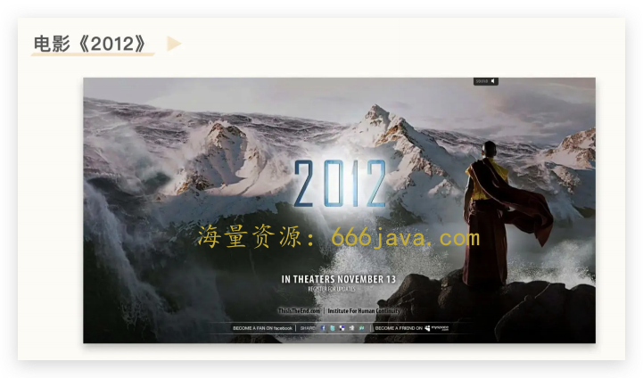
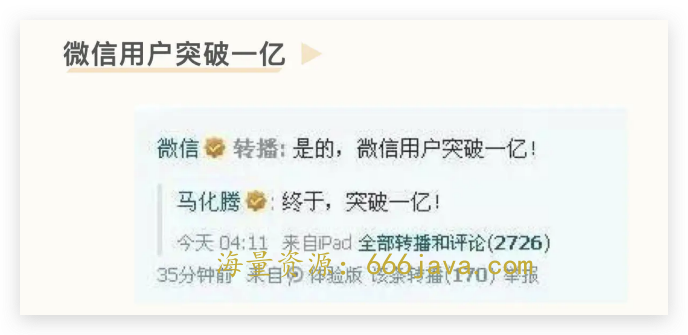
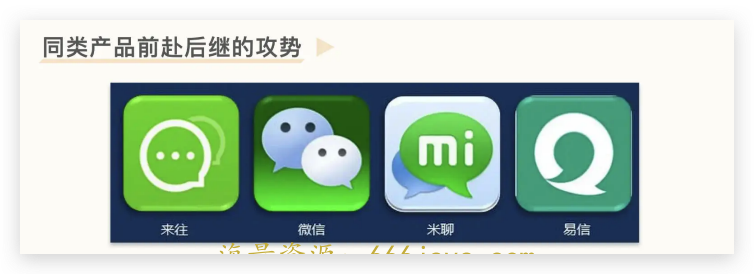
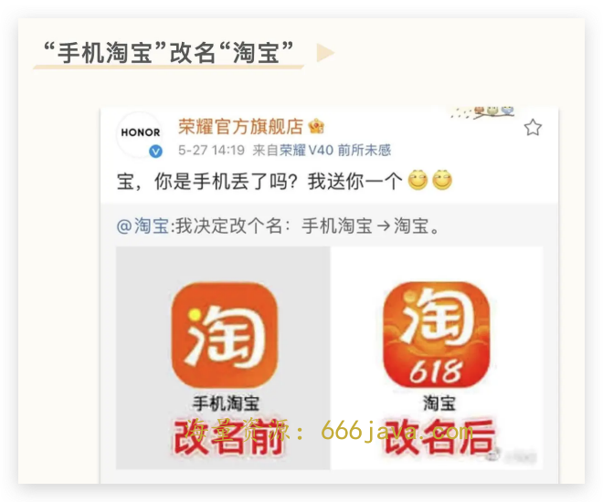
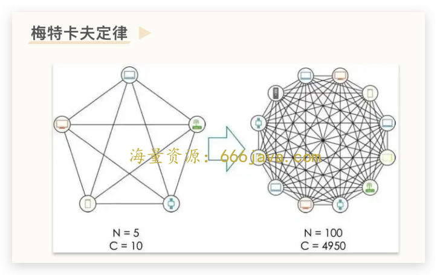
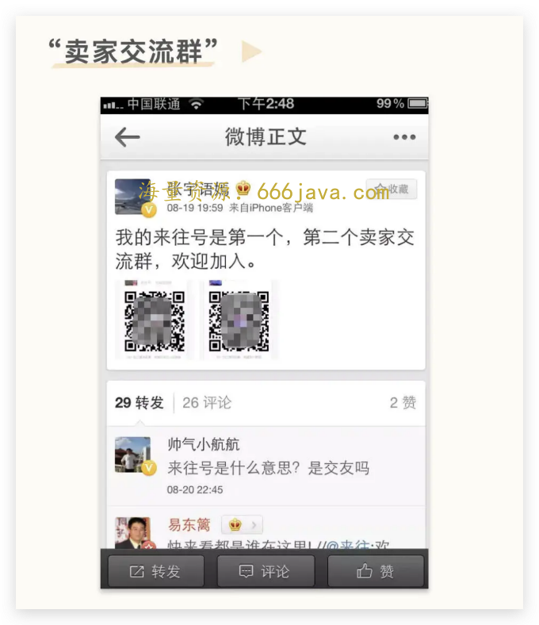

# 21-角色（上）：失败的来往和成功的钉钉后面为什么都是陈航（无招）？

<audio controls="" title="21-角色（上）：失败的来往和成功的钉钉后面为什么都是陈航（无招）？">
  <source
    id="mp3"
    src="/mp3/business-thinking/21-角色（上）：失败的来往和成功的钉钉后面为什么都是陈航（无招）？.mp3"
  />
</audio>

你好，我是雄峰。

今天是我们非规律世界的第五篇。跟过往不一样的点在于，过去我们的分析思路是：基于一个公司或者产品来切入分析，从而引申出一个或者几个关键的知识点。但是今天我们切入的角度是一个人：前阿里钉钉 CEO 陈航（无招）。

这是一个很难聊的话题，原因在于其所做的钉钉招黑。知乎上讨论钉钉“恶心”“无人性”“违反劳动法”的内容比比皆是，要聊“钉钉做得很好，陈航‘牛逼’”这个事情的确需要一定的勇气。因此，在分析之前，我建议你在看待钉钉和无招的事情上，抹平情绪，关注事实。

什么是事实部分？

1. **钉钉在企业办公领域一骑绝尘，行业占比达到 65%**：一方面干掉了具备先发优势的企业微信，另一方面，飞书虽然口碑极佳，是 IT 人的心头好，但用户规模也始终跟不上钉钉——为什么？
2. **陈航在阿里是有名的连续失败者，做一淘没有成功，另一次做“来往”，还是不习惯**：很难想象一个高 P（当年 P10）在经历过两次大失败之后，还能抖擞精神再战江湖，并找到新的出路——凭什么？

非规律世界这个模块，本质上是希望你能找到一个辩证看待事物的角度：没有什么是一成不变的规律，一个连续失败者也可以找到出路、逆风翻盘。

所以，这节课除了分析企业通讯领域产品的业务模式以外，更多的是想传递一种精神，帮助你从中汲取支撑自己在业务困顿、逆风局打仗的能力。

这节课算是预备课，我们先来了解一下来往 App 以及陈航（无招）这个人，再去了解钉钉诞生的原因，从中，我们再去学习社交产品中著名的定律——梅特卡夫定律。

## 移动船票：为什么要做来往

2009 年美国有一部科幻灾难电影叫做《2012》。故事发生在 2012 年 12 月，一家人正在度假。玛雅预言中 2012 年的 12 月 21 日是世界末日，世界出现各种极端天气，全球开始毁灭，为了应对世界末日各国高层秘密建造了一艘船，这船需要船票才能进去，有了船票才可以活命。

这个故事里，有两个关键词，2012 和船票。

恰好在 2012 年开始，移动互联网开始爆发，涌起浪潮。互联网公司都在思考一个关键命题： **如何从 PC 转型到移动时代。所以，谁能获得移动互联网时代的船票** 就很重要了。

这里简单提一下当时大家对“船票”的定义：产品的用户量能否过亿，过亿用户的产品基本就可以视为拿到了移动互联网的船票。

### **成功上岸的微信**

这个船票有多重要呢？从成功上岸的微信引发的关注就可以看出来。

2012 年 3 月，马化腾在腾讯微博表示，微信用户突破一亿。从零到一亿，用时 433 天。

360 的周鸿祎曾表示：50 个 360 的产品加起来都比不过一个微信。

在微信步入神坛的征途中，有不少同类产品前赴后继地对这个移动时代的皇冠发起攻势。可能唯一给微信带来困扰的产品就只有米聊了。由于米聊相较于微信的先发优势，微信也是历经几个大版本的迭代才把米聊甩在后面，从此之后一骑绝尘，成为了移动时代第一个用户突破 1 亿的产品。

后面的产品带来的更多就是笑料了。比如阿里于 13 年推出的来往，一款对标微信的移动通讯软件。

微信奠定了腾讯在移动互联网领域的地位，而当前移动互联网只有马化腾拿到了“船票”，其他人还在摸索。微信这张船票又在一年不到的时间里变大了三倍，2013 年 1 月 15 日，微信用户又上涨到了 3 亿，你就不难想象同行的心态：羡慕嫉妒以及酸。

阿里巴巴创始人马云曾表示：如果马化腾拿腾讯跟他换阿里巴巴，他还是会考虑换的。马云这么说，跟阿里巴巴公司属性有关系： **阿里作为中国最善于把流量变现的公司，也是最渴望流量的公司，而当时移动端的流量正在被微信快速聚集。**

### **路途坎坷的阿里**

回到 13 年看阿里巴巴的移动化进展，会发现并不是很快。淘宝也做了手机端，但当时的定位是“多端”，也就是主要还在电脑上，现在多了手机这个端，可以实现一些简单的功能，比如销售手机充值卡之类的。

所以，那个时候淘宝 App 不是直接叫淘宝，而是叫手机淘宝网。注意，这里有一个“网”字，说明 **App 端都还是 PC 的延续**，后面才去掉了“网”，叫“手机淘宝”，直到 2021 年才更名直接叫“淘宝”。13 年的手淘也就千万多量级的规模，远达不到微信的体量。

加之当时已经有不少用户开始尝试在微信上做购物导流，而这一块流量并不在自己手里面，腾讯也有自己的电商业务。所以，阿里在这个阶段喊出了“allin 无线”的口号，这个 allin 无线的主产品，一个是淘宝，一个是来往（对标微信）。前者主导的是张勇（现阿里 CEO），后者主导的是陆兆禧（前阿里 CEO）。

我们按下淘宝不提，单说来往为什么最终形成了陪跑无果的情况。

## 注定悲剧的来往

阿里有千万个理由去做来往，用户却很难找到一个理由去用来往，所以来往注定就是一场悲剧。

### 梅特卡夫定律

为什么用户很难去使用来往？社交产品中有一个著名的梅特卡夫定律： **一个网络的价值等于该网络内的节点数的平方，而且该网络的价值与联网的用户数的平方成正比，即网络效应。**

简单来说，熟人社交产品会出现越多人用越好用，越好用越多人用的情况，如果想脱离这个产品，那你就没有办法联系身边的人，这就导致你后面不得不用。就像鸡生蛋，蛋生鸡，子子孙孙无穷无尽。而这个领域的产品会形成自然垄断，一家独大，没有任何老二的机会。

当微信基于自身产品优势以及腾讯过往关系链的加持，很快覆盖了通讯录用户的使用占比之后，其余的产品就没有机会了。

那社交产品就没有机会了吗？也不是。在微信占据住了熟人社交的领域之后，后面的社交产品都会绕开微信，主打陌生人社交，比如陌陌、探探、Soul 等。在陌生人社交产品中，网络效应就不会起作用，核心在于： **使用的人并不一定想要身边的朋友知道自己在使用。**

这类产品是用来认识新异性发展配对关系用的，一旦找到适合的对象，大概率就会删除产品，所以人太多对用户而言也没什么用，这就是陌生人社交产品的使用方式。

但是好死不死，阿里推出的来往是对标微信的，所做的领域也是熟人社交产品。阿里也知道网络效应在社交产品上的作用，所以来往推出的时候，主要做了两件事情：一个是不断的拉用户来使用，构建网络效应，另一个是推出网络电话，以“免费打电话”的功能吸引用户使用。

来往 2013 年 9 月份上线，10 月份无招（陈航）开始负责，从失败的一淘项目（阿里旗下的促销导购平台）调到了来往。

### 陈航真的“无招”

为什么大家会觉得来往搞笑，核心在于阿里推广“来往”的方式搞笑： **用行政命令或者奖金诱迫员工拉人头。**

来往 9 月 23 日上线，但是阿里内部 8 月份就发起了一项“比比看谁来往好友多”的活动，规则和目的都很简单，就是拉好友。邮件中特别强调，员工邀请的重点是“阿里同事之外的亲朋好友”，届时谁的非同事活跃好友数量最多，谁就胜出。

当时阿里巴巴集团副总裁、淘宝网负责人语嫣在来往建了一个“卖家交流群”发布在微博上，该群瞬间爆满各大公司也都在线吃阿里拉人头的瓜和段子。

再说 VOIP 网络电话。简单来说就是用流量打电话，当时来往 4.0 版本已经上线了 VOIP 网络电话的功能，而阿里巴巴正在的申请移动转售牌照，为突破监管提供了可能（电信行业属于国营范围），一旦化身为“准虚拟运营商”，阿里巴巴提供价格低廉，甚至免费的电话和短信服务将击中许多用户的“痛点”，但是推出之后发现用户并不在乎，微信语音也挺好用。

我在腾讯的导师是从阿里来的，有一次吃饭跟我说了一件趣事。阿里江湖气和花名文化比较重，导师在阿里的老板恰好在来往项目组，因为来往始终做不过微信，为了表示不服输，要把自己的名字改成王小虎（他本人姓王），死磕张小龙，这也侧面反应大家没辙了。

一年之后，阿里内部重新梳理了移动战略，从过往的“all in 无线”转移到了“all in 移动电商”。马云内部复盘来往项目的时候，很生气地说到：我让你们造一挺机枪，去跟人家大干一场，结果造出个甘蔗棒子，捅了人家一下，还被反过来咬了一块肉。

来往项目逐步失去内部的支持，一时间大家都在传闻无招要走，毕竟一个高 P 连续做砸了两个项目，一个是一淘，一个是来往，都是内部很重视的产品，在阿里这样的公司，连续失败意味着机会会越来越少。

## 招黑又好用的钉钉

来往失败之后，无招不愿就此认输。虽然来往项目在社交领域一败涂地，但是无招也并非没有收获。 **来往当时吸引了大量围绕阿里系的中小企业主，也让无招意识到阿里的优势是在 B 端的影响力**，因此想尝试基于工作场景的企业通讯产品。

在当时 C 端产品称王的阶段，B 端产品并不被人看好，无招为了表达自己背水一战的决心，也沾沾仙气，找到马云表示“不成功便成仁”，带着几个残兵败将搬进了马云的私宅：马云在湖畔花园创业起家的房子。

钉钉起来之后，我很幼稚地问我导师：“阿里这么开放的吗，想内部孵化新项目就可以去马云家住吗，那我们要不要找公司申请去赛格（腾讯第一间办公室，开玩笑）？”

导师白了我一眼：“人（无招）那是有关系的好不好，你以为谁想申请就申请。”

### 最早的阿里实习生

无招可以说是个不折不扣的阿里元老，因为他是阿里最早的实习生。1999 年，马云从北京回到杭州继续创业，十八罗汉齐聚湖畔花园。在这段创业故事的开端部分，陈航便作为一名尚未毕业的学生，在阿里巴巴收购的公司“浙江伟业网络技术有限公司”实习。

无招后来回母校做演讲的时候说到，当时所在的公司是阿里巴巴成立时全资收购的第一家公司，CEO 李琪就是马云在中国黄页创业时候的搭档 CTO。不过，从学校毕业后的陈航就离开了阿里，留学日本，随后在日本一呆就是 11 年。2010 年前后，陈航回国，再次回到了阿里，成为淘宝的一员，没有这一层关系，无招也很难借到湖畔花园。

但是不管有没有关系，业务做成这样，也就只有最后一次机会了，陈航后来回忆： **当时没有什么高大上的想法，就是想要活下去。**

### 两个救星：康帕斯和复星

虽然有大致的目标，但是如何落地无招本人也不是很清楚。因为调研了一堆中小企业，大家的反馈都是：微信和 QQ 挺好的，没有什么痛点。有一天，无招连续拜访了好几家公司，没什么收获的时候，在路边吃臭豆腐，团队成员突然提到，朋友的公司就在楼上，不如上去看看。

这家公司叫康帕斯，80 多人，主营业务是电脑硬件销售，是典型的中小企业代表。康帕斯虽然是个小企业，但老板史楠是个对企业管理有着诸多见解的人。他向无招提了两点：

> 第一，工作和生活信息太繁杂，沟通工具总是在 QQ、微信、邮件、电话和短信中切换，希望有一款 **统一的工作平台**；
>
> 第二，阿里能不能将内部的高效企业管理系统简化后，提供给中国中小企业用，提高中小企业的管理水平。

在湖畔花园内，无招第一次向史楠提出“共创”的概念——需求从客户中来，产品到客户处去验证。

做 2B 的行业产品时，需求不能来自于自己的臆想，要切身理解使用者的困难。而想要更好的理解，就必须和这些企业在一起，通过观察甚至亲身体验，熟悉企业的工作流程，切实感受他们的需求和痛点，再来设计和改进产品。

这也是为什么在 18 年后，腾讯在产品通道里面增设了一个细分岗位：行业应用。本质上就是希望产品深入行业，从而找出应用方案。

基于康帕斯的“共创”，无招发现了中小企业在预算有限的情况下，难以开发或购买昂贵的管理信息系统，又衍生出一系列低效的协作、考勤、审批等工作难题。

举个例子，一个很典型的场景就是早上上班打卡的问题。康帕斯早上 8 点半上班，无招很早就带人守在公司门口打卡机旁边观察，7 点半就有人来，8 点 25 分到 8 点 30 分是高峰，大家急急忙忙到公司打卡、按指纹，有些人指纹按不下来，后面的人就着急地叫。围绕最初发现的这些痛点，钉钉推出了第一版产品，主打“企业内通讯”+“打卡”功能，并免费推广给中小客户。

如果说康帕斯让钉钉从 0 到 1 构建起来，那么复星集团的标杆案例，一方面让阿里内部意识到了钉钉的价值，另一方面竖立了一个典型的行业标杆，让大家觉得，“连复星都用钉钉了！”。

与复星集团的合作，更让钉钉对企业的认知又上了一个台阶。 **康柏斯让钉钉理解了什么是企业级沟通平台，而复星则让钉钉看明白了企业协同是怎么做的。**

复星集团 2012 年收入 520 亿，利润有 37 亿，旗下有 200 家企业，是一家超 8 万人的大型旗舰型企业集团。但是公司在信息系统上的投入不到 1 千万，集团在加大信息化和协同效率的建设后，出现了一系列问题：

> **首先，信息不透明。** 复星集团有很多控股或者投资企业，例如复星匡药位于上海，南京钢铁在南京，海南矿业在海南。内部员工反馈说：找一个人需要需要绕 5 个人，可能耗了 5 天时间。
>
> **其次，安全隐患多。** 早期公司人员只能在微信上沟通，信息保密与安全上也存在隐患。微信群上限 500 人，公司几千号人，无法加在一起。员工离职也不知道，仍在各种群里。投资公司的聊天内容往往会涉及到一些机密，群里经常会发现不少非本公司的人。
>
> **最后，协同不连贯。** 复星集团 2012 年就开始推移动办公，最高峰时集团甚至有几百个管理类 App，但由于这些 App 彼此无法进行信息交换，复星在形态、效率上仍然是数字孤岛状态。

复星给无招提的合作条件非常苛刻，服务三年且免费，如果中间不合作还要赔钱。最终无招还是“咬咬牙签了这份协议”。因为复星是一个很好的大集团样本，不仅对于团队认知提升有帮助，同时也是一个好的 show case。这也是为什么很多时候 **新产品为了在 B 端打开市场口子，都会以很低的价格甚至免费的方式来塑造标杆。**

钉钉给复星公司开发的软件就叫“复星通”， 前后分了三次迭代，很大程度上解决复星内部的问题。

2015 年 5 月份的一天，马云突然来了，直言钉钉是自己的“惊喜”。他是在参观复星集团时，听到对方说“你们阿里旗下有一款产品，帮复星解决了不少管理问题。”

于是，内部方面，在马云的支持下，钉钉当月就成立了事业部。外部方面，复星集团董事长郭广昌除了内部夸赞以外，更多次在公开场合，夸赞钉钉是他工作的好帮手，有了复星的背书，钉钉的外部拓展也相当迅速。

## 小结

好了，这节课我们就先说到这里。我来为你总结一下这节课的关键信息。

**船票的变化：** 我们过去所说的移动互联网船票，指的是产品的用户量能否过亿，过亿用户的产品基本就可以视为拿到了移动互联网的船票。而现在，我们已经不会再提到船票这个词了，因为大家还没确定好下一艘船是什么。

**梅特卡夫定律：** 一个网络的价值等于该网络内的节点数的平方，而且该网络的价值与联网的用户数的平方成正比，即网络效应。熟人社交产品会出现越多人用越好用，越好用越多人用的情况，如果想脱离这个产品，那你就没有办法联系身边的人，这就导致你后面不得不用。

**社交产品的方向：** 社交产品按照关系链进行区分，可以拆解为熟人社交和陌生人社交两类，熟人社交领域中梅特卡夫定律会发生极大的作用。在这个领域中，只要一款产品覆盖了通讯录 30%以上的用户群体，则会席卷所有熟人关系链，但是在陌生人社交领域，该定理则较难发挥作用，这也是陌生人社交领域一直有新产品出现的原因，从陌陌、探探到 Soul。

说到这里，你应该已经对无招、钉钉有了一定的了解了。但是，我们还没有回答这节课的问题：

- 为什么失败的来往和成功的钉钉背后都是陈航？
- 为什么钉钉能够成功？
- 为什么我说，这节课是想向你传递一种支撑自己在业务困顿、逆风局的时候，打仗的能力呢？

我们下节课再继续聊。

## 思考题

想一想，为什么移动互联网初期，各大传统互联网公司都非常强调船票的概念呢？

欢迎你在留言区和我交流互动。我们建立了一个 [读者交流群](http://jinshuju.net/f/DuxzBi)，欢迎你的加入！如果你觉得有所收获，也可以把这节课分享给你的朋友一起学习。我们下节课见。
